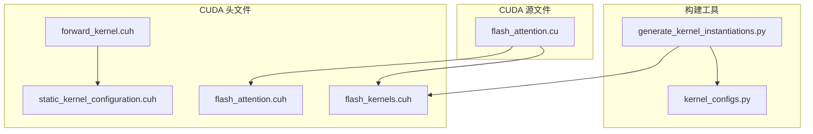
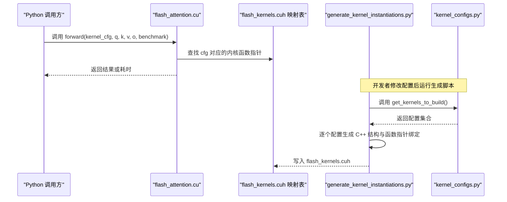
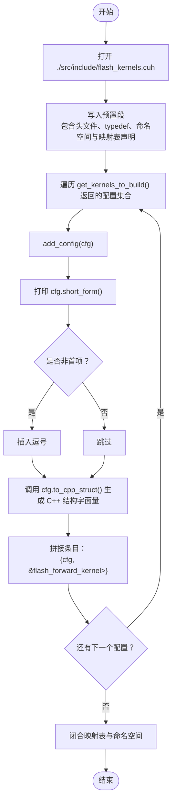
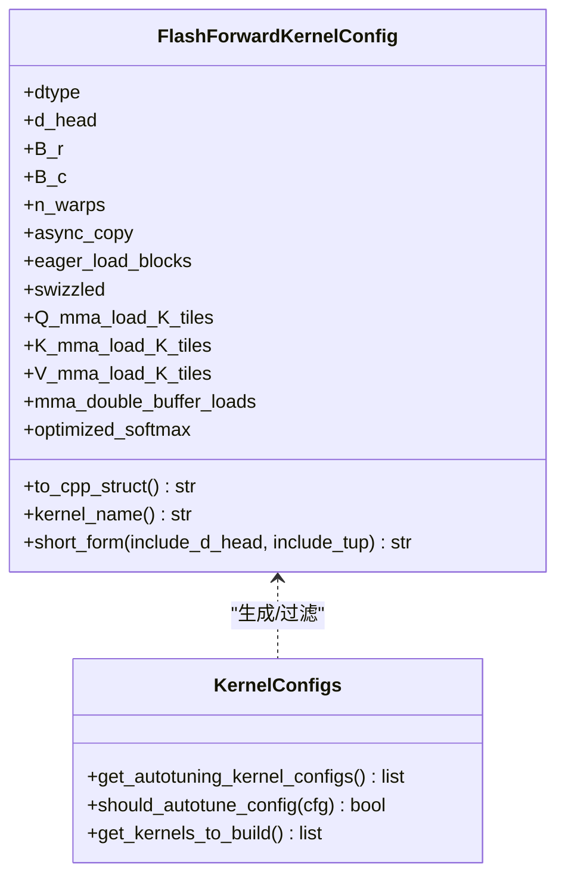
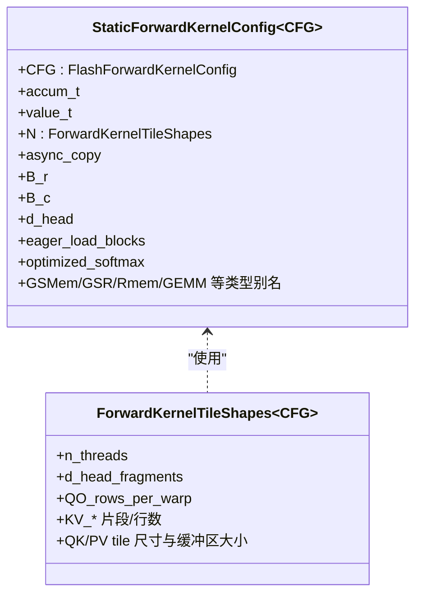
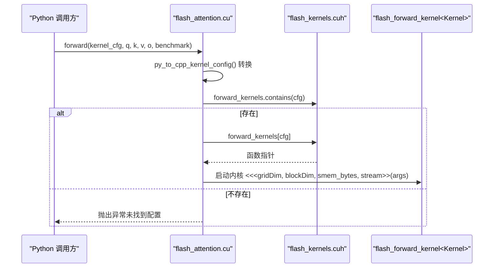
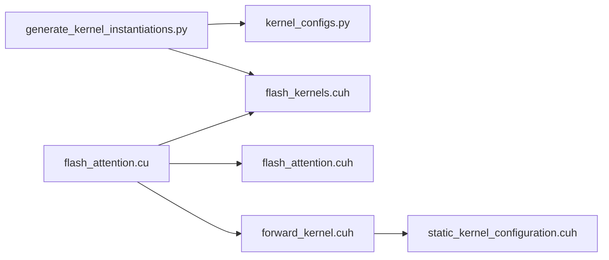

# 代码生成与实例化

<cite>
**本文引用的文件列表**
- [generate_kernel_instantiations.py](file://tools/build/generate_kernel_instantiations.py)
- [kernel_configs.py](file://py/flash_helpers/kernel_configs.py)
- [flash_kernels.cuh](file://src/include/flash_kernels.cuh)
- [static_kernel_configuration.cuh](file://src/include/static_kernel_configuration.cuh)
- [flash_attention.cu](file://src/flash_attention.cu)
- [flash_attention.cuh](file://src/include/flash_attention.cuh)
- [forward_kernel.cuh](file://src/include/forward_kernel.cuh)
</cite>

## 目录
1. [简介](#简介)
2. [项目结构](#项目结构)
3. [核心组件](#核心组件)
4. [架构总览](#架构总览)
5. [详细组件分析](#详细组件分析)
6. [依赖关系分析](#依赖关系分析)
7. [性能考量](#性能考量)
8. [故障排查指南](#故障排查指南)
9. [结论](#结论)
10. [附录：新增内核配置操作指南](#附录新增内核配置操作指南)

## 简介
本文件围绕内核代码生成与实例化展开，重点解析 generate_kernel_instantiations.py 工具的工作流程，说明其如何调用 get_kernels_to_build() 获取待构建的内核配置集合，并自动生成 src/include/flash_kernels.cuh 中的内核函数指针映射表。文档深入解释生成代码的 C++ 模板结构，特别是 StaticForwardKernelConfig 的实例化方式以及 flash_forward_kernel 函数指针的绑定机制；并提供分步指南，演示在添加新内核配置后如何运行该脚本重新生成头文件，强调自动化构建流程的重要性，避免手动维护大量模板实例引发的错误。

## 项目结构
本仓库采用“源码 + 构建工具 + Python 辅助”的组织方式：
- tools/build：包含内核实例化生成脚本 generate_kernel_instantiations.py 及其他构建辅助工具
- py/flash_helpers：Python 层面的内核配置、自动调优策略与解析逻辑
- src/include：CUDA 头文件，定义内核配置、静态配置模板、前向内核等
- src：CUDA 源文件，封装 Python 绑定、参数校验、内核选择与调度

图表来源
- [generate_kernel_instantiations.py](file://tools/build/generate_kernel_instantiations.py#L1-L57)
- [kernel_configs.py](file://py/flash_helpers/kernel_configs.py#L457-L463)
- [flash_kernels.cuh](file://src/include/flash_kernels.cuh#L1-L187)
- [static_kernel_configuration.cuh](file://src/include/static_kernel_configuration.cuh#L104-L291)
- [flash_attention.cuh](file://src/include/flash_attention.cuh#L30-L109)
- [forward_kernel.cuh](file://src/include/forward_kernel.cuh#L85-L206)
- [flash_attention.cu](file://src/flash_attention.cu#L1-L150)

章节来源
- [generate_kernel_instantiations.py](file://tools/build/generate_kernel_instantiations.py#L1-L57)
- [kernel_configs.py](file://py/flash_helpers/kernel_configs.py#L457-L463)
- [flash_kernels.cuh](file://src/include/flash_kernels.cuh#L1-L187)
- [static_kernel_configuration.cuh](file://src/include/static_kernel_configuration.cuh#L104-L291)
- [flash_attention.cuh](file://src/include/flash_attention.cuh#L30-L109)
- [forward_kernel.cuh](file://src/include/forward_kernel.cuh#L85-L206)
- [flash_attention.cu](file://src/flash_attention.cu#L1-L150)

## 核心组件
- 内核配置数据结构与生成器
  - FlashForwardKernelConfig：描述内核运行时配置（数据类型、块大小、线程束数、异步拷贝、预加载、swizzle、各张量的 K 方向片段数、双缓冲、优化 softmax 等）
  - get_kernels_to_build()：聚合自动调优配置，返回待构建的配置集合
  - generate_kernel_instantiations.py：读取配置集合，生成 flash_kernels.cuh 的映射表
- 静态配置模板
  - StaticForwardKernelConfig：以 FlashForwardKernelConfig 为模板参数，推导出内存布局、寄存器/共享内存形状、GEMM 配置等静态常量与类型别名
- 前向内核与调度
  - flash_forward_kernel：模板 CUDA 内核，接收 ForwardKernelArgs，按 Kernel 类型执行 QK/S/PV 计算与 softmax 归一化
  - flash_attention.cu：Python 扩展入口，负责参数校验、内核选择、动态共享内存设置、启动内核

章节来源
- [kernel_configs.py](file://py/flash_helpers/kernel_configs.py#L106-L175)
- [kernel_configs.py](file://py/flash_helpers/kernel_configs.py#L457-L463)
- [generate_kernel_instantiations.py](file://tools/build/generate_kernel_instantiations.py#L13-L56)
- [static_kernel_configuration.cuh](file://src/include/static_kernel_configuration.cuh#L104-L291)
- [forward_kernel.cuh](file://src/include/forward_kernel.cuh#L85-L206)
- [flash_attention.cu](file://src/flash_attention.cu#L1-L150)

## 架构总览
下图展示从 Python 配置到 C++ 实例化再到运行时调度的关键路径。

图表来源
- [flash_attention.cu](file://src/flash_attention.cu#L34-L135)
- [flash_kernels.cuh](file://src/include/flash_kernels.cuh#L1-L187)
- [generate_kernel_instantiations.py](file://tools/build/generate_kernel_instantiations.py#L13-L56)
- [kernel_configs.py](file://py/flash_helpers/kernel_configs.py#L457-L463)

## 详细组件分析

### 组件A：generate_kernel_instantiations.py 工作流
- 入口与职责
  - 通过相对路径追加 sys.path 并导入 kernel_configs.py
  - 打开目标头文件进行写入，先输出预置段（包含必要的头文件、函数指针 typedef、命名空间与映射表声明）
  - 遍历 get_kernels_to_build() 返回的配置集合，逐个生成 C++ 结构体字面量与函数指针绑定
- 关键步骤
  - 输出映射表起始与注释
  - add_config(cfg)：打印短形式描述；非首项前插入逗号；调用 cfg.to_cpp_struct() 生成 FlashForwardKernelConfig 字面量；拼接形如 {cfg, &flash_forward_kernel<StaticForwardKernelConfig<cfg>>} 的条目
  - 遍历完成后闭合映射表与命名空间
- 生成的映射表结构
  - 键：FlashForwardKernelConfig 字面量
  - 值：flash_forward_kernel<StaticForwardKernelConfig<...>> 的函数指针
  - 运行时通过 forward_kernels.find(cfg) 或 contains(cfg) 定位具体实例

图表来源
- [generate_kernel_instantiations.py](file://tools/build/generate_kernel_instantiations.py#L13-L56)

章节来源
- [generate_kernel_instantiations.py](file://tools/build/generate_kernel_instantiations.py#L13-L56)

### 组件B：FlashForwardKernelConfig 与 Python 配置生成
- 数据结构字段
  - dtype、d_head、B_r、B_c、n_warps、async_copy、eager_load_blocks、swizzled、Q/K/V_mma_load_K_tiles、mma_double_buffer_loads、optimized_softmax
- Python 侧生成策略
  - get_autotuning_kernel_configs()：基于枚举的参数空间（dtype、d_head、B_r、B_c、n_warps、async/eager/swizzled、load tiles、双缓冲、优化 softmax）组合生成候选集
  - should_autotune_config()：过滤不合法或不推荐的组合
  - get_kernels_to_build()：汇总自动调优配置并排序去重
- C++ 侧生成
  - FlashForwardKernelConfig.to_cpp_struct()：将配置序列化为 C++ 字面量字符串
  - FlashForwardKernelConfig.kernel_name()：固定返回 flash_forward_kernel，用于生成映射表条目

图表来源
- [kernel_configs.py](file://py/flash_helpers/kernel_configs.py#L106-L175)
- [kernel_configs.py](file://py/flash_helpers/kernel_configs.py#L389-L424)
- [kernel_configs.py](file://py/flash_helpers/kernel_configs.py#L364-L387)
- [kernel_configs.py](file://py/flash_helpers/kernel_configs.py#L457-L463)

章节来源
- [kernel_configs.py](file://py/flash_helpers/kernel_configs.py#L106-L175)
- [kernel_configs.py](file://py/flash_helpers/kernel_configs.py#L364-L387)
- [kernel_configs.py](file://py/flash_helpers/kernel_configs.py#L389-L424)
- [kernel_configs.py](file://py/flash_helpers/kernel_configs.py#L457-L463)

### 组件C：StaticForwardKernelConfig 的模板实例化
- 角色定位
  - 以 FlashForwardKernelConfig 为模板参数，推导出静态常量与类型别名，包括：
    - 线程/瓦片/寄存器/共享内存布局
    - Q/K/V/P/O 的内存布局与加载/存储配置
    - GEMM_QK、GEMM_PV 的类型
    - 行统计信息数组等
- 实例化绑定
  - 生成的映射表中，每个键值对的值为 flash_forward_kernel<StaticForwardKernelConfig<键>>，即通过模板实参将具体配置注入到 flash_forward_kernel 内核模板中
- 与运行时的关系
  - flash_attention.cu 在运行时根据传入的 FlashForwardKernelConfig 查找映射表，得到对应实例的函数指针，然后以 ForwardKernelArgs 启动内核

图表来源
- [static_kernel_configuration.cuh](file://src/include/static_kernel_configuration.cuh#L104-L291)

章节来源
- [static_kernel_configuration.cuh](file://src/include/static_kernel_configuration.cuh#L104-L291)
- [flash_kernels.cuh](file://src/include/flash_kernels.cuh#L1-L187)
- [forward_kernel.cuh](file://src/include/forward_kernel.cuh#L85-L206)

### 组件D：flash_forward_kernel 的模板绑定与运行时调度
- 模板内核
  - flash_forward_kernel<Kernel>：接收 ForwardKernelArgs，按 Kernel 提供的类型与常量执行计算
- 运行时选择
  - flash_attention.cu：将 Python 传入的配置转换为 FlashForwardKernelConfig，检查 forward_kernels 是否包含该配置，若存在则取出函数指针并启动内核
- 动态共享内存设置
  - 模块初始化时遍历映射表，对需要更大动态共享内存的内核调用 cudaFuncSetAttribute 设置最大动态共享内存

图表来源
- [flash_attention.cu](file://src/flash_attention.cu#L16-L135)
- [flash_kernels.cuh](file://src/include/flash_kernels.cuh#L1-L187)
- [forward_kernel.cuh](file://src/include/forward_kernel.cuh#L85-L206)

章节来源
- [flash_attention.cu](file://src/flash_attention.cu#L16-L135)
- [flash_kernels.cuh](file://src/include/flash_kernels.cuh#L1-L187)
- [forward_kernel.cuh](file://src/include/forward_kernel.cuh#L85-L206)

## 依赖关系分析
- generate_kernel_instantiations.py 依赖 kernel_configs.py 提供的配置集合
- 生成的 flash_kernels.cuh 被 flash_attention.cu 引用，用于运行时内核选择
- flash_forward_kernel 依赖 static_kernel_configuration.cuh 推导出的静态配置
- flash_attention.cu 依赖 flash_attention.cuh 提供的参数结构与比较运算符

图表来源
- [generate_kernel_instantiations.py](file://tools/build/generate_kernel_instantiations.py#L13-L56)
- [kernel_configs.py](file://py/flash_helpers/kernel_configs.py#L457-L463)
- [flash_kernels.cuh](file://src/include/flash_kernels.cuh#L1-L187)
- [flash_attention.cu](file://src/flash_attention.cu#L1-L150)
- [flash_attention.cuh](file://src/include/flash_attention.cuh#L30-L109)
- [forward_kernel.cuh](file://src/include/forward_kernel.cuh#L85-L206)
- [static_kernel_configuration.cuh](file://src/include/static_kernel_configuration.cuh#L104-L291)

章节来源
- [generate_kernel_instantiations.py](file://tools/build/generate_kernel_instantiations.py#L13-L56)
- [kernel_configs.py](file://py/flash_helpers/kernel_configs.py#L457-L463)
- [flash_kernels.cuh](file://src/include/flash_kernels.cuh#L1-L187)
- [flash_attention.cu](file://src/flash_attention.cu#L1-L150)
- [flash_attention.cuh](file://src/include/flash_attention.cuh#L30-L109)
- [forward_kernel.cuh](file://src/include/forward_kernel.cuh#L85-L206)
- [static_kernel_configuration.cuh](file://src/include/static_kernel_configuration.cuh#L104-L291)

## 性能考量
- 自动化实例化减少手写模板实例的冗余与错误，确保配置覆盖全面且一致
- 通过 StaticForwardKernelConfig 推导静态布局与缓冲区大小，有助于编译期优化与寄存器/共享内存占用控制
- 运行时仅做一次映射查找，避免分支判断带来的开销
- 对需要更大动态共享内存的内核进行属性设置，提升稳定性与吞吐

## 故障排查指南
- “未找到内核配置”错误
  - 现象：运行时报错提示 cfg 未在 flash_kernels.cuh 中
  - 排查：确认 generate_kernel_instantiations.py 已运行且生成了对应配置的条目；检查配置是否被 should_autotune_config 过滤
  - 参考位置：flash_attention.cu 中的 contains 与异常抛出
- 配置不合法导致的编译失败
  - 现象：编译报错或运行时行为异常
  - 排查：检查 StaticForwardKernelConfig::valid_config 中的断言条件是否满足（例如 load K 片段必须为 2 的幂且不超过上限）
- 动态共享内存不足
  - 现象：内核启动失败或性能异常
  - 排查：确认模块初始化时已为超过阈值的内核设置 MaxDynamicSharedMemorySize

章节来源
- [flash_attention.cu](file://src/flash_attention.cu#L34-L135)
- [static_kernel_configuration.cuh](file://src/include/static_kernel_configuration.cuh#L22-L35)

## 结论
generate_kernel_instantiations.py 将 Python 层的配置生成与 C++ 模板实例化有机结合，通过自动生成 flash_kernels.cuh 的映射表，实现了内核配置的自动化管理。配合 StaticForwardKernelConfig 的静态推导与 flash_forward_kernel 的模板化设计，系统在保证正确性的同时兼顾了性能与可维护性。建议在新增或调整内核配置时，优先通过 Python 侧配置生成器扩展参数空间，再运行生成脚本更新映射表，从而避免手工维护带来的错误风险。

## 附录：新增内核配置操作指南
- 步骤1：在 Python 侧扩展参数空间
  - 修改或新增 get_autotuning_kernel_configs() 的参数枚举，或在 should_autotune_config() 中放宽/收紧过滤条件
  - 如需特定推进序列，可在 get_kernel_progression_configs() 中添加或调整基线配置
- 步骤2：运行生成脚本
  - 在 tools/build 目录下执行 generate_kernel_instantiations.py，它会自动调用 get_kernels_to_build() 并生成新的 flash_kernels.cuh
- 步骤3：验证生成结果
  - 检查 flash_kernels.cuh 中是否包含新增配置对应的条目（键为 FlashForwardKernelConfig 字面量，值为 flash_forward_kernel<StaticForwardKernelConfig<...>>）
- 步骤4：编译与测试
  - 重新编译扩展模块，运行 Python 测试，确保新配置可通过 forward_kernels 正确选择并启动

章节来源
- [kernel_configs.py](file://py/flash_helpers/kernel_configs.py#L389-L424)
- [kernel_configs.py](file://py/flash_helpers/kernel_configs.py#L426-L455)
- [kernel_configs.py](file://py/flash_helpers/kernel_configs.py#L457-L463)
- [generate_kernel_instantiations.py](file://tools/build/generate_kernel_instantiations.py#L13-L56)
- [flash_kernels.cuh](file://src/include/flash_kernels.cuh#L1-L187)