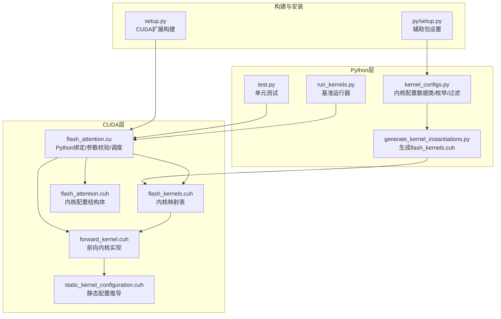
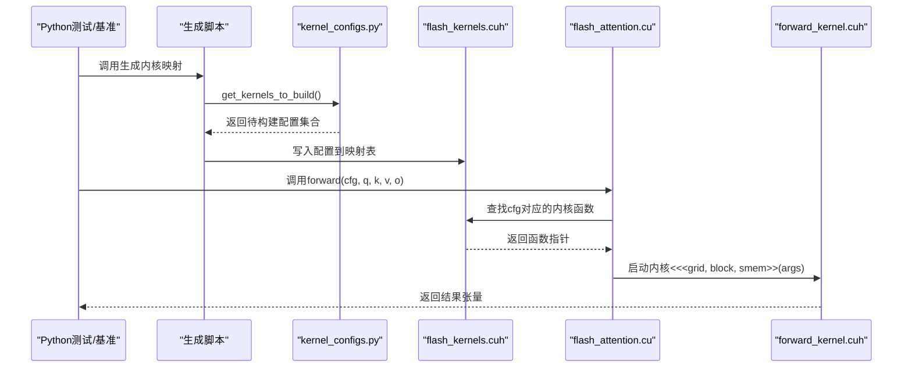
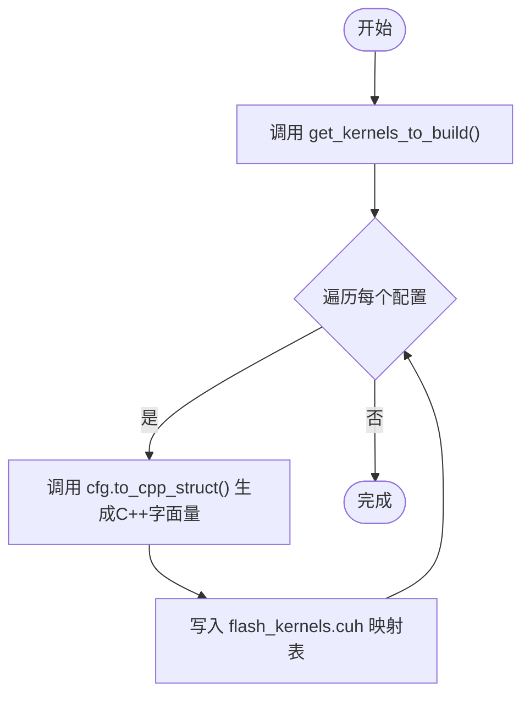
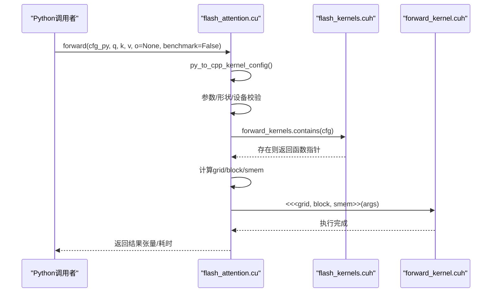
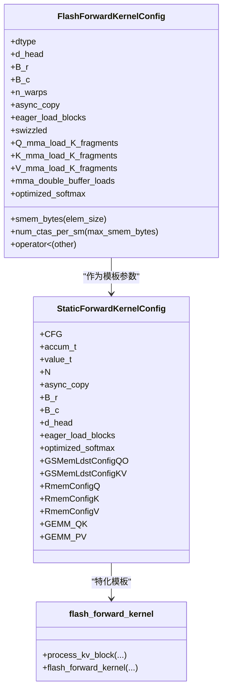
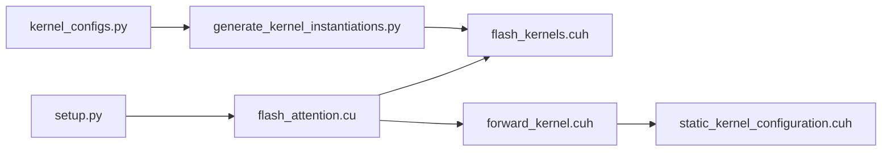

# 新内核变体扩展指南

<cite>
**本文引用的文件**
- [README.md](file://README.md)
- [setup.py](file://setup.py)
- [py/setup.py](file://py/setup.py)
- [src/include/flash_attention.cuh](file://src/include/flash_attention.cuh)
- [src/include/static_kernel_configuration.cuh](file://src/include/static_kernel_configuration.cuh)
- [src/include/flash_kernels.cuh](file://src/include/flash_kernels.cuh)
- [src/include/forward_kernel.cuh](file://src/include/forward_kernel.cuh)
- [src/flash_attention.cu](file://src/flash_attention.cu)
- [py/flash_helpers/kernel_configs.py](file://py/flash_helpers/kernel_configs.py)
- [tools/build/generate_kernel_instantiations.py](file://tools/build/generate_kernel_instantiations.py)
- [py/flash_helpers/test/test.py](file://py/flash_helpers/test/test.py)
- [tools/benchmark/run_kernels.py](file://tools/benchmark/run_kernels.py)
</cite>

## 目录
1. [简介](#简介)
2. [项目结构](#项目结构)
3. [核心组件](#核心组件)
4. [架构总览](#架构总览)
5. [详细组件分析](#详细组件分析)
6. [依赖关系分析](#依赖关系分析)
7. [性能考量](#性能考量)
8. [故障排查指南](#故障排查指南)
9. [结论](#结论)
10. [附录：扩展步骤清单](#附录扩展步骤清单)

## 简介
本指南面向希望在现有Flash注意力CUDA内核基础上新增“内核变体”的开发者，目标是安全、可重复地添加新的块大小（B_r/B_c）或新的优化组合（如新的MMA加载策略、双缓冲等），并确保：
- Python层配置与C++层模板实现保持一致；
- 新配置能被自动构建脚本纳入生成的内核映射；
- 生成的flash_kernels.cuh正确无误；
- 通过单元测试与基准工具验证功能正确性与性能表现。

## 项目结构
该仓库采用“Python辅助工具 + CUDA内核 + 构建脚本”的分层组织方式：
- Python层负责内核配置枚举、过滤与生成脚本调用；
- CUDA层负责内核调度、参数校验、内核映射查找与执行；
- 工具链负责自动生成flash_kernels.cuh并进行基准与调试。

图表来源
- [py/flash_helpers/kernel_configs.py](file://py/flash_helpers/kernel_configs.py#L1-L200)
- [tools/build/generate_kernel_instantiations.py](file://tools/build/generate_kernel_instantiations.py#L1-L57)
- [src/flash_attention.cu](file://src/flash_attention.cu#L1-L150)
- [src/include/flash_kernels.cuh](file://src/include/flash_kernels.cuh#L1-L187)
- [src/include/forward_kernel.cuh](file://src/include/forward_kernel.cuh#L1-L207)
- [src/include/static_kernel_configuration.cuh](file://src/include/static_kernel_configuration.cuh#L1-L294)
- [src/include/flash_attention.cuh](file://src/include/flash_attention.cuh#L1-L110)
- [setup.py](file://setup.py#L1-L76)
- [py/setup.py](file://py/setup.py#L1-L20)

章节来源
- [README.md](file://README.md#L1-L63)
- [setup.py](file://setup.py#L1-L76)
- [py/setup.py](file://py/setup.py#L1-L20)

## 核心组件
- 内核配置结构体：定义内核运行时的关键参数，包括数据类型、d_head、B_r/B_c、n_warps、异步拷贝、预加载、Swizzle、Q/K/V的MMA加载片段数、双缓冲、优化softmax等。
- 静态配置推导：根据配置推导线程块/寄存器/共享内存布局、tile形状、缓冲区大小等。
- 内核映射表：将配置对象映射到具体模板实例化的内核函数指针。
- Python配置与过滤：提供内核配置数据类、自动调优配置集合、进度式配置集合、过滤规则与生成脚本入口。
- CUDA调度与执行：Python绑定将配置转换为C++结构体，校验后在flash_kernels.cuh中查找对应内核并执行。

章节来源
- [src/include/flash_attention.cuh](file://src/include/flash_attention.cuh#L30-L110)
- [src/include/static_kernel_configuration.cuh](file://src/include/static_kernel_configuration.cuh#L1-L294)
- [src/include/flash_kernels.cuh](file://src/include/flash_kernels.cuh#L1-L187)
- [py/flash_helpers/kernel_configs.py](file://py/flash_helpers/kernel_configs.py#L100-L220)
- [src/flash_attention.cu](file://src/flash_attention.cu#L1-L150)

## 架构总览
下图展示了从Python配置到CUDA内核执行的端到端流程，以及生成脚本如何将配置注入到内核映射表中。

图表来源
- [tools/build/generate_kernel_instantiations.py](file://tools/build/generate_kernel_instantiations.py#L1-L57)
- [py/flash_helpers/kernel_configs.py](file://py/flash_helpers/kernel_configs.py#L457-L486)
- [src/flash_attention.cu](file://src/flash_attention.cu#L34-L135)
- [src/include/flash_kernels.cuh](file://src/include/flash_kernels.cuh#L1-L187)
- [src/include/forward_kernel.cuh](file://src/include/forward_kernel.cuh#L85-L207)

## 详细组件分析

### 组件A：内核配置与生成流程
- Python层的FlashForwardKernelConfig数据类定义了所有可枚举的内核参数；其to_cpp_struct方法用于生成C++侧结构体字面量，供生成脚本写入flash_kernels.cuh。
- get_kernels_to_build()返回需要构建的配置集合，默认使用自动调优配置集；也可通过环境变量选择“prog”“all”“tune”或指定B_r,B_c组合。
- generate_kernel_instantiations.py会遍历get_kernels_to_build()返回的配置，逐个写入flash_kernels.cuh的映射表，键为配置对象，值为模板实例化后的内核函数指针。

图表来源
- [py/flash_helpers/kernel_configs.py](file://py/flash_helpers/kernel_configs.py#L148-L164)
- [py/flash_helpers/kernel_configs.py](file://py/flash_helpers/kernel_configs.py#L457-L486)
- [tools/build/generate_kernel_instantiations.py](file://tools/build/generate_kernel_instantiations.py#L13-L56)

章节来源
- [py/flash_helpers/kernel_configs.py](file://py/flash_helpers/kernel_configs.py#L100-L220)
- [py/flash_helpers/kernel_configs.py](file://py/flash_helpers/kernel_configs.py#L457-L486)
- [tools/build/generate_kernel_instantiations.py](file://tools/build/generate_kernel_instantiations.py#L1-L57)

### 组件B：CUDA调度与内核执行
- flash_attention.cu负责：
  - 将Python侧传入的配置对象转换为C++结构体；
  - 进行设备能力、数据类型、形状等运行时校验；
  - 在flash_kernels.cuh中查找对应内核函数；
  - 计算grid/block维度与共享内存大小，启动内核并可选记录时间。

图表来源
- [src/flash_attention.cu](file://src/flash_attention.cu#L16-L135)
- [src/include/flash_kernels.cuh](file://src/include/flash_kernels.cuh#L1-L187)
- [src/include/forward_kernel.cuh](file://src/include/forward_kernel.cuh#L85-L207)

章节来源
- [src/flash_attention.cu](file://src/flash_attention.cu#L1-L150)

### 组件C：静态配置推导与模板实例化
- static_kernel_configuration.cuh基于FlashForwardKernelConfig推导：
  - 线程块/寄存器/共享内存布局；
  - Q/K/V的tile形状与缓冲区大小；
  - GEMM阶段的tile划分与寄存器/共享内存搬运配置；
  - 通过模板特化将配置固化到编译期，减少运行时分支。
- forward_kernel.cuh实现具体的计算流程：QK矩阵乘、softmax、PV矩阵乘、最终归一化与输出写回。

图表来源
- [src/include/flash_attention.cuh](file://src/include/flash_attention.cuh#L30-L110)
- [src/include/static_kernel_configuration.cuh](file://src/include/static_kernel_configuration.cuh#L1-L294)
- [src/include/forward_kernel.cuh](file://src/include/forward_kernel.cuh#L1-L207)

章节来源
- [src/include/static_kernel_configuration.cuh](file://src/include/static_kernel_configuration.cuh#L1-L294)
- [src/include/forward_kernel.cuh](file://src/include/forward_kernel.cuh#L1-L207)

## 依赖关系分析
- Python层依赖：
  - kernel_configs.py提供配置数据类、过滤与生成入口；
  - 测试与基准脚本依赖kernel_configs.py提供的配置集合。
- CUDA层依赖：
  - flash_kernels.cuh由生成脚本维护，是运行时查找内核的唯一依据；
  - forward_kernel.cuh实现内核主体逻辑；
  - static_kernel_configuration.cuh提供编译期配置推导；
  - flash_attention.cu负责运行时调度与参数校验。
- 构建与安装：
  - setup.py定义CUDA扩展编译参数与源文件；
  - py/setup.py为辅助包设置。

图表来源
- [py/flash_helpers/kernel_configs.py](file://py/flash_helpers/kernel_configs.py#L1-L200)
- [tools/build/generate_kernel_instantiations.py](file://tools/build/generate_kernel_instantiations.py#L1-L57)
- [src/flash_attention.cu](file://src/flash_attention.cu#L1-L150)
- [src/include/flash_kernels.cuh](file://src/include/flash_kernels.cuh#L1-L187)
- [src/include/forward_kernel.cuh](file://src/include/forward_kernel.cuh#L1-L207)
- [src/include/static_kernel_configuration.cuh](file://src/include/static_kernel_configuration.cuh#L1-L294)
- [setup.py](file://setup.py#L1-L76)

章节来源
- [setup.py](file://setup.py#L1-L76)
- [py/setup.py](file://py/setup.py#L1-L20)

## 性能考量
- 块大小与寄存器/共享内存限制：内核配置中的B_r/B_c、n_warps与d_head共同决定共享内存占用与CTA数量；当共享内存接近上限或寄存器受限时，num_ctas_per_sm会限制并发度。
- 异步拷贝与双缓冲：async_copy与mma_double_buffer_loads可提升带宽利用率，但需平衡寄存器与共享内存压力。
- Swizzle与tile划分：Swizzle有助于访存合并，但会增加寄存器压力；tile划分影响GEMM效率与寄存器/共享内存占用。
- 数据类型：bf16/fp16对性能与精度有不同影响，需结合实际场景选择。

章节来源
- [src/include/flash_attention.cuh](file://src/include/flash_attention.cuh#L54-L110)
- [src/include/static_kernel_configuration.cuh](file://src/include/static_kernel_configuration.cuh#L1-L294)

## 故障排查指南
- “内核配置未找到”：检查生成脚本是否已将新配置写入flash_kernels.cuh；确认Python层get_kernels_to_build()返回了该配置；确认CUDA侧forward_kernels.contains(cfg)为真。
- “数据类型不匹配”：确保Python侧配置dtype与输入张量dtype一致。
- “序列长度不整除块大小”：确保seq_len对B_r与B_c均为整除。
- “设备能力不足”：当前要求SM_80及以上。
- “测试失败”：对比参考实现（fp32上采样）与内核输出，允许fp16误差不超过fp32误差的两倍。

章节来源
- [src/flash_attention.cu](file://src/flash_attention.cu#L34-L135)
- [py/flash_helpers/test/test.py](file://py/flash_helpers/test/test.py#L1-L104)

## 结论
新增内核变体的核心在于“配置一致性 + 自动化生成 + 可验证”。只要在Python层正确声明配置并在生成脚本中纳入构建，C++层即可通过映射表无缝接入；随后通过测试与基准工具验证正确性与性能，即可安全扩展。

## 附录：扩展步骤清单

### 步骤1：在Python层定义新配置
- 在FlashForwardKernelConfig中明确新增参数（如新的B_r/B_c、新的MMA加载片段数、新的优化开关等）。
- 若涉及新的布尔特性或枚举值，确保to_cpp_str/to_torch_dtype等辅助方法兼容。
- 如需改变默认过滤规则，可在should_autotune_config或get_kernels_to_build中调整。

章节来源
- [py/flash_helpers/kernel_configs.py](file://py/flash_helpers/kernel_configs.py#L100-L220)
- [py/flash_helpers/kernel_configs.py](file://py/flash_helpers/kernel_configs.py#L364-L387)
- [py/flash_helpers/kernel_configs.py](file://py/flash_helpers/kernel_configs.py#L457-L486)

### 步骤2：确保生成脚本包含新配置
- 运行生成脚本以将新配置写入flash_kernels.cuh：
  - 调用tools/build/generate_kernel_instantiations.py
  - 该脚本会读取get_kernels_to_build()返回的配置集合，并逐条写入映射表
- 检查生成的flash_kernels.cuh中是否包含新配置项。

章节来源
- [tools/build/generate_kernel_instantiations.py](file://tools/build/generate_kernel_instantiations.py#L13-L56)
- [src/include/flash_kernels.cuh](file://src/include/flash_kernels.cuh#L1-L187)

### 步骤3：同步更新C++层模板实现
- 若新增配置涉及新的tile形状、缓冲策略或GEMM划分，需在static_kernel_configuration.cuh中相应扩展推导逻辑，确保valid_config与各tile/缓冲大小计算正确。
- 若新增配置触发新的分支（例如新的MMA加载策略），需在forward_kernel.cuh中补充对应路径或条件编译。

章节来源
- [src/include/static_kernel_configuration.cuh](file://src/include/static_kernel_configuration.cuh#L1-L294)
- [src/include/forward_kernel.cuh](file://src/include/forward_kernel.cuh#L1-L207)

### 步骤4：验证生成的flash_kernels.cuh正确性
- 编译CUDA扩展，确保生成的映射表被链接进内核；
- 运行单元测试，确保新配置可通过forward(cfg,...)调用并返回正确结果。

章节来源
- [src/flash_attention.cu](file://src/flash_attention.cu#L1-L150)
- [py/flash_helpers/test/test.py](file://py/flash_helpers/test/test.py#L1-L104)

### 步骤5：通过基准工具验证功能与性能
- 使用tools/benchmark/run_kernels.py运行选定配置，与参考内核（v2/v3）对比，评估性能与数值一致性。
- 可通过命令行参数选择序列长度、头维、运行次数与内核集合。

章节来源
- [tools/benchmark/run_kernels.py](file://tools/benchmark/run_kernels.py#L1-L159)

### 示例：添加B_r=256的支持
- 在Python层：
  - 在get_kernels_to_build()或相关集合中加入B_r=256的配置；
  - 确保should_autotune_config允许该配置（若存在限制，按需放宽）。
- 在C++层：
  - 检查static_kernel_configuration.cuh中对B_r的约束与tile推导是否支持256；
  - 若需要，扩展valid_config或tile形状推导逻辑。
- 生成并验证：
  - 运行生成脚本，确认flash_kernels.cuh包含新配置；
  - 运行测试与基准，验证正确性与性能。

章节来源
- [py/flash_helpers/kernel_configs.py](file://py/flash_helpers/kernel_configs.py#L389-L424)
- [py/flash_helpers/kernel_configs.py](file://py/flash_helpers/kernel_configs.py#L457-L486)
- [src/include/static_kernel_configuration.cuh](file://src/include/static_kernel_configuration.cuh#L1-L294)
- [tools/build/generate_kernel_instantiations.py](file://tools/build/generate_kernel_instantiations.py#L13-L56)

### 示例：引入新的MMA加载策略
- 在Python层：
  - 为Q/K/V分别新增MMA加载片段数字段，并在short_form/to_cpp_struct中体现；
  - 在过滤逻辑中允许新策略组合。
- 在C++层：
  - 在static_kernel_configuration.cuh中扩展tile缓冲大小与GEMM配置，使新片段数合法；
  - 在forward_kernel.cuh中补充对应加载/搬运路径。
- 生成并验证：
  - 重新生成映射表；
  - 单元测试与基准对比，确保无回归。

章节来源
- [py/flash_helpers/kernel_configs.py](file://py/flash_helpers/kernel_configs.py#L100-L220)
- [src/include/static_kernel_configuration.cuh](file://src/include/static_kernel_configuration.cuh#L1-L294)
- [src/include/forward_kernel.cuh](file://src/include/forward_kernel.cuh#L1-L207)
- [tools/build/generate_kernel_instantiations.py](file://tools/build/generate_kernel_instantiations.py#L13-L56)