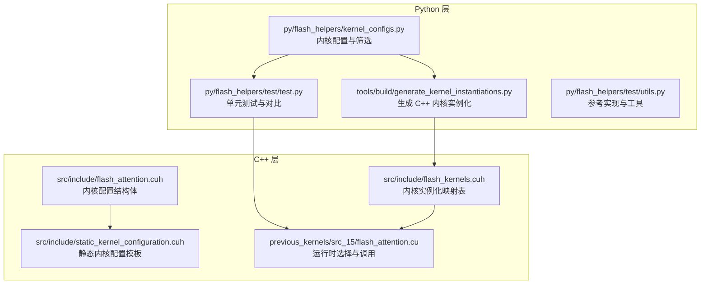
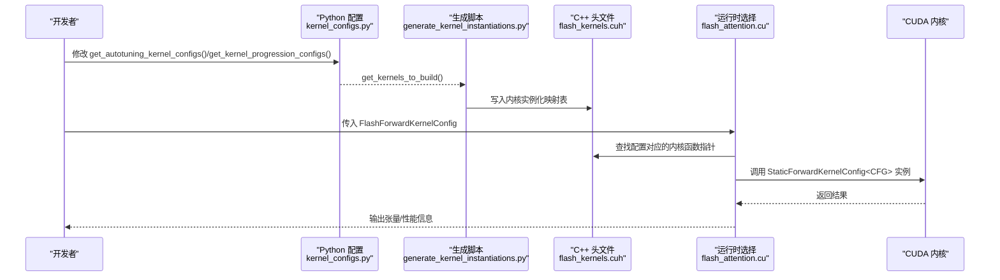
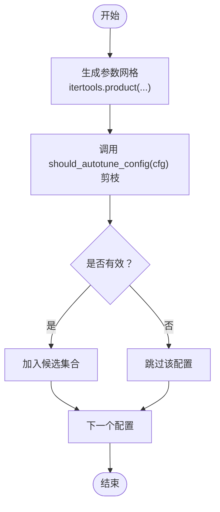
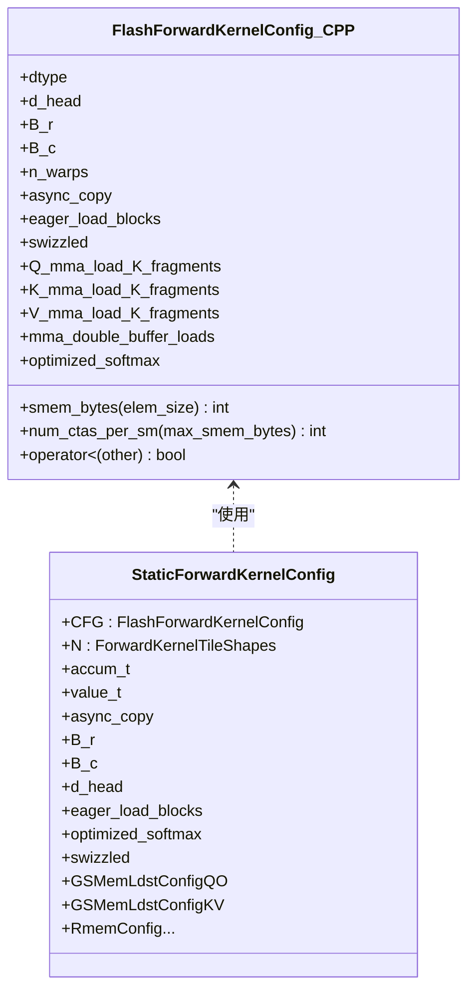
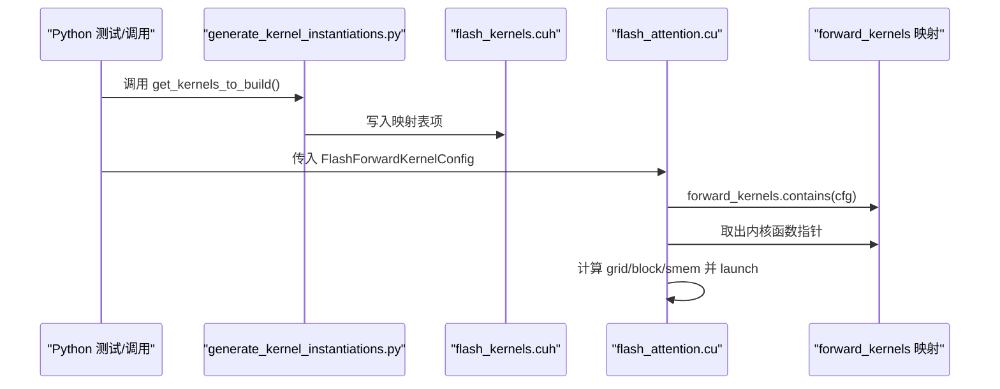
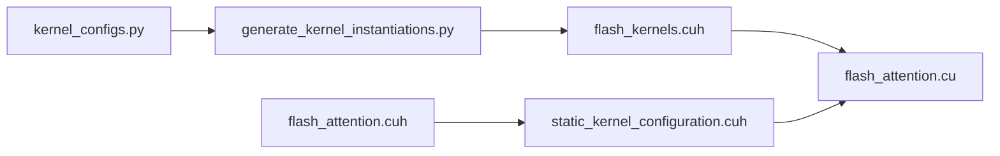

# 配置定制与扩展

<cite>
**本文引用的文件列表**
- [py/flash_helpers/kernel_configs.py](file://py/flash_helpers/kernel_configs.py)
- [tools/build/generate_kernel_instantiations.py](file://tools/build/generate_kernel_instantiations.py)
- [src/include/flash_kernels.cuh](file://src/include/flash_kernels.cuh)
- [src/include/static_kernel_configuration.cuh](file://src/include/static_kernel_configuration.cuh)
- [src/include/flash_attention.cuh](file://src/include/flash_attention.cuh)
- [previous_kernels/src_15/flash_attention.cu](file://previous_kernels/src_15/flash_attention.cu)
- [py/flash_helpers/test/test.py](file://py/flash_helpers/test/test.py)
- [py/flash_helpers/test/utils.py](file://py/flash_helpers/test/utils.py)
- [tools/benchmark/benchmark_autotune.sh](file://tools/benchmark/benchmark_autotune.sh)
</cite>

## 目录
1. [简介](#简介)
2. [项目结构](#项目结构)
3. [核心组件](#核心组件)
4. [架构总览](#架构总览)
5. [详细组件分析](#详细组件分析)
6. [依赖关系分析](#依赖关系分析)
7. [性能考量](#性能考量)
8. [故障排查指南](#故障排查指南)
9. [结论](#结论)
10. [附录：分步指南与最佳实践](#附录分步指南与最佳实践)

## 简介
本文件面向需要自定义内核配置或添加新内核变体的开发者，系统性讲解如何：
- 通过修改 Python 层配置函数调整自动调优搜索空间；
- 在代码中定义新的 FlashForwardKernelConfig 实例并纳入构建；
- 使用 generate_kernel_instantiations.py 工具从 Python 配置生成 C++ 内核实例化代码；
- 分步添加支持新块大小或新优化组合的内核变体，并验证正确性与性能。

## 项目结构
该仓库采用“Python 配置 + C++ 内核 + 构建脚本”的分层组织方式：
- Python 层负责内核配置、过滤与生成；
- C++ 层负责静态内核配置与运行时选择；
- 构建脚本负责将 Python 配置映射为 C++ 头文件中的内核实例化表。

图表来源
- [py/flash_helpers/kernel_configs.py](file://py/flash_helpers/kernel_configs.py#L389-L485)
- [tools/build/generate_kernel_instantiations.py](file://tools/build/generate_kernel_instantiations.py#L1-L56)
- [src/include/flash_kernels.cuh](file://src/include/flash_kernels.cuh#L1-L187)
- [src/include/static_kernel_configuration.cuh](file://src/include/static_kernel_configuration.cuh#L1-L294)
- [src/include/flash_attention.cuh](file://src/include/flash_attention.cuh#L1-L110)
- [previous_kernels/src_15/flash_attention.cu](file://previous_kernels/src_15/flash_attention.cu#L1-L150)

章节来源
- [py/flash_helpers/kernel_configs.py](file://py/flash_helpers/kernel_configs.py#L389-L485)
- [tools/build/generate_kernel_instantiations.py](file://tools/build/generate_kernel_instantiations.py#L1-L56)
- [src/include/flash_kernels.cuh](file://src/include/flash_kernels.cuh#L1-L187)
- [src/include/static_kernel_configuration.cuh](file://src/include/static_kernel_configuration.cuh#L1-L294)
- [src/include/flash_attention.cuh](file://src/include/flash_attention.cuh#L1-L110)
- [previous_kernels/src_15/flash_attention.cu](file://previous_kernels/src_15/flash_attention.cu#L1-L150)

## 核心组件
- Python 配置与筛选
  - FlashForwardKernelConfig：描述内核配置的不可变数据类，包含数据类型、d_head、块大小、线程瓦片数、异步拷贝、预加载、swizzle、Q/K/V 的 K 片段加载数、双缓冲、优化 softmax 等字段。
  - get_autotuning_kernel_configs()：定义自动调优的参数网格，返回满足 should_autotune_config() 过滤条件的配置集合。
  - get_kernel_progression_configs()：定义内核演进路径，可扩展为全尺寸搜索。
  - get_kernels_to_build()：汇总当前要构建的内核集合（默认来自自动调优）。
  - should_autotune_config()：对配置进行合法性与资源限制检查，剔除不合适的组合。
- C++ 内核配置与实例化
  - FlashForwardKernelConfig（C++ 结构体）：与 Python 数据类一一对应，用于运行时比较与排序。
  - StaticForwardKernelConfig：基于 FlashForwardKernelConfig 的编译期静态配置模板，决定内存布局、寄存器/共享内存片段数等。
  - flash_kernels.cuh：由 Python 脚本生成的内核实例化映射表，键为配置，值为对应内核函数指针。
  - flash_attention.cu：运行时根据传入配置查找映射表并调用相应内核。

章节来源
- [py/flash_helpers/kernel_configs.py](file://py/flash_helpers/kernel_configs.py#L106-L175)
- [py/flash_helpers/kernel_configs.py](file://py/flash_helpers/kernel_configs.py#L364-L424)
- [py/flash_helpers/kernel_configs.py](file://py/flash_helpers/kernel_configs.py#L426-L485)
- [src/include/flash_attention.cuh](file://src/include/flash_attention.cuh#L30-L110)
- [src/include/static_kernel_configuration.cuh](file://src/include/static_kernel_configuration.cuh#L1-L294)
- [src/include/flash_kernels.cuh](file://src/include/flash_kernels.cuh#L1-L187)
- [previous_kernels/src_15/flash_attention.cu](file://previous_kernels/src_15/flash_attention.cu#L1-L150)

## 架构总览
下面的序列图展示了从 Python 配置到 C++ 内核实例化的完整流程。

图表来源
- [py/flash_helpers/kernel_configs.py](file://py/flash_helpers/kernel_configs.py#L389-L485)
- [tools/build/generate_kernel_instantiations.py](file://tools/build/generate_kernel_instantiations.py#L1-L56)
- [src/include/flash_kernels.cuh](file://src/include/flash_kernels.cuh#L1-L187)
- [previous_kernels/src_15/flash_attention.cu](file://previous_kernels/src_15/flash_attention.cu#L1-L150)

## 详细组件分析

### 组件一：Python 配置与筛选（自动调优搜索空间）
- 关键函数
  - get_autotuning_kernel_configs(dtypes=[DType.BF16, DType.FP16])：定义 d_head、B_r、B_c、n_warps、异步拷贝、预加载、swizzle、Q/K/V 加载片段数、双缓冲、优化 softmax 等维度的网格，使用 itertools.product 生成笛卡尔积后经 should_autotune_config() 过滤。
  - should_autotune_config(cfg)：对非法组合进行剪枝，例如当未启用异步拷贝却启用预加载时直接剔除；当 Q/K 加载片段不一致且 Q 不为 0 时剔除；针对 B_r=64 或 B_r=128 的特定约束进行限制。
  - get_kernel_progression_configs(all_block_sizes=False)：以短格式字符串定义内核演进路径，支持扩展为全尺寸搜索。
  - get_kernels_to_build()：汇总当前构建集合，默认取自自动调优配置。
- 设计要点
  - 将“搜索空间”与“合法性约束”分离，便于迭代优化；
  - 通过环境变量或参数键控制测试范围（如 prog/all/tune）。

图表来源
- [py/flash_helpers/kernel_configs.py](file://py/flash_helpers/kernel_configs.py#L389-L424)
- [py/flash_helpers/kernel_configs.py](file://py/flash_helpers/kernel_configs.py#L364-L387)

章节来源
- [py/flash_helpers/kernel_configs.py](file://py/flash_helpers/kernel_configs.py#L364-L424)
- [py/flash_helpers/kernel_configs.py](file://py/flash_helpers/kernel_configs.py#L426-L485)

### 组件二：C++ 内核配置与静态模板
- FlashForwardKernelConfig（C++）
  - 字段与 Python 对应，提供 smem_bytes() 与 num_ctas_per_sm() 等辅助计算，用于动态共享内存设置与并发度估算。
  - 提供 operator< 用于排序与映射键比较。
- StaticForwardKernelConfig
  - 基于编译期常量推导 tile 形状、线程/瓦片划分、共享/寄存器内存片段数、swizzle 策略等，保证内核在编译期完成大部分分支展开与常量折叠。
  - 通过 valid_config() 在编译期静态断言，确保加载片段数与 d_head、双缓冲等约束一致。
- flash_kernels.cuh
  - 由 Python 脚本生成，建立 FlashForwardKernelConfig 到内核函数指针的映射，作为运行时选择依据。

图表来源
- [src/include/flash_attention.cuh](file://src/include/flash_attention.cuh#L30-L110)
- [src/include/static_kernel_configuration.cuh](file://src/include/static_kernel_configuration.cuh#L1-L294)

章节来源
- [src/include/flash_attention.cuh](file://src/include/flash_attention.cuh#L30-L110)
- [src/include/static_kernel_configuration.cuh](file://src/include/static_kernel_configuration.cuh#L1-L294)

### 组件三：内核实例化生成与运行时选择
- generate_kernel_instantiations.py
  - 读取 get_kernels_to_build()，逐条写入 flash_kernels.cuh 的映射表，键为 C++ 结构体字面量，值为对应内核模板实例化函数指针。
- flash_attention.cu
  - 接收 Python 传入的配置对象，转换为 C++ 结构体；
  - 在 flash_kernels.cuh 中查找对应内核函数指针并调用；
  - 设置动态共享内存上限，按配置计算 grid/block 并执行内核。

图表来源
- [tools/build/generate_kernel_instantiations.py](file://tools/build/generate_kernel_instantiations.py#L1-L56)
- [src/include/flash_kernels.cuh](file://src/include/flash_kernels.cuh#L1-L187)
- [previous_kernels/src_15/flash_attention.cu](file://previous_kernels/src_15/flash_attention.cu#L1-L150)

章节来源
- [tools/build/generate_kernel_instantiations.py](file://tools/build/generate_kernel_instantiations.py#L1-L56)
- [src/include/flash_kernels.cuh](file://src/include/flash_kernels.cuh#L1-L187)
- [previous_kernels/src_15/flash_attention.cu](file://previous_kernels/src_15/flash_attention.cu#L1-L150)

## 依赖关系分析
- Python 层依赖
  - kernel_configs.py 依赖 dataclasses、itertools、正则表达式解析短格式字符串，以及 DType 枚举与数值工具函数。
  - generate_kernel_instantiations.py 依赖 kernel_configs.get_kernels_to_build() 产出集合。
- C++ 层依赖
  - flash_kernels.cuh 依赖 flash_attention.cuh 与 forward_kernel.cuh；
  - flash_attention.cu 依赖 flash_kernels.cuh 与静态配置头文件；
  - static_kernel_configuration.cuh 依赖 flash_attention.cuh 与底层张量/布局/加载存储等头文件。

图表来源
- [py/flash_helpers/kernel_configs.py](file://py/flash_helpers/kernel_configs.py#L389-L485)
- [tools/build/generate_kernel_instantiations.py](file://tools/build/generate_kernel_instantiations.py#L1-L56)
- [src/include/flash_kernels.cuh](file://src/include/flash_kernels.cuh#L1-L187)
- [src/include/flash_attention.cuh](file://src/include/flash_attention.cuh#L1-L110)
- [src/include/static_kernel_configuration.cuh](file://src/include/static_kernel_configuration.cuh#L1-L294)
- [previous_kernels/src_15/flash_attention.cu](file://previous_kernels/src_15/flash_attention.cu#L1-L150)

章节来源
- [py/flash_helpers/kernel_configs.py](file://py/flash_helpers/kernel_configs.py#L389-L485)
- [tools/build/generate_kernel_instantiations.py](file://tools/build/generate_kernel_instantiations.py#L1-L56)
- [src/include/flash_kernels.cuh](file://src/include/flash_kernels.cuh#L1-L187)
- [src/include/flash_attention.cuh](file://src/include/flash_attention.cuh#L1-L110)
- [src/include/static_kernel_configuration.cuh](file://src/include/static_kernel_configuration.cuh#L1-L294)
- [previous_kernels/src_15/flash_attention.cu](file://previous_kernels/src_15/flash_attention.cu#L1-L150)

## 性能考量
- 自动调优搜索空间
  - 通过 should_autotune_config() 剪枝，避免无效组合导致编译失败或运行时资源不足；
  - 合理设置 B_r/B_c/n_warps 与加载片段数，平衡寄存器/共享内存占用与吞吐。
- 运行时选择
  - flash_kernels.cuh 的映射表键为 FlashForwardKernelConfig，比较器按字段顺序排序，确保查找稳定；
  - flash_attention.cu 在模块初始化时根据 smem_bytes() 设置最大动态共享内存，避免超限。
- 验证与基准
  - 单元测试使用参考实现（flash_attn_2/3_cuda）进行数值一致性校验；
  - benchmark_autotune.sh 提供自动调优基准入口，可按序列长度批量评估。

章节来源
- [py/flash_helpers/kernel_configs.py](file://py/flash_helpers/kernel_configs.py#L364-L387)
- [src/include/flash_attention.cuh](file://src/include/flash_attention.cuh#L54-L66)
- [previous_kernels/src_15/flash_attention.cu](file://previous_kernels/src_15/flash_attention.cu#L118-L149)
- [py/flash_helpers/test/test.py](file://py/flash_helpers/test/test.py#L1-L104)
- [py/flash_helpers/test/utils.py](file://py/flash_helpers/test/utils.py#L1-L202)
- [tools/benchmark/benchmark_autotune.sh](file://tools/benchmark/benchmark_autotune.sh#L1-L4)

## 故障排查指南
- 配置未被构建
  - 检查 get_kernels_to_build() 是否包含目标配置；确认 generate_kernel_instantiations.py 已重新生成 flash_kernels.cuh。
- 运行时报错“配置未找到”
  - 确认 Python 传入的配置与 C++ 结构体字段完全一致；检查 flash_kernels.cuh 中是否存在对应键。
- 编译期静态断言失败
  - 检查 StaticForwardKernelConfig::valid_config() 的断言条件，尤其是加载片段数与 d_head、双缓冲的关系。
- 性能异常
  - 使用 benchmark_autotune.sh 生成 CSV，结合单测中的数值误差统计进行对比分析。

章节来源
- [tools/build/generate_kernel_instantiations.py](file://tools/build/generate_kernel_instantiations.py#L1-L56)
- [src/include/flash_kernels.cuh](file://src/include/flash_kernels.cuh#L1-L187)
- [src/include/static_kernel_configuration.cuh](file://src/include/static_kernel_configuration.cuh#L1-L36)
- [previous_kernels/src_15/flash_attention.cu](file://previous_kernels/src_15/flash_attention.cu#L1-L150)
- [py/flash_helpers/test/test.py](file://py/flash_helpers/test/test.py#L1-L104)

## 结论
通过将 Python 层的配置网格与 C++ 层的静态模板相结合，本项目实现了灵活、可扩展的内核配置体系。开发者只需在 Python 层调整搜索空间与过滤条件，再通过生成脚本同步到 C++ 头文件，即可快速引入新的块大小或优化组合，并在测试与基准流程中验证正确性与性能。

## 附录：分步指南与最佳实践

### 步骤一：调整自动调优搜索空间
- 在 Python 层修改 get_autotuning_kernel_configs()，新增或调整以下维度：
  - d_heads、B_r、B_c、n_warps；
  - 异步拷贝、预加载、swizzle；
  - Q/K/V 的 K 片段加载数（Q/K/V_mma_load_K_tiles）；
  - 双缓冲、优化 softmax。
- 如需扩展全尺寸搜索，可在 get_kernel_progression_configs() 中启用 all_block_sizes 参数，或直接在 get_kernels_to_build() 中合并更多配置集合。

章节来源
- [py/flash_helpers/kernel_configs.py](file://py/flash_helpers/kernel_configs.py#L389-L424)
- [py/flash_helpers/kernel_configs.py](file://py/flash_helpers/kernel_configs.py#L426-L485)

### 步骤二：定义新的 FlashForwardKernelConfig 实例并纳入构建
- 在 Python 层构造新的 FlashForwardKernelConfig 实例（字段与枚举值需与 C++ 对应），并确保其通过 should_autotune_config()；
- 确保 get_kernels_to_build() 包含该配置（可通过直接追加或在 get_kernel_progression_configs() 中扩展）。

章节来源
- [py/flash_helpers/kernel_configs.py](file://py/flash_helpers/kernel_configs.py#L106-L175)
- [py/flash_helpers/kernel_configs.py](file://py/flash_helpers/kernel_configs.py#L457-L463)

### 步骤三：生成 C++ 内核实例化代码
- 运行 generate_kernel_instantiations.py，它会读取 get_kernels_to_build() 并写入 src/include/flash_kernels.cuh；
- 确认生成文件中包含目标配置键值对，键为 C++ 结构体字面量，值为对应内核模板实例化函数指针。

章节来源
- [tools/build/generate_kernel_instantiations.py](file://tools/build/generate_kernel_instantiations.py#L1-L56)
- [src/include/flash_kernels.cuh](file://src/include/flash_kernels.cuh#L1-L187)

### 步骤四：在 C++ 层验证与调用
- 确认 flash_attention.cu 能够通过 flash_kernels.cuh 的映射表找到目标内核；
- 若配置涉及较大的共享内存，确保在模块初始化时设置了最大动态共享内存；
- 运行单元测试，使用参考实现进行数值一致性对比。

章节来源
- [previous_kernels/src_15/flash_attention.cu](file://previous_kernels/src_15/flash_attention.cu#L1-L150)
- [py/flash_helpers/test/test.py](file://py/flash_helpers/test/test.py#L1-L104)
- [py/flash_helpers/test/utils.py](file://py/flash_helpers/test/utils.py#L1-L202)

### 步骤五：验证正确性与性能
- 正确性：使用 py/flash_helpers/test/test.py 遍历 get_kernels_to_build() 中的所有配置，与参考实现对比误差；
- 性能：使用 tools/benchmark/benchmark_autotune.sh 指定序列长度与运行次数，输出 CSV 以便后续分析。

章节来源
- [py/flash_helpers/test/test.py](file://py/flash_helpers/test/test.py#L1-L104)
- [tools/benchmark/benchmark_autotune.sh](file://tools/benchmark/benchmark_autotune.sh#L1-L4)