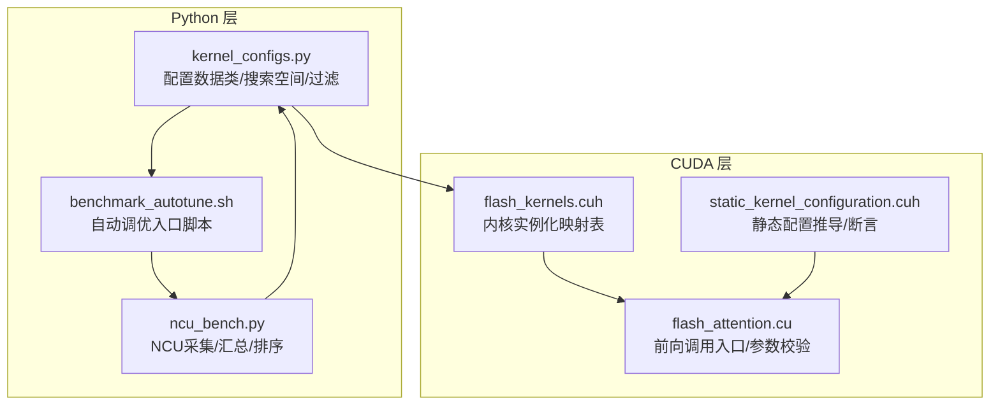
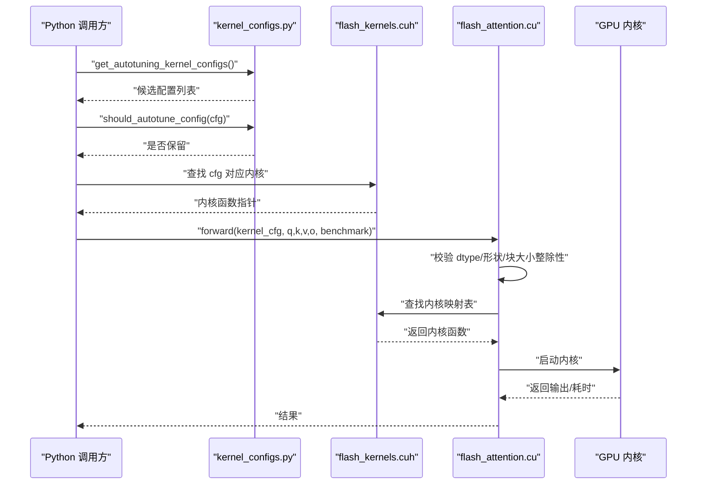
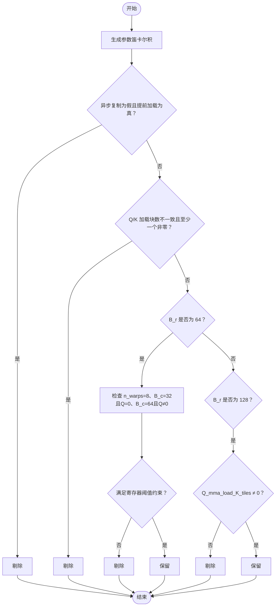
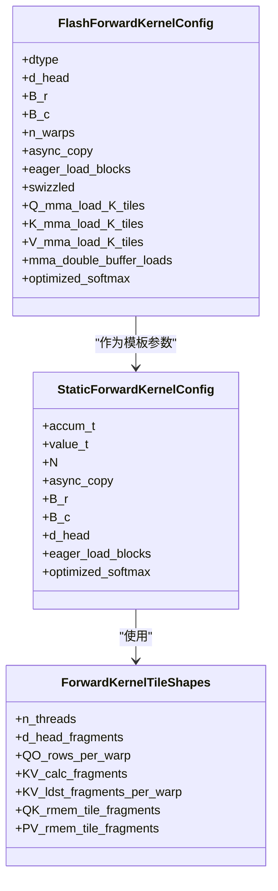
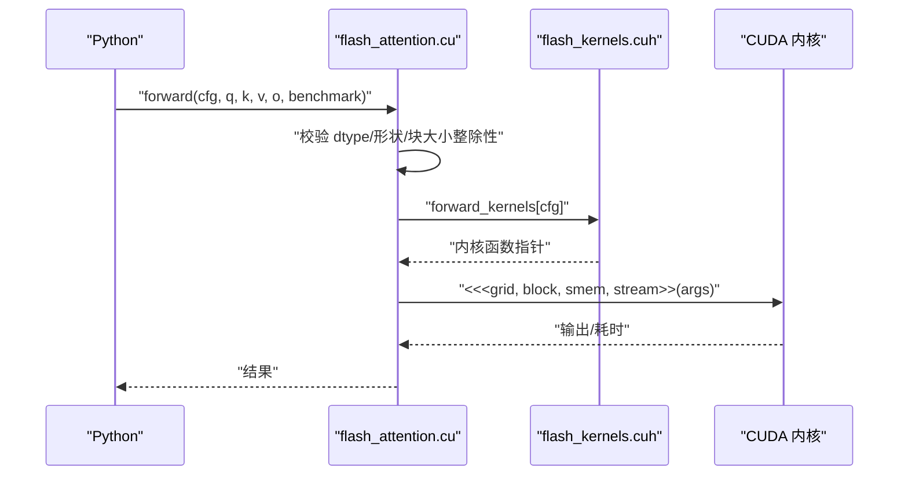
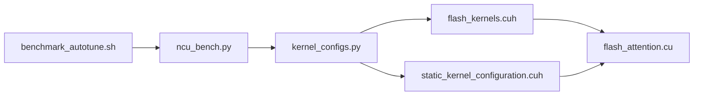

# 配置管理与自动调优

<cite>
**本文引用的文件**
- [py/flash_helpers/kernel_configs.py](file://py/flash_helpers/kernel_configs.py)
- [previous_kernels/src_15/include/static_kernel_configuration.cuh](file://previous_kernels/src_15/include/static_kernel_configuration.cuh)
- [src/include/static_kernel_configuration.cuh](file://src/include/static_kernel_configuration.cuh)
- [previous_kernels/src_15/include/flash_kernels.cuh](file://previous_kernels/src_15/include/flash_kernels.cuh)
- [previous_kernels/src_15/flash_attention.cu](file://previous_kernels/src_15/flash_attention.cu)
- [tools/benchmark/ncu_bench.py](file://tools/benchmark/ncu_bench.py)
- [tools/benchmark/benchmark_autotune.sh](file://tools/benchmark/benchmark_autotune.sh)
- [README.md](file://README.md)
</cite>

## 目录
1. [引言](#引言)
2. [项目结构](#项目结构)
3. [核心组件](#核心组件)
4. [架构总览](#架构总览)
5. [详细组件分析](#详细组件分析)
6. [依赖关系分析](#依赖关系分析)
7. [性能考量](#性能考量)
8. [故障排查指南](#故障排查指南)
9. [结论](#结论)
10. [附录](#附录)

## 引言
本文件围绕“内核配置管理与自动调优”主题，系统性解析以下关键能力：
- 如何通过定义参数组合空间（如块大小、线程束数量、异步复制、加载策略等）构建自动调优的搜索空间；
- 如何在 should_autotune_config 中进行过滤，剔除无效或不满足硬件约束的配置；
- 如何使用 get_autotuning_kernel_configs 和 get_kernel_progression_configs 生成候选配置集；
- 如何基于这些配置在运行时选择并执行对应内核；
- 如何结合基准工具链（NCU、脚本）评估不同配置的性能与资源占用；
- 如何根据硬件特性（如 Ampere 架构寄存器限制）调整参数边界与约束。

## 项目结构
该项目包含多版本内核源码、Python 辅助模块、构建与基准工具。与本主题直接相关的核心位置如下：
- Python 层：内核配置数据结构、搜索空间生成与过滤逻辑、短名转换与解析；
- CUDA 层：静态内核配置推导、内核实例化映射表、前向调用入口；
- 基准层：NCU 性能采集与汇总、自动调优脚本。

图表来源
- [py/flash_helpers/kernel_configs.py](file://py/flash_helpers/kernel_configs.py#L1-L486)
- [tools/benchmark/ncu_bench.py](file://tools/benchmark/ncu_bench.py#L1-L464)
- [tools/benchmark/benchmark_autotune.sh](file://tools/benchmark/benchmark_autotune.sh#L1-L4)
- [previous_kernels/src_15/include/static_kernel_configuration.cuh](file://previous_kernels/src_15/include/static_kernel_configuration.cuh#L1-L294)
- [previous_kernels/src_15/include/flash_kernels.cuh](file://previous_kernels/src_15/include/flash_kernels.cuh#L1-L187)
- [previous_kernels/src_15/flash_attention.cu](file://previous_kernels/src_15/flash_attention.cu#L1-L150)

章节来源
- [README.md](file://README.md#L1-L63)

## 核心组件
- 配置数据结构与解析
  - FlashForwardKernelConfig：封装内核配置字段（数据类型、块大小、线程束数、异步复制、加载策略、双缓冲、优化开关等），并提供短名、C++ 结构体字符串、FLOP 计算等辅助方法。
  - 解析函数：支持从 demangled 名称、带类型签名名称、短名形式解析为配置对象。
- 自动调优搜索空间
  - get_autotuning_kernel_configs：以笛卡尔积方式生成候选配置，并通过 should_autotune_config 过滤无效组合。
  - get_kernel_progression_configs：按“逐步推进”的策略生成一组典型配置序列，便于观察性能曲线。
- 运行时选择与执行
  - should_autotune_config：过滤逻辑，确保配置满足硬件与语义约束（例如异步复制与“提前加载”不能同时为假；Q/K 加载策略需一致；特定 B_r/B_c/n_warps 组合可能触发寄存器阈值限制等）。
  - flash_attention.cu：接收 Python 层传入的配置，校验 dtype/形状/块大小整除性，查找内核映射表并调用。
  - flash_kernels.cuh：维护 FlashForwardKernelConfig 到内核函数指针的映射，供运行时调用。

章节来源
- [py/flash_helpers/kernel_configs.py](file://py/flash_helpers/kernel_configs.py#L106-L175)
- [py/flash_helpers/kernel_configs.py](file://py/flash_helpers/kernel_configs.py#L177-L363)
- [py/flash_helpers/kernel_configs.py](file://py/flash_helpers/kernel_configs.py#L364-L486)
- [previous_kernels/src_15/include/flash_kernels.cuh](file://previous_kernels/src_15/include/flash_kernels.cuh#L1-L187)
- [previous_kernels/src_15/flash_attention.cu](file://previous_kernels/src_15/flash_attention.cu#L1-L150)

## 架构总览
下图展示了从 Python 搜索空间到 CUDA 内核执行的关键流程。

图表来源
- [py/flash_helpers/kernel_configs.py](file://py/flash_helpers/kernel_configs.py#L364-L486)
- [previous_kernels/src_15/include/flash_kernels.cuh](file://previous_kernels/src_15/include/flash_kernels.cuh#L1-L187)
- [previous_kernels/src_15/flash_attention.cu](file://previous_kernels/src_15/flash_attention.cu#L1-L150)

## 详细组件分析

### 组件A：自动调优搜索空间与过滤逻辑
- 参数组合空间
  - 数据类型：BF16/FP16
  - 头维度：固定为 128
  - 块大小：B_r ∈ {64, 128}，B_c ∈ {32, 64}
  - 线程束数：n_warps ∈ {4}（当前默认）
  - 异步复制：仅允许 True（避免与“提前加载”同时为假）
  - 提前加载：仅允许 True（与异步复制配合）
  - Swizzle：仅允许 True（提升访存局部性）
  - Q/K/V 的 MMA 加载块数：Q_mma_load_K_tiles/K_mma_load_K_tiles/V_mma_load_K_tiles ∈ {0, 2}
  - 双缓冲：布尔
  - 优化 softmax：布尔
- 过滤逻辑 should_autotune_config
  - 异步复制为假且提前加载为真时，直接剔除（语义冲突）。
  - 若 Q/K 加载块数不相等且 Q/K 至少一个非零，则剔除（一致性约束）。
  - B_r=64 时：
    - n_warps=8 不允许（线程分配与寄存器压力相关）。
    - 当 B_c=32 且 Q_mma_load_K_tiles=0 时剔除（超过 3CTA 寄存器阈值）。
    - 当 B_c=64 且 Q_mma_load_K_tiles≠0 时剔除（寄存器压力过高）。
  - B_r=128 时：
    - Q_mma_load_K_tiles=0 不允许（与块大小/计算模式不匹配）。
- 生成策略
  - get_autotuning_kernel_configs：对上述集合做笛卡尔积，再应用过滤。
  - get_kernel_progression_configs：给出一条“逐步推进”的路径，便于观察性能趋势；可选扩展到全块大小空间。

图表来源
- [py/flash_helpers/kernel_configs.py](file://py/flash_helpers/kernel_configs.py#L364-L424)

章节来源
- [py/flash_helpers/kernel_configs.py](file://py/flash_helpers/kernel_configs.py#L364-L486)

### 组件B：静态内核配置与运行时断言
- 静态配置推导
  - ForwardKernelTileShapes：基于配置推导线程数、每 Warp 行列分块、寄存器/共享内存布局等常量信息。
  - StaticForwardKernelConfig：将配置映射为编译期常量，用于模板实例化与内存布局推导。
- 编译期断言
  - valid_config：对 K 方向片段数、双缓冲、Q/K/V 加载一致性等进行静态断言，确保配置合法。
- 作用
  - 将运行时配置转化为编译期可推导的常量，减少运行时开销，提高内核稳定性。

图表来源
- [previous_kernels/src_15/include/static_kernel_configuration.cuh](file://previous_kernels/src_15/include/static_kernel_configuration.cuh#L1-L294)
- [src/include/static_kernel_configuration.cuh](file://src/include/static_kernel_configuration.cuh#L1-L294)

章节来源
- [previous_kernels/src_15/include/static_kernel_configuration.cuh](file://previous_kernels/src_15/include/static_kernel_configuration.cuh#L1-L294)
- [src/include/static_kernel_configuration.cuh](file://src/include/static_kernel_configuration.cuh#L1-L294)

### 组件C：内核实例化映射与运行时调用
- 内核实例化映射
  - flash_kernels.cuh：维护 FlashForwardKernelConfig 到内核函数指针的映射，供 Python/运行时查找。
- 运行时调用
  - flash_attention.cu：接收 Python 传入的配置，校验 dtype/形状/块大小整除性，查找映射表并启动内核，支持动态共享内存设置。

图表来源
- [previous_kernels/src_15/flash_attention.cu](file://previous_kernels/src_15/flash_attention.cu#L1-L150)
- [previous_kernels/src_15/include/flash_kernels.cuh](file://previous_kernels/src_15/include/flash_kernels.cuh#L1-L187)

章节来源
- [previous_kernels/src_15/flash_attention.cu](file://previous_kernels/src_15/flash_attention.cu#L1-L150)
- [previous_kernels/src_15/include/flash_kernels.cuh](file://previous_kernels/src_15/include/flash_kernels.cuh#L1-L187)

### 组件D：基准与自动调优工作流
- 自动调优脚本
  - benchmark_autotune.sh：设置 KERNELS=tune，调用 ncu_bench.py 对不同序列长度进行基准测试，输出性能与寄存器等指标。
- NCU 基准工具
  - ncu_bench.py：解析 NCU CSV 输出，聚合多次运行结果，生成表格并计算 TFLOP/s 与注意力 FLOP/s，支持对比参考内核。
- 使用建议
  - 在不同 d_head/seq_len 下运行，观察“逐步推进”配置的性能变化，定位瓶颈（访存/寄存器/算力）。

章节来源
- [tools/benchmark/benchmark_autotune.sh](file://tools/benchmark/benchmark_autotune.sh#L1-L4)
- [tools/benchmark/ncu_bench.py](file://tools/benchmark/ncu_bench.py#L1-L464)

## 依赖关系分析
- Python 层依赖
  - kernel_configs.py 依赖 torch（仅在 dtype 映射时导入），并提供配置解析、短名转换、搜索空间生成与过滤。
- CUDA 层依赖
  - static_kernel_configuration.cuh 依赖通用头文件（common.h、flash_attention.cuh、gemm.cuh、layout.cuh、load_store.cuh、tensor.cuh、utils.h），并在 valid_config 中进行静态断言。
  - flash_kernels.cuh 维护内核映射表，供运行时查找。
  - flash_attention.cu 依赖 flash_kernels.cuh 并进行输入校验与内核启动。
- 工具链依赖
  - ncu_bench.py 依赖 NCU CLI 与 CSV 输出解析，生成性能报告。

图表来源
- [py/flash_helpers/kernel_configs.py](file://py/flash_helpers/kernel_configs.py#L1-L486)
- [previous_kernels/src_15/include/static_kernel_configuration.cuh](file://previous_kernels/src_15/include/static_kernel_configuration.cuh#L1-L294)
- [previous_kernels/src_15/include/flash_kernels.cuh](file://previous_kernels/src_15/include/flash_kernels.cuh#L1-L187)
- [previous_kernels/src_15/flash_attention.cu](file://previous_kernels/src_15/flash_attention.cu#L1-L150)
- [tools/benchmark/ncu_bench.py](file://tools/benchmark/ncu_bench.py#L1-L464)
- [tools/benchmark/benchmark_autotune.sh](file://tools/benchmark/benchmark_autotune.sh#L1-L4)

章节来源
- [py/flash_helpers/kernel_configs.py](file://py/flash_helpers/kernel_configs.py#L1-L486)
- [previous_kernels/src_15/include/static_kernel_configuration.cuh](file://previous_kernels/src_15/include/static_kernel_configuration.cuh#L1-L294)
- [previous_kernels/src_15/include/flash_kernels.cuh](file://previous_kernels/src_15/include/flash_kernels.cuh#L1-L187)
- [previous_kernels/src_15/flash_attention.cu](file://previous_kernels/src_15/flash_attention.cu#L1-L150)
- [tools/benchmark/ncu_bench.py](file://tools/benchmark/ncu_bench.py#L1-L464)
- [tools/benchmark/benchmark_autotune.sh](file://tools/benchmark/benchmark_autotune.sh#L1-L4)

## 性能考量
- 寄存器压力与块大小/线程束数
  - 过滤逻辑中明确指出：当 B_r=64 且 n_warps=8 时剔除；当 B_c=32 且 Q_mma_load_K_tiles=0 时剔除；当 B_c=64 且 Q_mma_load_K_tiles≠0 时剔除。这些规则与 Ampere 架构寄存器上限密切相关，避免单 CTA 或多 CTA 同时占用过多寄存器导致吞吐下降。
- 加载策略与访存局部性
  - 异步复制与提前加载通常与 Swizzle 配合使用，以提升全局/共享内存访问的连续性与带宽利用率。
- MMA 加载块数一致性
  - Q/K 加载块数必须一致（或至少一个为 0），否则会破坏计算/加载的一致性，导致编译期断言失败或运行时异常。
- 双缓冲与寄存器/共享内存占用
  - 双缓冲会增加寄存器与共享内存占用，需要在性能与资源之间权衡。

章节来源
- [py/flash_helpers/kernel_configs.py](file://py/flash_helpers/kernel_configs.py#L364-L424)
- [previous_kernels/src_15/include/static_kernel_configuration.cuh](file://previous_kernels/src_15/include/static_kernel_configuration.cuh#L1-L294)

## 故障排查指南
- 常见错误与定位
  - “内核配置未找到”：确认配置存在于 flash_kernels.cuh 的映射表中；可通过短名转换工具核对配置字符串。
  - “块大小不整除”：检查 seq_len 与 B_r/B_c 的整除关系。
  - “寄存器阈值超限”：遵循 should_autotune_config 的过滤规则，避免 B_r=64 且 n_warps=8、B_c=32 且 Q=0、B_c=64 且 Q≠0 等组合。
  - “配置不一致”：确保 Q/K 加载块数一致（或至少一个为 0）。
- 基准与调试
  - 使用 benchmark_autotune.sh 触发自动调优流程，结合 ncu_bench.py 的 CSV 输出查看 Registers Per Thread、Duration、Cycles 等指标，定位瓶颈。

章节来源
- [previous_kernels/src_15/flash_attention.cu](file://previous_kernels/src_15/flash_attention.cu#L1-L150)
- [py/flash_helpers/kernel_configs.py](file://py/flash_helpers/kernel_configs.py#L364-L486)
- [tools/benchmark/ncu_bench.py](file://tools/benchmark/ncu_bench.py#L1-L464)

## 结论
- get_autotuning_kernel_configs 通过参数组合空间与 should_autotune_config 的过滤逻辑，有效缩小了搜索空间，保证了配置的合法性与可行性。
- get_kernel_progression_configs 提供了可解释的“逐步推进”路径，便于观察不同配置对性能的影响。
- 静态内核配置与编译期断言确保了配置在模板实例化阶段即被验证，提升了内核的稳定性和可维护性。
- 基于 NCU 的基准工具链为自动调优提供了闭环：生成配置、执行内核、收集指标、比较性能。

## 附录

### 实际代码示例（路径引用）
- 修改自动调优搜索空间
  - 扩展 B_r/B_c/n_warps 组合：在 get_autotuning_kernel_configs 中添加更多候选值，注意 should_autotune_config 的过滤逻辑会据此筛选。
  - 示例路径：[py/flash_helpers/kernel_configs.py](file://py/flash_helpers/kernel_configs.py#L389-L424)
- 扩展推进式配置
  - 在 get_kernel_progression_configs 中追加新的短名配置，或启用 all_block_sizes 以覆盖更广的块大小空间。
  - 示例路径：[py/flash_helpers/kernel_configs.py](file://py/flash_helpers/kernel_configs.py#L426-L455)
- 调整过滤逻辑
  - 在 should_autotune_config 中新增约束（如新的寄存器阈值或硬件特性），确保新规则与现有断言一致。
  - 示例路径：[py/flash_helpers/kernel_configs.py](file://py/flash_helpers/kernel_configs.py#L364-L387)
- 基于硬件特性调整参数边界
  - Ampere 架构寄存器限制：参考过滤逻辑中对 B_r=64、B_c、n_warps、Q_mma_load_K_tiles 的约束，必要时在搜索空间中显式排除高风险组合。
  - 示例路径：[py/flash_helpers/kernel_configs.py](file://py/flash_helpers/kernel_configs.py#L364-L424)