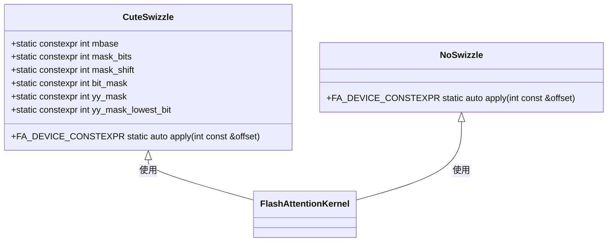
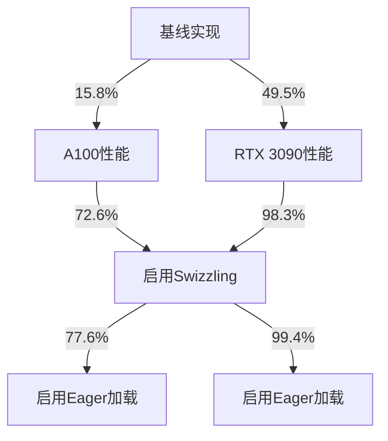
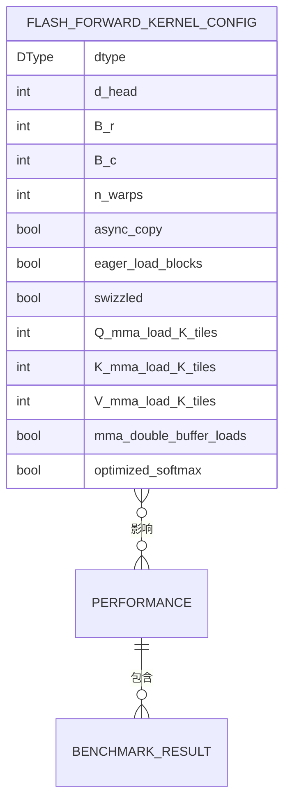

# Swizzling技术与内存访问优化

<cite>
**本文档引用的文件**   
- [kernel_configs.py](file://py/flash_helpers/kernel_configs.py)
- [swizzling.cuh](file://src/include/swizzling.cuh)
- [load_store.cuh](file://previous_kernels/src_13/include/load_store.cuh)
- [common.h](file://src/include/common.h)
- [flash_attention.cu](file://src/flash_attention.cu)
- [forward_kernel.cuh](file://src/include/forward_kernel.cuh)
</cite>

## 目录
1. [引言](#引言)
2. [Swizzling技术原理](#swizzling技术原理)
3. [Flash Attention中的Swizzling实现](#flash-attention中的swizzling实现)
4. [性能影响分析](#性能影响分析)
5. [配置与优化建议](#配置与优化建议)
6. [结论](#结论)

## 引言

Swizzling技术是一种用于优化GPU内存访问模式的关键技术，特别在Flash Attention内核中发挥着重要作用。通过重新排列共享内存中的数据布局，Swizzling能够有效避免bank冲突，从而显著提高内存访问效率和带宽利用率。本文档将深入探讨Swizzling技术的工作原理，分析其在Flash Attention内核中的具体实现，并结合`py/flash_helpers/kernel_configs.py`中的swizzled配置项，详细说明启用Swizzling对性能的影响。

**Section sources**
- [kernel_configs.py](file://py/flash_helpers/kernel_configs.py#L106-L121)
- [README.md](file://README.md#L38-L58)

## Swizzling技术原理

Swizzling技术的核心在于通过特定的位操作重新排列内存地址，从而避免多个线程同时访问同一内存bank导致的bank冲突。在GPU架构中，共享内存被划分为多个bank，每个bank可以独立访问。当多个线程同时访问同一bank时，会发生bank冲突，导致性能下降。

Swizzling通过以下方式解决这一问题：
- **地址重映射**：将连续的内存地址映射到不同的bank上
- **位操作**：利用位运算实现高效的地址转换
- **模式优化**：根据访问模式调整数据布局

这种技术特别适用于高并发线程束访问共享内存的场景，能够显著提高内存带宽利用率。

**Section sources**
- [swizzling.cuh](file://src/include/swizzling.cuh#L9-L23)
- [common.h](file://src/include/common.h#L43)

## Flash Attention中的Swizzling实现

在Flash Attention内核中，Swizzling技术通过`CuteSwizzle`结构体实现。该结构体定义了一个模板化的swizzle函数，用于在内存访问时重新计算地址。

**Diagram sources**
- [swizzling.cuh](file://src/include/swizzling.cuh#L9-L23)

Swizzling的实现包含以下关键组件：
- **位掩码计算**：通过`bit_mask`和`yy_mask`确定需要操作的位
- **地址转换**：使用异或操作重新映射地址
- **编译时优化**：利用`constexpr`确保转换在编译时完成

在内存加载和存储操作中，Swizzling通过`lane_to_thr_offset_r2smem`等函数将线程ID转换为共享内存偏移量，确保数据访问的均匀分布。

**Section sources**
- [swizzling.cuh](file://src/include/swizzling.cuh#L9-L23)
- [load_store.cuh](file://previous_kernels/src_13/include/load_store.cuh#L161-L167)

## 性能影响分析

Swizzling技术对Flash Attention内核的性能有显著影响。根据项目README中的基准测试数据，启用Swizzling后性能提升明显：

**Diagram sources**
- [README.md](file://README.md#L40-L58)

性能提升主要体现在以下几个方面：
- **内存带宽利用率**：通过避免bank冲突，提高内存访问效率
- **并发访问性能**：在高并发线程束访问时表现更优
- **整体吞吐量**：减少内存访问延迟，提高计算吞吐量

在不同块大小和数据类型下，Swizzling的优化效果有所不同。对于较大的块大小（如B_r=128），Swizzling能够更好地分散内存访问，避免热点bank的过度使用。

**Section sources**
- [README.md](file://README.md#L40-L58)
- [kernel_configs.py](file://py/flash_helpers/kernel_configs.py#L427-L435)

## 配置与优化建议

在`py/flash_helpers/kernel_configs.py`中，Swizzling通过`swizzled`配置项控制：

**Diagram sources**
- [kernel_configs.py](file://py/flash_helpers/kernel_configs.py#L106-L121)

启用Swizzling的建议：
- **高并发场景**：当线程束数量较多时，建议启用Swizzling
- **大块大小**：对于B_r≥64的配置，Swizzling通常能带来更好的性能
- **内存密集型操作**：在内存访问频繁的计算中，Swizzling效果更明显

用户应根据具体的应用场景和硬件配置选择是否启用Swizzling。通过性能测试对比启用和禁用Swizzling的差异，可以确定最佳配置。

**Section sources**
- [kernel_configs.py](file://py/flash_helpers/kernel_configs.py#L106-L121)
- [forward_kernel.cuh](file://src/include/forward_kernel.cuh#L89-L121)

## 结论

Swizzling技术通过重新排列共享内存中的数据布局，有效避免了bank冲突，显著提高了Flash Attention内核的内存访问效率和带宽利用率。在高并发线程束访问共享内存的场景下，Swizzling能够带来显著的性能提升。通过合理配置`swizzled`参数，用户可以根据具体的应用需求优化性能表现。