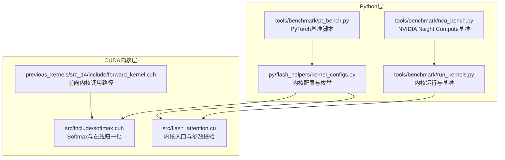
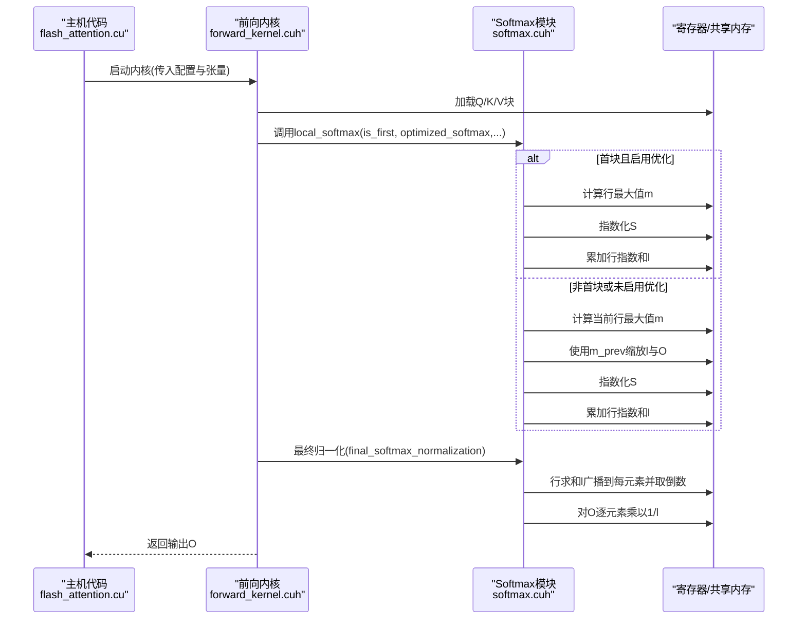
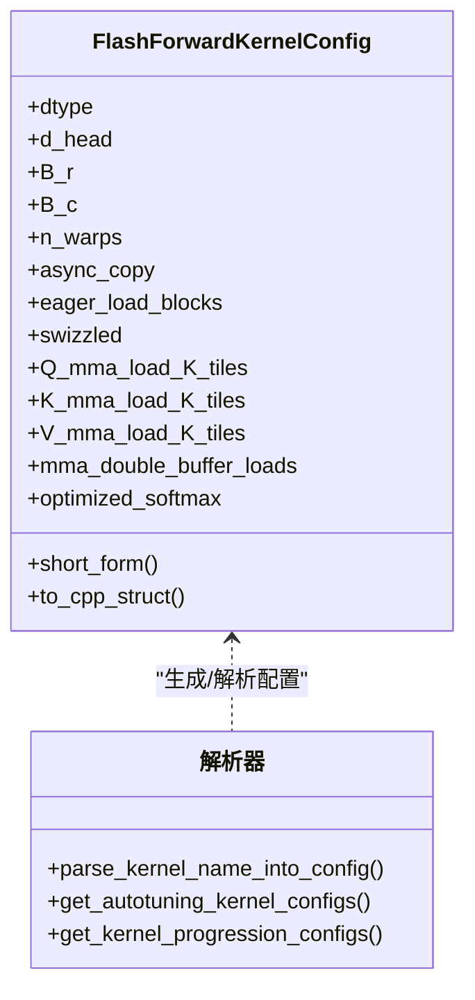
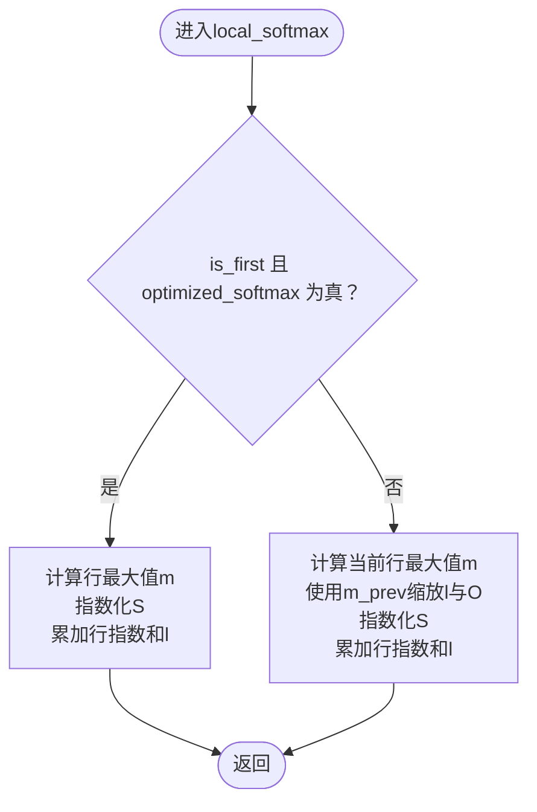
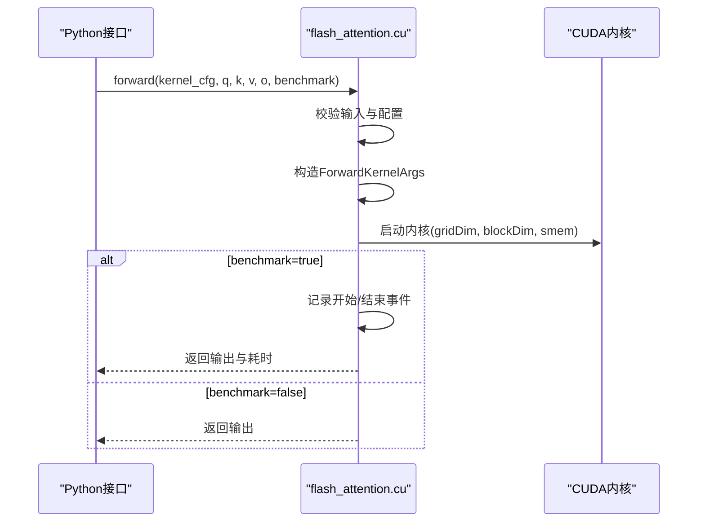
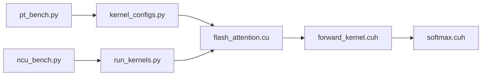

# 优化Softmax与计算开销减少

<cite>
**本文引用的文件**
- [kernel_configs.py](file://py/flash_helpers/kernel_configs.py)
- [softmax.cuh](file://src/include/softmax.cuh)
- [flash_attention.cu](file://src/flash_attention.cu)
- [README.md](file://README.md)
- [run_kernels.py](file://tools/benchmark/run_kernels.py)
- [pt_bench.py](file://tools/benchmark/pt_bench.py)
- [ncu_bench.py](file://tools/benchmark/ncu_bench.py)
- [forward_kernel.cuh](file://previous_kernels/src_14/include/forward_kernel.cuh)
- [softmax.cuh（历史版本）](file://previous_kernels/src_10/include/softmax.cuh)
</cite>

## 目录
1. [引言](#引言)
2. [项目结构](#项目结构)
3. [核心组件](#核心组件)
4. [架构总览](#架构总览)
5. [详细组件分析](#详细组件分析)
6. [依赖关系分析](#依赖关系分析)
7. [性能考量](#性能考量)
8. [故障排查指南](#故障排查指南)
9. [结论](#结论)
10. [附录](#附录)

## 引言
本文件围绕“优化Softmax（optimized_softmax）”展开，系统阐述该优化如何通过减少冗余计算与内存访问、降低Softmax阶段的计算开销，并结合配置项对整体内核性能的影响进行深入分析。文档还解释了优化Softmax与在线归一化技术的协同机制，如何减少中间结果存储与计算延迟；并提供在不同序列长度下的性能对比方法与适用场景建议，帮助读者正确评估与使用该优化。

## 项目结构
该项目为从零实现的Flash Attention CUDA内核系列，包含多代内核源码与工具链，其中第16代内核位于 src/，辅助配置与测试工具位于 py/ 与 tools/。优化Softmax主要体现在第10代及之后的softmax.cuh中，并通过 kernel_configs.py 的 FlashForwardKernelConfig 配置项启用。

图表来源
- [kernel_configs.py](file://py/flash_helpers/kernel_configs.py#L106-L175)
- [softmax.cuh](file://src/include/softmax.cuh#L85-L130)
- [flash_attention.cu](file://src/flash_attention.cu#L34-L135)
- [forward_kernel.cuh](file://previous_kernels/src_14/include/forward_kernel.cuh#L161-L193)

章节来源
- [README.md](file://README.md#L1-L63)

## 核心组件
- 优化Softmax配置项：FlashForwardKernelConfig 中的 optimized_softmax 布尔标志，用于控制是否启用优化的Softmax路径。
- Softmax实现：src/include/softmax.cuh 提供在线归一化的行最大值、指数化、行求和与最终归一化流程；当 is_first 且 optimized_softmax 为真时，走“首块优化路径”，避免重复缩放与累加逻辑。
- 内核入口与调度：src/flash_attention.cu 负责参数校验、内核启动与可选的基准计时。
- 历史版本对比：previous_kernels/src_10/include/softmax.cuh 展示了早期实现的在线归一化逻辑，便于理解优化演进。

章节来源
- [kernel_configs.py](file://py/flash_helpers/kernel_configs.py#L106-L175)
- [softmax.cuh](file://src/include/softmax.cuh#L85-L130)
- [flash_attention.cu](file://src/flash_attention.cu#L34-L135)
- [softmax.cuh（历史版本）](file://previous_kernels/src_10/include/softmax.cuh#L70-L102)

## 架构总览
优化Softmax在前向内核中以模板参数形式注入，通过 is_first 与 optimized_softmax 控制分支，配合在线归一化统计量 m（行最大值）、l（行指数和），在每块KV处理后更新统计量并在最终阶段完成归一化。

图表来源
- [flash_attention.cu](file://src/flash_attention.cu#L100-L135)
- [forward_kernel.cuh](file://previous_kernels/src_14/include/forward_kernel.cuh#L161-L193)
- [softmax.cuh](file://src/include/softmax.cuh#L85-L130)

## 详细组件分析

### 组件A：优化Softmax配置与启用方式
- 配置项：FlashForwardKernelConfig 包含 optimized_softmax 字段，用于在编译期选择是否启用优化Softmax路径。
- 短名与解析：kernel_configs.py 支持短名字符串中包含 opt_softmax 片段，解析后映射到配置对象，便于自动调优与进度推进。
- 自动调优：get_autotuning_kernel_configs 与 get_kernel_progression_configs 会生成包含 optimized_softmax 的配置集合，覆盖不同块大小与加载策略。

图表来源
- [kernel_configs.py](file://py/flash_helpers/kernel_configs.py#L106-L175)
- [kernel_configs.py](file://py/flash_helpers/kernel_configs.py#L389-L455)

章节来源
- [kernel_configs.py](file://py/flash_helpers/kernel_configs.py#L106-L175)
- [kernel_configs.py](file://py/flash_helpers/kernel_configs.py#L389-L455)

### 组件B：在线归一化与优化Softmax算法
- 行最大值计算：对每行在寄存器中做局部最大值聚合，并通过跨线程交换完成行内归约。
- 指数化：按行最大值中心化后指数化，避免溢出并保持数值稳定。
- 在线行和更新：在非首块时，先根据前后两轮行最大值缩放累积的行指数和与中间结果，再累加当前块的指数和。
- 最终归一化：在所有线程完成行和累加后，统一取倒数并对输出逐元素缩放。

图表来源
- [softmax.cuh](file://src/include/softmax.cuh#L85-L130)

章节来源
- [softmax.cuh](file://src/include/softmax.cuh#L13-L34)
- [softmax.cuh](file://src/include/softmax.cuh#L36-L49)
- [softmax.cuh](file://src/include/softmax.cuh#L51-L64)
- [softmax.cuh](file://src/include/softmax.cuh#L66-L83)
- [softmax.cuh](file://src/include/softmax.cuh#L85-L105)
- [softmax.cuh](file://src/include/softmax.cuh#L107-L129)

### 组件C：内核调用与参数传递
- 参数校验：检查设备能力、数据类型、形状一致性与块大小整除性。
- 启动参数：构造 ForwardKernelArgs，设置网格/块维度与共享内存大小。
- 可选基准：使用 CUDA Event 记录内核执行时间，便于性能对比。

图表来源
- [flash_attention.cu](file://src/flash_attention.cu#L34-L135)

章节来源
- [flash_attention.cu](file://src/flash_attention.cu#L34-L135)

### 组件D：历史版本对比与优化演进
- 早期实现：previous_kernels/src_10/include/softmax.cuh 展示了基础的在线归一化流程，便于理解优化点（如首块路径的简化）。
- 进一步演进：后续版本在行最大值与指数和的更新上进一步减少冗余，配合优化Softmax路径显著降低访存与算力浪费。

章节来源
- [softmax.cuh（历史版本）](file://previous_kernels/src_10/include/softmax.cuh#L70-L102)

## 依赖关系分析
- 配置到内核：FlashForwardKernelConfig 通过 Python/C++桥接进入 CUDA 内核，作为模板参数参与编译期分支选择。
- 内核到Softmax：前向内核在处理每个KV块时调用 local_softmax，并在最后阶段调用 final_softmax_normalization 完成全局归一化。
- 工具链：run_kernels.py 与 pt_bench.py/ncu_bench.py 提供内核运行与性能收集，支持对比优化前后在同一配置下的差异。

图表来源
- [kernel_configs.py](file://py/flash_helpers/kernel_configs.py#L106-L175)
- [flash_attention.cu](file://src/flash_attention.cu#L34-L135)
- [forward_kernel.cuh](file://previous_kernels/src_14/include/forward_kernel.cuh#L161-L193)
- [softmax.cuh](file://src/include/softmax.cuh#L85-L130)
- [run_kernels.py](file://tools/benchmark/run_kernels.py#L1-L159)
- [pt_bench.py](file://tools/benchmark/pt_bench.py#L1-L415)
- [ncu_bench.py](file://tools/benchmark/ncu_bench.py#L112-L463)

章节来源
- [kernel_configs.py](file://py/flash_helpers/kernel_configs.py#L106-L175)
- [flash_attention.cu](file://src/flash_attention.cu#L34-L135)
- [forward_kernel.cuh](file://previous_kernels/src_14/include/forward_kernel.cuh#L161-L193)
- [softmax.cuh](file://src/include/softmax.cuh#L85-L130)
- [run_kernels.py](file://tools/benchmark/run_kernels.py#L1-L159)
- [pt_bench.py](file://tools/benchmark/pt_bench.py#L1-L415)
- [ncu_bench.py](file://tools/benchmark/ncu_bench.py#L112-L463)

## 性能考量
- 减少冗余计算：优化Softmax在首块直接计算行最大值、指数化与行和，避免在非首块中重复缩放与累加，从而减少算术与访存操作。
- 降低内存访问：通过在线归一化，仅维护每行的统计量 m 与 l，无需缓存完整概率矩阵，显著降低全局内存写放大与带宽压力。
- 长序列收益：在长序列注意力中，Softmax阶段的计算与访存占比高，优化Softmax能带来更明显的吞吐提升。
- 自动调优：kernel_configs.py 提供大量配置组合（含 optimized_softmax），可在不同硬件与数据规模下寻找最优块大小与加载策略。

章节来源
- [kernel_configs.py](file://py/flash_helpers/kernel_configs.py#L389-L455)
- [README.md](file://README.md#L1-L63)

## 故障排查指南
- 设备与数据类型：确保设备计算能力满足要求，输入张量数据类型一致且为半精度或bfloat16。
- 块大小整除性：序列长度需能被 B_r 与 B_c 整除，否则会触发断言错误。
- 共享内存限制：若动态共享内存超过阈值，需在模块初始化时设置最大动态共享内存属性。
- 基准稳定性：使用 run_kernels.py 或 pt_bench.py/ncu_bench.py 多次运行取均值，避免单次波动影响判断。

章节来源
- [flash_attention.cu](file://src/flash_attention.cu#L49-L83)
- [flash_attention.cu](file://src/flash_attention.cu#L137-L150)
- [run_kernels.py](file://tools/benchmark/run_kernels.py#L1-L159)
- [pt_bench.py](file://tools/benchmark/pt_bench.py#L1-L415)
- [ncu_bench.py](file://tools/benchmark/ncu_bench.py#L112-L463)

## 结论
优化Softmax通过在首块路径中合并行最大值计算、指数化与行和更新，显著减少了冗余算术与内存访问，配合在线归一化有效降低了中间结果存储需求与计算延迟。在长序列注意力场景中，该优化对整体内核性能提升尤为明显。借助 kernel_configs.py 的配置体系与工具链，用户可以系统地探索不同块大小与加载策略，找到在特定硬件与数据规模下的最优配置。

## 附录
- 性能对比方法建议：
  - 使用 run_kernels.py 指定同一组配置（仅 optimized_softmax 不同），固定序列长度与头维，多次运行取均值。
  - 使用 pt_bench.py/ncu_bench.py 在相同条件下对比不同内核迭代版本，观察相对性能变化。
  - 关注指标：内核时延、算力利用率、指令数与带宽占用等，综合评估优化效果。

章节来源
- [run_kernels.py](file://tools/benchmark/run_kernels.py#L1-L159)
- [pt_bench.py](file://tools/benchmark/pt_bench.py#L1-L415)
- [ncu_bench.py](file://tools/benchmark/ncu_bench.py#L112-L463)