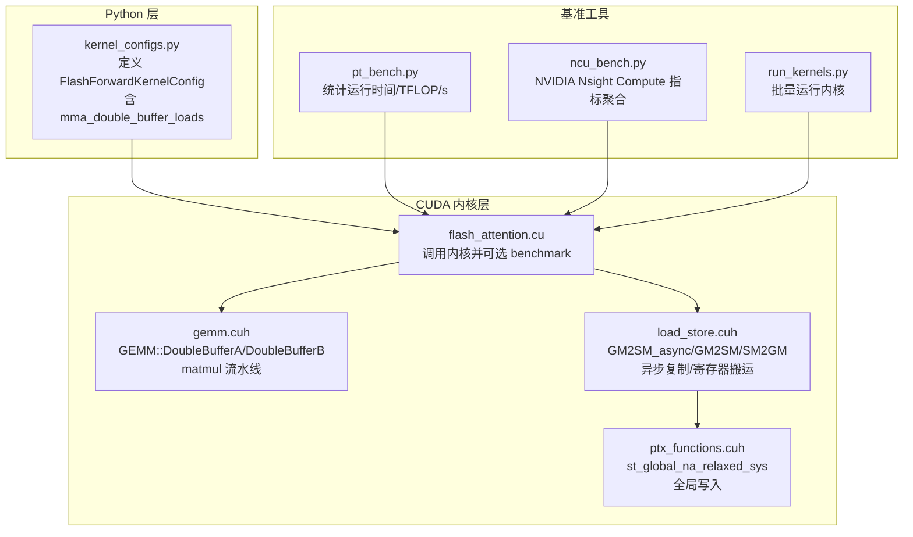
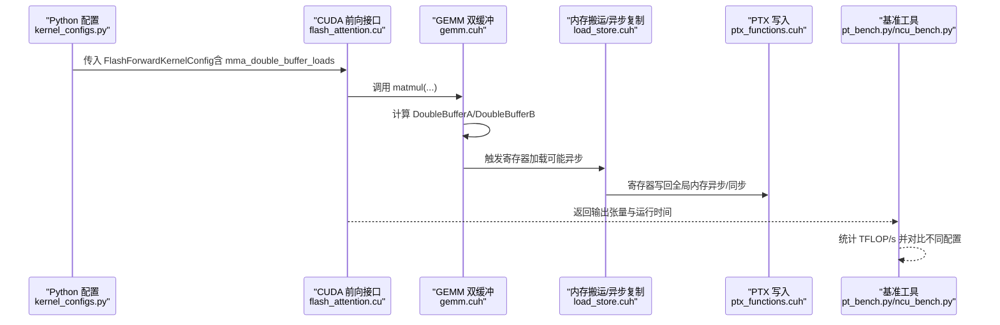
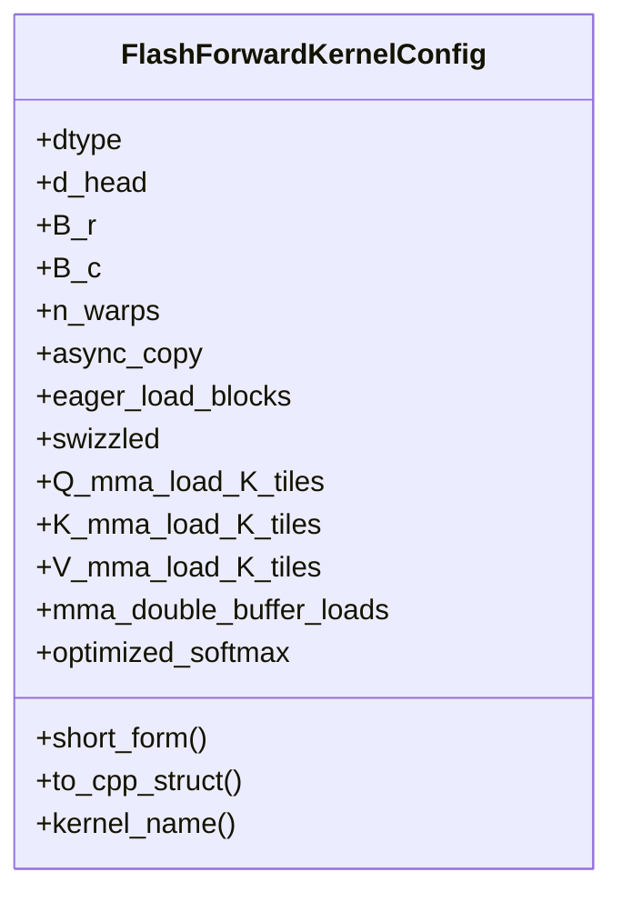
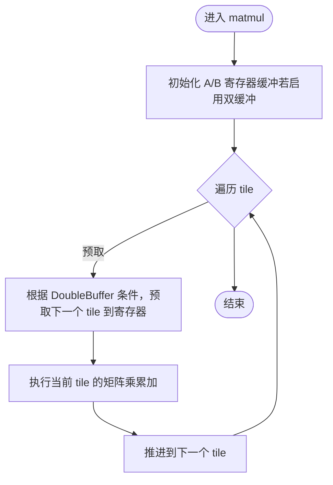
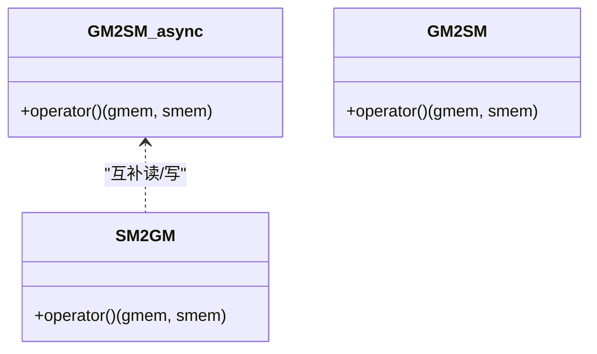
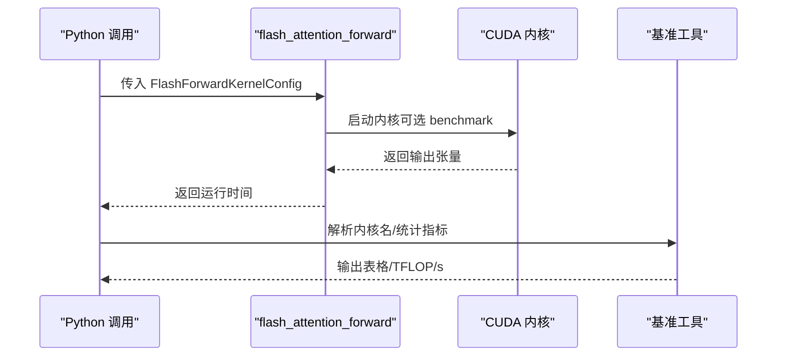
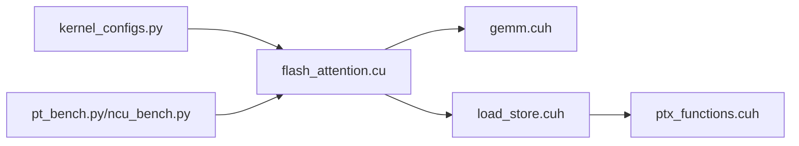

# 双缓冲机制与数据流水线

<cite>
**本文引用的文件**
- [kernel_configs.py](file://py/flash_helpers/kernel_configs.py)
- [flash_attention.cu](file://src/flash_attention.cu)
- [gemm.cuh](file://src/include/gemm.cuh)
- [load_store.cuh](file://src/include/load_store.cuh)
- [ptx_functions.cuh](file://src/include/ptx_functions.cuh)
- [pt_bench.py](file://tools/benchmark/pt_bench.py)
- [ncu_bench.py](file://tools/benchmark/ncu_bench.py)
- [run_kernels.py](file://tools/benchmark/run_kernels.py)
</cite>

## 目录
1. [简介](#简介)
2. [项目结构](#项目结构)
3. [核心组件](#核心组件)
4. [架构总览](#架构总览)
5. [详细组件分析](#详细组件分析)
6. [依赖关系分析](#依赖关系分析)
7. [性能考量](#性能考量)
8. [故障排查指南](#故障排查指南)
9. [结论](#结论)
10. [附录](#附录)

## 简介
本文件围绕“双缓冲机制（mma_double_buffer_loads）”展开，系统阐述其如何通过在寄存器文件中维护两个数据缓冲区，实现计算与内存加载的流水线操作，从而提升指令级并行度。结合 Python 层配置项与 CUDA 内核实现，解释双缓冲在高计算强度场景下的性能收益、减少数据依赖停顿的机理，以及与异步复制（async_copy）协同优化整体执行效率的方法。最后提供性能基准方法与建议，指导在寄存器资源充足时启用该优化。

## 项目结构
本仓库包含 Python 辅助模块、CUDA 内核源码、构建与基准工具。与双缓冲直接相关的关键位置如下：
- Python 配置层：定义内核配置与枚举，包含 mma_double_buffer_loads 开关
- CUDA 内核层：GEMM 路径中使用双缓冲加载策略；内存搬运路径支持异步复制
- 基准工具：提供运行与统计流程，便于对比不同配置的性能

图示来源
- [kernel_configs.py](file://py/flash_helpers/kernel_configs.py#L106-L164)
- [flash_attention.cu](file://src/flash_attention.cu#L1-L150)
- [gemm.cuh](file://src/include/gemm.cuh#L24-L123)
- [load_store.cuh](file://src/include/load_store.cuh#L16-L36)
- [ptx_functions.cuh](file://src/include/ptx_functions.cuh#L201-L216)
- [pt_bench.py](file://tools/benchmark/pt_bench.py#L145-L214)
- [ncu_bench.py](file://tools/benchmark/ncu_bench.py#L112-L170)
- [run_kernels.py](file://tools/benchmark/run_kernels.py#L1-L159)

章节来源
- [kernel_configs.py](file://py/flash_helpers/kernel_configs.py#L106-L164)
- [flash_attention.cu](file://src/flash_attention.cu#L1-L150)
- [gemm.cuh](file://src/include/gemm.cuh#L24-L123)
- [load_store.cuh](file://src/include/load_store.cuh#L16-L36)
- [ptx_functions.cuh](file://src/include/ptx_functions.cuh#L201-L216)
- [pt_bench.py](file://tools/benchmark/pt_bench.py#L145-L214)
- [ncu_bench.py](file://tools/benchmark/ncu_bench.py#L112-L170)
- [run_kernels.py](file://tools/benchmark/run_kernels.py#L1-L159)

## 核心组件
- 内核配置对象：包含 mma_double_buffer_loads 布尔开关，用于控制是否启用双缓冲加载
- GEMM 双缓冲：根据寄存器缓冲大小与是否整块加载决定是否启用 DoubleBufferA/DoubleBufferB
- 内存搬运与异步复制：提供 GM2SM_async/GM2SM/SM2GM，支持异步加载与寄存器搬运
- 基准工具：提供统计运行时间、TFLOP/s 的能力，便于对比不同配置

章节来源
- [kernel_configs.py](file://py/flash_helpers/kernel_configs.py#L106-L164)
- [gemm.cuh](file://src/include/gemm.cuh#L24-L123)
- [load_store.cuh](file://src/include/load_store.cuh#L16-L36)
- [pt_bench.py](file://tools/benchmark/pt_bench.py#L145-L214)

## 架构总览
双缓冲在本项目中的作用链路如下：
- Python 层通过 FlashForwardKernelConfig 将 mma_double_buffer_loads 传递给 CUDA 内核
- CUDA 内核在 matmul 中根据 GEMM::DoubleBufferA/DoubleBufferB 切换双缓冲加载策略
- 内存搬运层通过 GM2SM_async/GM2SM/SM2GM 实现异步复制与寄存器搬运，减少访存停顿
- 基准工具测量运行时间并转换为 TFLOP/s，评估双缓冲带来的性能增益

图示来源
- [kernel_configs.py](file://py/flash_helpers/kernel_configs.py#L106-L164)
- [flash_attention.cu](file://src/flash_attention.cu#L1-L150)
- [gemm.cuh](file://src/include/gemm.cuh#L24-L123)
- [load_store.cuh](file://src/include/load_store.cuh#L16-L36)
- [ptx_functions.cuh](file://src/include/ptx_functions.cuh#L201-L216)
- [pt_bench.py](file://tools/benchmark/pt_bench.py#L145-L214)
- [ncu_bench.py](file://tools/benchmark/ncu_bench.py#L112-L170)

## 详细组件分析

### 组件 A：双缓冲配置与枚举（Python 层）
- FlashForwardKernelConfig 含布尔字段 mma_double_buffer_loads，用于开启/关闭双缓冲加载
- short_form 会将该开关以“buffer”形式展示，便于在内核名称中识别
- get_kernel_progression_configs/get_autotuning_kernel_configs 会枚举该开关的 False/True 两种取值，形成对比基线

图示来源
- [kernel_configs.py](file://py/flash_helpers/kernel_configs.py#L106-L164)
- [kernel_configs.py](file://py/flash_helpers/kernel_configs.py#L251-L321)
- [kernel_configs.py](file://py/flash_helpers/kernel_configs.py#L389-L455)

章节来源
- [kernel_configs.py](file://py/flash_helpers/kernel_configs.py#L106-L164)
- [kernel_configs.py](file://py/flash_helpers/kernel_configs.py#L251-L321)
- [kernel_configs.py](file://py/flash_helpers/kernel_configs.py#L389-L455)

### 组件 B：GEMM 双缓冲加载（CUDA 层）
- GEMM::DoubleBufferA/DoubleBufferB 基于“非整块加载且寄存器缓冲大小大于 1”的条件自动判定
- matmul 中先预加载第 0 个 tile，随后在每轮迭代中提前加载下一个 tile，与当前 tile 的计算重叠
- 这种“预取 + 计算重叠”的流水线显著减少访存等待

图示来源
- [gemm.cuh](file://src/include/gemm.cuh#L24-L123)

章节来源
- [gemm.cuh](file://src/include/gemm.cuh#L24-L123)

### 组件 C：内存搬运与异步复制（CUDA 层）
- GM2SM_async/GM2SM/SM2GM 提供三种搬运路径：异步加载、直接拷贝、寄存器写回
- 异步复制（GM2SM_async）可与计算流水线配合，减少访存停顿
- st_global_na_relaxed_sys 作为寄存器写回的底层实现，保证写入语义

图示来源
- [load_store.cuh](file://src/include/load_store.cuh#L16-L36)
- [ptx_functions.cuh](file://src/include/ptx_functions.cuh#L201-L216)

章节来源
- [load_store.cuh](file://src/include/load_store.cuh#L16-L36)
- [ptx_functions.cuh](file://src/include/ptx_functions.cuh#L201-L216)

### 组件 D：前向接口与基准统计（Python/C++ 层）
- flash_attention_forward 接收 Python 侧配置，构造 ForwardKernelArgs 并启动 CUDA 内核
- 支持 benchmark 模式，使用 CUDA Event 记录运行时间
- pt_bench.py/ncu_bench.py 提供统计与表格输出，便于对比不同配置（含 buffer）

图示来源
- [flash_attention.cu](file://src/flash_attention.cu#L1-L150)
- [pt_bench.py](file://tools/benchmark/pt_bench.py#L145-L214)
- [ncu_bench.py](file://tools/benchmark/ncu_bench.py#L112-L170)

章节来源
- [flash_attention.cu](file://src/flash_attention.cu#L1-L150)
- [pt_bench.py](file://tools/benchmark/pt_bench.py#L145-L214)
- [ncu_bench.py](file://tools/benchmark/ncu_bench.py#L112-L170)

## 依赖关系分析
- Python 配置层依赖内核配置解析与短名映射，影响最终内核实例化
- CUDA 内核层依赖 GEMM 双缓冲与内存搬运路径，二者共同决定流水线深度
- 基准工具依赖内核运行时间统计，用于量化双缓冲收益

图示来源
- [kernel_configs.py](file://py/flash_helpers/kernel_configs.py#L106-L164)
- [flash_attention.cu](file://src/flash_attention.cu#L1-L150)
- [gemm.cuh](file://src/include/gemm.cuh#L24-L123)
- [load_store.cuh](file://src/include/load_store.cuh#L16-L36)
- [ptx_functions.cuh](file://src/include/ptx_functions.cuh#L201-L216)
- [pt_bench.py](file://tools/benchmark/pt_bench.py#L145-L214)
- [ncu_bench.py](file://tools/benchmark/ncu_bench.py#L112-L170)

章节来源
- [kernel_configs.py](file://py/flash_helpers/kernel_configs.py#L106-L164)
- [flash_attention.cu](file://src/flash_attention.cu#L1-L150)
- [gemm.cuh](file://src/include/gemm.cuh#L24-L123)
- [load_store.cuh](file://src/include/load_store.cuh#L16-L36)
- [ptx_functions.cuh](file://src/include/ptx_functions.cuh#L201-L216)
- [pt_bench.py](file://tools/benchmark/pt_bench.py#L145-L214)
- [ncu_bench.py](file://tools/benchmark/ncu_bench.py#L112-L170)

## 性能考量
- 双缓冲减少数据依赖停顿：通过“预取下一阶段数据 + 当前阶段计算”的流水线，避免寄存器加载成为瓶颈
- 与异步复制协同：GM2SM_async 在访存阶段释放计算单元，进一步提升指令级并行
- 高计算强度场景收益更明显：当 FLOPs/带宽比高时，访存延迟被计算时间稀释，双缓冲带来的吞吐提升更显著
- 寄存器资源约束：双缓冲需要额外寄存器空间存储两份缓冲，需确保不触发寄存器溢出或 spilling
- 建议启用策略：在寄存器资源充足（如较小 d_head 或较小 tile）时优先启用 mma_double_buffer_loads；同时开启 async_copy 以最大化访存并行

章节来源
- [gemm.cuh](file://src/include/gemm.cuh#L24-L123)
- [load_store.cuh](file://src/include/load_store.cuh#L16-L36)
- [kernel_configs.py](file://py/flash_helpers/kernel_configs.py#L389-L455)

## 故障排查指南
- 寄存器溢出/Spill：若启用双缓冲后出现寄存器溢出，应降低 d_head 或减小 tile，或关闭双缓冲
- 异步复制与同步问题：确认异步复制路径与后续读写存在正确的同步点，避免竞态
- 基准结果不稳定：使用 pt_bench.py/ncu_bench.py 的多次重复与统计，排除冷启动与缓存抖动影响
- 内核未命中：确保 Python 配置中的 mma_double_buffer_loads 与内核短名一致，参考 short_form 显示

章节来源
- [pt_bench.py](file://tools/benchmark/pt_bench.py#L145-L214)
- [ncu_bench.py](file://tools/benchmark/ncu_bench.py#L112-L170)
- [kernel_configs.py](file://py/flash_helpers/kernel_configs.py#L106-L164)

## 结论
双缓冲机制通过在寄存器中维护两份数据缓冲，将内存加载与计算重叠，有效减少数据依赖导致的停顿，在高计算强度场景下显著提升吞吐。结合异步复制与合理的寄存器资源管理，可在不牺牲正确性的前提下获得稳定性能收益。建议在寄存器资源充足时启用 mma_double_buffer_loads，并通过基准工具持续验证收益。

## 附录
- 使用基准工具对比不同配置（含 buffer）：参考 pt_bench.py/ncu_bench.py 的统计与表格输出
- 批量运行内核：参考 run_kernels.py 的参数与流程
- 内核配置枚举：参考 kernel_configs.py 中的 get_kernel_progression_configs/get_autotuning_kernel_configs

章节来源
- [pt_bench.py](file://tools/benchmark/pt_bench.py#L145-L214)
- [ncu_bench.py](file://tools/benchmark/ncu_bench.py#L112-L170)
- [run_kernels.py](file://tools/benchmark/run_kernels.py#L1-L159)
- [kernel_configs.py](file://py/flash_helpers/kernel_configs.py#L389-L455)