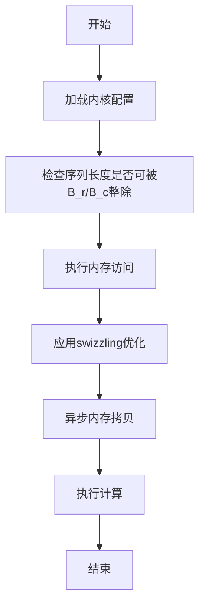

# 块大小配置与内存访问模式

<cite>
**本文档引用的文件**   
- [kernel_configs.py](file://py/flash_helpers/kernel_configs.py)
- [common.h](file://src/include/common.h)
- [load_store.cuh](file://src/include/load_store.cuh)
- [swizzling.cuh](file://src/include/swizzling.cuh)
- [layout.cuh](file://src/include/layout.cuh)
- [flash_attention.cu](file://src/flash_attention.cu)
- [README.md](file://README.md)
</cite>

## 目录
1. [引言](#引言)
2. [块大小配置基础](#块大小配置基础)
3. [内存访问模式分析](#内存访问模式分析)
4. [计算强度与理论算力需求](#计算强度与理论算力需求)
5. [共享内存使用效率](#共享内存使用效率)
6. [Ampere架构性能表现](#ampere架构性能表现)
7. [性能对比与配置建议](#性能对比与配置建议)

## 引言
本项目实现了Flash Attention从基础版本到优化版本的16次迭代，最终在A100和RTX 3090上分别达到了官方Flash Attention 2性能的99.2%和102.9%。核心优化围绕块大小（B_r/B_c）配置展开，通过调整行块大小（B_r）和列块大小（B_c）来优化内存访问模式、计算强度和共享内存使用效率。项目支持非因果注意力的前向传播，使用16位（bf16/fp16）输入输出张量，softmax计算在fp32中进行。

**Section sources**
- [README.md](file://README.md#L1-L63)

## 块大小配置基础
在Flash Attention内核中，块大小配置是性能优化的核心参数。行块大小（B_r）和列块大小（B_c）共同决定了计算的粒度和内存访问模式。B_r控制查询序列的分块大小，而B_c控制键值序列的分块大小。这些参数直接影响内存带宽消耗、计算强度和缓存命中率。在Ampere架构上，合理的块大小配置可以最大化利用Tensor Core和共享内存，从而显著提升性能。

**Section sources**
- [kernel_configs.py](file://py/flash_helpers/kernel_configs.py#L106-L121)
- [common.h](file://src/include/common.h#L1-L83)

## 内存访问模式分析
块大小配置对内存访问模式有显著影响。较小的块大小可以提高缓存命中率，但会增加内存访问次数；较大的块大小可以减少内存访问次数，但可能导致缓存未命中。在Ampere架构上，通过swizzling技术可以优化内存访问模式，减少bank冲突。异步拷贝（async_copy）和急切加载块（eager_load_blocks）等技术进一步优化了内存访问，实现了计算与内存传输的重叠。

**Diagram sources **
- [flash_attention.cu](file://src/flash_attention.cu#L77-L82)
- [load_store.cuh](file://src/include/load_store.cuh#L109-L125)

## 计算强度与理论算力需求
计算强度是衡量算法性能的重要指标，定义为每字节内存访问的计算量。通过`calc_total_flop`函数可以计算不同块大小组合下的理论算力需求。计算强度受B_r和B_c的影响，较大的块大小通常能提供更高的计算强度，但需要权衡内存带宽消耗。在Ampere架构上，优化的块大小配置可以最大化利用GPU的计算能力，实现接近理论峰值的性能。

**Section sources**
- [kernel_configs.py](file://py/flash_helpers/kernel_configs.py#L87-L99)
- [common.h](file://src/include/common.h#L26-L32)

## 共享内存使用效率
共享内存的使用效率直接影响Flash Attention内核的性能。块大小配置决定了共享内存的分配和使用方式。通过优化块大小，可以最大化共享内存的利用率，减少全局内存访问。在Ampere架构上，共享内存的bank冲突是性能瓶颈之一，合理的块大小配置和swizzling技术可以有效减少bank冲突，提高共享内存的访问效率。

**Section sources**
- [load_store.cuh](file://src/include/load_store.cuh#L38-L45)
- [swizzling.cuh](file://src/include/swizzling.cuh#L9-L28)

## Ampere架构性能表现
在Ampere架构上，Flash Attention内核的性能表现受块大小配置的显著影响。通过16次迭代优化，内核性能逐步提升。关键优化包括swizzling、急切加载K&V块、计算与内存传输重叠、共享内存双缓冲等。这些优化结合合理的块大小配置，在A100和RTX 3090上实现了接近官方实现的性能。

**Section sources**
- [README.md](file://README.md#L38-L58)
- [common.h](file://src/include/common.h#L19-L20)

## 性能对比与配置建议
根据性能测试结果，建议在Ampere架构上使用B_r=128和B_c=64的块大小配置。这种配置在大多数序列长度下都能提供最佳性能。对于较短的序列长度，可以考虑使用较小的块大小以提高缓存命中率。对于较长的序列长度，较大的块大小可以更好地利用计算资源。用户应根据具体的序列长度和硬件规格选择最优的块大小配置。

**Section sources**
- [README.md](file://README.md#L40-L58)
- [kernel_configs.py](file://py/flash_helpers/kernel_configs.py#L389-L423)