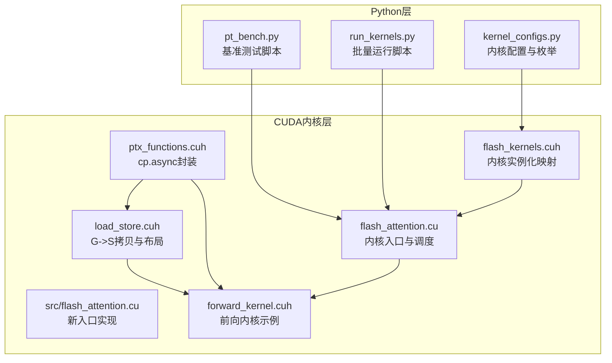
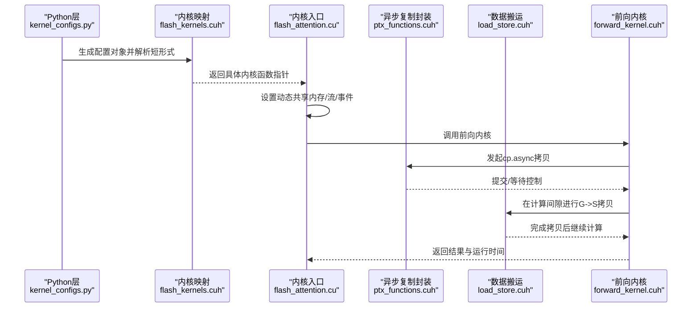
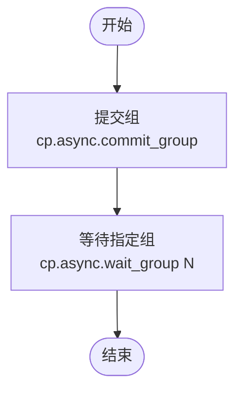
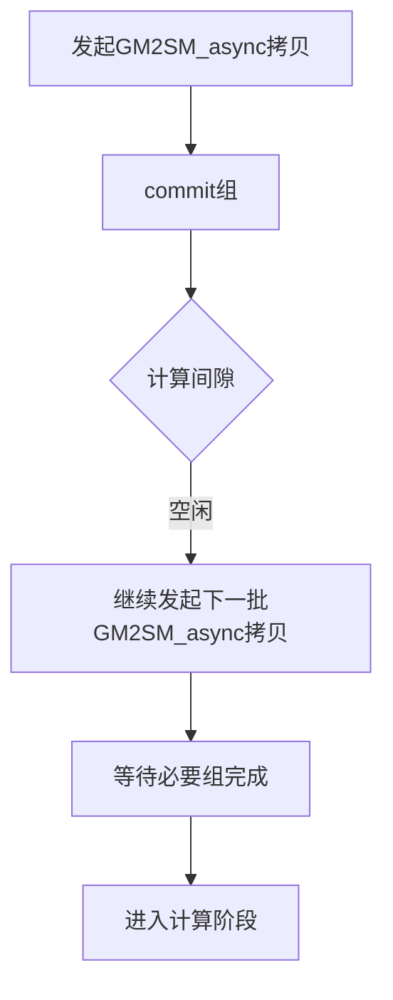
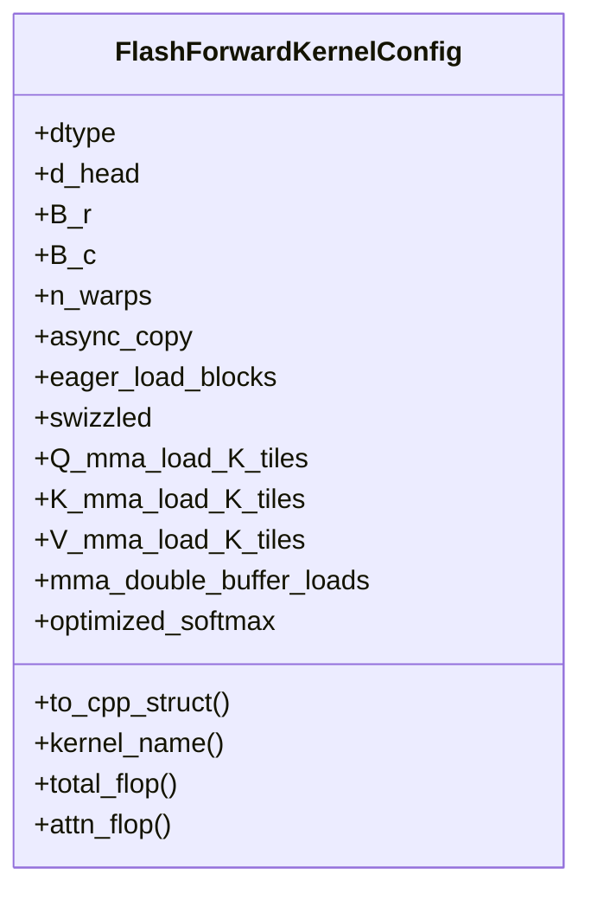
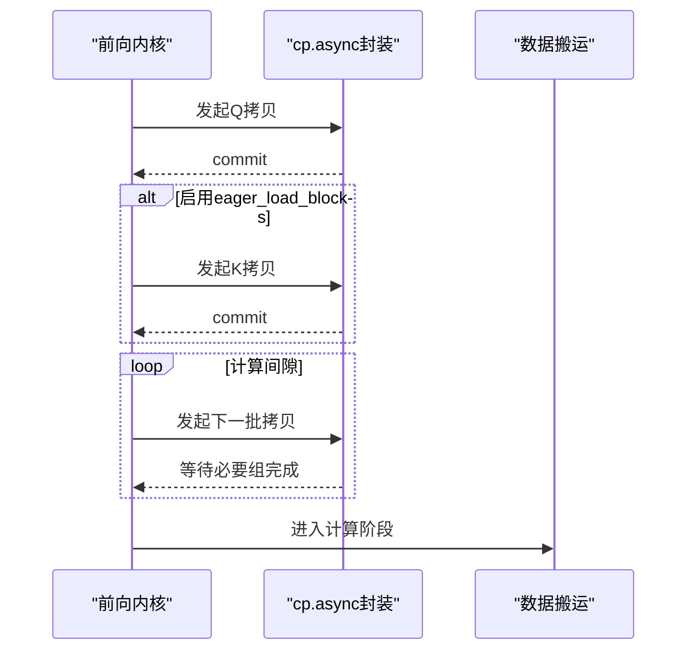
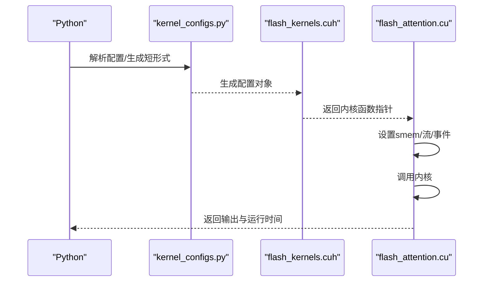
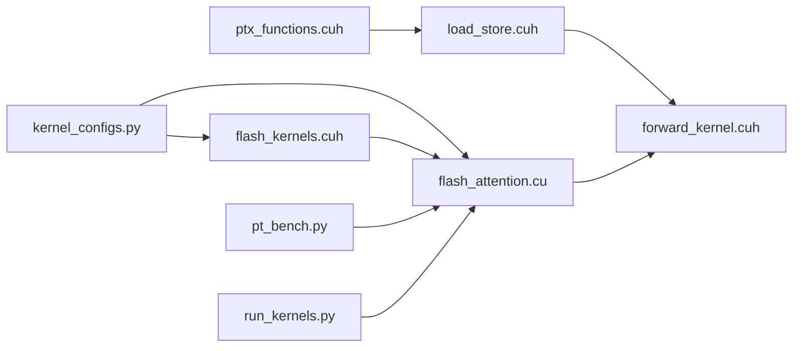

# 异步内存复制与计算重叠

<cite>
**本文引用的文件**
- [py/flash_helpers/kernel_configs.py](file://py/flash_helpers/kernel_configs.py)
- [previous_kernels/src_8/include/ptx_functions.cuh](file://previous_kernels/src_8/include/ptx_functions.cuh)
- [previous_kernels/src_9/include/ptx_functions.cuh](file://previous_kernels/src_9/include/ptx_functions.cuh)
- [previous_kernels/src_15/include/load_store.cuh](file://previous_kernels/src_15/include/load_store.cuh)
- [previous_kernels/src_15/include/flash_kernels.cuh](file://previous_kernels/src_15/include/flash_kernels.cuh)
- [previous_kernels/src_15/flash_attention.cu](file://previous_kernels/src_15/flash_attention.cu)
- [src/flash_attention.cu](file://src/flash_attention.cu)
- [tools/benchmark/pt_bench.py](file://tools/benchmark/pt_bench.py)
- [tools/benchmark/run_kernels.py](file://tools/benchmark/run_kernels.py)
- [previous_kernels/src_9/include/forward_kernel.cuh](file://previous_kernels/src_9/include/forward_kernel.cuh)
- [previous_kernels/src_8/include/forward_kernel.cuh](file://previous_kernels/src_8/include/forward_kernel.cuh)
</cite>

## 目录
1. [引言](#引言)
2. [项目结构](#项目结构)
3. [核心组件](#核心组件)
4. [架构总览](#架构总览)
5. [详细组件分析](#详细组件分析)
6. [依赖关系分析](#依赖关系分析)
7. [性能考量](#性能考量)
8. [故障排查指南](#故障排查指南)
9. [结论](#结论)
10. [附录](#附录)

## 引言
本文件围绕异步复制（async_copy）优化技术展开，系统阐述CUDA的cp.async指令如何实现“全局内存到共享内存”的异步数据传输，并与计算操作重叠以隐藏内存延迟。结合py/flash_helpers/kernel_configs.py中的配置参数，分析启用async_copy对内核性能的影响，特别是在长序列处理中的吞吐量提升；说明双缓冲技术如何与异步复制协同工作，确保数据流水线的连续性；最后提供性能对比方法与配置建议，帮助用户在不同场景下做出合理选择。

## 项目结构
该仓库包含多版本内核实现、Python辅助模块与基准测试工具。与本主题直接相关的文件包括：
- 配置与内核映射：py/flash_helpers/kernel_configs.py、previous_kernels/src_15/include/flash_kernels.cuh
- 异步复制PTX封装：previous_kernels/src_8/include/ptx_functions.cuh、previous_kernels/src_9/include/ptx_functions.cuh
- 数据搬运与布局：previous_kernels/src_15/include/load_store.cuh
- 内核入口与调用：previous_kernels/src_15/flash_attention.cu、src/flash_attention.cu
- 基准测试：tools/benchmark/pt_bench.py、tools/benchmark/run_kernels.py
- 前向内核示例（含commit/wait使用）：previous_kernels/src_9/include/forward_kernel.cuh、previous_kernels/src_8/include/forward_kernel.cuh

图表来源
- [py/flash_helpers/kernel_configs.py](file://py/flash_helpers/kernel_configs.py#L102-L175)
- [previous_kernels/src_15/include/flash_kernels.cuh](file://previous_kernels/src_15/include/flash_kernels.cuh#L1-L187)
- [previous_kernels/src_8/include/ptx_functions.cuh](file://previous_kernels/src_8/include/ptx_functions.cuh#L1-L38)
- [previous_kernels/src_9/include/ptx_functions.cuh](file://previous_kernels/src_9/include/ptx_functions.cuh#L1-L38)
- [previous_kernels/src_15/include/load_store.cuh](file://previous_kernels/src_15/include/load_store.cuh#L1-L120)
- [previous_kernels/src_15/flash_attention.cu](file://previous_kernels/src_15/flash_attention.cu#L1-L150)
- [src/flash_attention.cu](file://src/flash_attention.cu#L1-L150)
- [previous_kernels/src_9/include/forward_kernel.cuh](file://previous_kernels/src_9/include/forward_kernel.cuh#L50-L83)
- [previous_kernels/src_8/include/forward_kernel.cuh](file://previous_kernels/src_8/include/forward_kernel.cuh#L50-L83)

章节来源
- [py/flash_helpers/kernel_configs.py](file://py/flash_helpers/kernel_configs.py#L102-L175)
- [previous_kernels/src_15/include/flash_kernels.cuh](file://previous_kernels/src_15/include/flash_kernels.cuh#L1-L187)
- [previous_kernels/src_8/include/ptx_functions.cuh](file://previous_kernels/src_8/include/ptx_functions.cuh#L1-L38)
- [previous_kernels/src_9/include/ptx_functions.cuh](file://previous_kernels/src_9/include/ptx_functions.cuh#L1-L38)
- [previous_kernels/src_15/include/load_store.cuh](file://previous_kernels/src_15/include/load_store.cuh#L1-L120)
- [previous_kernels/src_15/flash_attention.cu](file://previous_kernels/src_15/flash_attention.cu#L1-L150)
- [src/flash_attention.cu](file://src/flash_attention.cu#L1-L150)
- [previous_kernels/src_9/include/forward_kernel.cuh](file://previous_kernels/src_9/include/forward_kernel.cuh#L50-L83)
- [previous_kernels/src_8/include/forward_kernel.cuh](file://previous_kernels/src_8/include/forward_kernel.cuh#L50-L83)

## 核心组件
- 异步复制PTX封装：提供模板化的cp.async提交、等待与组合函数，支持按大小发起异步拷贝，绕过L1缓存直写L2。
- 数据搬运与布局：定义从全局到共享内存的块级拷贝流程，结合swizzle与stride策略，保证高带宽利用。
- 内核配置与实例化：通过数据类描述内核配置（如async_copy、eager_load_blocks、mma_double_buffer_loads等），并生成内核实例映射表。
- 前向内核示例：演示commit/wait语义与异步拷贝流水线的配合，以及与计算阶段的重叠。
- 基准测试工具：提供批量运行、统计分析与TFLOP/s计算，便于对比启用/禁用async_copy的性能差异。

章节来源
- [previous_kernels/src_8/include/ptx_functions.cuh](file://previous_kernels/src_8/include/ptx_functions.cuh#L1-L38)
- [previous_kernels/src_9/include/ptx_functions.cuh](file://previous_kernels/src_9/include/ptx_functions.cuh#L1-L38)
- [previous_kernels/src_15/include/load_store.cuh](file://previous_kernels/src_15/include/load_store.cuh#L1-L120)
- [py/flash_helpers/kernel_configs.py](file://py/flash_helpers/kernel_configs.py#L102-L175)
- [previous_kernels/src_15/include/flash_kernels.cuh](file://previous_kernels/src_15/include/flash_kernels.cuh#L1-L187)
- [previous_kernels/src_9/include/forward_kernel.cuh](file://previous_kernels/src_9/include/forward_kernel.cuh#L50-L83)
- [previous_kernels/src_8/include/forward_kernel.cuh](file://previous_kernels/src_8/include/forward_kernel.cuh#L50-L83)
- [tools/benchmark/pt_bench.py](file://tools/benchmark/pt_bench.py#L1-L416)
- [tools/benchmark/run_kernels.py](file://tools/benchmark/run_kernels.py#L1-L159)

## 架构总览
下图展示了从Python配置到CUDA内核执行的关键路径，以及异步复制在其中的位置。

图表来源
- [py/flash_helpers/kernel_configs.py](file://py/flash_helpers/kernel_configs.py#L251-L336)
- [previous_kernels/src_15/include/flash_kernels.cuh](file://previous_kernels/src_15/include/flash_kernels.cuh#L1-L187)
- [previous_kernels/src_15/flash_attention.cu](file://previous_kernels/src_15/flash_attention.cu#L1-L150)
- [previous_kernels/src_8/include/ptx_functions.cuh](file://previous_kernels/src_8/include/ptx_functions.cuh#L1-L38)
- [previous_kernels/src_15/include/load_store.cuh](file://previous_kernels/src_15/include/load_store.cuh#L1-L120)
- [previous_kernels/src_9/include/forward_kernel.cuh](file://previous_kernels/src_9/include/forward_kernel.cuh#L50-L83)

## 详细组件分析

### 异步复制PTX封装（cp.async）
- 功能要点
  - 模板化cp_async_commit/cp_async_wait/cp_async_commit_and_wait_all，按编译期条件选择是否启用异步路径。
  - cp_async以固定大小（如128B）发起异步拷贝，目标为共享内存，源为全局内存，绕过L1直写L2，减少缓存污染。
- 使用位置
  - 在前向内核中，先发起一次拷贝，随后commit，再在计算间隙继续发起后续拷贝，形成流水线。
- 性能意义
  - 将内存带宽压力从计算阶段剥离，使计算与访存重叠，显著降低长序列场景下的内存延迟影响。

图表来源
- [previous_kernels/src_8/include/ptx_functions.cuh](file://previous_kernels/src_8/include/ptx_functions.cuh#L1-L38)
- [previous_kernels/src_9/include/ptx_functions.cuh](file://previous_kernels/src_9/include/ptx_functions.cuh#L1-L38)

章节来源
- [previous_kernels/src_8/include/ptx_functions.cuh](file://previous_kernels/src_8/include/ptx_functions.cuh#L1-L38)
- [previous_kernels/src_9/include/ptx_functions.cuh](file://previous_kernels/src_9/include/ptx_functions.cuh#L1-L38)

### 数据搬运与布局（G->S拷贝）
- 功能要点
  - 提供GM2SM/GM2SM_async两种拷贝策略，前者为同步寄存器写，后者为异步cp.async拷贝。
  - 通过OpIters、SmemStride、GMemStride等配置，实现按swizzle空间的分块拷贝，提高带宽利用率。
- 与异步复制的关系
  - 在前向内核中，先发起一次GM2SM_async拷贝并commit，然后在计算间隙继续发起下一批拷贝，形成流水线。
- 双缓冲协同
  - 当开启mma_double_buffer_loads时，K/V的加载采用双缓冲，与异步复制共同推进数据流水线，避免计算等待。

图表来源
- [previous_kernels/src_15/include/load_store.cuh](file://previous_kernels/src_15/include/load_store.cuh#L1-L120)
- [previous_kernels/src_15/include/flash_kernels.cuh](file://previous_kernels/src_15/include/flash_kernels.cuh#L1-L187)

章节来源
- [previous_kernels/src_15/include/load_store.cuh](file://previous_kernels/src_15/include/load_store.cuh#L1-L120)
- [previous_kernels/src_15/include/flash_kernels.cuh](file://previous_kernels/src_15/include/flash_kernels.cuh#L1-L187)

### 内核配置与实例化（async_copy等参数）
- 关键字段
  - async_copy：是否启用cp.async异步复制。
  - eager_load_blocks：是否提前加载下一组K/V块，进一步缩短等待时间。
  - mma_double_buffer_loads：是否启用矩阵乘法加载的双缓冲。
  - Q/K/V_mma_load_K_tiles：控制每轮加载的K碎片数量，影响流水深度与带宽占用。
  - swizzled：是否启用swizzle布局，提升访存带宽。
- 自动生成与筛选
  - 通过get_autotuning_kernel_configs与should_autotune_config生成候选配置集，并过滤不合理的组合。

图表来源
- [py/flash_helpers/kernel_configs.py](file://py/flash_helpers/kernel_configs.py#L102-L175)
- [py/flash_helpers/kernel_configs.py](file://py/flash_helpers/kernel_configs.py#L389-L424)
- [py/flash_helpers/kernel_configs.py](file://py/flash_helpers/kernel_configs.py#L364-L387)

章节来源
- [py/flash_helpers/kernel_configs.py](file://py/flash_helpers/kernel_configs.py#L102-L175)
- [py/flash_helpers/kernel_configs.py](file://py/flash_helpers/kernel_configs.py#L389-L424)
- [py/flash_helpers/kernel_configs.py](file://py/flash_helpers/kernel_configs.py#L364-L387)

### 前向内核示例（流水线与重叠）
- 关键流程
  - 先拷贝Q，commit；
  - 若开启eager_load_blocks，则立即拷贝K并advance到下一块，再次commit；
  - 在计算间隙继续发起后续拷贝，直到所有块完成；
  - 计算阶段与拷贝阶段重叠，最大化带宽利用率。
- 双缓冲
  - 当启用mma_double_buffer_loads时，K/V加载采用双缓冲，与异步复制协同，避免计算等待。

图表来源
- [previous_kernels/src_9/include/forward_kernel.cuh](file://previous_kernels/src_9/include/forward_kernel.cuh#L50-L83)
- [previous_kernels/src_8/include/forward_kernel.cuh](file://previous_kernels/src_8/include/forward_kernel.cuh#L50-L83)
- [previous_kernels/src_8/include/ptx_functions.cuh](file://previous_kernels/src_8/include/ptx_functions.cuh#L1-L38)
- [previous_kernels/src_9/include/ptx_functions.cuh](file://previous_kernels/src_9/include/ptx_functions.cuh#L1-L38)

章节来源
- [previous_kernels/src_9/include/forward_kernel.cuh](file://previous_kernels/src_9/include/forward_kernel.cuh#L50-L83)
- [previous_kernels/src_8/include/forward_kernel.cuh](file://previous_kernels/src_8/include/forward_kernel.cuh#L50-L83)
- [previous_kernels/src_8/include/ptx_functions.cuh](file://previous_kernels/src_8/include/ptx_functions.cuh#L1-L38)
- [previous_kernels/src_9/include/ptx_functions.cuh](file://previous_kernels/src_9/include/ptx_functions.cuh#L1-L38)

### 内核入口与调用（Python->CUDA）
- Python层通过py/flash_helpers/kernel_configs.py解析内核配置，映射到C++侧的内核函数指针。
- CUDA入口负责设置动态共享内存、启动内核、记录事件并返回运行时间，便于基准测试统计。

图表来源
- [py/flash_helpers/kernel_configs.py](file://py/flash_helpers/kernel_configs.py#L251-L336)
- [previous_kernels/src_15/include/flash_kernels.cuh](file://previous_kernels/src_15/include/flash_kernels.cuh#L1-L187)
- [previous_kernels/src_15/flash_attention.cu](file://previous_kernels/src_15/flash_attention.cu#L1-L150)
- [src/flash_attention.cu](file://src/flash_attention.cu#L1-L150)

章节来源
- [py/flash_helpers/kernel_configs.py](file://py/flash_helpers/kernel_configs.py#L251-L336)
- [previous_kernels/src_15/include/flash_kernels.cuh](file://previous_kernels/src_15/include/flash_kernels.cuh#L1-L187)
- [previous_kernels/src_15/flash_attention.cu](file://previous_kernels/src_15/flash_attention.cu#L1-L150)
- [src/flash_attention.cu](file://src/flash_attention.cu#L1-L150)

## 依赖关系分析
- 配置依赖
  - FlashForwardKernelConfig决定是否启用async_copy、eager_load_blocks、mma_double_buffer_loads等，直接影响内核实例化与行为。
- 实现依赖
  - ptx_functions.cuh为异步复制提供底层PTX封装；
  - load_store.cuh负责块级拷贝与布局，是异步复制的上层接口；
  - flash_kernels.cuh将配置映射到具体内核实例；
  - flash_attention.cu作为入口，负责调度与计时。
- 测试依赖
  - pt_bench.py与run_kernels.py依赖kernel_configs.py生成配置，驱动内核运行并统计性能。

图表来源
- [py/flash_helpers/kernel_configs.py](file://py/flash_helpers/kernel_configs.py#L102-L175)
- [previous_kernels/src_15/include/flash_kernels.cuh](file://previous_kernels/src_15/include/flash_kernels.cuh#L1-L187)
- [previous_kernels/src_15/flash_attention.cu](file://previous_kernels/src_15/flash_attention.cu#L1-L150)
- [previous_kernels/src_8/include/ptx_functions.cuh](file://previous_kernels/src_8/include/ptx_functions.cuh#L1-L38)
- [previous_kernels/src_15/include/load_store.cuh](file://previous_kernels/src_15/include/load_store.cuh#L1-L120)
- [previous_kernels/src_9/include/forward_kernel.cuh](file://previous_kernels/src_9/include/forward_kernel.cuh#L50-L83)
- [tools/benchmark/pt_bench.py](file://tools/benchmark/pt_bench.py#L1-L416)
- [tools/benchmark/run_kernels.py](file://tools/benchmark/run_kernels.py#L1-L159)

章节来源
- [py/flash_helpers/kernel_configs.py](file://py/flash_helpers/kernel_configs.py#L102-L175)
- [previous_kernels/src_15/include/flash_kernels.cuh](file://previous_kernels/src_15/include/flash_kernels.cuh#L1-L187)
- [previous_kernels/src_15/flash_attention.cu](file://previous_kernels/src_15/flash_attention.cu#L1-L150)
- [previous_kernels/src_8/include/ptx_functions.cuh](file://previous_kernels/src_8/include/ptx_functions.cuh#L1-L38)
- [previous_kernels/src_15/include/load_store.cuh](file://previous_kernels/src_15/include/load_store.cuh#L1-L120)
- [previous_kernels/src_9/include/forward_kernel.cuh](file://previous_kernels/src_9/include/forward_kernel.cuh#L50-L83)
- [tools/benchmark/pt_bench.py](file://tools/benchmark/pt_bench.py#L1-L416)
- [tools/benchmark/run_kernels.py](file://tools/benchmark/run_kernels.py#L1-L159)

## 性能考量
- 异步复制对长序列吞吐量的提升
  - 通过cp.async将访存与计算重叠，显著降低全局内存访问带来的延迟瓶颈，尤其在长序列场景下收益明显。
  - eager_load_blocks可进一步缩短等待时间，但需权衡寄存器与共享内存占用。
- 双缓冲与流水线
  - mma_double_buffer_loads与异步复制协同，使K/V加载与计算交替进行，避免流水线停顿。
  - Q/K/V_mma_load_K_tiles影响每轮加载的碎片数，应根据硬件带宽与寄存器限制进行调优。
- 带宽与布局
  - swizzled布局可提升访存带宽利用率，与异步复制配合效果更佳。
- 基准测试建议
  - 使用tools/benchmark/pt_bench.py与tools/benchmark/run_kernels.py，对比启用/禁用async_copy的平均/中位/最小/最大耗时与TFLOP/s，评估不同配置在不同d_head与seq_len下的表现。

章节来源
- [tools/benchmark/pt_bench.py](file://tools/benchmark/pt_bench.py#L1-L416)
- [tools/benchmark/run_kernels.py](file://tools/benchmark/run_kernels.py#L1-L159)
- [py/flash_helpers/kernel_configs.py](file://py/flash_helpers/kernel_configs.py#L389-L424)

## 故障排查指南
- 设备能力检查
  - 内核入口要求SM_80及以上，若设备不满足会报错，需确认GPU计算能力。
- 数据类型与形状一致性
  - 输入张量需为FP16或BF16，且Q/K/V形状一致；否则会触发断言失败。
- 分块大小与步长
  - seq_len需能被B_r与B_c整除，否则会触发断言失败。
- 动态共享内存
  - 若内核使用的动态共享内存超过设备限制，入口处会设置最大动态共享内存属性，避免启动失败。
- 基准测试稳定性
  - 使用pt_bench.py的预热与同步机制，必要时配合flush_cache与nsight compute以获得更稳定的结果。

章节来源
- [previous_kernels/src_15/flash_attention.cu](file://previous_kernels/src_15/flash_attention.cu#L34-L83)
- [src/flash_attention.cu](file://src/flash_attention.cu#L34-L83)
- [tools/benchmark/pt_bench.py](file://tools/benchmark/pt_bench.py#L145-L175)

## 结论
- 异步复制（cp.async）通过将全局内存到共享内存的拷贝与计算阶段重叠，有效隐藏内存延迟，在长序列场景下显著提升吞吐量。
- 双缓冲与流水线策略（eager_load_blocks、mma_double_buffer_loads、Q/K/V_mma_load_K_tiles、swizzled）与异步复制协同，进一步优化带宽利用率与计算连续性。
- 建议在不同d_head与seq_len组合下，使用基准测试工具对比启用/禁用async_copy的性能差异，结合硬件资源约束选择最优配置。

## 附录
- 配置选择建议
  - 长序列、高d_head：优先启用async_copy与eager_load_blocks，适当开启mma_double_buffer_loads与swizzled。
  - 中短序列：可适度放宽异步深度，避免过度占用寄存器与共享内存。
  - 不同dtype：FP16/BF16均可，BF16在部分硬件上可能带来更好的吞吐，但需结合实际带宽与精度需求评估。
- 基准测试步骤
  - 使用tools/benchmark/run_kernels.py一次性运行多个内核配置，或使用tools/benchmark/pt_bench.py批量对比不同d_head与seq_len下的性能与TFLOP/s。

章节来源
- [py/flash_helpers/kernel_configs.py](file://py/flash_helpers/kernel_configs.py#L389-L424)
- [tools/benchmark/run_kernels.py](file://tools/benchmark/run_kernels.py#L1-L159)
- [tools/benchmark/pt_bench.py](file://tools/benchmark/pt_bench.py#L1-L416)