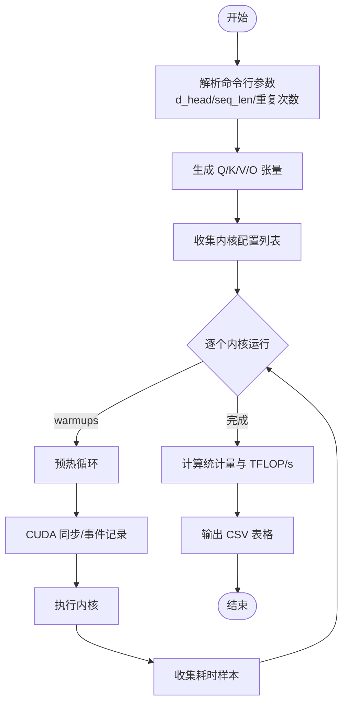

# 代码贡献指南

<cite>
**本文引用的文件**
- [README.md](file://README.md)
- [.clang-format](file://.clang-format)
- [setup.py](file://setup.py)
- [tools/debug/sanity_check.py](file://tools/debug/sanity_check.py)
- [py/flash_helpers/test/test.py](file://py/flash_helpers/test/test.py)
- [tools/benchmark/pt_bench.py](file://tools/benchmark/pt_bench.py)
- [tools/benchmark/run_kernels.py](file://tools/benchmark/run_kernels.py)
- [tools/build/pip_install_with_logs.sh](file://tools/build/pip_install_with_logs.sh)
- [tools/build/parse_ptx_build.py](file://tools/build/parse_ptx_build.py)
- [py/flash_helpers/kernel_configs.py](file://py/flash_helpers/kernel_configs.py)
- [py/flash_helpers/test/utils.py](file://py/flash_helpers/test/utils.py)
- [tools/debug/debug.py](file://tools/debug/debug.py)
</cite>

## 目录
1. [简介](#简介)
2. [项目结构](#项目结构)
3. [核心组件](#核心组件)
4. [架构总览](#架构总览)
5. [详细组件分析](#详细组件分析)
6. [依赖关系分析](#依赖关系分析)
7. [性能考量](#性能考量)
8. [故障排查指南](#故障排查指南)
9. [结论](#结论)
10. [附录](#附录)

## 简介
本指南面向希望为本项目做出贡献的开发者，提供从本地环境搭建、代码修改、格式化检查、功能验证到性能回归测试的完整流程。特别强调以下关键点：
- 使用 .clang-format 统一 C++/CUDA 代码风格，确保跨版本与团队协作的一致性。
- 在新增内核优化或调整配置后，必须通过 sanity_check.py 与测试套件进行正确性验证；同时建议使用 pt_bench.py 进行性能回归对比。
- 构建阶段若遇到问题，使用 pip_install_with_logs.sh 获取带符号的构建日志，并借助 parse_ptx_build.py 解析 PTX 编译信息，辅助定位寄存器溢出、栈帧与编译时间等问题。
- 贡献者需关注项目 16 个迭代版本的历史演进，避免重复已验证的优化路径。

## 项目结构
项目采用“源码 + 工具 + 测试 + 历史内核”的组织方式：
- 源码与头文件位于 src/ 与 src/include/，CUDA 内核实现在此。
- 历史内核位于 previous_kernels/，按迭代版本划分目录，便于对照演进。
- Python 包与工具位于 py/ 与 tools/，包括测试、基准、构建与调试脚本。
- 根目录提供安装与测试入口，README.md 提供总体介绍与性能对比数据。

**章节来源**
- [README.md](file://README.md#L1-L63)
- [.clang-format](file://.clang-format#L1-L21)
- [setup.py](file://setup.py#L1-L76)

## 核心组件
- 代码格式化：.clang-format 定义了 C++/CUDA 的缩进、换行、头文件分组与排序策略，确保风格一致。
- 构建与安装：setup.py 配置 NVCC 编译参数、目标架构与依赖，支持调试与发布两种模式。
- 正确性验证：sanity_check.py 与 py/flash_helpers/test/test.py 提供多配置与多 dtype 的对比校验。
- 性能回归：pt_bench.py 与 run_kernels.py 提供批量运行与统计输出，便于对比不同内核配置的性能。
- 构建日志解析：pip_install_with_logs.sh 输出带符号的构建日志，parse_ptx_build.py 解析 PTX 编译信息，辅助定位寄存器/栈帧问题。
- 内核配置：py/flash_helpers/kernel_configs.py 定义内核配置数据结构与生成策略，支撑自动调优与进度演进。

**章节来源**
- [.clang-format](file://.clang-format#L1-L21)
- [setup.py](file://setup.py#L14-L75)
- [tools/debug/sanity_check.py](file://tools/debug/sanity_check.py#L1-L78)
- [py/flash_helpers/test/test.py](file://py/flash_helpers/test/test.py#L1-L104)
- [tools/benchmark/pt_bench.py](file://tools/benchmark/pt_bench.py#L1-L416)
- [tools/benchmark/run_kernels.py](file://tools/benchmark/run_kernels.py#L1-L159)
- [tools/build/pip_install_with_logs.sh](file://tools/build/pip_install_with_logs.sh#L1-L31)
- [tools/build/parse_ptx_build.py](file://tools/build/parse_ptx_build.py#L1-L250)
- [py/flash_helpers/kernel_configs.py](file://py/flash_helpers/kernel_configs.py#L1-L486)

## 架构总览
下图展示了贡献流程中的关键交互：开发者在本地完成修改后，依次执行格式化、安装、正确性验证与性能测试；若构建失败，使用日志解析工具定位问题。

**图表来源**
- [.clang-format](file://.clang-format#L1-L21)
- [setup.py](file://setup.py#L14-L75)
- [tools/debug/sanity_check.py](file://tools/debug/sanity_check.py#L1-L78)
- [py/flash_helpers/test/test.py](file://py/flash_helpers/test/test.py#L1-L104)
- [tools/benchmark/pt_bench.py](file://tools/benchmark/pt_bench.py#L1-L416)
- [tools/build/pip_install_with_logs.sh](file://tools/build/pip_install_with_logs.sh#L1-L31)
- [tools/build/parse_ptx_build.py](file://tools/build/parse_ptx_build.py#L1-L250)

## 详细组件分析

### 代码格式化（.clang-format）
- 配置要点
  - 语言：C++，强制模板声明换行。
  - 大括号风格：附加于语句末尾，保持紧凑。
  - 缩进宽度：4。
  - 头文件分组与排序：按外部库、系统头、项目头优先级排序，保留组内顺序。
- 执行建议
  - 在提交前统一格式化，避免 CI 中因风格差异导致的失败。
  - 可在 IDE 中集成 clang-format，或在本地脚本中批量应用。

**章节来源**
- [.clang-format](file://.clang-format#L1-L21)

### 构建与安装（setup.py）
- 关键编译参数
  - C++20 标准、快速数学、行信息与资源使用统计。
  - 调试模式支持：开启 -g/-G 并定义 FA_DEBUG，关闭优化。
  - 目标架构：sm_80（A100/RTX 3090）。
- 依赖与扩展
  - 依赖 torch、einops，构建扩展 flash_attention_kernels，包含 src/flash_attention.cu。
- 建议
  - 开发时可设置 FA_DEBUG=true 以启用调试编译，便于定位内核问题。

**章节来源**
- [setup.py](file://setup.py#L14-L75)

### 正确性验证（sanity_check.py 与测试套件）
- sanity_check.py
  - 支持小规模与大规模测试，可选择特定内核。
  - 对比参考实现与当前内核输出，打印差异统计。
- Python 测试套件（py/flash_helpers/test/test.py）
  - 自动遍历内核配置，比较 flash_attention.forward 与 Python 参考实现（FP16/BF16）。
  - 断言条件：与 FP16 结果差异不超过 FP32 结果差异的倍数阈值。
- 建议
  - 新增内核或调整配置后，先运行 sanity_check.py，再运行测试套件，确保数值正确性。

**图表来源**
- [tools/debug/sanity_check.py](file://tools/debug/sanity_check.py#L1-L78)
- [py/flash_helpers/test/test.py](file://py/flash_helpers/test/test.py#L1-L104)
- [py/flash_helpers/test/utils.py](file://py/flash_helpers/test/utils.py#L1-L202)

**章节来源**
- [tools/debug/sanity_check.py](file://tools/debug/sanity_check.py#L1-L78)
- [py/flash_helpers/test/test.py](file://py/flash_helpers/test/test.py#L1-L104)
- [py/flash_helpers/test/utils.py](file://py/flash_helpers/test/utils.py#L1-L202)

### 性能回归测试（pt_bench.py 与 run_kernels.py）
- pt_bench.py
  - 支持多 d_head 与 seq_len 组合，输出均值/中位数/最小/最大/标准差与相对性能百分比。
  - 可选稳定化策略（flush cache、sleep、同步），并计算 Attn TFLOP/s。
  - 输出 CSV 表格，便于横向对比不同内核配置。
- run_kernels.py
  - 快速运行指定内核配置与参考内核，支持多次重复与 dtype 选择。
- 建议
  - 在 PR 中附上 pt_bench.py 的 CSV 输出，标注设备型号与参数；对比参考内核（v2/v3）的相对性能。

**图表来源**
- [tools/benchmark/pt_bench.py](file://tools/benchmark/pt_bench.py#L1-L416)
- [tools/benchmark/run_kernels.py](file://tools/benchmark/run_kernels.py#L1-L159)
- [py/flash_helpers/test/utils.py](file://py/flash_helpers/test/utils.py#L1-L202)

**章节来源**
- [tools/benchmark/pt_bench.py](file://tools/benchmark/pt_bench.py#L1-L416)
- [tools/benchmark/run_kernels.py](file://tools/benchmark/run_kernels.py#L1-L159)
- [py/flash_helpers/test/utils.py](file://py/flash_helpers/test/utils.py#L1-L202)

### 构建日志解析（pip_install_with_logs.sh 与 parse_ptx_build.py）
- pip_install_with_logs.sh
  - 创建带时间戳的日志文件，捕获 pip 安装过程。
  - 使用 cu++filt demangle 符号，生成 .demangled 文件。
  - 成功后调用 parse_ptx_build.py 将 PTX 日志解析为 CSV，便于后续分析。
- parse_ptx_build.py
  - 解析 ptxas 输出，提取函数名、寄存器使用、屏障、栈帧、溢出字节、编译时间等。
  - 支持 CSV 输出，便于自动化分析与报告生成。
- 建议
  - 构建失败时优先查看 logs/ 下的 demangled 日志，结合 parse_ptx_build.py 的 CSV 输出定位问题。

**章节来源**
- [tools/build/pip_install_with_logs.sh](file://tools/build/pip_install_with_logs.sh#L1-L31)
- [tools/build/parse_ptx_build.py](file://tools/build/parse_ptx_build.py#L1-L250)

### 内核配置与自动调优（kernel_configs.py）
- 数据结构
  - FlashForwardKernelConfig：封装 dtype、d_head、B_r、B_c、n_warps、异步拷贝、预取块、Swizzle、MMAs 加载瓦片、双缓冲、优化 softmax 等特征。
- 生成策略
  - get_autotuning_kernel_configs：基于参数空间生成候选配置集合。
  - get_kernel_progression_configs：按迭代演进生成配置序列。
  - get_kernels_to_build：汇总可用配置。
- 建议
  - 新增优化时，优先在自动调优空间中探索；必要时扩展 get_kernel_progression_configs 以记录演进路径。

**章节来源**
- [py/flash_helpers/kernel_configs.py](file://py/flash_helpers/kernel_configs.py#L1-L486)

### 调试辅助（tools/debug/debug.py）
- 功能
  - 与官方实现对比，打印中间张量与差异统计。
  - 支持范围初始化与块级调试输出，便于定位数值偏差来源。
- 建议
  - 在局部验证阶段使用该脚本进行逐块调试，缩小问题范围。

**章节来源**
- [tools/debug/debug.py](file://tools/debug/debug.py#L1-L253)

## 依赖关系分析
- 组件耦合
  - sanity_check.py 与测试套件依赖 flash_helpers.test.utils 提供的参考实现与数据生成。
  - pt_bench.py 与 run_kernels.py 依赖 kernel_configs 生成配置与计算 FLOP。
  - 构建日志解析链路依赖 parse_ptx_build.py 与 pip_install_with_logs.sh。
- 外部依赖
  - torch、einops、flash_attn_2_cuda/flash_attn_3_cuda（用于参考实现）。
  - ninja、psutil、packaging（构建依赖）。
- 建议
  - 更新依赖时，确保兼容性与版本匹配；在 CI 中固定关键依赖版本。

**图表来源**
- [tools/debug/sanity_check.py](file://tools/debug/sanity_check.py#L1-L78)
- [py/flash_helpers/test/test.py](file://py/flash_helpers/test/test.py#L1-L104)
- [py/flash_helpers/test/utils.py](file://py/flash_helpers/test/utils.py#L1-L202)
- [py/flash_helpers/kernel_configs.py](file://py/flash_helpers/kernel_configs.py#L1-L486)
- [tools/benchmark/pt_bench.py](file://tools/benchmark/pt_bench.py#L1-L416)
- [tools/benchmark/run_kernels.py](file://tools/benchmark/run_kernels.py#L1-L159)
- [tools/build/pip_install_with_logs.sh](file://tools/build/pip_install_with_logs.sh#L1-L31)
- [tools/build/parse_ptx_build.py](file://tools/build/parse_ptx_build.py#L1-L250)

**章节来源**
- [py/flash_helpers/test/utils.py](file://py/flash_helpers/test/utils.py#L1-L202)
- [py/flash_helpers/kernel_configs.py](file://py/flash_helpers/kernel_configs.py#L1-L486)
- [tools/benchmark/pt_bench.py](file://tools/benchmark/pt_bench.py#L1-L416)
- [tools/benchmark/run_kernels.py](file://tools/benchmark/run_kernels.py#L1-L159)
- [tools/build/pip_install_with_logs.sh](file://tools/build/pip_install_with_logs.sh#L1-L31)
- [tools/build/parse_ptx_build.py](file://tools/build/parse_ptx_build.py#L1-L250)

## 性能考量
- 设备与稳定性
  - 使用 nvidia-smi 设置目标设备的 SM/Mem 时钟，减少波动；测试结束后重置为默认频率。
  - 在 pt_bench.py 中启用 flush_cache 与 sleep，降低缓存影响。
- 统计指标
  - 均值、中位数、最小/最大、标准差与相对性能百分比；同时计算 Attn TFLOP/s，便于跨配置横向对比。
- 建议
  - 在 PR 中附带 CSV 报表与设备信息；对显著退化（如相对性能低于基准的一定阈值）需给出解释与改进方案。

**章节来源**
- [tools/benchmark/pt_bench.py](file://tools/benchmark/pt_bench.py#L1-L416)

## 故障排查指南
- 构建失败
  - 使用 pip_install_with_logs.sh 生成带符号的构建日志，定位编译错误。
  - 通过 parse_ptx_build.py 解析 PTX 日志，检查寄存器使用、栈帧与溢出字节，判断是否需要减小块尺寸或优化内存访问。
- 数值不一致
  - 先运行 sanity_check.py，观察每行/每列差异分布；再运行测试套件，确认断言失败的具体配置。
  - 使用 tools/debug/debug.py 进行块级调试，打印中间张量，定位 softmax 或矩阵乘步骤的偏差来源。
- 性能异常
  - 检查 pt_bench.py 的统计输出，确认是否出现异常波动；必要时调整 warmups/repeats 参数。
  - 对照 run_kernels.py 的参考内核（v2/v3），确认实现差异。

**章节来源**
- [tools/build/pip_install_with_logs.sh](file://tools/build/pip_install_with_logs.sh#L1-L31)
- [tools/build/parse_ptx_build.py](file://tools/build/parse_ptx_build.py#L1-L250)
- [tools/debug/sanity_check.py](file://tools/debug/sanity_check.py#L1-L78)
- [py/flash_helpers/test/test.py](file://py/flash_helpers/test/test.py#L1-L104)
- [tools/debug/debug.py](file://tools/debug/debug.py#L1-L253)
- [tools/benchmark/pt_bench.py](file://tools/benchmark/pt_bench.py#L1-L416)
- [tools/benchmark/run_kernels.py](file://tools/benchmark/run_kernels.py#L1-L159)

## 结论
本指南提供了从本地开发到 PR 审查的全流程规范：统一格式化、严格正确性验证、系统化性能回归测试以及构建日志解析。贡献者应遵循以下关键实践：
- 修改代码后先格式化，再安装构建。
- 新增内核或调整配置后，务必运行 sanity_check.py 与测试套件。
- 性能变更需提供 pt_bench.py 的 CSV 报表与设备信息。
- 构建失败时使用 pip_install_with_logs.sh 与 parse_ptx_build.py 辅助定位。
- 关注 16 个迭代版本的演进历史，避免重复已验证的路径。

## 附录
- Pull Request 审查标准建议
  - 性能提升量化：提供 pt_bench.py 的 CSV 报表，明确设备、d_head、seq_len、均值/中位数、相对性能与 TFLOP/s。
  - 数值正确性：sanity_check.py 与测试套件全部通过，断言失败需有明确解释与修复。
  - 代码可读性：遵循 .clang-format 规范，注释清晰，逻辑模块化。
  - 文档更新：新增内核或配置时，补充 README.md 中的性能对比或配置说明。
  - 版本演进：避免重复已验证的优化；如涉及历史路径，需说明差异与收益。

**章节来源**
- [README.md](file://README.md#L1-L63)
- [.clang-format](file://.clang-format#L1-L21)
- [tools/benchmark/pt_bench.py](file://tools/benchmark/pt_bench.py#L1-L416)
- [tools/debug/sanity_check.py](file://tools/debug/sanity_check.py#L1-L78)
- [py/flash_helpers/test/test.py](file://py/flash_helpers/test/test.py#L1-L104)