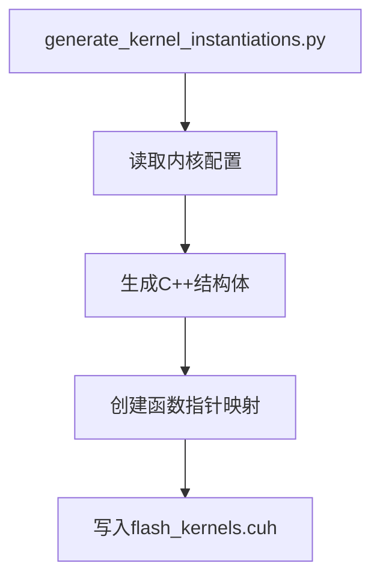
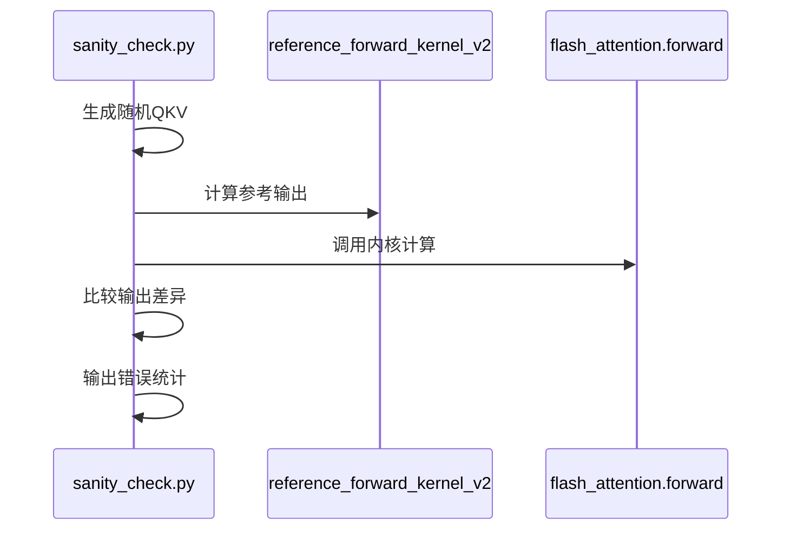

# 开发者指南

<cite>
**本文档中引用的文件**  
- [README.md](file://README.md)
- [setup.py](file://setup.py)
- [py/setup.py](file://py/setup.py)
- [tools/build/generate_kernel_instantiations.py](file://tools/build/generate_kernel_instantiations.py)
- [tools/debug/sanity_check.py](file://tools/debug/sanity_check.py)
- [tools/debug/debug.py](file://tools/debug/debug.py)
- [tools/analysis/count_sass_instructions.sh](file://tools/analysis/count_sass_instructions.sh)
- [tools/analysis/compare_sass_instruction_counts.py](file://tools/analysis/compare_sass_instruction_counts.py)
- [tools/analysis/ptx_sass_filter.py](file://tools/analysis/ptx_sass_filter.py)
- [tools/build/clean_asm.sh](file://tools/build/clean_asm.sh)
- [tools/build/extract_sass.py](file://tools/build/extract_sass.py)
- [py/flash_helpers/kernel_configs.py](file://py/flash_helpers/kernel_configs.py)
- [.clang-format](file://.clang-format)
</cite>

## 目录
1. [简介](#简介)
2. [项目结构](#项目结构)
3. [构建与安装](#构建与安装)
4. [内核配置与代码生成](#内核配置与代码生成)
5. [调试工具使用](#调试工具使用)
6. [代码格式化与静态检查](#代码格式化与静态检查)
7. [性能分析工作流](#性能分析工作流)
8. [贡献指南](#贡献指南)

## 简介

本项目实现了Flash Attention从零开始的16次迭代优化，最终在A100上达到官方Flash Attention 2性能的99.2%，在RTX 3090上达到102.9%。项目包含15个历史内核版本（位于`previous_kernels/`目录）和最终优化版本（位于`src/`目录）。内核实现了Flash Attention 2的前向传播功能，支持非因果注意力，使用128维头维度，输入输出为16位（bf16/fp16）张量，softmax计算在fp32中进行。

**Section sources**
- [README.md](file://README.md#L1-L63)

## 项目结构

项目采用分层结构，主要包含以下几个部分：
- `flash_attention/`: Python包，包含CUDA内核的Python接口
- `previous_kernels/`: 历史内核版本，按迭代顺序组织
- `src/`: 最终优化的内核源码
- `py/`: Python辅助工具和测试代码
- `tools/`: 构建、调试和分析工具
- `setup.py`: 主项目的构建配置

内核源码组织遵循模块化设计，包含common.h、cuda_utils.cuh等通用头文件，以及flash_attention.cuh、flash_kernels.cuh等核心功能头文件。这种结构便于代码复用和维护。

**Section sources**
- [README.md](file://README.md#L1-L63)

## 构建与安装

项目使用setuptools进行构建，通过setup.py配置CUDA扩展的编译参数。构建过程需要CUDA工具链支持，特别是nvcc编译器。安装命令如下：

```bash
pip install --no-build-isolation .
pip install ./py
```

主setup.py文件配置了nvcc编译参数，包括架构支持（compute_80, sm_80）、优化级别（-O3）和调试选项。py/setup.py用于安装Python辅助工具包。构建时会自动处理CUDA源文件（.cu）和头文件（.cuh），生成可导入的Python模块。

**Section sources**
- [setup.py](file://setup.py#L1-L76)
- [py/setup.py](file://py/setup.py#L1-L20)
- [README.md](file://README.md#L19-L26)

## 内核配置与代码生成

### 内核实例化生成

`tools/build/generate_kernel_instantiations.py`脚本负责生成内核实例化代码。该脚本从`py/flash_helpers/kernel_configs.py`获取要构建的内核配置，然后生成`src/include/flash_kernels.cuh`文件，其中包含所有内核函数的注册代码。生成的代码使用C++映射（std::map）将内核配置与对应的内核函数指针关联起来，实现了运行时的内核选择机制。



**Diagram sources**
- [tools/build/generate_kernel_instantiations.py](file://tools/build/generate_kernel_instantiations.py#L1-L57)

### 内核配置管理

`py/flash_helpers/kernel_configs.py`文件定义了`FlashForwardKernelConfig`数据类，用于表示内核配置。配置包含数据类型、头维度、块大小、warp数量、异步拷贝、预加载块、swizzling等优化选项。该文件还提供了多种配置生成函数，如`get_autotuning_kernel_configs()`用于生成自动调优的配置组合，`get_kernel_progression_configs()`用于生成迭代优化的配置序列。

**Section sources**
- [tools/build/generate_kernel_instantiations.py](file://tools/build/generate_kernel_instantiations.py#L1-L57)
- [py/flash_helpers/kernel_configs.py](file://py/flash_helpers/kernel_configs.py#L1-L486)

## 调试工具使用

### 功能验证

`tools/debug/sanity_check.py`脚本用于验证内核的正确性。该脚本使用PyTorch生成随机输入张量，调用参考实现（reference_forward_kernel_v2）计算预期输出，然后调用实际内核计算输出，最后比较两者差异。脚本支持小规模测试（--small参数）和详细差异输出（--diff参数），便于快速定位问题。



**Diagram sources**
- [tools/debug/sanity_check.py](file://tools/debug/sanity_check.py#L1-L78)

### 错误诊断

`tools/debug/debug.py`脚本提供详细的错误诊断功能。该脚本可以打印张量的详细值，支持范围初始化（--range参数）以便于调试。脚本实现了块级Flash Attention的纯Python版本，可以逐块比较计算过程，帮助定位数值错误。输出结果保存在debug/debug_pt.txt和debug/debug_cuda.txt文件中，便于详细分析。

**Section sources**
- [tools/debug/sanity_check.py](file://tools/debug/sanity_check.py#L1-L78)
- [tools/debug/debug.py](file://tools/debug/debug.py#L1-L253)

## 代码格式化与静态检查

项目使用.clang-format文件定义代码格式化规则，确保C++代码风格的一致性。.clang-format文件位于项目根目录，包含缩进、空格、换行等格式化选项。开发者在提交代码前应使用clang-format工具格式化代码，以保持代码库的整洁和可读性。

**Section sources**
- [.clang-format](file://.clang-format)

## 性能分析工作流

### SASS指令计数分析

项目提供了一套完整的性能分析工具链。`tools/analysis/count_sass_instructions.sh`脚本使用nvdisasm提取SASS指令并统计各类指令的数量。`tools/analysis/compare_sass_instruction_counts.py`脚本可以比较两个版本的指令计数差异，帮助评估优化效果。`tools/build/extract_sass.py`脚本可以从cubin文件中提取SASS汇编代码，便于深入分析。


**Diagram sources**
- [tools/analysis/count_sass_instructions.sh](file://tools/analysis/count_sass_instructions.sh#L1-L10)
- [tools/analysis/compare_sass_instruction_counts.py](file://tools/analysis/compare_sass_instruction_counts.py#L1-L201)

### 高级调试技术

`tools/analysis/ptx_sass_filter.py`脚本提供PTX到SASS的映射分析功能。该脚本可以提取特定PTX指令对应的所有SASS指令，帮助理解编译器优化行为。结合`tools/build/clean_asm.sh`脚本（用于清理汇编代码中的地址信息），开发者可以进行精确的性能分析和优化。

**Section sources**
- [tools/analysis/count_sass_instructions.sh](file://tools/analysis/count_sass_instructions.sh#L1-L10)
- [tools/analysis/compare_sass_instruction_counts.py](file://tools/analysis/compare_sass_instruction_counts.py#L1-L201)
- [tools/analysis/ptx_sass_filter.py](file://tools/analysis/ptx_sass_filter.py#L1-L122)
- [tools/build/clean_asm.sh](file://tools/build/clean_asm.sh#L1-L44)

## 贡献指南

新贡献者应遵循以下工作流：
1. 阅读README.md了解项目背景和目标
2. 使用setup.py安装项目依赖
3. 运行sanity_check.py验证环境配置
4. 修改内核代码或添加新配置
5. 使用generate_kernel_instantiations.py生成新的内核实例
6. 运行debug.py进行详细调试
7. 使用性能分析工具评估优化效果
8. 格式化代码并提交

添加新内核配置时，应在kernel_configs.py中定义新的配置组合，并确保generate_kernel_instantiations.py能够正确处理。优化现有实现时，应使用SASS指令分析工具量化优化效果，并通过功能验证确保正确性。

**Section sources**
- [README.md](file://README.md#L1-L63)
- [setup.py](file://setup.py#L1-L76)
- [tools/build/generate_kernel_instantiations.py](file://tools/build/generate_kernel_instantiations.py#L1-L57)
- [tools/debug/sanity_check.py](file://tools/debug/sanity_check.py#L1-L78)
- [tools/debug/debug.py](file://tools/debug/debug.py#L1-L253)
- [tools/analysis/count_sass_instructions.sh](file://tools/analysis/count_sass_instructions.sh#L1-L10)
- [tools/analysis/compare_sass_instruction_counts.py](file://tools/analysis/compare_sass_instruction_counts.py#L1-L201)
- [tools/analysis/ptx_sass_filter.py](file://tools/analysis/ptx_sass_filter.py#L1-L122)
- [tools/build/clean_asm.sh](file://tools/build/clean_asm.sh#L1-L44)
- [py/flash_helpers/kernel_configs.py](file://py/flash_helpers/kernel_configs.py#L1-L486)
- [.clang-format](file://.clang-format)