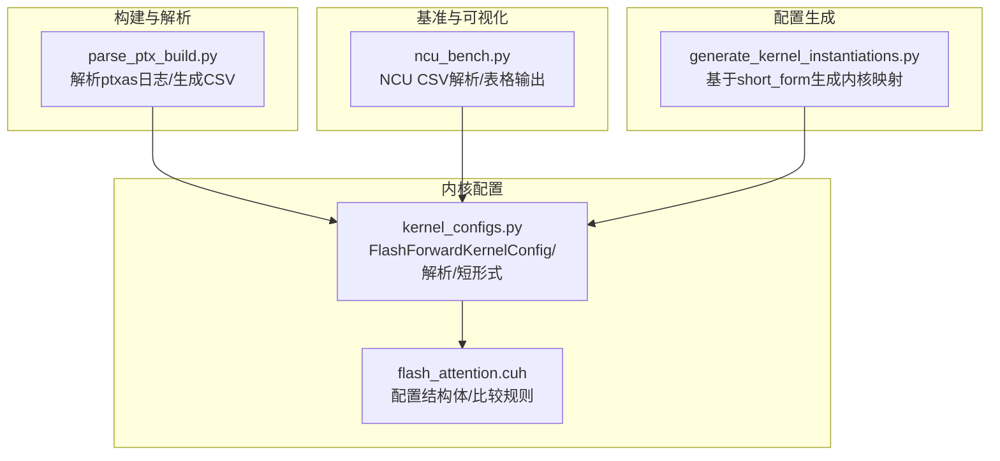
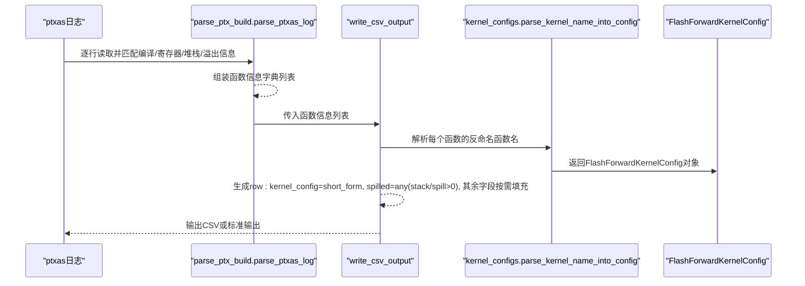
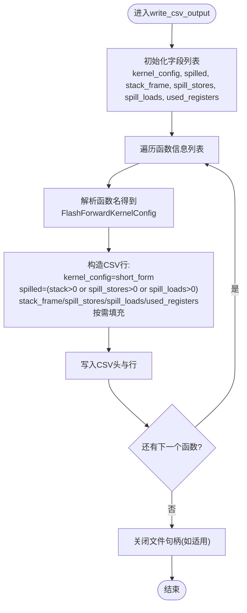
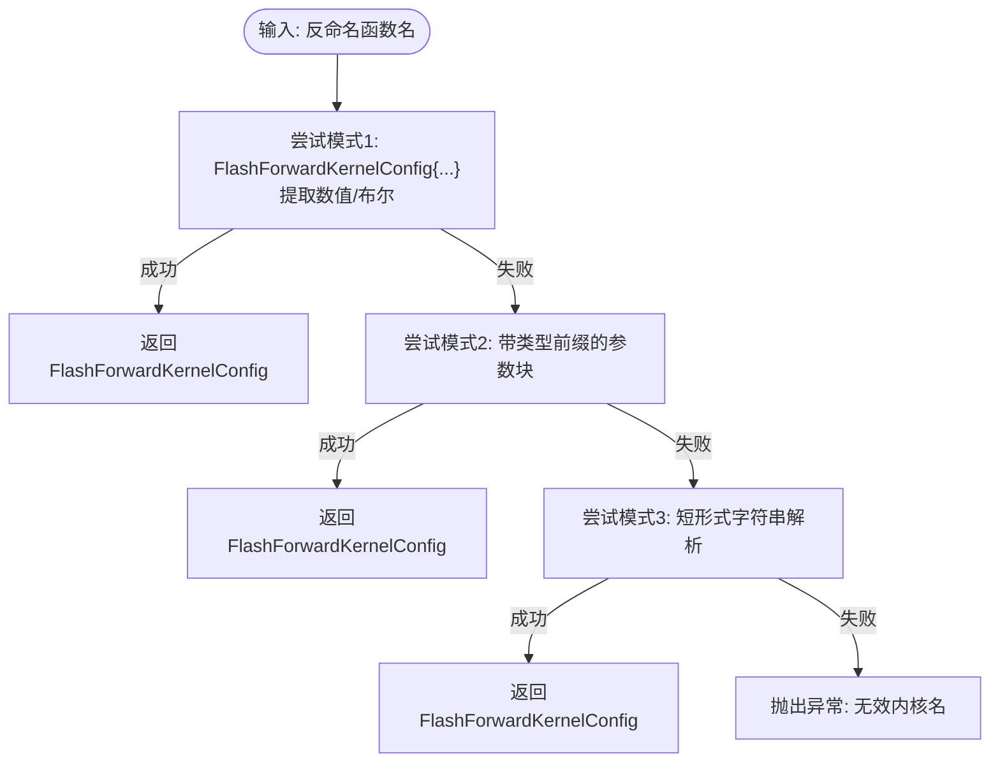
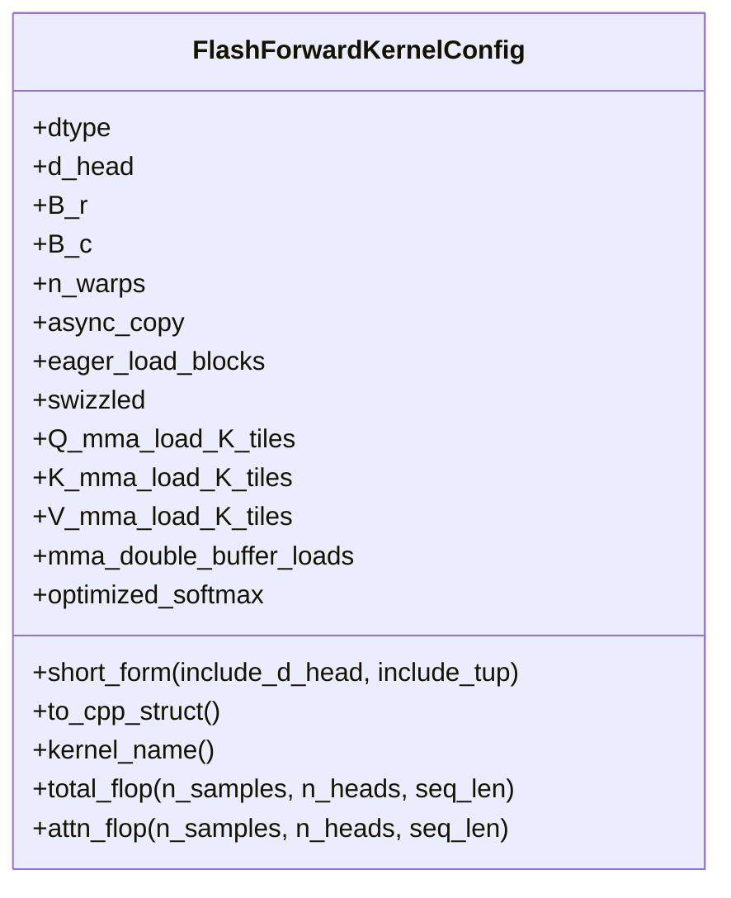
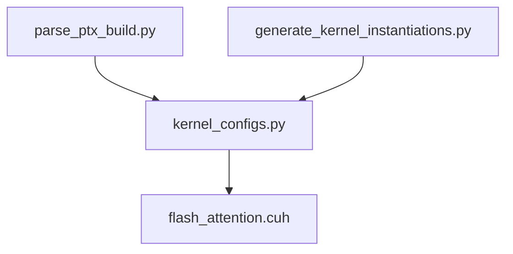

# CSV输出与性能分析

<cite>
**本文引用的文件**
- [tools/build/parse_ptx_build.py](file://tools/build/parse_ptx_build.py)
- [py/flash_helpers/kernel_configs.py](file://py/flash_helpers/kernel_configs.py)
- [src/include/flash_attention.cuh](file://src/include/flash_attention.cuh)
- [tools/benchmark/ncu_bench.py](file://tools/benchmark/ncu_bench.py)
- [tools/build/generate_kernel_instantiations.py](file://tools/build/generate_kernel_instantiations.py)
</cite>

## 目录
1. [引言](#引言)
2. [项目结构](#项目结构)
3. [核心组件](#核心组件)
4. [架构总览](#架构总览)
5. [详细组件分析](#详细组件分析)
6. [依赖关系分析](#依赖关系分析)
7. [性能考量](#性能考量)
8. [故障排查指南](#故障排查指南)
9. [结论](#结论)
10. [附录](#附录)

## 引言
本文件围绕“如何将解析后的内核性能数据转换为CSV格式输出”展开，重点解释以下内容：
- write_csv_output函数如何从编译日志中提取并组织字段，生成CSV输出。
- 字段选择策略：kernel_config、spilled、stack_frame、spill_stores、spill_loads、used_registers 的来源与意义。
- parse_kernel_name_into_config函数如何将反命名后的函数名解析为FlashForwardKernelConfig对象，并生成short_form配置标识。
- CSV数据如何用于寄存器压力分析、堆栈溢出诊断和内核配置优化决策，为开发者提供量化性能调优依据。

## 项目结构
该仓库包含构建、分析与基准测试工具，以及内核配置定义。与本主题直接相关的关键位置如下：
- 构建与解析：tools/build/parse_ptx_build.py 负责解析ptxas日志，提取寄存器、堆栈与溢出信息，并输出CSV。
- 内核配置模型：py/flash_helpers/kernel_configs.py 定义FlashForwardKernelConfig及解析短形式配置的逻辑。
- CUDA侧配置结构体：src/include/flash_attention.cuh 提供配置字段的语义与比较规则。
- 基准与可视化：tools/benchmark/ncu_bench.py 展示了如何使用NV-Code-Analyzer导出的CSV进行性能对比与表格化输出。
- 配置生成：tools/build/generate_kernel_instantiations.py 使用short_form作为键生成内核映射。

图表来源
- [tools/build/parse_ptx_build.py](file://tools/build/parse_ptx_build.py#L1-L250)
- [py/flash_helpers/kernel_configs.py](file://py/flash_helpers/kernel_configs.py#L100-L210)
- [src/include/flash_attention.cuh](file://src/include/flash_attention.cuh#L30-L109)
- [tools/benchmark/ncu_bench.py](file://tools/benchmark/ncu_bench.py#L70-L120)
- [tools/build/generate_kernel_instantiations.py](file://tools/build/generate_kernel_instantiations.py#L1-L56)

章节来源
- [tools/build/parse_ptx_build.py](file://tools/build/parse_ptx_build.py#L1-L250)
- [py/flash_helpers/kernel_configs.py](file://py/flash_helpers/kernel_configs.py#L100-L210)
- [src/include/flash_attention.cuh](file://src/include/flash_attention.cuh#L30-L109)
- [tools/benchmark/ncu_bench.py](file://tools/benchmark/ncu_bench.py#L70-L120)
- [tools/build/generate_kernel_instantiations.py](file://tools/build/generate_kernel_instantiations.py#L1-L56)

## 核心组件
- write_csv_output函数：从函数信息列表中抽取字段，写入CSV；其中kernel_config来自解析后的配置对象的short_form，spilled由stack_frame、spill_stores、spill_loads三者是否大于0决定。
- parse_kernel_name_into_config函数：尝试三种模式解析内核名称，最终返回FlashForwardKernelConfig对象；其short_form方法生成可读的配置标识。
- FlashForwardKernelConfig：CUDA侧配置结构体，定义字段与比较规则；Python侧对应dataclass，提供short_form、to_cpp_struct等方法。
- NCU基准脚本：展示如何从NV-Code-Analyzer导出的CSV中提取指标并生成表格，体现CSV在性能对比中的作用。

章节来源
- [tools/build/parse_ptx_build.py](file://tools/build/parse_ptx_build.py#L173-L221)
- [py/flash_helpers/kernel_configs.py](file://py/flash_helpers/kernel_configs.py#L100-L210)
- [src/include/flash_attention.cuh](file://src/include/flash_attention.cuh#L30-L109)
- [tools/benchmark/ncu_bench.py](file://tools/benchmark/ncu_bench.py#L70-L120)

## 架构总览
下图展示了从ptxas日志到CSV输出的整体流程，以及与内核配置解析的关系。

图表来源
- [tools/build/parse_ptx_build.py](file://tools/build/parse_ptx_build.py#L31-L172)
- [tools/build/parse_ptx_build.py](file://tools/build/parse_ptx_build.py#L173-L221)
- [py/flash_helpers/kernel_configs.py](file://py/flash_helpers/kernel_configs.py#L323-L335)

## 详细组件分析

### write_csv_output函数：CSV字段选择与生成
- 字段来源与处理
  - kernel_config：通过解析函数名得到FlashForwardKernelConfig后，调用其short_form生成人类可读的配置标识。
  - spilled：当stack_frame、spill_stores、spill_loads任一大于0时标记为溢出。
  - stack_frame、spill_stores、spill_loads：直接取自解析结果，缺失值替换为0以保证CSV一致性。
  - used_registers：直接取自解析结果。
  - 忽略字段：cumulative_stack、cmem0、architecture、compile_time（在CSV输出中不写入）。
- 输出目标：若指定输出文件则写入文件，否则写入标准输出。
- 错误处理：使用try/finally确保文件句柄正确关闭。

图表来源
- [tools/build/parse_ptx_build.py](file://tools/build/parse_ptx_build.py#L173-L221)

章节来源
- [tools/build/parse_ptx_build.py](file://tools/build/parse_ptx_build.py#L173-L221)

### parse_kernel_name_into_config函数：从反命名函数名到配置对象
- 解析策略（优先级）
  - 模式1：从形如“FlashForwardKernelConfig{...}”的参数块中提取数值，自动识别布尔与整数。
  - 模式2：支持带类型前缀的参数块，例如“(c10::ScalarType)”、“(int)”、“(bool)”。
  - 模式3：解析短形式字符串，如“(FP16, 128, 64, 64, 4): async+eager+swizzled+load_0_2_2_tiles+opt_softmax”，从中提取dtype、d_head、B_r、B_c、n_warps、布尔标志与Q/K/V加载tile数量。
- 失败回退：若三种模式均失败，抛出异常提示无效内核名。
- 短形式生成：FlashForwardKernelConfig.short_form会组合dtype、d_head、B_r、B_c、n_warps与特性标志，形成紧凑且可读的配置标识。

图表来源
- [py/flash_helpers/kernel_configs.py](file://py/flash_helpers/kernel_configs.py#L177-L215)
- [py/flash_helpers/kernel_configs.py](file://py/flash_helpers/kernel_configs.py#L217-L249)
- [py/flash_helpers/kernel_configs.py](file://py/flash_helpers/kernel_configs.py#L251-L321)
- [py/flash_helpers/kernel_configs.py](file://py/flash_helpers/kernel_configs.py#L323-L335)

章节来源
- [py/flash_helpers/kernel_configs.py](file://py/flash_helpers/kernel_configs.py#L177-L215)
- [py/flash_helpers/kernel_configs.py](file://py/flash_helpers/kernel_configs.py#L217-L249)
- [py/flash_helpers/kernel_configs.py](file://py/flash_helpers/kernel_configs.py#L251-L321)
- [py/flash_helpers/kernel_configs.py](file://py/flash_helpers/kernel_configs.py#L323-L335)

### FlashForwardKernelConfig：字段语义与比较规则
- 字段含义（节选）
  - dtype：数据类型枚举（如FP16、BF16）。
  - d_head：每头维度大小。
  - B_r、B_c：分块尺寸。
  - n_warps：每CTA的warp数。
  - async_copy、eager_load_blocks、swizzled：内存拷贝与加载策略。
  - Q_mma_load_K_tiles、K_mma_load_K_tiles、V_mma_load_K_tiles：Q/K/V的K方向加载tile数。
  - mma_double_buffer_loads：是否启用双缓冲加载。
  - optimized_softmax：是否启用优化的softmax。
- 比较规则：按dtype、d_head、B_r、B_c、n_warps、各布尔标志依次比较，用于排序与去重。

图表来源
- [py/flash_helpers/kernel_configs.py](file://py/flash_helpers/kernel_configs.py#L100-L175)
- [src/include/flash_attention.cuh](file://src/include/flash_attention.cuh#L30-L109)

章节来源
- [py/flash_helpers/kernel_configs.py](file://py/flash_helpers/kernel_configs.py#L100-L175)
- [src/include/flash_attention.cuh](file://src/include/flash_attention.cuh#L30-L109)

### CSV数据在性能分析中的应用
- 寄存器压力分析
  - used_registers：反映每个配置使用的寄存器数量，可用于评估寄存器压力与并发度限制。
  - spilled：当spilled为真时，表示存在堆栈帧或溢出（spill_stores或spill_loads非零），通常意味着寄存器不足导致临时变量被溢出到本地/共享内存。
- 堆栈溢出诊断
  - stack_frame、spill_stores、spill_loads：这些字段直接指示溢出规模。结合spilled可快速定位高溢出配置。
- 内核配置优化决策
  - 通过CSV对不同配置的used_registers、spilled进行横向对比，筛选出低溢出、合理寄存器占用的配置组合。
  - 结合业务场景（如d_head、B_r/B_c、n_warps）调整，观察对寄存器与溢出的影响，逐步收敛到稳定高效的配置集。

章节来源
- [tools/build/parse_ptx_build.py](file://tools/build/parse_ptx_build.py#L173-L221)

### 与NCU基准脚本的协同
- ncu_bench.py展示了如何从NV-Code-Analyzer导出的CSV中提取关键指标（如Duration、Cycles、Registers Per Thread、L2 Hit Rate），并生成表格或CSV输出。
- 该脚本同样依赖kernel_configs模块解析内核名称，生成短形式标识，便于跨工具链统一标识同一配置。

章节来源
- [tools/benchmark/ncu_bench.py](file://tools/benchmark/ncu_bench.py#L70-L120)
- [tools/benchmark/ncu_bench.py](file://tools/benchmark/ncu_bench.py#L289-L300)

## 依赖关系分析
- parse_ptx_build.py依赖kernel_configs模块完成内核名称解析与配置对象生成。
- kernel_configs.py中的FlashForwardKernelConfig与CUDA侧flash_attention.cuh中的同名结构体保持字段一致性和比较规则一致性。
- generate_kernel_instantiations.py使用short_form作为键生成内核映射，确保运行期配置与构建期配置的一致性。

图表来源
- [tools/build/parse_ptx_build.py](file://tools/build/parse_ptx_build.py#L1-L20)
- [py/flash_helpers/kernel_configs.py](file://py/flash_helpers/kernel_configs.py#L100-L175)
- [src/include/flash_attention.cuh](file://src/include/flash_attention.cuh#L30-L109)
- [tools/build/generate_kernel_instantiations.py](file://tools/build/generate_kernel_instantiations.py#L1-L56)

章节来源
- [tools/build/parse_ptx_build.py](file://tools/build/parse_ptx_build.py#L1-L20)
- [py/flash_helpers/kernel_configs.py](file://py/flash_helpers/kernel_configs.py#L100-L175)
- [src/include/flash_attention.cuh](file://src/include/flash_attention.cuh#L30-L109)
- [tools/build/generate_kernel_instantiations.py](file://tools/build/generate_kernel_instantiations.py#L1-L56)

## 性能考量
- 寄存器与溢出的权衡
  - 提升block大小或tile数可能提高吞吐，但也会增加寄存器需求，导致spilled上升。
  - 合理设置n_warps、B_r/B_c与加载tile数，有助于在寄存器与访存之间取得平衡。
- 配置短形式的稳定性
  - short_form作为跨工具链的统一标识，有利于长期追踪与回归分析。
- 数据完整性
  - 对缺失值采用0填充，避免CSV列宽不一致；同时保留原始None值以便打印调试时区分。

[本节为通用指导，无需列出具体文件来源]

## 故障排查指南
- 内核名称无法解析
  - 现象：parse_kernel_name_into_config抛出“无效内核名”异常。
  - 排查：确认反命名函数名是否符合三种模式之一；检查日志中是否存在FlashForwardKernelConfig参数块或短形式字符串。
- CSV列不一致
  - 现象：部分行缺少某些字段。
  - 排查：确认parse_ptxas_log是否正确匹配到寄存器/堆栈/溢出行；write_csv_output已将None替换为0，但缺失字段仍可能影响列顺序。
- 寄存器溢出过高
  - 现象：spilled为真且used_registers接近上限。
  - 排查：降低d_head、B_r/B_c或减少异步/预加载策略，观察spilled与used_registers变化。

章节来源
- [py/flash_helpers/kernel_configs.py](file://py/flash_helpers/kernel_configs.py#L323-L335)
- [tools/build/parse_ptx_build.py](file://tools/build/parse_ptx_build.py#L94-L172)
- [tools/build/parse_ptx_build.py](file://tools/build/parse_ptx_build.py#L173-L221)

## 结论
write_csv_output函数通过解析ptxas日志，将内核配置与性能指标（寄存器、堆栈、溢出）整合为CSV，为后续的寄存器压力分析、堆栈溢出诊断与配置优化提供了可靠的数据基础。parse_kernel_name_into_config负责将反命名函数名转换为FlashForwardKernelConfig对象，并以short_form作为统一标识，贯穿构建、运行与分析全链路。配合NCU基准脚本，开发者可以建立从构建到性能验证的闭环工作流，实现量化驱动的内核配置优化。

[本节为总结性内容，无需列出具体文件来源]

## 附录
- 字段清单与来源
  - kernel_config：来自FlashForwardKernelConfig.short_form，来源于parse_kernel_name_into_config。
  - spilled：由stack_frame、spill_stores、spill_loads三者是否大于0综合判定。
  - stack_frame、spill_stores、spill_loads、used_registers：直接取自ptxas日志解析结果。
  - 忽略字段：cumulative_stack、cmem0、architecture、compile_time（在CSV输出中不写入）。

章节来源
- [tools/build/parse_ptx_build.py](file://tools/build/parse_ptx_build.py#L173-L221)
- [py/flash_helpers/kernel_configs.py](file://py/flash_helpers/kernel_configs.py#L100-L175)