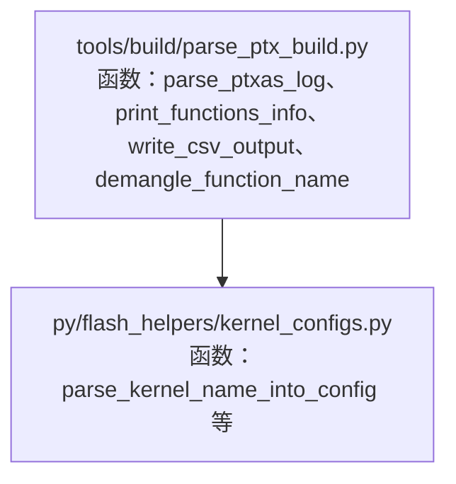
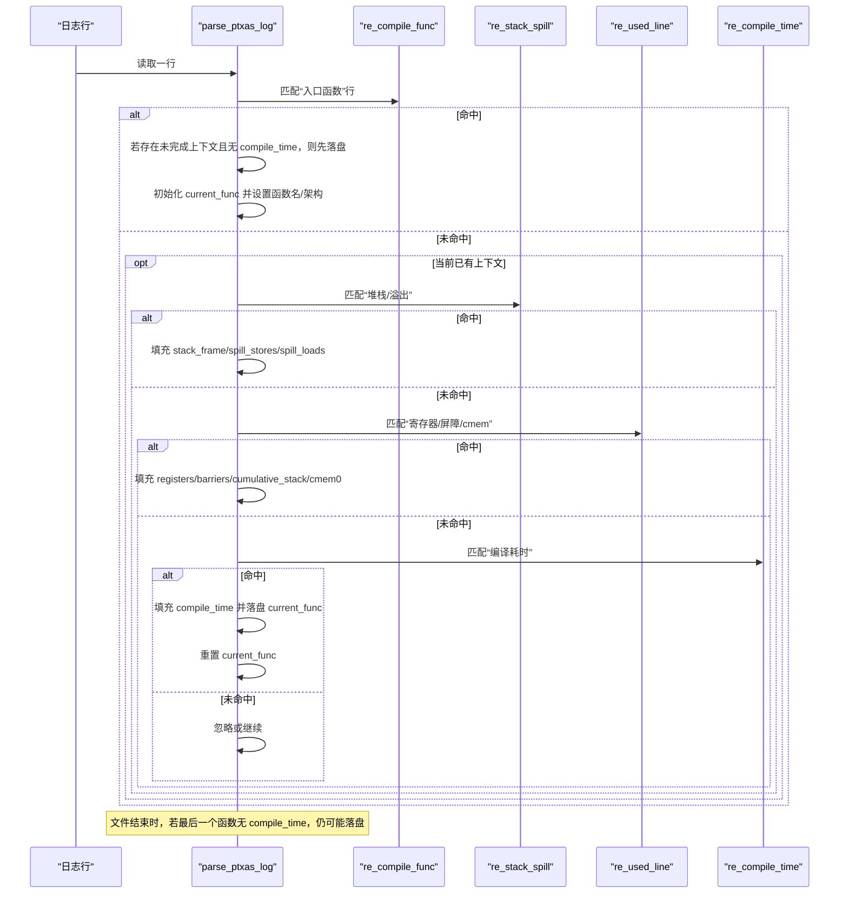
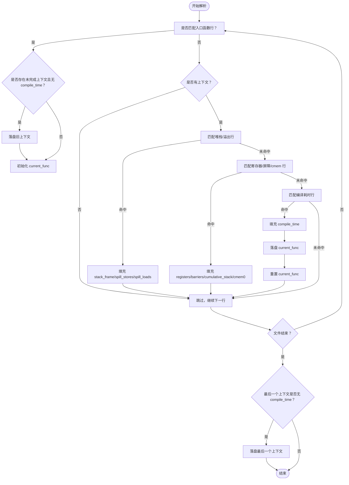
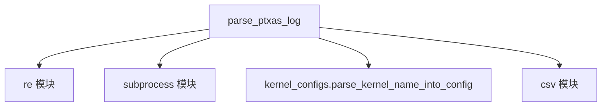

# PTX日志解析机制

<cite>
**本文引用的文件**
- [tools/build/parse_ptx_build.py](file://tools/build/parse_ptx_build.py)
- [py/flash_helpers/kernel_configs.py](file://py/flash_helpers/kernel_configs.py)
</cite>

## 目录
1. [引言](#引言)
2. [项目结构](#项目结构)
3. [核心组件](#核心组件)
4. [架构总览](#架构总览)
5. [详细组件分析](#详细组件分析)
6. [依赖关系分析](#依赖关系分析)
7. [性能考量](#性能考量)
8. [故障排查指南](#故障排查指南)
9. [结论](#结论)

## 引言
本文件聚焦于工具模块 tools/build/parse_ptx_build.py 中的 parse_ptxas_log 函数，系统性解析其如何从 ptxas 编译器日志中提取关键性能指标。文档将详细说明四个正则表达式模式如何匹配“入口函数编译开始”、“堆栈帧大小与溢出存储/加载”、“寄存器与屏障使用”以及“编译耗时”，并阐释函数状态机设计（current_func 字典的构建与重置）、多行日志条目关联策略，以及对缺失数据（如 compile_time）的容错处理。最后通过实际日志样例演示完整解析流程。

## 项目结构
该功能位于 tools/build/parse_ptx_build.py，负责解析 ptxas 输出日志，提取与内核编译相关的性能与资源使用信息；py/flash_helpers/kernel_configs.py 提供将解析到的函数名转换为可读配置短形式的能力，用于后续统计或输出展示。

图表来源
- [tools/build/parse_ptx_build.py](file://tools/build/parse_ptx_build.py#L31-L141)
- [py/flash_helpers/kernel_configs.py](file://py/flash_helpers/kernel_configs.py#L323-L336)

章节来源
- [tools/build/parse_ptx_build.py](file://tools/build/parse_ptx_build.py#L31-L141)
- [py/flash_helpers/kernel_configs.py](file://py/flash_helpers/kernel_configs.py#L323-L336)

## 核心组件
- 正则表达式集合
  - re_compile_func：匹配“Compiling entry function '...' for 'sm_XX'"，抽取函数名与架构代号。
  - re_stack_spill：匹配“N bytes stack frame, M bytes spill stores, P bytes spill loads”，抽取堆栈帧与溢出存储/加载字节数。
  - re_used_line：匹配“Used U registers, used V barriers, [Z bytes cumulative stack size,] W bytes cmem[0]”，抽取寄存器数、屏障数、可选累计堆栈大小与 cmem[0] 大小。
  - re_compile_time：匹配“Compile time = T ms”，抽取编译耗时毫秒数。
- 状态机与上下文
  - current_func：当前正在解析的函数上下文字典，包含上述字段的暂存值。
  - functions_info：最终结果列表，每个元素为一个函数的完整信息字典。
- 辅助能力
  - demangle_function_name：尝试使用 cu++filt 对 C++ 符号进行反混淆，失败回退为原始名称。
  - print_functions_info：以人类可读方式打印函数信息。
  - write_csv_output：将函数信息写入 CSV，对 None 值进行 0 填充以便统计。

章节来源
- [tools/build/parse_ptx_build.py](file://tools/build/parse_ptx_build.py#L31-L141)
- [tools/build/parse_ptx_build.py](file://tools/build/parse_ptx_build.py#L144-L221)

## 架构总览
parse_ptxas_log 的工作流采用“逐行扫描 + 状态机”的设计：遇到函数起始行即开启新上下文；随后在上下文中按顺序匹配堆栈/溢出、寄存器/屏障、编译耗时等行；当遇到新的函数起始行或文件结束时，根据是否具备 compile_time 决定是否落盘当前上下文。

图表来源
- [tools/build/parse_ptx_build.py](file://tools/build/parse_ptx_build.py#L69-L139)

## 详细组件分析

### 正则表达式与匹配逻辑
- re_compile_func
  - 作用：识别“入口函数编译开始”行，抽取函数名与架构代号。
  - 设计要点：允许行首存在任意文本（如时间戳），使用命名捕获组提取函数名与架构数字。
  - 影响：触发新函数上下文的创建与旧上下文的落盘/清理。
- re_stack_spill
  - 作用：识别堆栈帧与溢出存储/加载字节信息。
  - 设计要点：三个数值分别对应堆栈帧、溢出存储、溢出加载；均为整数。
  - 影响：填充 current_func 的 stack_frame、spill_stores、spill_loads。
- re_used_line
  - 作用：识别寄存器使用、屏障使用、可选累计堆栈大小与 cmem[0]。
  - 设计要点：累计堆栈部分可选，使用非捕获分组与可选捕获组组合；其余为必选。
  - 影响：填充 used_registers、used_barriers、cumulative_stack（None 表示缺失）、cmem0。
- re_compile_time
  - 作用：识别编译耗时行。
  - 设计要点：匹配“Compile time = T ms”，数值支持小数。
  - 影响：填充 compile_time，随后落盘并重置 current_func。

章节来源
- [tools/build/parse_ptx_build.py](file://tools/build/parse_ptx_build.py#L42-L59)
- [tools/build/parse_ptx_build.py](file://tools/build/parse_ptx_build.py#L69-L139)

### 函数状态机与上下文管理
- current_func 的构建
  - 初始化字段：函数名（原始/反混淆）、架构、堆栈/溢出、寄存器/屏障、累计堆栈、cmem[0]、编译耗时。
  - 仅在 re_compile_func 命中时创建新上下文；若旧上下文尚未填充 compile_time，则先行落盘。
- 落盘与重置
  - re_compile_time 命中后，将 current_func 追加至 functions_info，并清空 current_func。
  - 文件结束时，若 current_func 仍未填充 compile_time，也会落盘（保留 None 字段）。
- 多行日志关联
  - 通过 current_func 将同一函数的多行日志条目聚合在一起，形成一个完整的函数记录。

图表来源
- [tools/build/parse_ptx_build.py](file://tools/build/parse_ptx_build.py#L69-L139)

章节来源
- [tools/build/parse_ptx_build.py](file://tools/build/parse_ptx_build.py#L69-L139)

### 容错与缺失数据处理
- compile_time 缺失
  - 在 re_compile_time 未命中时，current_func 会保留 None；文件结束时若仍无 compile_time，也会落盘。
  - CSV 导出阶段对 None 值进行 0 填充，避免统计错误。
- cumulative_stack 缺失
  - re_used_line 中该字段为可选，未出现时 current_func 对应键保持 None。
- cmem0 缺失
  - 若日志行不包含 cmem[0] 字段，该字段保持 None；CSV 导出时同样以 0 填充。
- 函数名反混淆
  - 使用 cu++filt 尝试反混淆；失败则回退为原始符号，保证解析不中断。

章节来源
- [tools/build/parse_ptx_build.py](file://tools/build/parse_ptx_build.py#L110-L139)
- [tools/build/parse_ptx_build.py](file://tools/build/parse_ptx_build.py#L173-L221)

### 实际日志样例解析流程
以下为基于函数注释与正则匹配的典型日志片段解析步骤（不直接粘贴具体日志内容）：
1) 遇到“入口函数”行：解析出函数名与架构，创建 current_func。
2) 继续读取：若出现“堆栈/溢出”行，则填充 stack_frame、spill_stores、spill_loads。
3) 继续读取：若出现“寄存器/屏障/cmem”行，则填充 used_registers、used_barriers、cumulative_stack（可选）、cmem0。
4) 继续读取：若出现“编译耗时”行，则填充 compile_time，落盘 current_func 并重置。
5) 若文件结束且最后一个函数未出现“编译耗时”，仍将其落盘（保留 None）。
6) 最终输出：print_functions_info 或 write_csv_output 对结果进行格式化展示或导出。

章节来源
- [tools/build/parse_ptx_build.py](file://tools/build/parse_ptx_build.py#L31-L141)
- [tools/build/parse_ptx_build.py](file://tools/build/parse_ptx_build.py#L144-L221)

## 依赖关系分析
- parse_ptxas_log 依赖正则模块 re 与 subprocess（用于函数名反混淆）。
- 输出阶段依赖 kernel_configs 模块，将函数名转换为可读配置短形式，便于统计与对比。
- CSV 导出阶段对 None 值进行 0 填充，确保数值列可直接参与统计。

图表来源
- [tools/build/parse_ptx_build.py](file://tools/build/parse_ptx_build.py#L31-L141)
- [tools/build/parse_ptx_build.py](file://tools/build/parse_ptx_build.py#L173-L221)
- [py/flash_helpers/kernel_configs.py](file://py/flash_helpers/kernel_configs.py#L323-L336)

章节来源
- [tools/build/parse_ptx_build.py](file://tools/build/parse_ptx_build.py#L31-L141)
- [tools/build/parse_ptx_build.py](file://tools/build/parse_ptx_build.py#L173-L221)
- [py/flash_helpers/kernel_configs.py](file://py/flash_helpers/kernel_configs.py#L323-L336)

## 性能考量
- 时间复杂度：O(N)，其中 N 为日志行数，逐行扫描一次。
- 空间复杂度：O(M)，M 为函数数量，保存 functions_info 列表。
- 正则匹配：使用预编译正则，避免重复编译开销。
- I/O：单次顺序读取文件，内存占用低，适合大日志文件处理。

## 故障排查指南
- 无法找到入口函数行
  - 检查日志是否包含“Compiling entry function ... for sm_XX”格式；若缺失，current_func 将始终为 None，导致所有后续行被忽略。
- 未出现编译耗时行
  - parse_ptxas_log 会在文件结束时仍落盘最后一个函数（compile_time 可能为 None）；CSV 导出会将其填 0。
- 寄存器/屏障/cmem 行缺失
  - re_used_line 为可选字段，缺失时对应键保持 None；CSV 导出会填 0。
- 函数名反混淆失败
  - cu++filt 不可用时会回退为原始符号；不影响解析流程。
- CSV 导出列不完整
  - write_csv_output 忽略 cumulative_stack、cmem0、architecture、compile_time 字段，仅输出与注册表使用相关的列。

章节来源
- [tools/build/parse_ptx_build.py](file://tools/build/parse_ptx_build.py#L69-L139)
- [tools/build/parse_ptx_build.py](file://tools/build/parse_ptx_build.py#L173-L221)

## 结论
parse_ptxas_log 通过一组精心设计的正则表达式与简洁的状态机，实现了对 ptxas 日志的稳健解析。它能够准确提取入口函数、堆栈/溢出、寄存器/屏障与编译耗时等关键指标，并对缺失数据提供明确的容错策略。配合 kernel_configs 的函数名解析，可进一步生成可读性强的配置短形式，便于后续统计与对比分析。