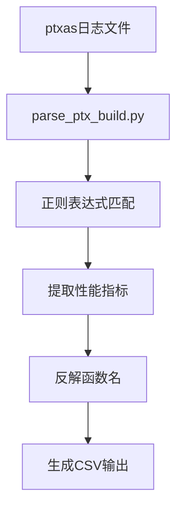
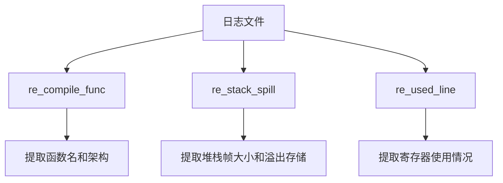
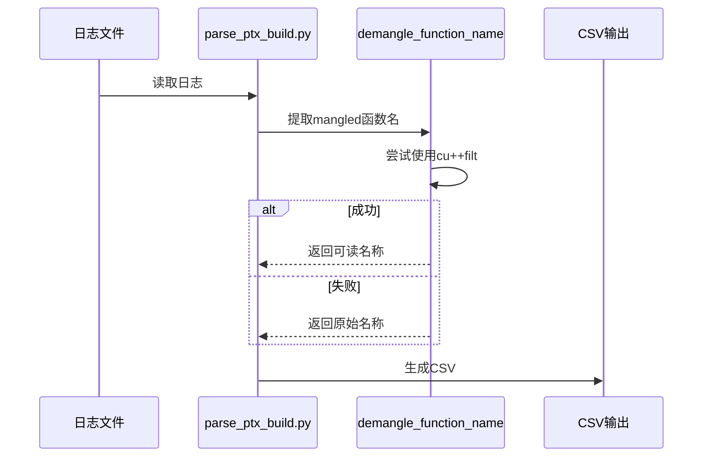
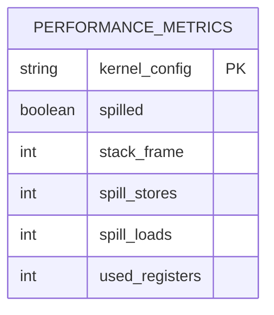
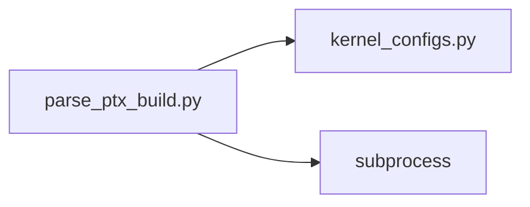

# PTX构建分析

<cite>
**本文档中引用的文件**  
- [parse_ptx_build.py](file://tools/build/parse_ptx_build.py)
- [kernel_configs.py](file://py/flash_helpers/kernel_configs.py)
- [pip_install_with_logs.sh](file://tools/build/pip_install_with_logs.sh)
- [setup.py](file://setup.py)
</cite>

## 目录
1. [简介](#简介)
2. [项目结构](#项目结构)
3. [核心组件](#核心组件)
4. [架构概述](#架构概述)
5. [详细组件分析](#详细组件分析)
6. [依赖分析](#依赖分析)
7. [性能考量](#性能考量)
8. [故障排除指南](#故障排除指南)
9. [结论](#结论)

## 简介
`parse_ptx_build.py` 是一个用于解析 `ptxas` 编译器日志并提取关键性能指标的工具。该工具在构建过程中起着至关重要的作用，通过分析编译日志，提取寄存器使用情况、堆栈帧大小、溢出存储等信息，并将 mangled 函数名反解为可读的内核配置标识。这些信息对于内核优化和性能瓶颈诊断至关重要。

## 项目结构
项目结构清晰，主要分为以下几个部分：
- `flash_attention/`：包含主要的 Python 包。
- `previous_kernels/`：包含之前版本的内核实现。
- `py/`：包含辅助工具和测试代码。
- `src/`：包含 CUDA 源代码。
- `tools/`：包含各种构建和分析工具。

## 核心组件
`parse_ptx_build.py` 是本项目的核心组件之一，负责解析 `ptxas` 编译器日志并提取关键性能指标。

**Section sources**
- [parse_ptx_build.py](file://tools/build/parse_ptx_build.py#L1-L250)

## 架构概述
`parse_ptx_build.py` 的工作流程如下：
1. 读取 `ptxas` 编译器日志文件。
2. 使用正则表达式匹配日志中的关键信息，如“Compiling entry function”、寄存器使用、堆栈帧大小、溢出存储等。
3. 将 mangled 函数名反解为可读的内核配置标识。
4. 将提取的信息输出为 CSV 格式，便于后续分析。

**Diagram sources**
- [parse_ptx_build.py](file://tools/build/parse_ptx_build.py#L31-L250)

## 详细组件分析

### parse_ptx_build.py 分析
`parse_ptx_build.py` 的主要功能是解析 `ptxas` 编译器日志并提取关键性能指标。以下是其主要功能的详细分析。

#### 正则表达式匹配
`parse_ptx_build.py` 使用多个正则表达式来匹配日志中的关键信息。例如，`re_compile_func` 用于匹配“Compiling entry function”行，`re_stack_spill` 用于匹配堆栈帧大小和溢出存储信息，`re_used_line` 用于匹配寄存器使用情况。

**Diagram sources**
- [parse_ptx_build.py](file://tools/build/parse_ptx_build.py#L43-L58)

#### 函数名反解
`parse_ptx_build.py` 使用 `demangle_function_name` 函数将 mangled 函数名反解为可读的内核配置标识。该函数首先尝试使用 `cu++filt` 工具，如果失败则返回原始的 mangled 名称。

**Diagram sources**
- [parse_ptx_build.py](file://tools/build/parse_ptx_build.py#L11-L28)

#### CSV输出格式
`parse_ptx_build.py` 将提取的信息输出为 CSV 格式，便于后续分析。CSV 文件包含以下字段：`kernel_config`、`spilled`、`stack_frame`、`spill_stores`、`spill_loads`、`used_registers`。

**Diagram sources**
- [parse_ptx_build.py](file://tools/build/parse_ptx_build.py#L173-L221)

## 依赖分析
`parse_ptx_build.py` 依赖于 `flash_helpers.kernel_configs` 模块来解析内核配置。此外，它还依赖于 `subprocess` 模块来调用 `cu++filt` 工具。

**Diagram sources**
- [parse_ptx_build.py](file://tools/build/parse_ptx_build.py#L8)
- [parse_ptx_build.py](file://tools/build/parse_ptx_build.py#L5)

## 性能考量
`parse_ptx_build.py` 通过提取寄存器使用情况、堆栈帧大小、溢出存储等信息，为内核优化提供数据支持。这些信息可以帮助开发者识别性能瓶颈，优化内核配置。

## 故障排除指南
如果 `parse_ptx_build.py` 无法正确解析日志文件，可以检查以下几点：
- 确保日志文件格式正确。
- 确保 `cu++filt` 工具已安装并可用。
- 检查正则表达式是否匹配日志中的关键信息。

**Section sources**
- [parse_ptx_build.py](file://tools/build/parse_ptx_build.py#L11-L28)

## 结论
`parse_ptx_build.py` 是一个强大的工具，能够解析 `ptxas` 编译器日志并提取关键性能指标。通过反解 mangled 函数名和生成 CSV 输出，它为内核优化和性能瓶颈诊断提供了重要的数据支持。