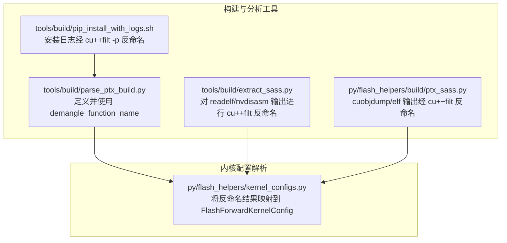
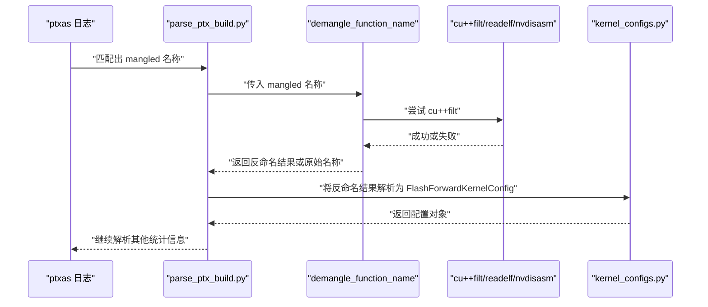
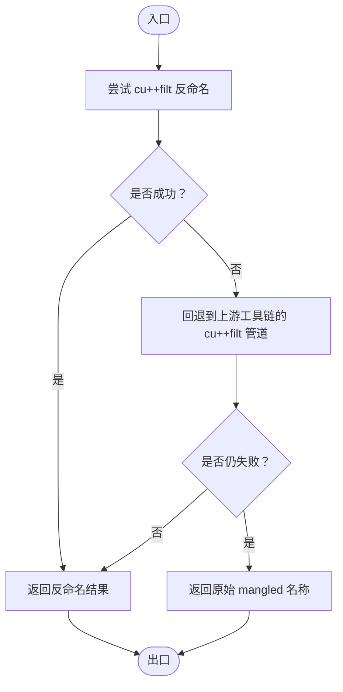
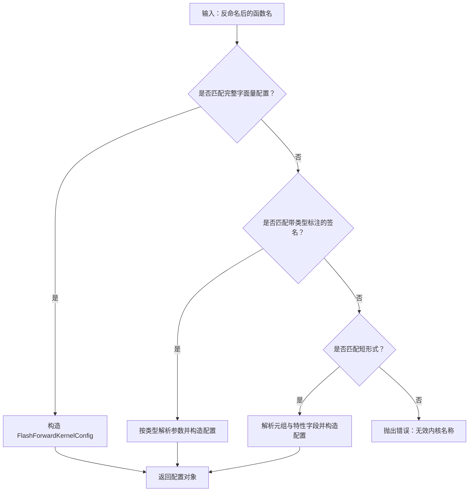
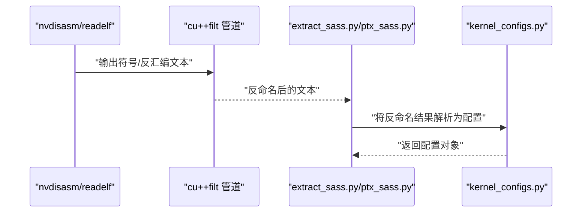
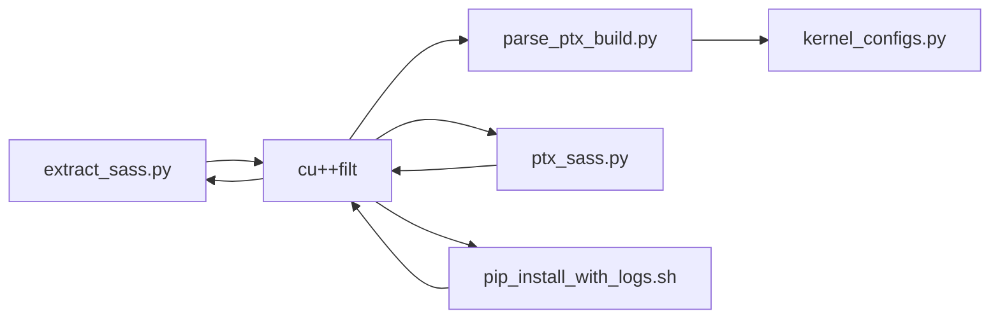

# 函数名反命名机制

<cite>
**本文引用的文件**
- [tools/build/parse_ptx_build.py](file://tools/build/parse_ptx_build.py)
- [py/flash_helpers/kernel_configs.py](file://py/flash_helpers/kernel_configs.py)
- [tools/build/extract_sass.py](file://tools/build/extract_sass.py)
- [py/flash_helpers/build/ptx_sass.py](file://py/flash_helpers/build/ptx_sass.py)
- [tools/build/pip_install_with_logs.sh](file://tools/build/pip_install_with_logs.sh)
</cite>

## 目录
1. [引言](#引言)
2. [项目结构](#项目结构)
3. [核心组件](#核心组件)
4. [架构总览](#架构总览)
5. [详细组件分析](#详细组件分析)
6. [依赖关系分析](#依赖关系分析)
7. [性能考量](#性能考量)
8. [故障排查指南](#故障排查指南)
9. [结论](#结论)

## 引言
本文件围绕 demangle_function_name 函数的“多重回退机制”展开，系统性说明其在不同 CUDA 开发环境中的适配策略：优先调用 cu++filt 工具，其次尝试通过管道将 readelf/nvdisasm 输出交给 cu++filt 处理，最后在所有外部工具不可用时返回原始 mangled 名称。文档还结合实际 mangled 名称示例（如以特定前缀开头的符号），解释反命名后如何与 FlashForwardKernelConfig 数据结构进行映射，并总结 subprocess 调用的安全性与异常处理实践。

## 项目结构
本仓库包含构建与调试工具、内核配置解析以及 CUDA 反命名相关脚本。与 demangle_function_name 直接相关的核心位置如下：
- tools/build/parse_ptx_build.py：定义并使用 demangle_function_name 的主流程，用于解析 ptxas 日志中的函数名。
- py/flash_helpers/kernel_configs.py：提供将反命名后的函数名解析为 FlashForwardKernelConfig 的多种策略。
- tools/build/extract_sass.py：在提取 SASS/PTX 时，对 readelf/nvdisasm 的输出统一通过 cu++filt 进行反命名。
- py/flash_helpers/build/ptx_sass.py：在 cuobjdump/elf 输出中直接调用 cu++filt 进行反命名。
- tools/build/pip_install_with_logs.sh：在安装日志中使用 cu++filt -p 对输出进行反命名处理。

图表来源
- [tools/build/parse_ptx_build.py](file://tools/build/parse_ptx_build.py#L11-L28)
- [tools/build/extract_sass.py](file://tools/build/extract_sass.py#L100-L170)
- [py/flash_helpers/build/ptx_sass.py](file://py/flash_helpers/build/ptx_sass.py#L99-L110)
- [tools/build/pip_install_with_logs.sh](file://tools/build/pip_install_with_logs.sh#L25-L31)
- [py/flash_helpers/kernel_configs.py](file://py/flash_helpers/kernel_configs.py#L323-L336)

章节来源
- [tools/build/parse_ptx_build.py](file://tools/build/parse_ptx_build.py#L11-L28)
- [py/flash_helpers/kernel_configs.py](file://py/flash_helpers/kernel_configs.py#L323-L336)
- [tools/build/extract_sass.py](file://tools/build/extract_sass.py#L100-L170)
- [py/flash_helpers/build/ptx_sass.py](file://py/flash_helpers/build/ptx_sass.py#L99-L110)
- [tools/build/pip_install_with_logs.sh](file://tools/build/pip_install_with_logs.sh#L25-L31)

## 核心组件
- demangle_function_name：实现“优先 cu++filt、其次回退、最后保留原始名称”的三段式策略。
- FlashForwardKernelConfig：描述内核配置的数据结构，支持从多种格式的反命名字符串中解析。
- 构建与分析脚本：在多个环节对 CUDA 工具链输出进行反命名，确保后续解析稳定可靠。

章节来源
- [tools/build/parse_ptx_build.py](file://tools/build/parse_ptx_build.py#L11-L28)
- [py/flash_helpers/kernel_configs.py](file://py/flash_helpers/kernel_configs.py#L106-L175)
- [tools/build/extract_sass.py](file://tools/build/extract_sass.py#L100-L170)
- [py/flash_helpers/build/ptx_sass.py](file://py/flash_helpers/build/ptx_sass.py#L99-L110)

## 架构总览
下图展示了 demangle_function_name 在不同工具链中的调用路径与回退策略，以及反命名结果如何进入内核配置解析流程。

图表来源
- [tools/build/parse_ptx_build.py](file://tools/build/parse_ptx_build.py#L76-L91)
- [tools/build/parse_ptx_build.py](file://tools/build/parse_ptx_build.py#L11-L28)
- [py/flash_helpers/kernel_configs.py](file://py/flash_helpers/kernel_configs.py#L323-L336)

## 详细组件分析

### 组件A：demangle_function_name 的多重回退机制
- 优先策略：直接调用 cu++filt，若成功则返回反命名结果；若失败（抛出 CalledProcessError 或 FileNotFoundError），则进入下一步。
- 回退策略：在 readelf/nvdisasm 等工具的输出管道中统一通过 cu++filt 进行反命名，确保即使外部工具不可用，也能在上游阶段完成反命名。
- 兼容性策略：若所有外部工具均不可用，则返回原始 mangled 名称，保证流程不中断。

图表来源
- [tools/build/parse_ptx_build.py](file://tools/build/parse_ptx_build.py#L11-L28)
- [tools/build/extract_sass.py](file://tools/build/extract_sass.py#L100-L170)
- [py/flash_helpers/build/ptx_sass.py](file://py/flash_helpers/build/ptx_sass.py#L99-L110)

章节来源
- [tools/build/parse_ptx_build.py](file://tools/build/parse_ptx_build.py#L11-L28)
- [tools/build/extract_sass.py](file://tools/build/extract_sass.py#L100-L170)
- [py/flash_helpers/build/ptx_sass.py](file://py/flash_helpers/build/ptx_sass.py#L99-L110)

### 组件B：反命名后的函数名与 FlashForwardKernelConfig 映射
- 解析策略顺序：
  1) 尝试匹配包含 FlashForwardKernelConfig 字面量的完整签名；
  2) 尝试带类型标注的签名（如包含类型前缀）；
  3) 尝试短形式（例如以“(FP16, 128, 64, 64, 4): ...”开头的简写）。
- 若三种策略均失败，则抛出错误，提示无效的内核名称。

图表来源
- [py/flash_helpers/kernel_configs.py](file://py/flash_helpers/kernel_configs.py#L177-L215)
- [py/flash_helpers/kernel_configs.py](file://py/flash_helpers/kernel_configs.py#L217-L249)
- [py/flash_helpers/kernel_configs.py](file://py/flash_helpers/kernel_configs.py#L251-L321)
- [py/flash_helpers/kernel_configs.py](file://py/flash_helpers/kernel_configs.py#L323-L336)

章节来源
- [py/flash_helpers/kernel_configs.py](file://py/flash_helpers/kernel_configs.py#L177-L215)
- [py/flash_helpers/kernel_configs.py](file://py/flash_helpers/kernel_configs.py#L217-L249)
- [py/flash_helpers/kernel_configs.py](file://py/flash_helpers/kernel_configs.py#L251-L321)
- [py/flash_helpers/kernel_configs.py](file://py/flash_helpers/kernel_configs.py#L323-L336)

### 组件C：CUDA 工具链中的反命名一致性
- extract_sass.py：在 nvdisasm 与 readelf 的输出上统一追加 cu++filt 管道，确保符号表与反汇编输出的可读性一致。
- ptx_sass.py：在 cuobjdump 的 ELF 输出上使用 cu++filt -p 进行反命名，便于后续 PTX/SASS 映射。
- pip_install_with_logs.sh：在安装日志中使用 cu++filt -p 进行反命名，再交由 parse_ptx_build.py 进行统计解析。

图表来源
- [tools/build/extract_sass.py](file://tools/build/extract_sass.py#L100-L170)
- [py/flash_helpers/build/ptx_sass.py](file://py/flash_helpers/build/ptx_sass.py#L99-L110)
- [tools/build/pip_install_with_logs.sh](file://tools/build/pip_install_with_logs.sh#L25-L31)
- [py/flash_helpers/kernel_configs.py](file://py/flash_helpers/kernel_configs.py#L323-L336)

章节来源
- [tools/build/extract_sass.py](file://tools/build/extract_sass.py#L100-L170)
- [py/flash_helpers/build/ptx_sass.py](file://py/flash_helpers/build/ptx_sass.py#L99-L110)
- [tools/build/pip_install_with_logs.sh](file://tools/build/pip_install_with_logs.sh#L25-L31)
- [py/flash_helpers/kernel_configs.py](file://py/flash_helpers/kernel_configs.py#L323-L336)

## 依赖关系分析
- parse_ptx_build.py 依赖 kernel_configs.py 将反命名后的名称解析为配置对象。
- extract_sass.py 与 ptx_sass.py 通过 subprocess 调用 cu++filt，确保符号可读性。
- pip_install_with_logs.sh 在安装日志层面也采用 cu++filt -p，形成端到端的一致性。

图表来源
- [tools/build/parse_ptx_build.py](file://tools/build/parse_ptx_build.py#L76-L91)
- [py/flash_helpers/kernel_configs.py](file://py/flash_helpers/kernel_configs.py#L323-L336)
- [tools/build/extract_sass.py](file://tools/build/extract_sass.py#L100-L170)
- [py/flash_helpers/build/ptx_sass.py](file://py/flash_helpers/build/ptx_sass.py#L99-L110)
- [tools/build/pip_install_with_logs.sh](file://tools/build/pip_install_with_logs.sh#L25-L31)

章节来源
- [tools/build/parse_ptx_build.py](file://tools/build/parse_ptx_build.py#L76-L91)
- [py/flash_helpers/kernel_configs.py](file://py/flash_helpers/kernel_configs.py#L323-L336)
- [tools/build/extract_sass.py](file://tools/build/extract_sass.py#L100-L170)
- [py/flash_helpers/build/ptx_sass.py](file://py/flash_helpers/build/ptx_sass.py#L99-L110)
- [tools/build/pip_install_with_logs.sh](file://tools/build/pip_install_with_logs.sh#L25-L31)

## 性能考量
- 多重回退避免了因外部工具缺失导致的流程中断，提升整体鲁棒性。
- 在工具链输出上统一使用 cu++filt，减少重复反命名成本，提高后续解析效率。
- 对于大规模日志与符号表，建议在调用外部工具时尽量复用已有的反命名结果，避免二次处理。

## 故障排查指南
- 外部工具缺失：检查 CUDA 工具链是否安装并加入 PATH（如 cuobjdump、nvdisasm、readelf、cu++filt）。工具检查逻辑会列出缺失项并提示安装。
- subprocess 异常：
  - CalledProcessError：通常表示外部命令执行失败，需检查命令参数与输入文件路径。
  - FileNotFoundError：表示工具未找到，确认 PATH 配置与工具版本。
- 安装日志反命名：若安装过程中出现大量 mangled 名称，可在日志中使用 cu++filt -p 进行反命名后再行分析。

章节来源
- [tools/build/extract_sass.py](file://tools/build/extract_sass.py#L183-L204)
- [tools/build/extract_sass.py](file://tools/build/extract_sass.py#L290-L318)
- [tools/build/extract_sass.py](file://tools/build/extract_sass.py#L377-L414)
- [tools/build/pip_install_with_logs.sh](file://tools/build/pip_install_with_logs.sh#L25-L31)

## 结论
demangle_function_name 的多重回退机制通过“优先 cu++filt、其次工具链管道反命名、最后保留原始名称”的策略，在不同 CUDA 开发环境下实现了高适应性与强健性。配合 kernel_configs.py 的多策略解析，能够将反命名后的函数名稳定地映射到 FlashForwardKernelConfig，支撑后续的统计解析与配置生成。同时，各工具脚本在调用外部工具时遵循一致的异常处理与日志输出规范，确保了整体流程的可靠性与可维护性。