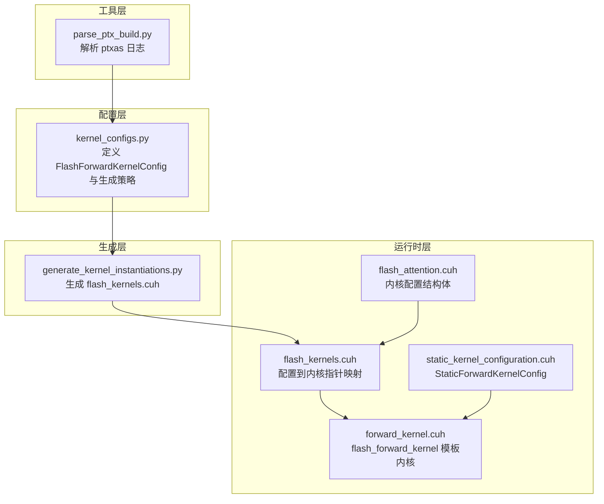
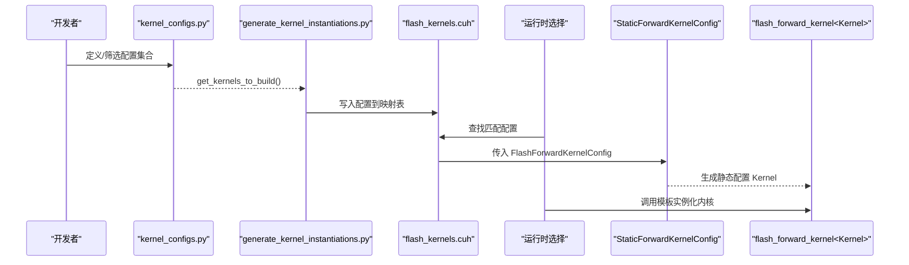
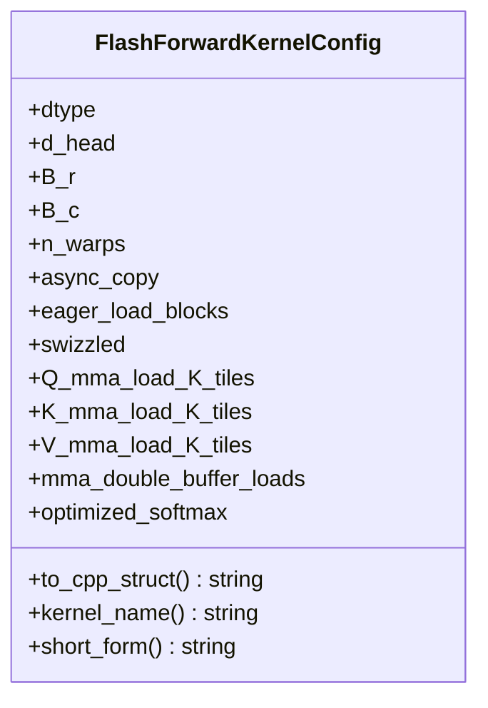
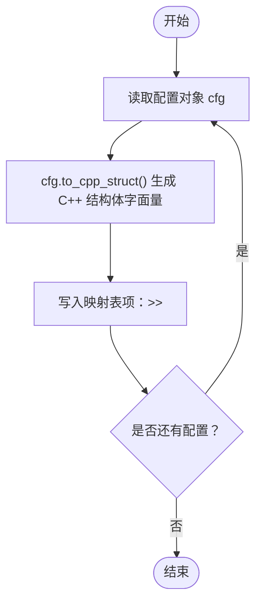
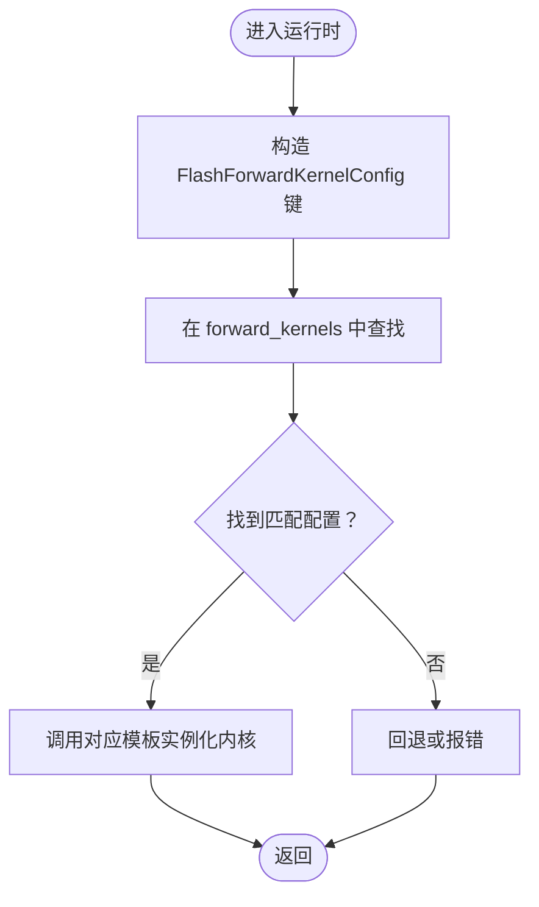
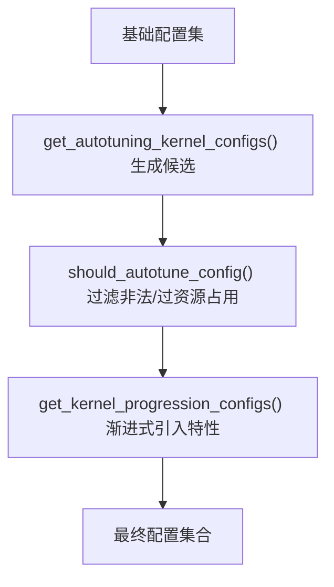
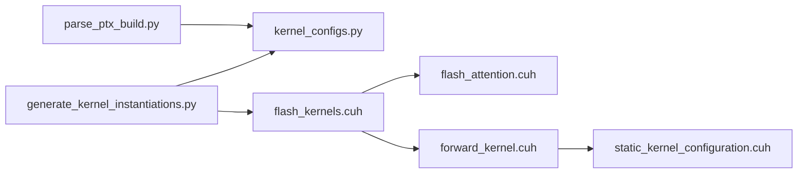

# 内核实例化生成

<cite>
**本文引用的文件**
- [generate_kernel_instantiations.py](file://tools/build/generate_kernel_instantiations.py)
- [kernel_configs.py](file://py/flash_helpers/kernel_configs.py)
- [flash_kernels.cuh](file://src/include/flash_kernels.cuh)
- [flash_attention.cuh](file://src/include/flash_attention.cuh)
- [forward_kernel.cuh](file://src/include/forward_kernel.cuh)
- [static_kernel_configuration.cuh](file://src/include/static_kernel_configuration.cuh)
- [parse_ptx_build.py](file://tools/build/parse_ptx_build.py)
</cite>

## 目录
1. [简介](#简介)
2. [项目结构](#项目结构)
3. [核心组件](#核心组件)
4. [架构总览](#架构总览)
5. [详细组件分析](#详细组件分析)
6. [依赖关系分析](#依赖关系分析)
7. [性能考量](#性能考量)
8. [故障排查指南](#故障排查指南)
9. [结论](#结论)
10. [附录](#附录)

## 简介
本文件系统性阐述 generate_kernel_instantiations.py 如何基于内核配置自动生成 CUDA 内核实例化代码，重点覆盖以下方面：
- 如何从 kernel_configs.py 中读取 FlashForwardKernelConfig 配置；
- 如何动态生成 flash_kernels.cuh 中的函数指针映射表；
- 配置对象到 C++ 结构体的转换过程；
- 模板实例化语法的生成逻辑；
- 支持 16 个优化版本的迭代开发；
- 运行时根据硬件架构与参数选择最优内核；
- 配置过滤策略、编译时间与运行效率的权衡；
- 新增自定义配置的扩展方法。

## 项目结构
该仓库采用“配置驱动 + 自动化生成”的方式组织内核实例化流程：
- 配置层：在 Python 中定义 FlashForwardKernelConfig 及其生成策略（自动调优、进度推进等）；
- 生成层：通过 generate_kernel_instantiations.py 将配置集合写入 C++ 头文件；
- 运行时层：在 C++ 中以 map 映射配置到具体模板实例化内核入口；
- 工具层：parse_ptx_build.py 解析编译日志，辅助评估不同配置的寄存器/栈帧/编译时间等指标。

图表来源
- [generate_kernel_instantiations.py](file://tools/build/generate_kernel_instantiations.py#L1-L56)
- [kernel_configs.py](file://py/flash_helpers/kernel_configs.py#L106-L175)
- [flash_kernels.cuh](file://src/include/flash_kernels.cuh#L1-L187)
- [flash_attention.cuh](file://src/include/flash_attention.cuh#L30-L110)
- [forward_kernel.cuh](file://src/include/forward_kernel.cuh#L85-L200)
- [static_kernel_configuration.cuh](file://src/include/static_kernel_configuration.cuh#L104-L200)
- [parse_ptx_build.py](file://tools/build/parse_ptx_build.py#L1-L200)

章节来源
- [generate_kernel_instantiations.py](file://tools/build/generate_kernel_instantiations.py#L1-L56)
- [kernel_configs.py](file://py/flash_helpers/kernel_configs.py#L364-L486)

## 核心组件
- FlashForwardKernelConfig：描述一次内核实例化的完整配置，包括数据类型、块大小、线程束数、异步拷贝、预加载、Swizzle、各张量的 K 片段加载数、双缓冲、优化 Softmax 等。
- 生成器 generate_kernel_instantiations.py：将配置集合写入 flash_kernels.cuh，形成“配置 -> 内核函数指针”的映射。
- 运行时映射 flash_kernels.cuh：以 std::map<FlashForwardKernelConfig, 函数指针> 的形式存储，键为配置，值为对应模板实例化后的内核入口。
- 模板内核 forward_kernel.cuh：定义 flash_forward_kernel<Kernel>(...) 模板，其中 Kernel 由 StaticForwardKernelConfig<CFG> 提供静态配置。
- 静态配置 static_kernel_configuration.cuh：将 FlashForwardKernelConfig 转换为编译期常量，决定 Tile 形状、加载策略、寄存器/共享内存布局等。

章节来源
- [flash_attention.cuh](file://src/include/flash_attention.cuh#L30-L110)
- [flash_kernels.cuh](file://src/include/flash_kernels.cuh#L1-L187)
- [forward_kernel.cuh](file://src/include/forward_kernel.cuh#L85-L200)
- [static_kernel_configuration.cuh](file://src/include/static_kernel_configuration.cuh#L104-L200)

## 架构总览
下图展示了从配置到实例化内核的端到端流程，以及运行时选择路径。

图表来源
- [generate_kernel_instantiations.py](file://tools/build/generate_kernel_instantiations.py#L13-L56)
- [kernel_configs.py](file://py/flash_helpers/kernel_configs.py#L457-L486)
- [flash_kernels.cuh](file://src/include/flash_kernels.cuh#L1-L187)
- [static_kernel_configuration.cuh](file://src/include/static_kernel_configuration.cuh#L104-L200)
- [forward_kernel.cuh](file://src/include/forward_kernel.cuh#L85-L200)

## 详细组件分析

### 组件A：配置对象到 C++ 结构体的转换
- FlashForwardKernelConfig 字段到 C++ 结构体的映射：
  - 数据类型：通过枚举映射到 torch::ScalarType；
  - 块大小与线程束数：直接映射为整型常量；
  - 布尔标志：async_copy、eager_load_blocks、swizzled、mma_double_buffer_loads、optimized_softmax；
  - 加载片段数：Q/K/V 的 K 片段加载数；
  - 其他：d_head、B_r、B_c 等。
- 转换方法 to_cpp_struct() 会将上述字段序列化为 C++ 结构体字面量，供模板实例化使用。

图表来源
- [kernel_configs.py](file://py/flash_helpers/kernel_configs.py#L106-L175)

章节来源
- [kernel_configs.py](file://py/flash_helpers/kernel_configs.py#L148-L164)

### 组件B：模板实例化语法的生成逻辑
- 生成器将每个配置写入 flash_kernels.cuh，格式为：
  - 键：FlashForwardKernelConfig{...}
  - 值：&flash_forward_kernel<StaticForwardKernelConfig<FlashForwardKernelConfig{...}>>
- 该语法确保在编译期完成内核模板参数绑定，运行时只需按配置查找即可调用。

图表来源
- [generate_kernel_instantiations.py](file://tools/build/generate_kernel_instantiations.py#L34-L50)

章节来源
- [generate_kernel_instantiations.py](file://tools/build/generate_kernel_instantiations.py#L13-L56)

### 组件C：运行时选择最优内核
- 运行时通过 std::map<FlashForwardKernelConfig, 函数指针> 查找匹配配置；
- FlashForwardKernelConfig 实现了 operator<，用于 map 的有序存储与比较；
- 选择策略可结合硬件能力（如 SMEM 限制、寄存器上限）与算子规模（B_r/B_c/d_head）进行启发式筛选。

图表来源
- [flash_kernels.cuh](file://src/include/flash_kernels.cuh#L1-L187)
- [flash_attention.cuh](file://src/include/flash_attention.cuh#L67-L109)

章节来源
- [flash_kernels.cuh](file://src/include/flash_kernels.cuh#L1-L187)
- [flash_attention.cuh](file://src/include/flash_attention.cuh#L30-L110)

### 组件D：配置过滤策略与 16 个优化版本迭代
- 自动调优策略 get_autotuning_kernel_configs() 生成候选配置集合；
- 过滤规则 should_autotune_config() 排除不合法或过度占用寄存器/共享内存的组合；
- 进度推进策略 get_kernel_progression_configs() 逐步引入特性（如异步拷贝、预加载、Swizzle、加载片段数、双缓冲、优化 Softmax），形成 16 个优化版本的演进路径。

图表来源
- [kernel_configs.py](file://py/flash_helpers/kernel_configs.py#L389-L424)
- [kernel_configs.py](file://py/flash_helpers/kernel_configs.py#L364-L388)
- [kernel_configs.py](file://py/flash_helpers/kernel_configs.py#L426-L455)

章节来源
- [kernel_configs.py](file://py/flash_helpers/kernel_configs.py#L364-L486)

### 组件E：编译时间与运行效率的权衡
- 编译时间：模板实例化数量越多，编译时间越长；可通过环境变量控制生成集合（如 prog/all/tune）；
- 运行效率：不同配置在不同硬件/规模上表现差异显著；通过 parse_ptx_build.py 分析寄存器、栈帧、溢出、编译时长等指标，指导选择更优配置；
- 资源约束：StaticForwardKernelConfig 对加载片段数、双缓冲等进行断言，避免超限导致编译失败或运行时崩溃。

章节来源
- [parse_ptx_build.py](file://tools/build/parse_ptx_build.py#L1-L200)
- [static_kernel_configuration.cuh](file://src/include/static_kernel_configuration.cuh#L13-L35)

### 组件F：新增自定义配置的扩展方法
- 在 Python 层新增配置：在 kernel_configs.py 中扩展参数空间或添加新的组合策略；
- 生成新映射：运行 generate_kernel_instantiations.py 重新生成 flash_kernels.cuh；
- 运行时验证：确保新配置满足 StaticForwardKernelConfig 的断言条件；
- 性能评估：使用 parse_ptx_build.py 分析新配置的寄存器/溢出/编译时长等指标。

章节来源
- [kernel_configs.py](file://py/flash_helpers/kernel_configs.py#L364-L486)
- [generate_kernel_instantiations.py](file://tools/build/generate_kernel_instantiations.py#L13-L56)
- [parse_ptx_build.py](file://tools/build/parse_ptx_build.py#L144-L200)

## 依赖关系分析
- generate_kernel_instantiations.py 依赖 kernel_configs.py 提供配置集合；
- flash_kernels.cuh 依赖 flash_attention.cuh（配置结构体）、forward_kernel.cuh（内核模板）；
- forward_kernel.cuh 依赖 static_kernel_configuration.cuh（静态配置）；
- parse_ptx_build.py 依赖 kernel_configs.py 的解析工具，将编译日志映射回配置短名。

图表来源
- [generate_kernel_instantiations.py](file://tools/build/generate_kernel_instantiations.py#L1-L56)
- [kernel_configs.py](file://py/flash_helpers/kernel_configs.py#L106-L175)
- [flash_kernels.cuh](file://src/include/flash_kernels.cuh#L1-L187)
- [flash_attention.cuh](file://src/include/flash_attention.cuh#L30-L110)
- [forward_kernel.cuh](file://src/include/forward_kernel.cuh#L85-L200)
- [static_kernel_configuration.cuh](file://src/include/static_kernel_configuration.cuh#L104-L200)
- [parse_ptx_build.py](file://tools/build/parse_ptx_build.py#L1-L200)

章节来源
- [generate_kernel_instantiations.py](file://tools/build/generate_kernel_instantiations.py#L1-L56)
- [kernel_configs.py](file://py/flash_helpers/kernel_configs.py#L106-L175)
- [flash_kernels.cuh](file://src/include/flash_kernels.cuh#L1-L187)
- [forward_kernel.cuh](file://src/include/forward_kernel.cuh#L85-L200)
- [static_kernel_configuration.cuh](file://src/include/static_kernel_configuration.cuh#L104-L200)
- [parse_ptx_build.py](file://tools/build/parse_ptx_build.py#L1-L200)

## 性能考量
- 模板实例化数量与编译时间成正比，建议按需生成（如仅生成进度推进或自动调优集合）；
- 不同配置在不同硬件架构上的寄存器/共享内存占用差异较大，应结合 parse_ptx_build.py 的输出进行筛选；
- 通过 should_autotune_config() 控制配置合法性，避免超资源占用导致编译失败；
- 运行时选择策略可结合 FlashForwardKernelConfig 的比较顺序与硬件资源限制，提高命中率与吞吐。

## 故障排查指南
- 生成失败：检查 generate_kernel_instantiations.py 是否正确导入 kernel_configs.py，确认输出路径存在；
- 运行时找不到内核：确认配置键与生成映射一致，且 FlashForwardKernelConfig 的比较顺序未改变；
- 编译失败：查看 parse_ptx_build.py 输出的寄存器/溢出/编译时长，调整配置（如减少加载片段数、关闭双缓冲、降低 B_r/B_c）；
- 断言失败：检查 StaticForwardKernelConfig 的断言条件，确保 Q/K/V 的加载片段数与 d_head/B_c 匹配。

章节来源
- [generate_kernel_instantiations.py](file://tools/build/generate_kernel_instantiations.py#L13-L56)
- [parse_ptx_build.py](file://tools/build/parse_ptx_build.py#L144-L200)
- [static_kernel_configuration.cuh](file://src/include/static_kernel_configuration.cuh#L13-L35)

## 结论
generate_kernel_instantiations.py 通过“配置驱动 + 自动化生成”的方式，将 Python 层的 FlashForwardKernelConfig 配置集合转化为 C++ 的模板实例化映射，实现了：
- 16 个优化版本的渐进式迭代与可控生成；
- 运行时按配置快速选择最优内核；
- 与工具链（parse_ptx_build.py）协同，平衡编译时间与运行效率；
- 易于扩展自定义配置，满足多样化的硬件与规模需求。

## 附录
- 关键实现路径参考：
  - 配置对象到 C++ 结构体转换：[kernel_configs.py](file://py/flash_helpers/kernel_configs.py#L148-L164)
  - 生成映射表：[generate_kernel_instantiations.py](file://tools/build/generate_kernel_instantiations.py#L34-L50)
  - 运行时映射与模板实例化：[flash_kernels.cuh](file://src/include/flash_kernels.cuh#L1-L187)
  - 内核模板与静态配置：[forward_kernel.cuh](file://src/include/forward_kernel.cuh#L85-L200)、[static_kernel_configuration.cuh](file://src/include/static_kernel_configuration.cuh#L104-L200)
  - 配置过滤与生成策略：[kernel_configs.py](file://py/flash_helpers/kernel_configs.py#L364-L486)
  - 编译日志解析与评估：[parse_ptx_build.py](file://tools/build/parse_ptx_build.py#L1-L200)