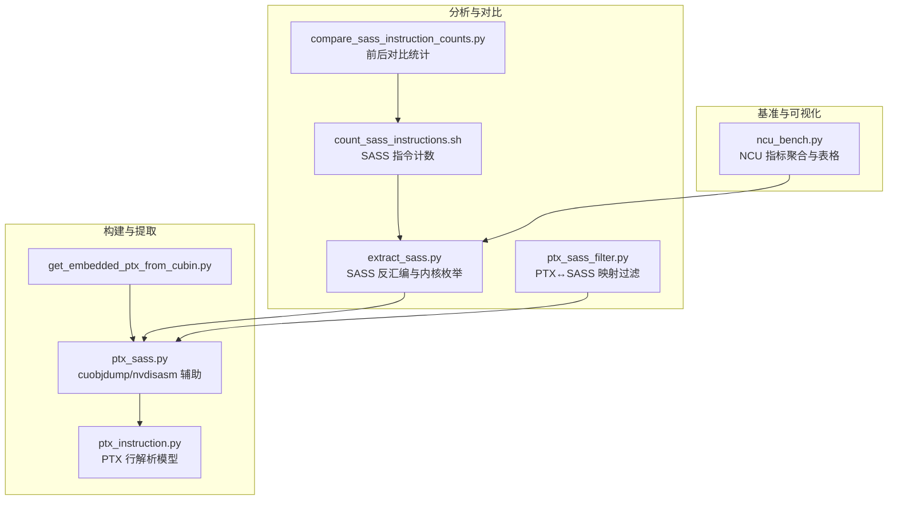
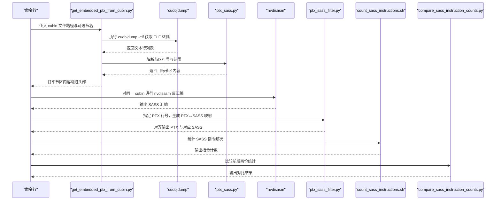
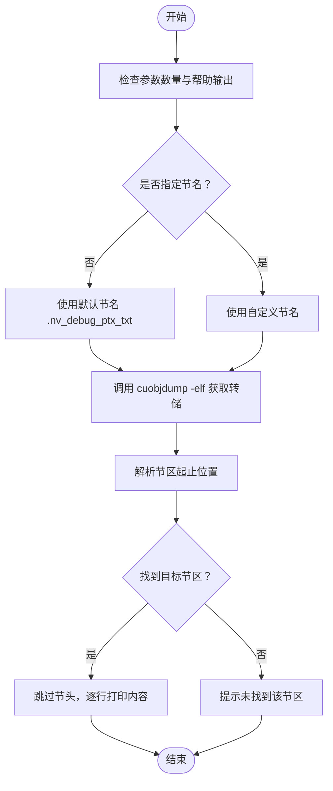
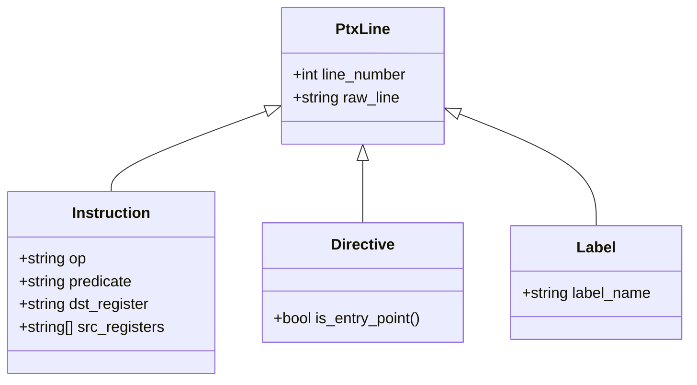
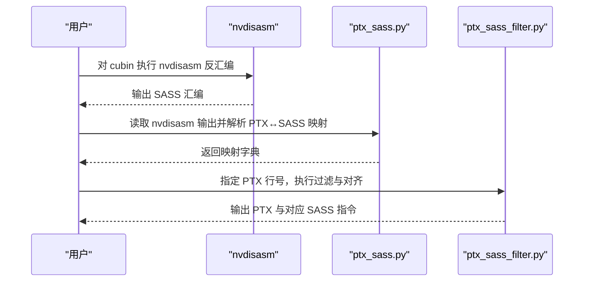
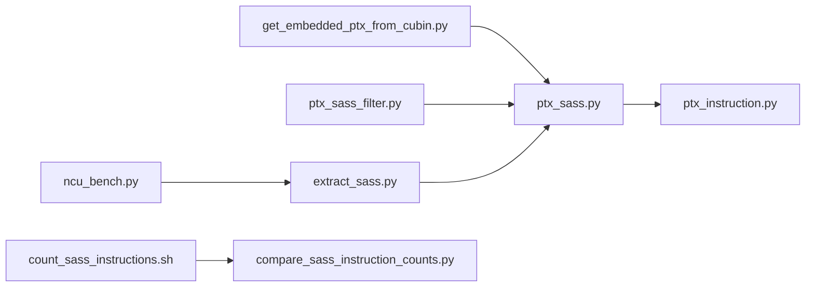

# 嵌入式PTX提取

<cite>
**本文引用的文件**
- [get_embedded_ptx_from_cubin.py](file://tools/build/get_embedded_ptx_from_cubin.py)
- [ptx_sass.py](file://py/flash_helpers/build/ptx_sass.py)
- [ptx_instruction.py](file://py/flash_helpers/build/ptx_instruction.py)
- [extract_sass.py](file://tools/build/extract_sass.py)
- [ptx_sass_filter.py](file://tools/analysis/ptx_sass_filter.py)
- [count_sass_instructions.sh](file://tools/analysis/count_sass_instructions.sh)
- [compare_sass_instruction_counts.py](file://tools/analysis/compare_sass_instruction_counts.py)
- [ncu_bench.py](file://tools/benchmark/ncu_bench.py)
- [README.md](file://README.md)
</cite>

## 目录
1. [简介](#简介)
2. [项目结构](#项目结构)
3. [核心组件](#核心组件)
4. [架构总览](#架构总览)
5. [详细组件分析](#详细组件分析)
6. [依赖关系分析](#依赖关系分析)
7. [性能考量](#性能考量)
8. [故障排查指南](#故障排查指南)
9. [结论](#结论)
10. [附录](#附录)

## 简介
本技术文档围绕工具脚本 get_embedded_ptx_from_cubin.py 展开，系统性说明其如何从编译产物 cubin 中提取嵌入的 PTX（Parallel Thread Execution）代码。该脚本通过调用 cuobjdump 工具获取 ELF 格式的转储输出，再利用内部解析函数定位并提取特定节区（如 .nv_debug_ptx_txt），从而为汇编级性能分析提供基础数据。文档还阐述了该工具在验证编译器优化效果、对比不同版本 PTX 指令差异等场景中的关键作用，并给出使用示例与与 SASS 反汇编工具协同工作的流程建议。

## 项目结构
该工具位于 tools/build 目录下，核心逻辑由 py/flash_helpers/build/ptx_sass.py 提供，包含 cuobjdump 调用、节区解析与 PTX 行解析等能力；同时，与 SASS 分析相关的工具分布在 tools/build、tools/analysis 和 tools/benchmark 下，形成“提取 PTX → 反汇编 SASS → 统计与对比”的完整链路。

图表来源
- [get_embedded_ptx_from_cubin.py](file://tools/build/get_embedded_ptx_from_cubin.py#L1-L38)
- [ptx_sass.py](file://py/flash_helpers/build/ptx_sass.py#L1-L165)
- [ptx_instruction.py](file://py/flash_helpers/build/ptx_instruction.py#L72-L91)
- [extract_sass.py](file://tools/build/extract_sass.py#L1-L200)
- [ptx_sass_filter.py](file://tools/analysis/ptx_sass_filter.py#L1-L121)
- [count_sass_instructions.sh](file://tools/analysis/count_sass_instructions.sh#L1-L10)
- [compare_sass_instruction_counts.py](file://tools/analysis/compare_sass_instruction_counts.py#L1-L181)
- [ncu_bench.py](file://tools/benchmark/ncu_bench.py#L1-L200)

章节来源
- [README.md](file://README.md#L1-L63)

## 核心组件
- get_embedded_ptx_from_cubin.py：命令行入口，负责参数解析、默认节区选择、调用 cuobjdump 获取 ELF 输出、解析并打印目标节区内容。
- ptx_sass.py：提供 cuobjdump 调用、节区定位与大小计算、PTX 行解析、nvdisasm 调用等辅助能力。
- ptx_instruction.py：定义 PTX 行的抽象模型（指令、指令标签、指令谓词、寄存器等），用于后续 PTX/SASS 映射与过滤。
- extract_sass.py：SASS 反汇编主流程，支持按内核索引生成 CFG 或汇编输出，以及错误诊断与工具可用性检查。
- ptx_sass_filter.py：基于 PTX 行号，向上游回溯相关指令并结合 nvdisasm 的 PTX↔SASS 映射进行筛选与对齐输出。
- count_sass_instructions.sh：对 SASS 输出进行指令计数统计。
- compare_sass_instruction_counts.py：比较两份统计结果，输出绝对/相对变化。
- ncu_bench.py：读取 NCU CSV 指标并聚合展示，便于宏观性能对比。

章节来源
- [get_embedded_ptx_from_cubin.py](file://tools/build/get_embedded_ptx_from_cubin.py#L1-L38)
- [ptx_sass.py](file://py/flash_helpers/build/ptx_sass.py#L1-L165)
- [ptx_instruction.py](file://py/flash_helpers/build/ptx_instruction.py#L72-L91)
- [extract_sass.py](file://tools/build/extract_sass.py#L1-L200)
- [ptx_sass_filter.py](file://tools/analysis/ptx_sass_filter.py#L1-L121)
- [count_sass_instructions.sh](file://tools/analysis/count_sass_instructions.sh#L1-L10)
- [compare_sass_instruction_counts.py](file://tools/analysis/compare_sass_instruction_counts.py#L1-L181)
- [ncu_bench.py](file://tools/benchmark/ncu_bench.py#L1-L200)

## 架构总览
下图展示了从 cubin 到 PTX 内容提取的端到端流程，以及与 SASS 反汇编、统计与对比工具的协作关系。

图表来源
- [get_embedded_ptx_from_cubin.py](file://tools/build/get_embedded_ptx_from_cubin.py#L1-L38)
- [ptx_sass.py](file://py/flash_helpers/build/ptx_sass.py#L66-L130)
- [ptx_sass_filter.py](file://tools/analysis/ptx_sass_filter.py#L40-L121)
- [count_sass_instructions.sh](file://tools/analysis/count_sass_instructions.sh#L1-L10)
- [compare_sass_instruction_counts.py](file://tools/analysis/compare_sass_instruction_counts.py#L1-L181)

## 详细组件分析

### 组件A：从 cubin 提取嵌入 PTX 的主流程
- 功能要点
  - 参数校验与帮助信息输出。
  - 默认节区名 .nv_debug_ptx_txt，支持自定义节名。
  - 调用 cuobjdump 获取 ELF 转储，必要时通过 cu++filt 去符号化。
  - 使用节区解析函数定位目标节区，跳过节头后逐行打印。
- 关键实现路径
  - 入口与参数处理：[get_embedded_ptx_from_cubin.py](file://tools/build/get_embedded_ptx_from_cubin.py#L10-L34)
  - cuobjdump 调用与去符号化：[ptx_sass.py](file://py/flash_helpers/build/ptx_sass.py#L99-L111)
  - 节区定位与截取：[ptx_sass.py](file://py/flash_helpers/build/ptx_sass.py#L69-L96)

图表来源
- [get_embedded_ptx_from_cubin.py](file://tools/build/get_embedded_ptx_from_cubin.py#L10-L34)
- [ptx_sass.py](file://py/flash_helpers/build/ptx_sass.py#L69-L111)

章节来源
- [get_embedded_ptx_from_cubin.py](file://tools/build/get_embedded_ptx_from_cubin.py#L1-L38)
- [ptx_sass.py](file://py/flash_helpers/build/ptx_sass.py#L66-L111)

### 组件B：节区解析与 PTX 行解析
- 节区解析
  - 通过查找以 .section 开头的行确定所有节区边界，进而计算目标节区的起止索引并返回该区间内的所有行。
  - 支持计算节区大小（行数）以便快速定位。
- PTX 行解析
  - 将 PTX 文本行解析为统一的数据结构，区分指令、指令标签、指令指令等类型，便于后续映射与过滤。
- 关键实现路径
  - 节区定位与截取：[ptx_sass.py](file://py/flash_helpers/build/ptx_sass.py#L69-L96)
  - 计算节区大小：[ptx_sass.py](file://py/flash_helpers/build/ptx_sass.py#L73-L82)
  - PTX 行解析模型与分发：[ptx_instruction.py](file://py/flash_helpers/build/ptx_instruction.py#L72-L91)

图表来源
- [ptx_instruction.py](file://py/flash_helpers/build/ptx_instruction.py#L72-L91)

章节来源
- [ptx_sass.py](file://py/flash_helpers/build/ptx_sass.py#L66-L96)
- [ptx_instruction.py](file://py/flash_helpers/build/ptx_instruction.py#L72-L91)

### 组件C：与 SASS 反汇编工具的协同
- SASS 反汇编
  - 通过 nvdisasm 对 cubin 进行控制流图或汇编输出，支持去除偏移、按函数名过滤等选项。
  - 提供工具可用性检查与错误诊断，便于定位 cuobjdump/nvdisasm/readelf/cu++filt 缺失问题。
- PTX↔SASS 映射与过滤
  - 从 nvdisasm 输出中解析出 PTX 行号与对应 SASS 指令的映射，支持以某 PTX 行为中心向上游回溯相关指令并进行对齐输出。
- 关键实现路径
  - nvdisasm 调用与输出处理：[ptx_sass.py](file://py/flash_helpers/build/ptx_sass.py#L123-L130)
  - PTX↔SASS 映射解析：[ptx_sass.py](file://py/flash_helpers/build/ptx_sass.py#L22-L63)
  - 过滤与对齐输出：[ptx_sass_filter.py](file://tools/analysis/ptx_sass_filter.py#L1-L121)
  - SASS 反汇编主流程与诊断：[extract_sass.py](file://tools/build/extract_sass.py#L1-L200)

图表来源
- [ptx_sass.py](file://py/flash_helpers/build/ptx_sass.py#L22-L63)
- [ptx_sass_filter.py](file://tools/analysis/ptx_sass_filter.py#L40-L121)

章节来源
- [ptx_sass.py](file://py/flash_helpers/build/ptx_sass.py#L22-L63)
- [ptx_sass_filter.py](file://tools/analysis/ptx_sass_filter.py#L1-L121)
- [extract_sass.py](file://tools/build/extract_sass.py#L1-L200)

### 组件D：指令计数与对比
- 指令计数
  - 通过正则匹配 SASS 输出中的指令助记符，统计出现频次并排序。
- 前后对比
  - 读取两份计数文件，计算绝对/相对变化，输出 Markdown 表格。
- 关键实现路径
  - SASS 指令计数脚本：[count_sass_instructions.sh](file://tools/analysis/count_sass_instructions.sh#L1-L10)
  - 对比统计脚本：[compare_sass_instruction_counts.py](file://tools/analysis/compare_sass_instruction_counts.py#L1-L181)

章节来源
- [count_sass_instructions.sh](file://tools/analysis/count_sass_instructions.sh#L1-L10)
- [compare_sass_instruction_counts.py](file://tools/analysis/compare_sass_instruction_counts.py#L1-L181)

## 依赖关系分析
- get_embedded_ptx_from_cubin.py 依赖 ptx_sass.py 的 cuobjdump 调用与节区解析能力。
- ptx_sass.py 依赖 ptx_instruction.py 的 PTX 行解析模型。
- ptx_sass_filter.py 依赖 ptx_sass.py 的 PTX↔SASS 映射解析与 PTX 行解析。
- extract_sass.py 与 ptx_sass.py 协同，共同支撑 SASS 反汇编与内核枚举。
- count_sass_instructions.sh 与 compare_sass_instruction_counts.py 形成“统计→对比”的分析闭环。
- ncu_bench.py 提供宏观指标聚合，与上述微观分析工具互补。

图表来源
- [get_embedded_ptx_from_cubin.py](file://tools/build/get_embedded_ptx_from_cubin.py#L1-L38)
- [ptx_sass.py](file://py/flash_helpers/build/ptx_sass.py#L1-L165)
- [ptx_instruction.py](file://py/flash_helpers/build/ptx_instruction.py#L72-L91)
- [ptx_sass_filter.py](file://tools/analysis/ptx_sass_filter.py#L1-L121)
- [extract_sass.py](file://tools/build/extract_sass.py#L1-L200)
- [count_sass_instructions.sh](file://tools/analysis/count_sass_instructions.sh#L1-L10)
- [compare_sass_instruction_counts.py](file://tools/analysis/compare_sass_instruction_counts.py#L1-L181)
- [ncu_bench.py](file://tools/benchmark/ncu_bench.py#L1-L200)

章节来源
- [get_embedded_ptx_from_cubin.py](file://tools/build/get_embedded_ptx_from_cubin.py#L1-L38)
- [ptx_sass.py](file://py/flash_helpers/build/ptx_sass.py#L1-L165)
- [ptx_instruction.py](file://py/flash_helpers/build/ptx_instruction.py#L72-L91)
- [ptx_sass_filter.py](file://tools/analysis/ptx_sass_filter.py#L1-L121)
- [extract_sass.py](file://tools/build/extract_sass.py#L1-L200)
- [count_sass_instructions.sh](file://tools/analysis/count_sass_instructions.sh#L1-L10)
- [compare_sass_instruction_counts.py](file://tools/analysis/compare_sass_instruction_counts.py#L1-L181)
- [ncu_bench.py](file://tools/benchmark/ncu_bench.py#L1-L200)

## 性能考量
- cuobjdump/nvdisasm 调用开销
  - 大型 cubin 的 ELF 转储与 SASS 反汇编可能耗时较长，建议在 CI 或批处理环境中运行，并缓存中间产物。
- 节区解析复杂度
  - 节区定位采用线性扫描，时间复杂度 O(N)，其中 N 为转储行数；通常足够高效。
- 过滤与映射
  - PTX↔SASS 映射解析与过滤过程为线性遍历，建议仅对需要的行号执行过滤，避免全量扫描。
- 工具链可用性
  - 若缺少 cuobjdump、nvdisasm、readelf、cu++filt 等工具，将导致流程中断；建议在环境初始化阶段进行检测并提示安装。

[本节为通用性能讨论，不直接分析具体文件]

## 故障排查指南
- cuobjdump 失败或无 cubin
  - 当输入为 .so 文件且未找到 cubin 时，会尝试列出所有嵌入文件并提示指定 cubin 名称；若仍失败，建议手动运行 cuobjdump -lelf 并检查文件类型。
- 工具缺失
  - 工具可用性检查会报告缺失工具清单，需先安装相应 CUDA 工具链。
- 节区不存在
  - 若指定的节名不存在，脚本会明确提示；请确认节名正确或使用默认节名 .nv_debug_ptx_txt。
- SASS 反汇编输出异常
  - 可通过 nvdisasm 的 -cfg/-c 选项与 -fun 指定内核索引进行调试；必要时去除偏移以提升可读性。

章节来源
- [extract_sass.py](file://tools/build/extract_sass.py#L289-L397)
- [ptx_sass.py](file://py/flash_helpers/build/ptx_sass.py#L183-L200)
- [get_embedded_ptx_from_cubin.py](file://tools/build/get_embedded_ptx_from_cubin.py#L22-L34)

## 结论
get_embedded_ptx_from_cubin.py 通过 cuobjdump 与节区解析，实现了从 cubin 中稳定提取嵌入 PTX 的能力；配合 nvdisasm、PTX↔SASS 映射与统计对比工具，可形成完整的汇编级性能分析链路。该工具在验证编译器优化效果、对比不同版本 PTX 指令差异等方面具有重要价值，建议在持续集成与回归测试中作为常规分析步骤使用。

[本节为总结性内容，不直接分析具体文件]

## 附录

### 使用示例
- 基础用法
  - 提取默认节区 .nv_debug_ptx_txt：
    - python tools/build/get_embedded_ptx_from_cubin.py <cubin 文件路径>
- 高级用法：指定自定义节区名称
  - python tools/build/get_embedded_ptx_from_cubin.py <cubin 文件路径> <节区名称>
- 与 SASS 反汇编协同
  - 先对同一 cubin 运行 nvdisasm 生成 SASS 输出，再使用 ptx_sass_filter.py 指定 PTX 行号进行映射与对齐输出。
- 指令计数与对比
  - 使用 tools/analysis/count_sass_instructions.sh 统计 SASS 指令频次，再用 compare_sass_instruction_counts.py 比较前后两份统计结果。

章节来源
- [get_embedded_ptx_from_cubin.py](file://tools/build/get_embedded_ptx_from_cubin.py#L10-L34)
- [ptx_sass_filter.py](file://tools/analysis/ptx_sass_filter.py#L40-L121)
- [count_sass_instructions.sh](file://tools/analysis/count_sass_instructions.sh#L1-L10)
- [compare_sass_instruction_counts.py](file://tools/analysis/compare_sass_instruction_counts.py#L139-L181)