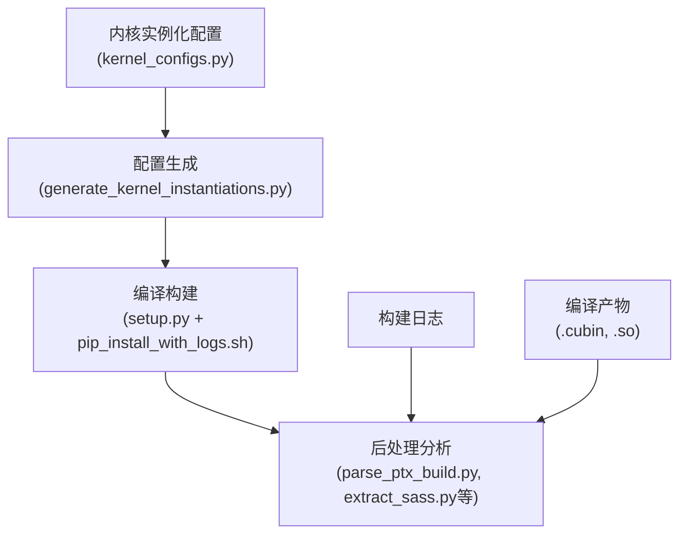
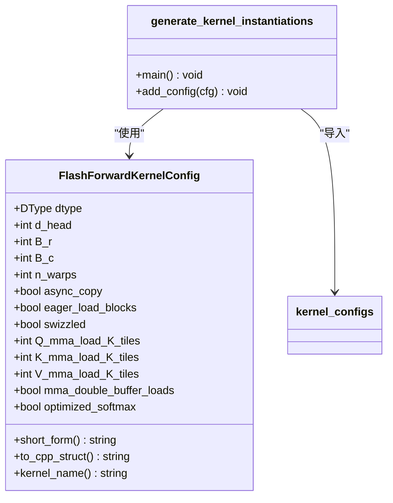
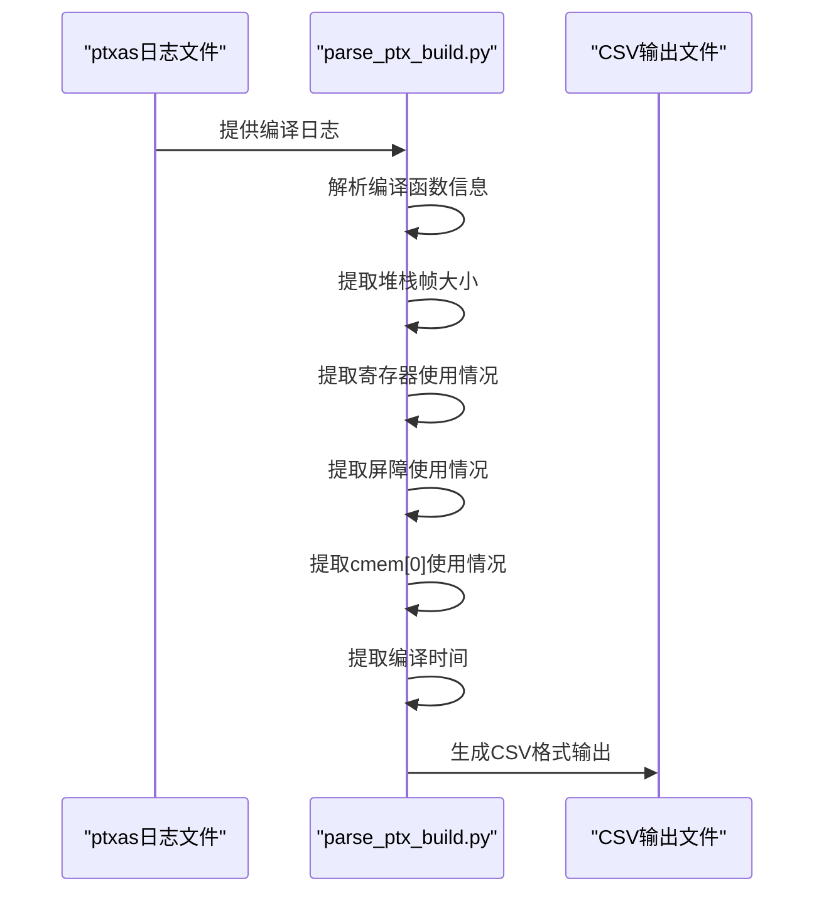
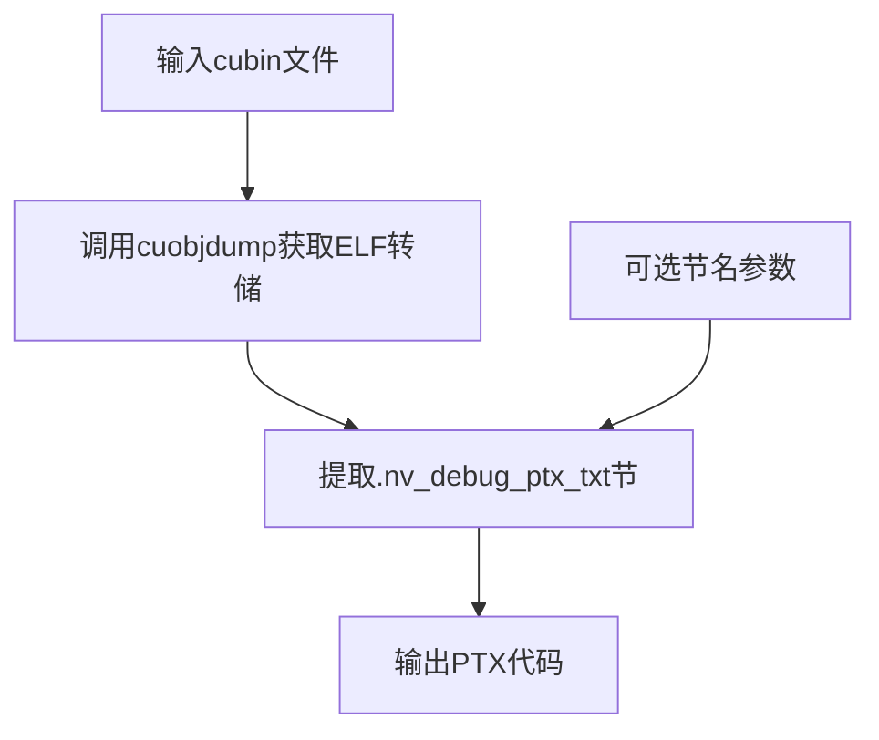
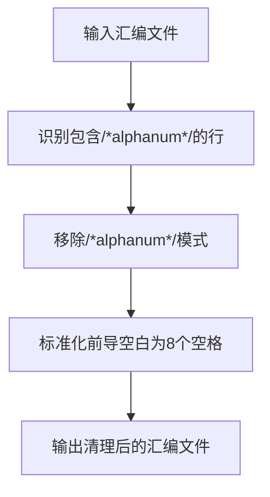
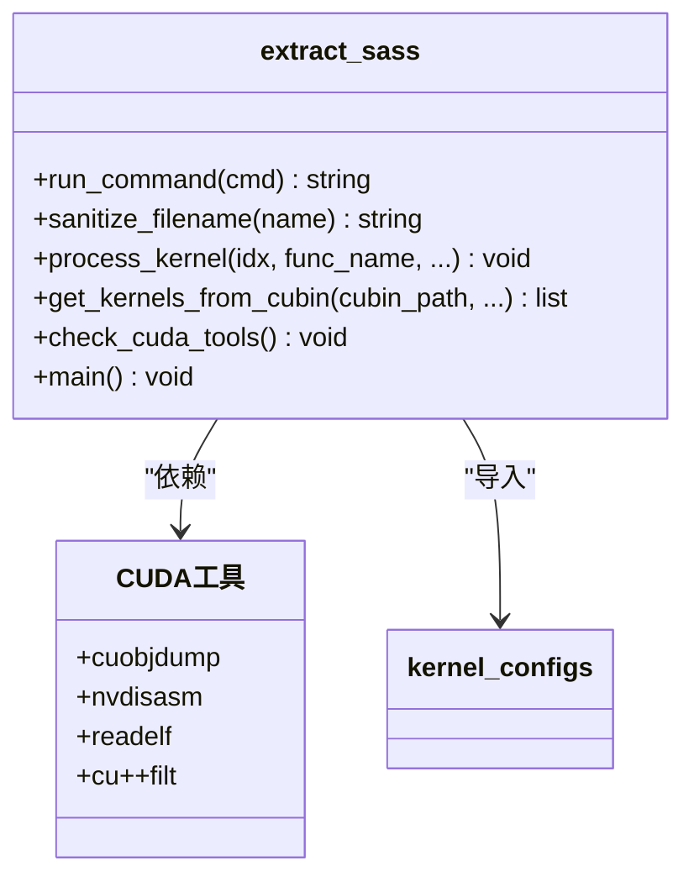
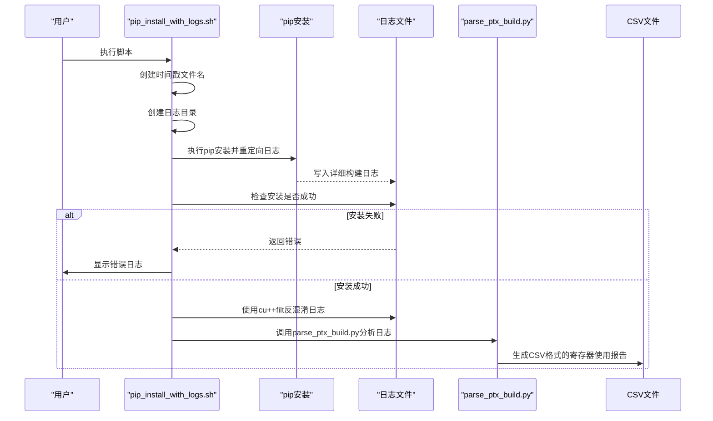
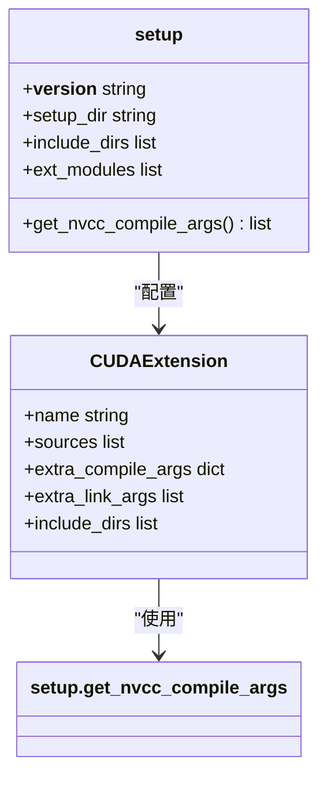
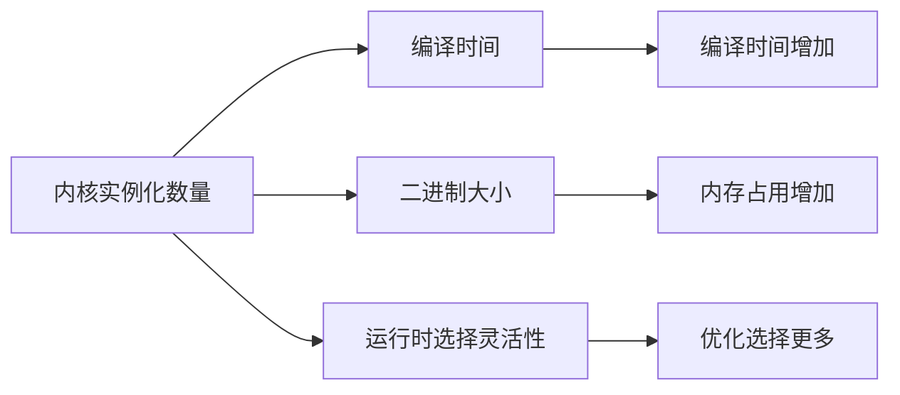

# 构建系统

<cite>
**本文档中引用的文件**   
- [generate_kernel_instantiations.py](file://tools/build/generate_kernel_instantiations.py)
- [parse_ptx_build.py](file://tools/build/parse_ptx_build.py)
- [get_embedded_ptx_from_cubin.py](file://tools/build/get_embedded_ptx_from_cubin.py)
- [clean_asm.sh](file://tools/build/clean_asm.sh)
- [extract_sass.py](file://tools/build/extract_sass.py)
- [pip_install_with_logs.sh](file://tools/build/pip_install_with_logs.sh)
- [setup.py](file://setup.py)
- [kernel_configs.py](file://py/flash_helpers/kernel_configs.py)
- [ptx_sass.py](file://py/flash_helpers/build/ptx_sass.py)
- [ptx_instruction.py](file://py/flash_helpers/build/ptx_instruction.py)
</cite>

## 目录
1. [简介](#简介)
2. [构建流程概述](#构建流程概述)
3. [内核实例化生成](#内核实例化生成)
4. [PTX解析与构建验证](#ptx解析与构建验证)
5. [嵌入式PTX提取](#嵌入式ptx提取)
6. [汇编级性能分析](#汇编级性能分析)
7. [带日志的安装](#带日志的安装)
8. [Python扩展编译](#python扩展编译)
9. [常见构建问题](#常见构建问题)
10. [性能优化考量](#性能优化考量)

## 简介
本项目构建系统围绕Flash Attention内核的优化和分析而设计，提供了一套完整的自动化工具链。该系统通过在tools/build/目录下的多个脚本实现，支持从内核实例化生成、PTX解析、SASS提取到性能分析的完整流程。构建系统的核心目标是为开发者提供一个可重复、可验证且可调试的环境，以支持对CUDA内核的持续优化。

**构建系统的主要特点包括：**
- 自动化生成内核实例化代码
- 详细的PTX和SASS级分析能力
- 完整的构建日志记录和错误排查机制
- 支持多种构建配置和自定义选项
- 集成化的性能分析工具

## 构建流程概述
项目的构建流程始于setup.py文件，该文件定义了Python扩展的编译配置。构建过程通过一系列工具脚本协调，形成一个完整的自动化流水线。整个流程可以分为三个主要阶段：配置生成、编译构建和后处理分析。



**流程说明：**
1. **配置生成阶段**：根据预定义的内核配置生成具体的内核实例化代码
2. **编译构建阶段**：使用PyTorch的CUDA扩展机制编译CUDA代码
3. **后处理分析阶段**：对编译产物进行深入分析，提取性能关键指标

**Diagram sources**
- [generate_kernel_instantiations.py](file://tools/build/generate_kernel_instantiations.py#L1-L57)
- [setup.py](file://setup.py#L1-L76)
- [pip_install_with_logs.sh](file://tools/build/pip_install_with_logs.sh#L1-L31)

**Section sources**
- [generate_kernel_instantiations.py](file://tools/build/generate_kernel_instantiations.py#L1-L57)
- [setup.py](file://setup.py#L1-L76)

## 内核实例化生成
`generate_kernel_instantiations.py`脚本负责根据配置生成CUDA内核实例化代码。该脚本通过读取`kernel_configs.py`中的配置，动态生成包含所有必要内核实例的C++头文件。



**工作流程：**
1. 从`kernel_configs.py`导入`get_kernels_to_build`函数
2. 创建`flash_kernels.cuh`头文件并写入前言
3. 遍历所有要构建的内核配置
4. 为每个配置生成相应的C++结构体和函数指针映射
5. 完成文件写入

该脚本的关键优势在于其灵活性，允许通过修改`kernel_configs.py`中的配置来轻松添加或删除内核实例，而无需手动编辑生成的头文件。

**Diagram sources**
- [generate_kernel_instantiations.py](file://tools/build/generate_kernel_instantiations.py#L1-L57)
- [kernel_configs.py](file://py/flash_helpers/kernel_configs.py#L106-L486)

**Section sources**
- [generate_kernel_instantiations.py](file://tools/build/generate_kernel_instantiations.py#L1-L57)
- [kernel_configs.py](file://py/flash_helpers/kernel_configs.py#L106-L486)

## PTX解析与构建验证
`parse_ptx_build.py`脚本在PTX解析和构建验证中扮演关键角色。它解析ptxas编译器的日志文件，提取关键的性能指标和编译信息，为构建过程提供详细的验证和分析能力。



**主要功能：**
- **函数信息解析**：识别编译的入口函数及其目标架构
- **资源使用分析**：提取堆栈帧大小、溢出存储/加载字节数
- **寄存器分析**：统计使用的寄存器数量和屏障数量
- **编译时间监控**：记录每个函数的编译时间
- **输出格式化**：支持人类可读格式和CSV格式输出

该脚本通过正则表达式匹配ptxas日志中的特定模式来提取信息，确保了对编译过程的全面监控和验证。

**Diagram sources**
- [parse_ptx_build.py](file://tools/build/parse_ptx_build.py#L1-L250)

**Section sources**
- [parse_ptx_build.py](file://tools/build/parse_ptx_build.py#L1-L250)

## 嵌入式PTX提取
`get_embedded_ptx_from_cubin.py`脚本用于从cubin文件中提取嵌入式PTX代码，这对于内核分析和调试至关重要。该脚本利用CUDA工具链中的cuobjdump工具来访问cubin文件中的调试信息。



**工作原理：**
1. 接收cubin文件名作为输入参数
2. 调用`get_cuobjdump_elf_dump`函数获取ELF格式的转储
3. 使用`get_section_lines`函数提取指定的节（默认为`.nv_debug_ptx_txt`）
4. 输出节中的PTX代码内容

该脚本依赖于`py/flash_helpers/build/ptx_sass.py`中的辅助函数，展示了构建系统中脚本间的协作关系。提取的PTX代码可用于进一步的性能分析、指令计数或与SASS代码的对比分析。

**Diagram sources**
- [get_embedded_ptx_from_cubin.py](file://tools/build/get_embedded_ptx_from_cubin.py#L1-L38)
- [ptx_sass.py](file://py/flash_helpers/build/ptx_sass.py#L1-L166)

**Section sources**
- [get_embedded_ptx_from_cubin.py](file://tools/build/get_embedded_ptx_from_cubin.py#L1-L38)

## 汇编级性能分析
构建系统提供了两个关键工具用于汇编级性能分析：`clean_asm.sh`和`extract_sass.py`。这些工具共同构成了一个强大的SASS级分析流水线。

### clean_asm.sh
`clean_asm.sh`是一个Bash脚本，用于清理汇编文件中的冗余信息。它主要执行以下操作：
- 移除注释中的十六进制地址模式（如/*alphanum*/）
- 将包含这些模式的行的前导空白替换为恰好8个空格



### extract_sass.py
`extract_sass.py`是构建系统中最复杂的分析工具，提供了全面的SASS级分析能力。其主要功能包括：



**核心功能：**
- **内核枚举**：使用readelf从cubin文件中提取内核符号表
- **SASS反汇编**：使用nvdisasm生成SASS代码或控制流图
- **输出管理**：支持多种输出格式和命名选项
- **工具检查**：验证所需CUDA工具是否可用
- **临时文件管理**：自动创建和清理临时目录

该脚本支持多种分析模式，包括列出所有内核、生成控制流图、移除偏移前缀等，为深入的性能分析提供了强大支持。

**Diagram sources**
- [clean_asm.sh](file://tools/build/clean_asm.sh#L1-L44)
- [extract_sass.py](file://tools/build/extract_sass.py#L1-L508)

**Section sources**
- [clean_asm.sh](file://tools/build/clean_asm.sh#L1-L44)
- [extract_sass.py](file://tools/build/extract_sass.py#L1-L508)

## 带日志的安装
`pip_install_with_logs.sh`脚本为构建过程提供了带日志的安装能力，这对于排查构建问题至关重要。该脚本封装了pip安装过程，并添加了详细的日志记录功能。



**关键特性：**
- **时间戳命名**：使用时间戳确保日志文件名的唯一性
- **错误处理**：在安装失败时显示详细日志
- **反混淆处理**：使用cu++filt处理C++名称混淆
- **自动分析**：成功安装后自动调用PTX解析脚本
- **环境变量配置**：设置TORCH_CUDA_ARCH_LIST和PYTHONWARNINGS

该脚本通过将构建日志与分析工具集成，实现了从构建到分析的无缝衔接，大大提高了开发效率。

**Diagram sources**
- [pip_install_with_logs.sh](file://tools/build/pip_install_with_logs.sh#L1-L31)
- [parse_ptx_build.py](file://tools/build/parse_ptx_build.py#L1-L250)

**Section sources**
- [pip_install_with_logs.sh](file://tools/build/pip_install_with_logs.sh#L1-L31)

## Python扩展编译
`setup.py`文件定义了Python扩展的编译流程，是整个构建系统的核心配置文件。它使用PyTorch的CUDA扩展机制来编译CUDA内核。



**主要配置：**
- **编译参数**：通过`get_nvcc_compile_args`函数定义NVCC编译参数
- **调试支持**：根据FA_DEBUG环境变量切换调试和优化模式
- **架构支持**：指定compute_80和sm_80架构
- **优化选项**：启用快速数学和模板回溯限制
- **依赖管理**：声明运行时和构建时依赖

该文件还通过`setup_requires`指定了构建依赖，包括packaging、psutil和ninja，确保了构建环境的完整性。

**自定义构建选项：**
- **调试模式**：设置FA_DEBUG=true启用调试编译
- **CUDA架构**：通过TORCH_CUDA_ARCH_LIST环境变量指定目标架构
- **安装模式**：使用--no-build-isolation避免构建隔离

**Diagram sources**
- [setup.py](file://setup.py#L1-L76)

**Section sources**
- [setup.py](file://setup.py#L1-L76)

## 常见构建问题
在使用本构建系统时，可能会遇到一些常见问题。以下是主要问题及其解决方案：

### CUDA版本不兼容
**问题描述**：CUDA工具链版本与系统不匹配，导致编译失败。
**解决方案**：
1. 确认安装的CUDA版本与NVIDIA驱动兼容
2. 检查CUDA_HOME环境变量是否正确设置
3. 确保PATH中包含正确的CUDA工具路径

### Ninja缺失
**问题描述**：构建时提示缺少ninja构建系统。
**解决方案**：
```bash
# 使用pip安装
pip install ninja

# 或使用系统包管理器
# Ubuntu/Debian
sudo apt-get install ninja-build
# macOS
brew install ninja
```

### 编译器错误
**问题描述**：NVCC编译器报错，通常与C++标准或CUDA版本有关。
**解决方案**：
1. 确认使用支持C++20的编译器
2. 检查CUDA版本是否支持所需的特性
3. 在setup.py中调整编译参数

### 内存不足
**问题描述**：编译大型内核时出现内存不足错误。
**解决方案**：
1. 减少并行编译任务数
2. 增加系统交换空间
3. 分批编译内核

### 路径问题
**问题描述**：脚本无法找到所需的文件或工具。
**解决方案**：
1. 确认工作目录正确
2. 检查相对路径是否正确
3. 确保所有依赖文件存在

**Section sources**
- [setup.py](file://setup.py#L1-L76)
- [pip_install_with_logs.sh](file://tools/build/pip_install_with_logs.sh#L1-L31)

## 性能优化考量
构建过程中的性能优化是一个关键考量，需要在编译时间和运行效率之间找到平衡。以下是一些重要的优化策略：

### 内核实例化数量控制
内核实例化的数量直接影响编译时间和二进制大小。通过`kernel_configs.py`中的配置，可以精确控制要构建的内核数量。



**优化策略：**
- **生产环境**：只构建经过验证的最佳配置
- **开发环境**：构建更多配置以支持性能探索
- **基准测试**：使用`get_autotuning_kernel_configs`生成完整的调优配置集

### 编译器优化级别
`setup.py`中的编译参数对性能有显著影响：
- **O3优化**：默认的优化级别，平衡性能和编译时间
- **调试模式**：使用-O0和-G标志，便于调试但性能较差
- **特定优化**：使用--use_fast_math等标志进一步优化

### 构建并行化
利用Ninja构建系统的并行能力可以显著减少编译时间：
- 确保系统有足够的CPU核心
- 配置适当的并行任务数
- 监控内存使用以避免交换

### 缓存策略
建立有效的构建缓存策略：
- 使用ccache加速重复编译
- 保留成功的构建产物
- 实现增量构建以减少重新编译

这些优化考量帮助开发者在开发效率和运行性能之间做出明智的权衡。

**Section sources**
- [kernel_configs.py](file://py/flash_helpers/kernel_configs.py#L106-L486)
- [setup.py](file://setup.py#L1-L76)