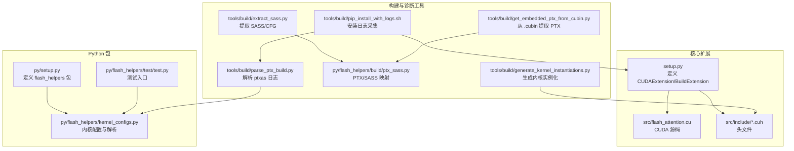
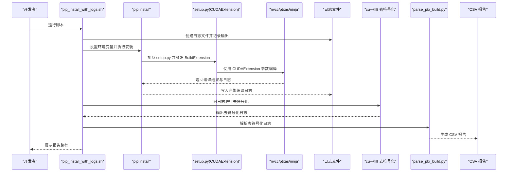
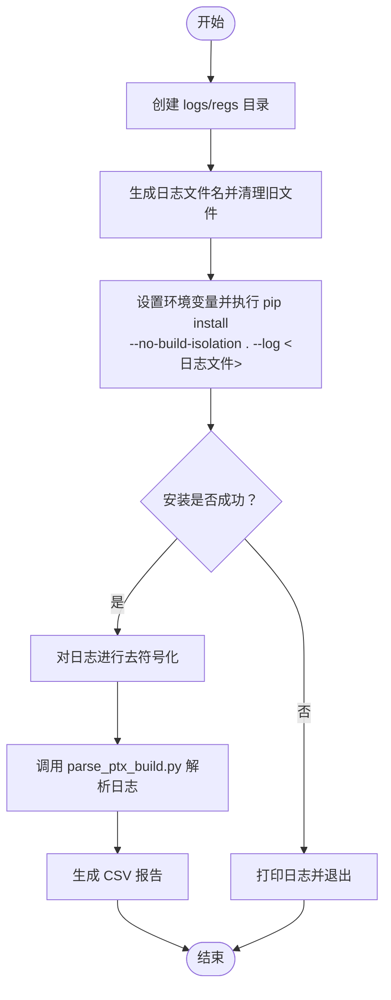
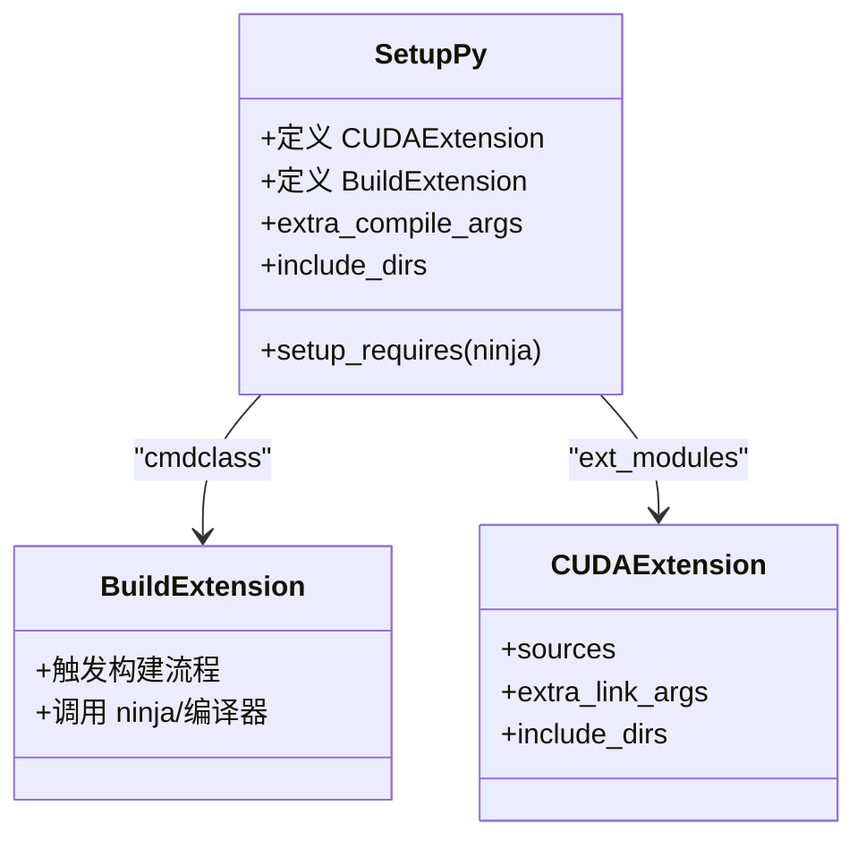
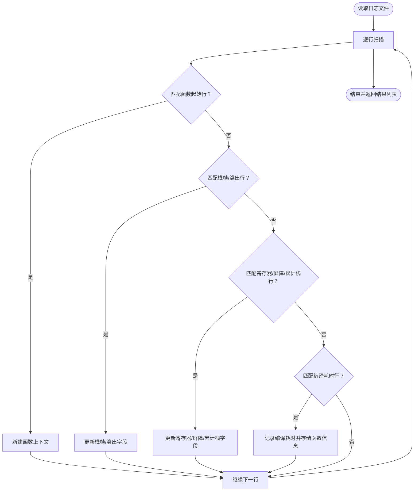
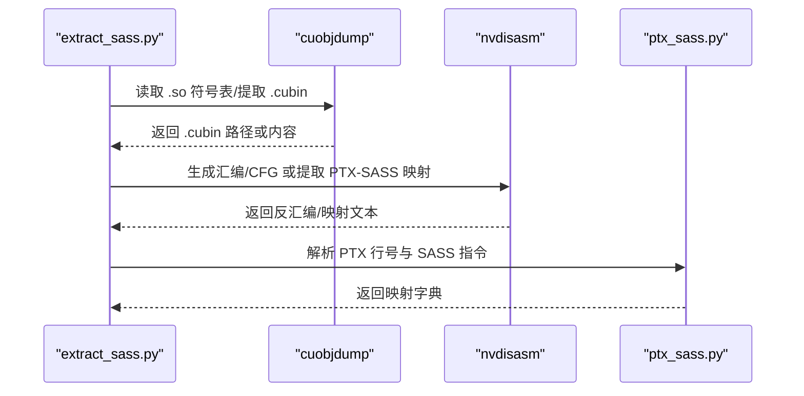
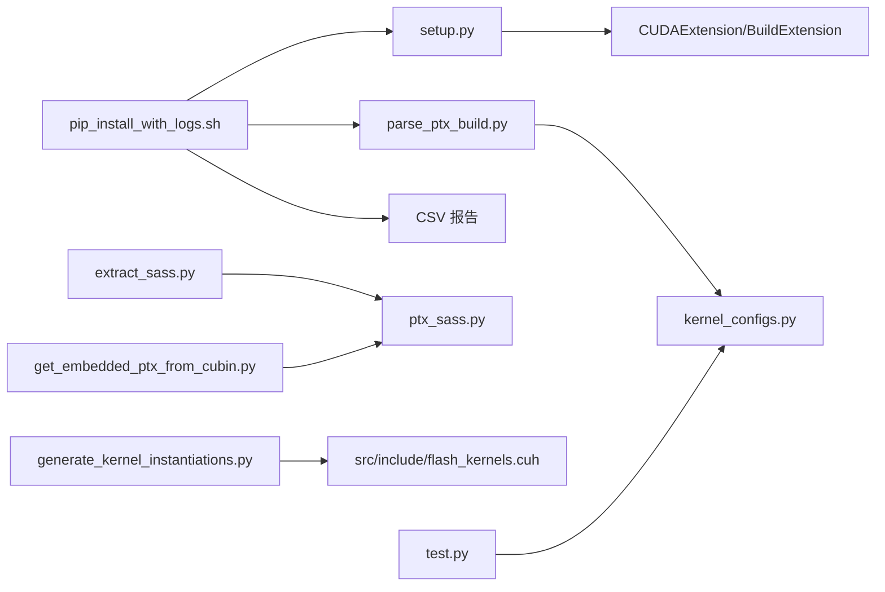

# pip_install_with_logs.sh 脚本详解

<cite>
**本文引用的文件**
- [pip_install_with_logs.sh](file://tools/build/pip_install_with_logs.sh)
- [setup.py](file://setup.py)
- [py/setup.py](file://py/setup.py)
- [parse_ptx_build.py](file://tools/build/parse_ptx_build.py)
- [extract_sass.py](file://tools/build/extract_sass.py)
- [get_embedded_ptx_from_cubin.py](file://tools/build/get_embedded_ptx_from_cubin.py)
- [ptx_sass.py](file://py/flash_helpers/build/ptx_sass.py)
- [kernel_configs.py](file://py/flash_helpers/kernel_configs.py)
- [generate_kernel_instantiations.py](file://tools/build/generate_kernel_instantiations.py)
- [test.py](file://py/flash_helpers/test/test.py)
- [README.md](file://README.md)
</cite>

## 目录
1. [引言](#引言)
2. [项目结构](#项目结构)
3. [核心组件](#核心组件)
4. [架构总览](#架构总览)
5. [详细组件分析](#详细组件分析)
6. [依赖关系分析](#依赖关系分析)
7. [性能考量](#性能考量)
8. [故障排查指南](#故障排查指南)
9. [结论](#结论)
10. [附录](#附录)

## 引言
本文件围绕 tools/build/pip_install_with_logs.sh 脚本展开，系统性解析其工作流程与在构建诊断中的关键作用。该脚本通过封装 pip install 命令，将 CUDA 编译的完整输出重定向并保存为日志文件，随后对日志进行去符号化处理，并进一步解析 ptxas 输出以提取寄存器使用、栈帧与溢出、屏障数、cmem 等关键指标，最终生成可读的 CSV 报告，用于定位编译错误、性能警告与架构不匹配等问题。同时，结合 setup.py 与 py/setup.py 的自定义构建扩展触发机制，说明如何调用 ninja 构建系统、嵌入 PTX 提取逻辑以及生成调试符号，帮助读者在跨平台部署与持续集成中高效定位问题。

## 项目结构
该仓库采用“核心 CUDA 扩展 + Python 包 + 工具链”的分层组织方式：
- 核心 CUDA 扩展：由 setup.py 定义，使用 PyTorch 的 BuildExtension/CUDAExtension 触发 nvcc 编译，生成 Python 可导入的扩展模块。
- Python 辅助包：py/setup.py 定义 flash_helpers 包，包含内核配置、解析与测试工具。
- 构建与诊断工具：tools/build 下提供日志采集、PTX/SASS 解析、内核实例化生成等脚本。
- 测试与验证：py/flash_helpers/test 下包含基于参数化的单元测试，验证不同内核配置的正确性。

图表来源
- [setup.py](file://setup.py#L1-L76)
- [py/setup.py](file://py/setup.py#L1-L20)
- [pip_install_with_logs.sh](file://tools/build/pip_install_with_logs.sh#L1-L31)
- [parse_ptx_build.py](file://tools/build/parse_ptx_build.py#L1-L250)
- [extract_sass.py](file://tools/build/extract_sass.py#L1-L508)
- [get_embedded_ptx_from_cubin.py](file://tools/build/get_embedded_ptx_from_cubin.py#L1-L38)
- [ptx_sass.py](file://py/flash_helpers/build/ptx_sass.py#L1-L166)
- [generate_kernel_instantiations.py](file://tools/build/generate_kernel_instantiations.py#L1-L57)

章节来源
- [README.md](file://README.md#L1-L63)

## 核心组件
- pip_install_with_logs.sh：封装 pip install，重定向日志、去符号化、解析并生成 CSV 报告。
- setup.py：定义 CUDAExtension 与 BuildExtension，控制 nvcc 编译参数（含调试符号、架构、警告抑制）。
- py/setup.py：定义 flash_helpers 包，作为工具与配置的载体。
- parse_ptx_build.py：解析 ptxas 日志，提取函数名、架构、寄存器、栈帧、溢出、屏障、cmem、编译耗时等。
- extract_sass.py / get_embedded_ptx_from_cubin.py / ptx_sass.py：从 .so/.cubin 中提取 PTX/SASS，建立 PTX 行号到 SASS 指令的映射。
- kernel_configs.py：将内核名称解析为配置对象，支持短形式与长形式转换。
- generate_kernel_instantiations.py：根据配置生成内核实例化声明，写入头文件。

章节来源
- [pip_install_with_logs.sh](file://tools/build/pip_install_with_logs.sh#L1-L31)
- [setup.py](file://setup.py#L1-L76)
- [py/setup.py](file://py/setup.py#L1-L20)
- [parse_ptx_build.py](file://tools/build/parse_ptx_build.py#L1-L250)
- [extract_sass.py](file://tools/build/extract_sass.py#L1-L508)
- [get_embedded_ptx_from_cubin.py](file://tools/build/get_embedded_ptx_from_cubin.py#L1-L38)
- [ptx_sass.py](file://py/flash_helpers/build/ptx_sass.py#L1-L166)
- [kernel_configs.py](file://py/flash_helpers/kernel_configs.py#L1-L486)
- [generate_kernel_instantiations.py](file://tools/build/generate_kernel_instantiations.py#L1-L57)

## 架构总览
下图展示了 pip 安装、日志采集、去符号化与解析的端到端流程，以及与构建扩展、工具链的交互关系。

图表来源
- [pip_install_with_logs.sh](file://tools/build/pip_install_with_logs.sh#L1-L31)
- [setup.py](file://setup.py#L1-L76)
- [parse_ptx_build.py](file://tools/build/parse_ptx_build.py#L1-L250)

## 详细组件分析

### 组件A：pip_install_with_logs.sh 工作流
- 功能要点
  - 生成时间戳文件名，创建 logs/regs 目录。
  - 以环境变量 TORCH_CUDA_ARCH_LIST="8.0" 和忽略 Python 警告的方式运行 pip install --no-build-isolation .，并将输出写入日志文件。
  - 若安装失败，打印日志并退出；成功后对日志进行去符号化处理，再调用 parse_ptx_build.py 生成 CSV 报告。
- 关键行为
  - 使用 --no-build-isolation 避免隔离构建导致的工具链差异。
  - 通过 cu++filt -p 将 mangled 名称还原为可读函数名，便于后续解析。
  - 生成 CSV 文件以便自动化分析与回归对比。

图表来源
- [pip_install_with_logs.sh](file://tools/build/pip_install_with_logs.sh#L1-L31)
- [parse_ptx_build.py](file://tools/build/parse_ptx_build.py#L1-L250)

章节来源
- [pip_install_with_logs.sh](file://tools/build/pip_install_with_logs.sh#L1-L31)

### 组件B：setup.py 与 py/setup.py 的构建扩展触发机制
- CUDA 扩展定义
  - 使用 BuildExtension 与 CUDAExtension，指定源文件、额外编译参数、链接参数与包含目录。
  - 通过 get_nvcc_compile_args 控制 C++/NVCC 参数，启用调试符号、行信息、资源使用统计、架构目标等。
- 自定义构建触发
  - 当 pip install 加载 setup.py 时，会触发 BuildExtension，进而调用 ninja 或底层构建系统完成 nvcc 编译。
  - setup_requires 中声明 ninja，确保在安装阶段具备必要的构建工具。
- Python 包定义
  - py/setup.py 定义 flash_helpers 包，供工具与测试使用。

图表来源
- [setup.py](file://setup.py#L1-L76)
- [py/setup.py](file://py/setup.py#L1-L20)

章节来源
- [setup.py](file://setup.py#L1-L76)
- [py/setup.py](file://py/setup.py#L1-L20)

### 组件C：parse_ptx_build.py 的解析逻辑
- 解析目标
  - 从 ptxas 日志中提取函数名（含 mangled/demangled）、架构 sm_xx、栈帧大小、溢出字节数、寄存器使用、屏障数、cmem[0]、编译耗时等。
- 处理流程
  - 使用正则逐行匹配，维护当前函数上下文，遇到新函数时关闭上一个函数记录。
  - 支持 CSV 与人类可读两种输出格式；CSV 仅保留关键字段，便于自动化处理。
  - 通过 kernel_configs.parse_kernel_name_into_config 将函数名解析为配置对象，生成短形式标识。

图表来源
- [parse_ptx_build.py](file://tools/build/parse_ptx_build.py#L1-L250)
- [kernel_configs.py](file://py/flash_helpers/kernel_configs.py#L1-L486)

章节来源
- [parse_ptx_build.py](file://tools/build/parse_ptx_build.py#L1-L250)
- [kernel_configs.py](file://py/flash_helpers/kernel_configs.py#L1-L486)

### 组件D：PTX/SASS 提取与映射
- 从 .cubin 提取 PTX
  - 使用 cuobjdump 获取 ELF 段，提取 .nv_debug_ptx_txt 段内容。
  - get_embedded_ptx_from_cubin.py 支持指定段名，默认使用 .nv_debug_ptx_txt。
- 从 .so 提取 .cubin
  - extract_sass.py 在处理 .so 时，先尝试 cuobjdump -lelf 读取符号表，再自动定位 .cubin 并提取。
  - 支持 -fun 指定函数索引、-cfg 生成控制流图、-no_offsets 清理偏移前缀等。
- 建立 PTX 到 SASS 的映射
  - ptx_sass.py 解析 nvdisasm 输出，将 PTX 行号与对应 SASS 指令关联，便于定位指令级问题。

图表来源
- [extract_sass.py](file://tools/build/extract_sass.py#L1-L508)
- [get_embedded_ptx_from_cubin.py](file://tools/build/get_embedded_ptx_from_cubin.py#L1-L38)
- [ptx_sass.py](file://py/flash_helpers/build/ptx_sass.py#L1-L166)

章节来源
- [extract_sass.py](file://tools/build/extract_sass.py#L1-L508)
- [get_embedded_ptx_from_cubin.py](file://tools/build/get_embedded_ptx_from_cubin.py#L1-L38)
- [ptx_sass.py](file://py/flash_helpers/build/ptx_sass.py#L1-L166)

### 组件E：内核实例化生成与配置解析
- generate_kernel_instantiations.py
  - 读取 kernel_configs.get_kernels_to_build() 生成的配置集合，写入 src/include/flash_kernels.cuh，形成内核函数指针映射。
- kernel_configs.py
  - 提供多种解析策略，支持从 mangled 名称、带类型签名的名称、短形式字符串解析为配置对象。
  - 提供短形式字符串与 C++ 结构体表示，便于生成实例化代码。

章节来源
- [generate_kernel_instantiations.py](file://tools/build/generate_kernel_instantiations.py#L1-L57)
- [kernel_configs.py](file://py/flash_helpers/kernel_configs.py#L1-L486)

## 依赖关系分析
- 脚本与构建扩展
  - pip_install_with_logs.sh 通过 pip install 触发 setup.py 的 BuildExtension，从而调用 ninja/nvcc 完成 CUDA 编译。
- 日志解析与工具链
  - parse_ptx_build.py 依赖 cu++filt 去符号化输出；extract_sass.py/ptx_sass.py 依赖 cuobjdump/nvdisasm/readelf/cu++filt 等 CUDA 工具。
- 配置与测试
  - kernel_configs.py 为解析与生成提供统一的配置模型；test.py 通过参数化遍历配置，验证功能正确性。

图表来源
- [pip_install_with_logs.sh](file://tools/build/pip_install_with_logs.sh#L1-L31)
- [setup.py](file://setup.py#L1-L76)
- [parse_ptx_build.py](file://tools/build/parse_ptx_build.py#L1-L250)
- [kernel_configs.py](file://py/flash_helpers/kernel_configs.py#L1-L486)
- [extract_sass.py](file://tools/build/extract_sass.py#L1-L508)
- [get_embedded_ptx_from_cubin.py](file://tools/build/get_embedded_ptx_from_cubin.py#L1-L38)
- [ptx_sass.py](file://py/flash_helpers/build/ptx_sass.py#L1-L166)
- [generate_kernel_instantiations.py](file://tools/build/generate_kernel_instantiations.py#L1-L57)
- [test.py](file://py/flash_helpers/test/test.py#L1-L104)

章节来源
- [pip_install_with_logs.sh](file://tools/build/pip_install_with_logs.sh#L1-L31)
- [setup.py](file://setup.py#L1-L76)
- [parse_ptx_build.py](file://tools/build/parse_ptx_build.py#L1-L250)
- [extract_sass.py](file://tools/build/extract_sass.py#L1-L508)
- [get_embedded_ptx_from_cubin.py](file://tools/build/get_embedded_ptx_from_cubin.py#L1-L38)
- [ptx_sass.py](file://py/flash_helpers/build/ptx_sass.py#L1-L166)
- [generate_kernel_instantiations.py](file://tools/build/generate_kernel_instantiations.py#L1-L57)
- [kernel_configs.py](file://py/flash_helpers/kernel_configs.py#L1-L486)
- [test.py](file://py/flash_helpers/test/test.py#L1-L104)

## 性能考量
- 编译参数优化
  - setup.py 启用 --generate-line-info、--resource-usage、--keep 等参数，便于生成调试符号与资源使用报告。
  - 通过 -Xptxas=-warn-lmem-usage/-warn-spills 提升对寄存器与内存溢出的敏感度，配合 parse_ptx_build.py 的 CSV 输出进行量化分析。
- 日志粒度与可读性
  - pip_install_with_logs.sh 保存完整日志，避免遗漏关键警告；去符号化后便于人工审阅与自动化解析。
- 工具链依赖
  - 缺少 cuobjdump/nvdisasm/readelf/cu++filt 会导致 SASS/CFG 提取失败；建议在 CI 环境预装 CUDA Toolkit。

[本节为通用指导，无需列出具体文件来源]

## 故障排查指南
- 典型问题与定位方法
  - CUDA 架构不匹配
    - 现象：安装阶段出现架构不兼容或链接错误。
    - 定位：检查 setup.py 中 -gencode/arch=compute_80,code=sm_80 是否与目标 GPU 一致；若目标为其他架构，需调整该参数。
    - 参考：[setup.py](file://setup.py#L1-L76)
  - ninja 缺失
    - 现象：pip install 报错提示找不到构建工具。
    - 定位：确认 setup_requires 中已声明 ninja；在 CI 环境安装 ninja。
    - 参考：[setup.py](file://setup.py#L1-L76)
  - PTX 解析失败
    - 现象：extract_sass.py 无法从 .so/.cubin 中提取 .cubin 或段内容。
    - 定位：检查 cuobjdump/nvdisasm/readelf/cu++filt 是否可用；必要时手动运行 cuobjdump -lelf 或 cuobjdump -all 排查。
    - 参考：[extract_sass.py](file://tools/build/extract_sass.py#L1-L508)
  - PTX/SASS 映射为空
    - 现象：ptx_sass.py 未建立映射。
    - 定位：确认 .cubin 包含 .nv_debug_ptx_txt 段；使用 get_embedded_ptx_from_cubin.py 验证段存在。
    - 参考：[ptx_sass.py](file://py/flash_helpers/build/ptx_sass.py#L1-L166)，[get_embedded_ptx_from_cubin.py](file://tools/build/get_embedded_ptx_from_cubin.py#L1-L38)
  - 日志中寄存器/溢出警告
    - 现象：CSV 报告显示 used_registers/spill_* 字段较大。
    - 定位：结合 extract_sass.py 生成的 CFG/汇编，定位热点内核；调整寄存器分配或减少共享内存使用。
    - 参考：[parse_ptx_build.py](file://tools/build/parse_ptx_build.py#L1-L250)，[extract_sass.py](file://tools/build/extract_sass.py#L1-L508)
- 跨平台与持续集成建议
  - 在 CI 中固定 CUDA 版本与工具链，确保 cuobjdump/nvdisasm/readelf/cu++filt 可用。
  - 使用 pip_install_with_logs.sh 生成日志与 CSV，作为回归基线与变更对比依据。
  - 对于多 GPU 架构，按目标 GPU 调整 -gencode 参数并分别构建与测试。

章节来源
- [setup.py](file://setup.py#L1-L76)
- [extract_sass.py](file://tools/build/extract_sass.py#L1-L508)
- [get_embedded_ptx_from_cubin.py](file://tools/build/get_embedded_ptx_from_cubin.py#L1-L38)
- [ptx_sass.py](file://py/flash_helpers/build/ptx_sass.py#L1-L166)
- [parse_ptx_build.py](file://tools/build/parse_ptx_build.py#L1-L250)

## 结论
pip_install_with_logs.sh 通过“完整日志采集 + 去符号化 + 解析 CSV”三步法，将 CUDA 编译过程可视化与可量化，显著提升了构建诊断效率。结合 setup.py 的自定义构建扩展与 ninja 构建系统，以及 PTX/SASS 提取与映射工具，形成了从安装到性能分析的闭环。该工具链在跨平台部署与持续集成中具有重要实用价值，能够快速定位 CUDA 架构不匹配、ninja 缺失、PTX 解析失败等常见问题，并为性能优化提供数据支撑。

[本节为总结性内容，无需列出具体文件来源]

## 附录
- 快速参考
  - 安装与日志采集：运行 tools/build/pip_install_with_logs.sh，查看 logs 与 regs 目录产物。
  - 查看 CSV 报告：parse_ptx_build.py 生成的 CSV 文件包含关键性能指标，便于自动化分析。
  - 提取 SASS/CFG：使用 extract_sass.py，支持 -cfg 生成控制流图与 -no_offsets 清理偏移。
  - 从 .cubin 提取 PTX：使用 get_embedded_ptx_from_cubin.py，验证 .nv_debug_ptx_txt 段是否存在。

[本节为补充说明，无需列出具体文件来源]