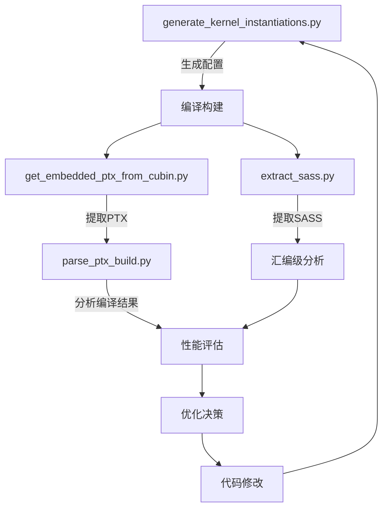
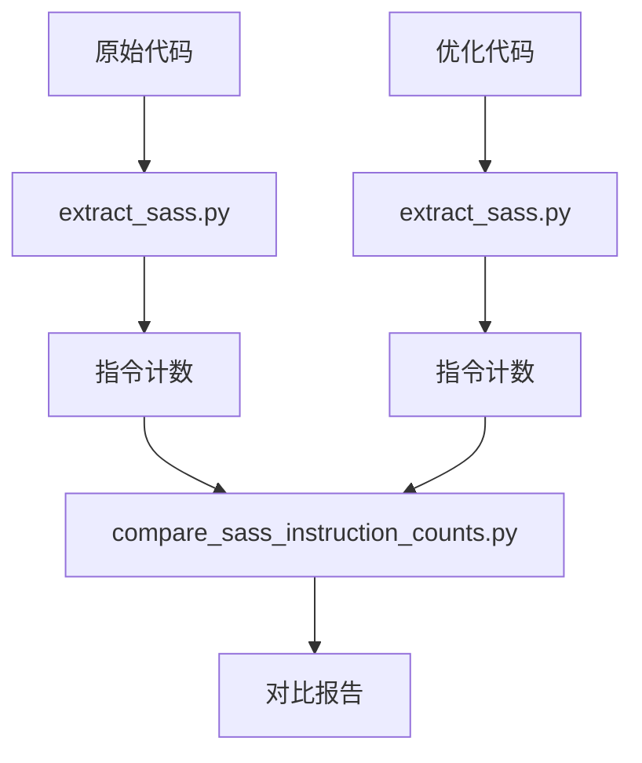
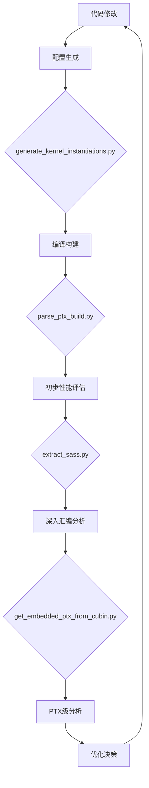

# 构建工具辅助脚本集

<cite>
**本文档中引用的文件**  
- [extract_sass.py](file://tools/build/extract_sass.py)
- [generate_kernel_instantiations.py](file://tools/build/generate_kernel_instantiations.py)
- [get_embedded_ptx_from_cubin.py](file://tools/build/get_embedded_ptx_from_cubin.py)
- [parse_ptx_build.py](file://tools/build/parse_ptx_build.py)
- [kernel_configs.py](file://py/flash_helpers/kernel_configs.py)
- [ptx_sass.py](file://py/flash_helpers/build/ptx_sass.py)
- [ptx_instruction.py](file://py/flash_helpers/build/ptx_instruction.py)
</cite>

## 目录
1. [介绍](#介绍)
2. [核心工具功能分析](#核心工具功能分析)
3. [工具协同作用与应用场景](#工具协同作用与应用场景)
4. [调用方式与集成方法](#调用方式与集成方法)
5. [输入输出格式说明](#输入输出格式说明)

## 介绍
本文件详细介绍了tools/build目录下的Python构建辅助工具集，这些工具主要用于Flash Attention内核的性能分析、自动化测试和汇编级调试。该工具集包含四个核心脚本：extract_sass.py用于从cubin文件中提取SASS指令；generate_kernel_instantiations.py用于自动化生成不同配置的内核实例化代码；get_embedded_ptx_from_cubin.py用于解析二进制文件获取嵌入式PTX代码；parse_ptx_build.py用于分析PTX输出以验证编译结果。这些工具共同构成了一个完整的内核优化循环，支持自动调优、指令计数对比和汇编级调试等关键开发流程。

## 核心工具功能分析

### extract_sass.py：SASS指令提取工具
该工具从CUDA二进制文件（.so或.cubin）中提取SASS（Streaming ASSembler）指令，用于性能分析和汇编级调试。它通过调用CUDA工具链中的cuobjdump和nvdisasm来实现功能。

**功能特点：**
- 支持从.so或.cubin文件中提取内核信息
- 使用readelf解析符号表获取内核函数信息
- 调用nvdisasm生成SASS反汇编或控制流图
- 支持过滤和格式化输出，移除地址偏移等冗余信息
- 提供详细日志和错误处理机制

**工作流程：**
1. 验证CUDA工具链的可用性（cuobjdump, nvdisasm, readelf, cu++filt）
2. 解析输入文件，如果是.so文件则先提取嵌入的.cubin
3. 使用readelf -Ws命令读取符号表，筛选出以"void"和"flash"为特征的内核函数
4. 对每个内核调用nvdisasm进行反汇编，生成SASS指令
5. 可选择生成控制流图（-cfg）或普通反汇编
6. 将结果保存到指定输出目录

**Section sources**
- [extract_sass.py](file://tools/build/extract_sass.py#L1-L508)

### generate_kernel_instantiations.py：内核实例化代码生成工具
该工具自动化生成不同配置的内核实例化代码，以支持全面测试和性能评估。

**功能特点：**
- 读取src/include/flash_kernels.cuh模板文件
- 调用kernel_configs.py中的get_kernels_to_build()函数获取所有需要构建的内核配置
- 为每个内核配置生成相应的C++函数指针映射条目
- 输出到flash_kernels.cuh文件，供主程序使用

**工作流程：**
1. 导入flash_helpers.kernel_configs模块
2. 获取所有需要构建的内核配置
3. 为每个配置生成短形式名称和C++结构体表示
4. 生成函数指针映射的C++代码
5. 写入flash_kernels.cuh文件

**Section sources**
- [generate_kernel_instantiations.py](file://tools/build/generate_kernel_instantiations.py#L1-L57)
- [kernel_configs.py](file://py/flash_helpers/kernel_configs.py#L457-L462)

### get_embedded_ptx_from_cubin.py：嵌入式PTX代码提取工具
该工具解析cubin二进制文件，提取其中嵌入的PTX（Parallel Thread Execution）代码。

**功能特点：**
- 专门针对.cubin文件中的.nv_debug_ptx_txt节区
- 利用cuobjdump工具提取ELF格式的嵌入内容
- 可指定不同的节区名称进行提取
- 输出纯文本格式的PTX代码

**工作流程：**
1. 接收cubin文件名作为命令行参数
2. 调用cuobjdump -elf命令获取完整的ELF转储
3. 解析输出，定位指定的节区（默认为.nv_debug_ptx_txt）
4. 提取并输出节区内容，跳过节区头信息

**Section sources**
- [get_embedded_ptx_from_cubin.py](file://tools/build/get_embedded_ptx_from_cubin.py#L1-L38)
- [ptx_sass.py](file://py/flash_helpers/build/ptx_sass.py#L99-L110)

### parse_ptx_build.py：PTX编译结果分析工具
该工具分析ptxas（PTX汇编器）的编译日志，提取关键性能指标。

**功能特点：**
- 解析ptxas编译日志文件
- 提取每个内核函数的编译信息，包括：
  - 使用的寄存器数量
  - 堆栈帧大小
  - 溢出存储/加载字节数
  - 使用的屏障数量
  - cmem[0]使用字节数
  - 编译时间
- 支持输出为可读格式或CSV格式
- 集成demangle功能，将C++函数名还原为可读形式

**工作流程：**
1. 读取ptxas日志文件
2. 使用正则表达式匹配关键信息行
3. 构建函数信息字典，包含所有提取的性能指标
4. 调用kernel_configs.py解析内核配置
5. 输出格式化结果或CSV文件

**Section sources**
- [parse_ptx_build.py](file://tools/build/parse_ptx_build.py#L1-L250)
- [kernel_configs.py](file://py/flash_helpers/kernel_configs.py#L323-L335)

## 工具协同作用与应用场景

### 内核优化循环中的协同作用
这些工具在内核优化过程中形成了一个完整的闭环：



**Diagram sources**
- [generate_kernel_instantiations.py](file://tools/build/generate_kernel_instantiations.py)
- [get_embedded_ptx_from_cubin.py](file://tools/build/get_embedded_ptx_from_cubin.py)
- [parse_ptx_build.py](file://tools/build/parse_ptx_build.py)
- [extract_sass.py](file://tools/build/extract_sass.py)

### 自动调优场景
在自动调优过程中，这些工具协同工作：
1. generate_kernel_instantiations.py根据kernel_configs.py中的配置生成所有候选内核
2. 构建系统编译生成包含所有内核的二进制文件
3. parse_ptx_build.py分析编译结果，评估每个内核的资源使用情况
4. extract_sass.py提取关键内核的SASS指令，进行深入的汇编级分析
5. 基于分析结果选择最优配置，或指导进一步的代码优化

### 指令计数对比场景
结合tools/analysis/compare_sass_instruction_counts.py工具，可以进行指令级性能对比：
1. 使用extract_sass.py提取优化前后的SASS代码
2. 使用ptx_sass.py中的工具统计各类指令的数量
3. 调用compare_sass_instruction_counts.py进行对比分析
4. 生成包含绝对变化和相对变化的详细报告



**Diagram sources**
- [extract_sass.py](file://tools/build/extract_sass.py)
- [compare_sass_instruction_counts.py](file://tools/analysis/compare_sass_instruction_counts.py)

### 汇编级调试场景
在汇编级调试中，这些工具提供关键支持：
1. get_embedded_ptx_from_cubin.py提取原始PTX代码，作为高级语言到SASS的中间表示
2. extract_sass.py生成详细的SASS反汇编，包含地址偏移和控制流信息
3. ptx_sass.py提供PTX到SASS的映射关系，帮助理解编译器优化过程
4. 开发者可以对比PTX和SASS，分析编译器的优化决策和代码生成质量

## 调用方式与集成方法

### 单个工具调用方式
各工具的典型调用方式如下：

**extract_sass.py**
```bash
# 列出所有内核
python extract_sass.py libflash_attn.so -l

# 提取特定内核的SASS
python extract_sass.py libflash_attn.so -fun 0 -o output_dir

# 生成控制流图
python extract_sass.py libflash_attn.so -cfg -o output_dir
```

**generate_kernel_instantiations.py**
```bash
# 直接运行生成flash_kernels.cuh
python generate_kernel_instantiations.py
```

**get_embedded_ptx_from_cubin.py**
```bash
# 提取默认PTX节区
python get_embedded_ptx_from_cubin.py kernel.cubin

# 提取指定节区
python get_embedded_ptx_from_cubin.py kernel.cubin .nv_fatbin
```

**parse_ptx_build.py**
```bash
# 输出可读格式
python parse_ptx_build.py ptxas.log

# 输出CSV格式
python parse_ptx_build.py ptxas.log --csv --output results.csv
```

### 与主构建流程的集成
这些工具通常集成在构建系统的不同阶段：



**Diagram sources**
- [generate_kernel_instantiations.py](file://tools/build/generate_kernel_instantiations.py)
- [parse_ptx_build.py](file://tools/build/parse_ptx_build.py)
- [extract_sass.py](file://tools/build/extract_sass.py)
- [get_embedded_ptx_from_cubin.py](file://tools/build/get_embedded_ptx_from_cubin.py)

## 输入输出格式说明

### extract_sass.py
**输入：**
- 主要输入：.so或.cubin二进制文件
- 可选参数：-cubin（指定cubin文件）、-fun（指定函数索引）、-name（输出文件名）

**输出：**
- SASS反汇编文件（.asm）或控制流图（.dot）
- 文件名基于内核名称或指定名称
- 包含完整的SASS指令序列，可选移除地址偏移

### generate_kernel_instantiations.py
**输入：**
- 无命令行输入
- 依赖kernel_configs.py中的配置生成逻辑

**输出：**
- src/include/flash_kernels.cuh文件
- C++代码格式，包含所有内核配置的函数指针映射

### get_embedded_ptx_from_cubin.py
**输入：**
- cubin文件名
- 可选的节区名称

**输出：**
- 标准输出流中的PTX代码文本
- 不包含节区头信息的纯PTX指令

### parse_ptx_build.py
**输入：**
- ptxas编译日志文件

**输出：**
- 可读格式：包含每个内核详细信息的文本报告
- CSV格式：包含关键性能指标的表格数据，便于后续分析

**Section sources**
- [extract_sass.py](file://tools/build/extract_sass.py#L207-L249)
- [generate_kernel_instantiations.py](file://tools/build/generate_kernel_instantiations.py#L13-L54)
- [get_embedded_ptx_from_cubin.py](file://tools/build/get_embedded_ptx_from_cubin.py#L10-L27)
- [parse_ptx_build.py](file://tools/build/parse_ptx_build.py#L224-L237)