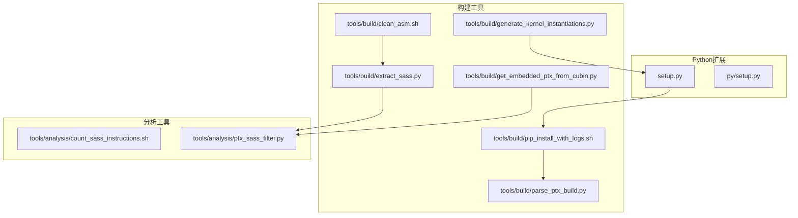
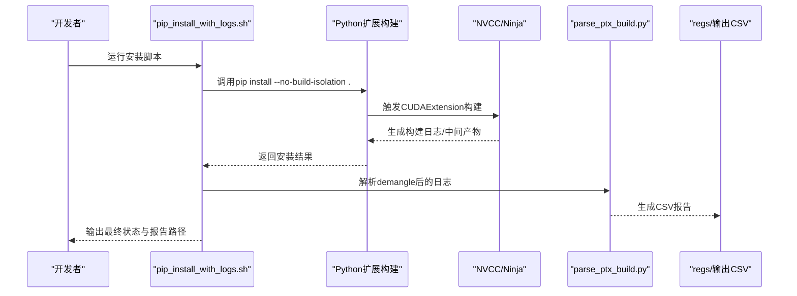
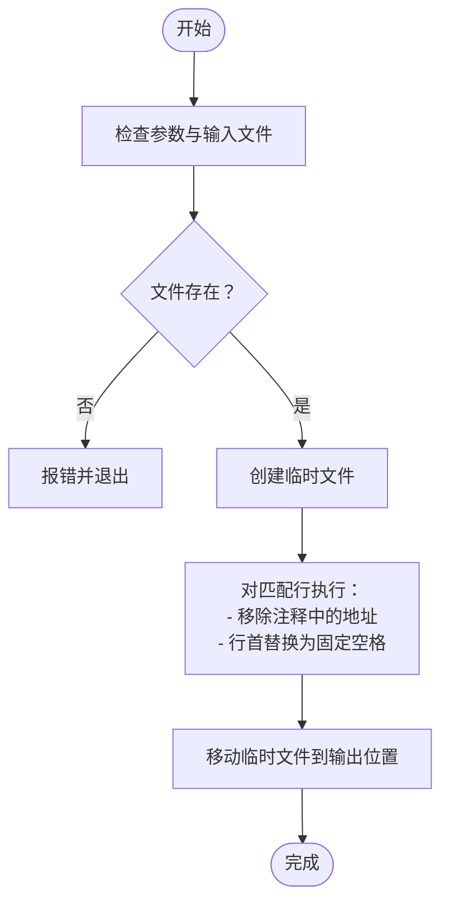
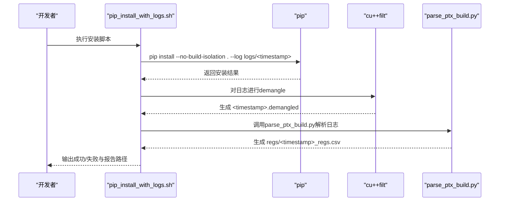
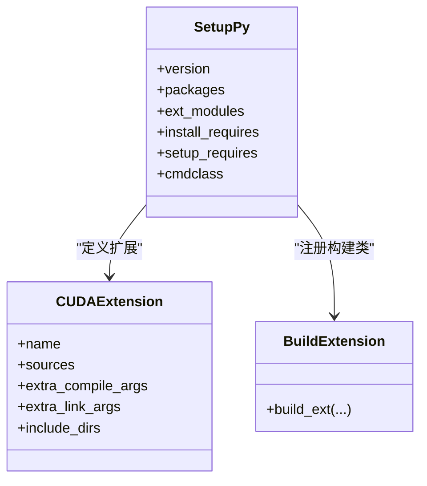
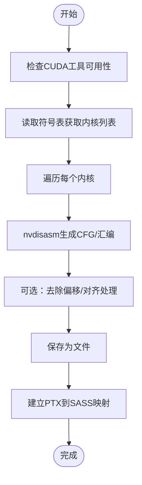
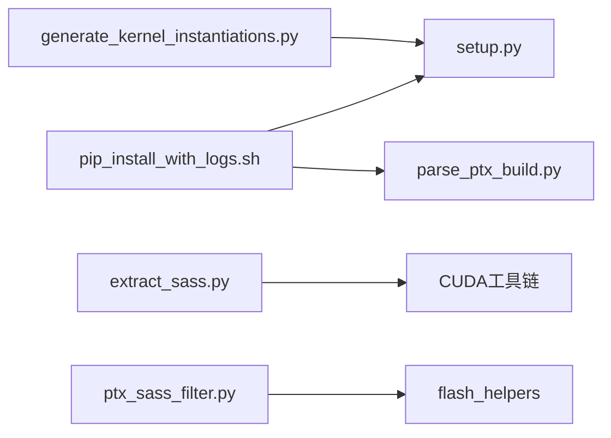

# 构建辅助脚本

<cite>
**本文引用的文件**
- [tools/build/clean_asm.sh](file://tools/build/clean_asm.sh)
- [tools/build/pip_install_with_logs.sh](file://tools/build/pip_install_with_logs.sh)
- [tools/build/parse_ptx_build.py](file://tools/build/parse_ptx_build.py)
- [tools/build/extract_sass.py](file://tools/build/extract_sass.py)
- [tools/build/get_embedded_ptx_from_cubin.py](file://tools/build/get_embedded_ptx_from_cubin.py)
- [tools/analysis/count_sass_instructions.sh](file://tools/analysis/count_sass_instructions.sh)
- [tools/analysis/ptx_sass_filter.py](file://tools/analysis/ptx_sass_filter.py)
- [tools/build/generate_kernel_instantiations.py](file://tools/build/generate_kernel_instantiations.py)
- [setup.py](file://setup.py)
- [py/setup.py](file://py/setup.py)
</cite>

## 目录
1. [简介](#简介)
2. [项目结构](#项目结构)
3. [核心组件](#核心组件)
4. [架构总览](#架构总览)
5. [详细组件分析](#详细组件分析)
6. [依赖关系分析](#依赖关系分析)
7. [性能与可重复性建议](#性能与可重复性建议)
8. [故障排除指南](#故障排除指南)
9. [结论](#结论)

## 简介
本文件聚焦于构建系统中的Shell脚本工具集，围绕以下目标展开：
- 清理旧的汇编分析文件，确保基准测试的纯净性（删除SASS、PTX和日志文件）。
- 封装pip安装过程并捕获完整编译输出，用于诊断CUDA版本不兼容、缺失ninja构建工具等问题。
- 结合Python扩展构建脚本，说明如何触发自定义构建步骤、环境变量配置与调试符号生成，提供完整的构建故障排除指南。

## 项目结构
该仓库采用“按功能域分层”的组织方式：核心CUDA内核位于src目录，构建与分析工具集中在tools目录；Python扩展通过setup.py与py/setup.py分别管理主包与辅助工具包。

图表来源
- [tools/build/clean_asm.sh](file://tools/build/clean_asm.sh#L1-L44)
- [tools/build/pip_install_with_logs.sh](file://tools/build/pip_install_with_logs.sh#L1-L31)
- [tools/build/parse_ptx_build.py](file://tools/build/parse_ptx_build.py#L1-L250)
- [tools/build/extract_sass.py](file://tools/build/extract_sass.py#L1-L508)
- [tools/build/get_embedded_ptx_from_cubin.py](file://tools/build/get_embedded_ptx_from_cubin.py#L1-L38)
- [tools/analysis/count_sass_instructions.sh](file://tools/analysis/count_sass_instructions.sh#L1-L10)
- [tools/analysis/ptx_sass_filter.py](file://tools/analysis/ptx_sass_filter.py#L1-L122)
- [tools/build/generate_kernel_instantiations.py](file://tools/build/generate_kernel_instantiations.py#L1-L57)
- [setup.py](file://setup.py#L1-L76)
- [py/setup.py](file://py/setup.py#L1-L20)

章节来源
- [tools/build/clean_asm.sh](file://tools/build/clean_asm.sh#L1-L44)
- [tools/build/pip_install_with_logs.sh](file://tools/build/pip_install_with_logs.sh#L1-L31)
- [tools/build/parse_ptx_build.py](file://tools/build/parse_ptx_build.py#L1-L250)
- [tools/build/extract_sass.py](file://tools/build/extract_sass.py#L1-L508)
- [tools/build/get_embedded_ptx_from_cubin.py](file://tools/build/get_embedded_ptx_from_cubin.py#L1-L38)
- [tools/analysis/count_sass_instructions.sh](file://tools/analysis/count_sass_instructions.sh#L1-L10)
- [tools/analysis/ptx_sass_filter.py](file://tools/analysis/ptx_sass_filter.py#L1-L122)
- [tools/build/generate_kernel_instantiations.py](file://tools/build/generate_kernel_instantiations.py#L1-L57)
- [setup.py](file://setup.py#L1-L76)
- [py/setup.py](file://py/setup.py#L1-L20)

## 核心组件
- 清理汇编文件脚本：对SASS/PTX等反汇编输出进行归一化处理，移除地址偏移等非确定性信息，便于比较与回归测试。
- 安装日志脚本：统一记录pip安装过程，自动demangle符号并解析PTX构建信息，生成CSV报告，便于定位问题。
- CUDA扩展构建：通过setuptools与PyTorch CUDAExtension，配置NVCC编译参数、调试符号与目标架构，触发自定义构建流程。
- 反汇编与映射：从cubin中提取内核、生成CFG或汇编，建立PTX到SASS映射，支持过滤与统计分析。

章节来源
- [tools/build/clean_asm.sh](file://tools/build/clean_asm.sh#L1-L44)
- [tools/build/pip_install_with_logs.sh](file://tools/build/pip_install_with_logs.sh#L1-L31)
- [tools/build/parse_ptx_build.py](file://tools/build/parse_ptx_build.py#L1-L250)
- [setup.py](file://setup.py#L1-L76)

## 架构总览
下图展示从安装到分析的端到端流程，以及关键文件之间的调用关系。

图表来源
- [tools/build/pip_install_with_logs.sh](file://tools/build/pip_install_with_logs.sh#L1-L31)
- [tools/build/parse_ptx_build.py](file://tools/build/parse_ptx_build.py#L1-L250)
- [setup.py](file://setup.py#L1-L76)

## 详细组件分析

### 组件A：clean_asm.sh —— 清理旧的汇编分析文件
- 目标：确保基准测试的纯净性，移除SASS/PTX输出中的地址偏移等非确定性信息，统一缩进格式，便于diff与回归对比。
- 关键行为：
  - 输入校验：检查参数数量与输入文件存在性。
  - 处理策略：仅对包含特定模式的行移除注释中的十六进制地址，并将行首空白替换为固定宽度空格，保证列对齐。
  - 输出控制：支持原地修改或写入新文件。
- 典型应用场景：
  - 在自动化基准测试前，清理历史SASS/PTX输出，避免地址差异导致的误判。
  - 在CI中对反汇编产物进行去噪，减少噪声干扰。

图表来源
- [tools/build/clean_asm.sh](file://tools/build/clean_asm.sh#L1-L44)

章节来源
- [tools/build/clean_asm.sh](file://tools/build/clean_asm.sh#L1-L44)

### 组件B：pip_install_with_logs.sh —— 封装pip安装并捕获完整编译输出
- 目标：统一记录pip安装过程，自动demangle符号并解析PTX构建信息，生成CSV报告，便于诊断CUDA版本不兼容、缺失ninja构建工具等问题。
- 关键行为：
  - 时间戳命名：根据当前时间生成日志文件名，避免覆盖。
  - 日志目录：自动创建logs与regs目录，存放原始日志与demangle后日志。
  - 安装命令：设置特定CUDA架构列表与警告环境变量，执行pip install --no-build-isolation，失败时打印日志并退出。
  - 符号demangle：使用cu++filt处理日志，生成.demangled文件。
  - 解析与导出：调用parse_ptx_build.py解析日志，生成CSV报告至regs目录。
- 常见问题定位：
  - CUDA版本不兼容：查看日志中nvcc/ptxas错误与架构匹配提示。
  - 缺失ninja：查看setup_requires中是否包含ninja，确认构建工具链可用。
  - 构建失败：结合CSV报告中的寄存器使用、栈帧与溢出信息定位热点。

图表来源
- [tools/build/pip_install_with_logs.sh](file://tools/build/pip_install_with_logs.sh#L1-L31)
- [tools/build/parse_ptx_build.py](file://tools/build/parse_ptx_build.py#L1-L250)

章节来源
- [tools/build/pip_install_with_logs.sh](file://tools/build/pip_install_with_logs.sh#L1-L31)

### 组件C：Python扩展构建（setup.py）—— 触发自定义构建步骤、环境变量与调试符号
- 目标：通过setuptools与PyTorch CUDAExtension，配置NVCC编译参数、调试符号与目标架构，触发自定义构建流程。
- 关键点：
  - 编译参数：启用C++20、快速数学、行信息、资源使用统计、模板回溯限制、保留中间产物等；在调试模式下开启-g -G -O0并定义调试宏。
  - 目标架构：指定compute_80与sm_80，确保与主流GPU兼容。
  - 依赖声明：显式声明ninja作为构建依赖，避免因缺少构建工具导致失败。
  - 扩展模块：定义CUDAExtension，包含源文件与头文件目录，链接CUDA库。
- 调试建议：
  - 设置FA_DEBUG环境变量以启用调试编译参数与符号。
  - 使用--keep选项保留中间产物，便于进一步分析。

图表来源
- [setup.py](file://setup.py#L1-L76)

章节来源
- [setup.py](file://setup.py#L1-L76)

### 组件D：Python辅助包（py/setup.py）
- 目标：管理辅助工具包flash_helpers，供构建与分析脚本共享数据结构与工具函数。
- 关键点：
  - 包发现：自动扫描包内容。
  - 版本管理：统一版本号。
  - 依赖声明：可按需启用torch、einops、ninja等依赖。

章节来源
- [py/setup.py](file://py/setup.py#L1-L20)

### 组件E：反汇编与映射（extract_sass.py、get_embedded_ptx_from_cubin.py、ptx_sass_filter.py）
- 目标：从cubin中提取内核、生成CFG或汇编，建立PTX到SASS映射，支持过滤与统计分析。
- 关键行为：
  - 工具检测：检查cuobjdump、nvdisasm、readelf、cu++filt是否可用。
  - 内核枚举：通过readelf读取符号表，筛选目标内核。
  - 提取与保存：使用nvdisasm生成CFG或汇编，支持去除偏移、重定向输出。
  - PTX/SASS映射：解析cuobjdump输出，建立PTX行到SASS指令的映射。
  - 过滤与统计：支持按行过滤相关PTX指令，统计SASS指令频次。

图表来源
- [tools/build/extract_sass.py](file://tools/build/extract_sass.py#L1-L508)
- [tools/build/get_embedded_ptx_from_cubin.py](file://tools/build/get_embedded_ptx_from_cubin.py#L1-L38)
- [tools/analysis/ptx_sass_filter.py](file://tools/analysis/ptx_sass_filter.py#L1-L122)

章节来源
- [tools/build/extract_sass.py](file://tools/build/extract_sass.py#L1-L508)
- [tools/build/get_embedded_ptx_from_cubin.py](file://tools/build/get_embedded_ptx_from_cubin.py#L1-L38)
- [tools/analysis/ptx_sass_filter.py](file://tools/analysis/ptx_sass_filter.py#L1-L122)

### 组件F：自动实例化生成（generate_kernel_instantiations.py）
- 目标：根据配置生成内核实例化代码，写入头文件，供CUDA内核选择逻辑使用。
- 关键行为：
  - 读取内核配置集合，生成C++映射初始化代码。
  - 输出到指定头文件，包含必要的头文件包含与命名空间。

章节来源
- [tools/build/generate_kernel_instantiations.py](file://tools/build/generate_kernel_instantiations.py#L1-L57)

## 依赖关系分析
- 构建链路：
  - pip_install_with_logs.sh 依赖 Python扩展构建（setup.py），并通过 parse_ptx_build.py 解析构建日志。
  - extract_sass.py 依赖 CUDA工具链（cuobjdump、nvdisasm、readelf、cu++filt）。
  - ptx_sass_filter.py 依赖 flash_helpers 中的PTX/SASS解析工具。
- 潜在循环依赖：
  - 当前脚本间无直接循环依赖；若在其他脚本中引入对setup.py的直接依赖，需谨慎评估。
- 外部依赖：
  - ninja、cuobjdump、nvdisasm、readelf、cu++filt、cu++filt等工具需正确安装并加入PATH。

图表来源
- [tools/build/pip_install_with_logs.sh](file://tools/build/pip_install_with_logs.sh#L1-L31)
- [tools/build/parse_ptx_build.py](file://tools/build/parse_ptx_build.py#L1-L250)
- [tools/build/extract_sass.py](file://tools/build/extract_sass.py#L1-L508)
- [tools/analysis/ptx_sass_filter.py](file://tools/analysis/ptx_sass_filter.py#L1-L122)
- [tools/build/generate_kernel_instantiations.py](file://tools/build/generate_kernel_instantiations.py#L1-L57)
- [setup.py](file://setup.py#L1-L76)

章节来源
- [tools/build/pip_install_with_logs.sh](file://tools/build/pip_install_with_logs.sh#L1-L31)
- [tools/build/parse_ptx_build.py](file://tools/build/parse_ptx_build.py#L1-L250)
- [tools/build/extract_sass.py](file://tools/build/extract_sass.py#L1-L508)
- [tools/analysis/ptx_sass_filter.py](file://tools/analysis/ptx_sass_filter.py#L1-L122)
- [tools/build/generate_kernel_instantiations.py](file://tools/build/generate_kernel_instantiations.py#L1-L57)
- [setup.py](file://setup.py#L1-L76)

## 性能与可重复性建议
- 清理与归一化：在基准测试前后使用clean_asm.sh对SASS/PTX输出进行归一化，消除地址偏移带来的差异。
- 日志与报告：通过pip_install_with_logs.sh统一收集日志，结合parse_ptx_build.py生成CSV报告，便于横向对比不同构建条件下的寄存器使用、栈帧与溢出情况。
- 架构一致性：在安装脚本中固定TORCH_CUDA_ARCH_LIST，确保不同机器上的构建目标一致。
- 中间产物保留：在调试阶段使用--keep保留中间产物，便于深入分析NVCC/ptxas输出。

[本节为通用建议，无需列出具体文件来源]

## 故障排除指南
- CUDA工具缺失
  - 现象：运行extract_sass.py时报错，提示工具不可用。
  - 排查：确认cuobjdump、nvdisasm、readelf、cu++filt已安装并加入PATH。
  - 参考
    - [tools/build/extract_sass.py](file://tools/build/extract_sass.py#L183-L204)
- 缺少ninja构建工具
  - 现象：安装过程中提示找不到ninja。
  - 排查：检查setup.py中的setup_requires是否包含ninja；在环境中安装ninja。
  - 参考
    - [setup.py](file://setup.py#L60-L76)
- CUDA版本不兼容
  - 现象：NVCC/ptxas报架构不匹配或编译失败。
  - 排查：在pip_install_with_logs.sh中固定TORCH_CUDA_ARCH_LIST为目标GPU架构；检查setup.py中的gencode配置。
  - 参考
    - [tools/build/pip_install_with_logs.sh](file://tools/build/pip_install_with_logs.sh#L19-L24)
    - [setup.py](file://setup.py#L33-L41)
- 构建失败与性能瓶颈
  - 现象：构建日志显示寄存器使用过高、栈帧溢出或spill过多。
  - 排查：使用parse_ptx_build.py解析CSV报告，关注used_registers、stack_frame、spill_stores/spill_loads；必要时调整编译参数或内核实现。
  - 参考
    - [tools/build/parse_ptx_build.py](file://tools/build/parse_ptx_build.py#L144-L221)
- 反汇编与映射问题
  - 现象：无法从.cubin提取内核或映射为空。
  - 排查：确认cubin文件有效；尝试get_embedded_ptx_from_cubin.py提取嵌入的PTX；使用ptx_sass_filter.py过滤相关指令并比对映射。
  - 参考
    - [tools/build/get_embedded_ptx_from_cubin.py](file://tools/build/get_embedded_ptx_from_cubin.py#L1-L38)
    - [tools/analysis/ptx_sass_filter.py](file://tools/analysis/ptx_sass_filter.py#L1-L122)
- 基准测试噪音
  - 现象：SASS/PTX输出差异大，难以复现。
  - 排查：使用clean_asm.sh对历史产物进行归一化处理，确保地址偏移被移除且对齐一致。
  - 参考
    - [tools/build/clean_asm.sh](file://tools/build/clean_asm.sh#L1-L44)

章节来源
- [tools/build/extract_sass.py](file://tools/build/extract_sass.py#L183-L204)
- [setup.py](file://setup.py#L60-L76)
- [tools/build/pip_install_with_logs.sh](file://tools/build/pip_install_with_logs.sh#L19-L24)
- [tools/build/parse_ptx_build.py](file://tools/build/parse_ptx_build.py#L144-L221)
- [tools/build/get_embedded_ptx_from_cubin.py](file://tools/build/get_embedded_ptx_from_cubin.py#L1-L38)
- [tools/analysis/ptx_sass_filter.py](file://tools/analysis/ptx_sass_filter.py#L1-L122)
- [tools/build/clean_asm.sh](file://tools/build/clean_asm.sh#L1-L44)

## 结论
本文件系统性梳理了构建辅助脚本的功能与交互关系，重点覆盖了：
- 使用clean_asm.sh清理SASS/PTX输出，确保基准测试的可重复性与可比性。
- 通过pip_install_with_logs.sh统一捕获安装日志并解析PTX构建信息，形成CSV报告，辅助诊断CUDA与构建工具链问题。
- 借助setup.py与py/setup.py，明确Python扩展的构建流程、环境变量与调试符号配置，为开发者提供完整的构建与故障排除指南。