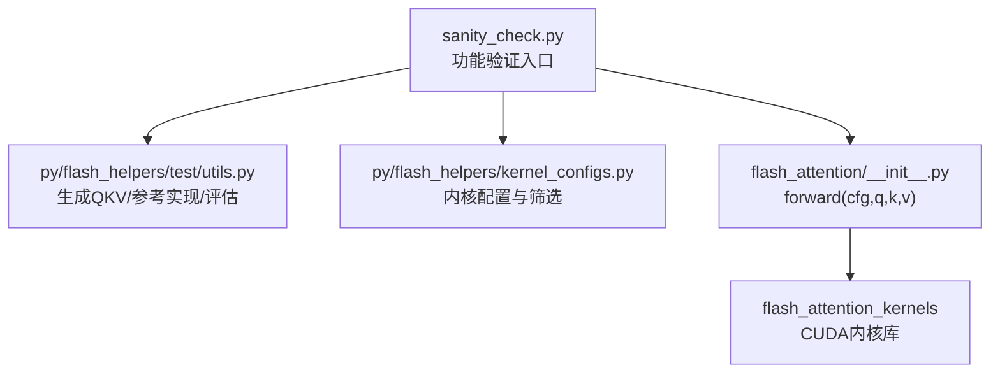
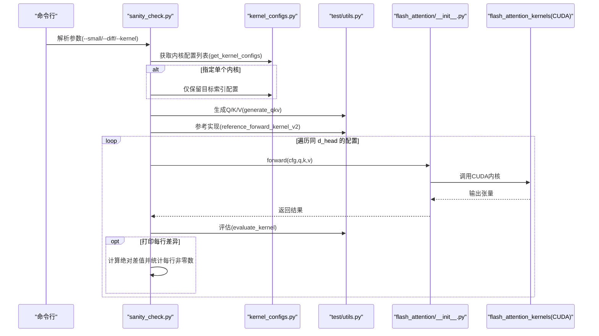
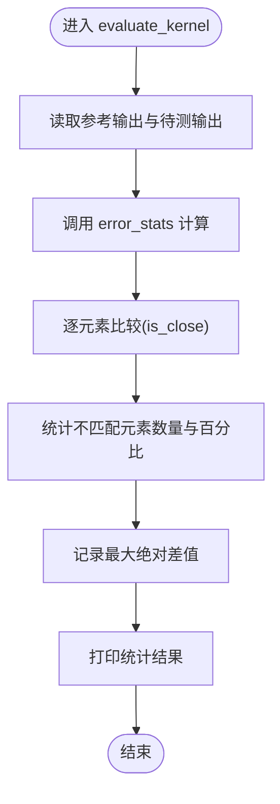
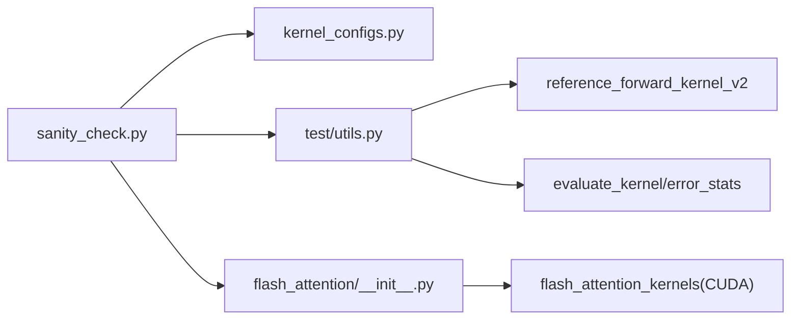

# 功能验证工具

<cite>
**本文引用的文件**
- [sanity_check.py](file://tools/debug/sanity_check.py)
- [utils.py](file://py/flash_helpers/test/utils.py)
- [kernel_configs.py](file://py/flash_helpers/kernel_configs.py)
- [__init__.py](file://flash_attention/__init__.py)
- [test.py](file://py/flash_helpers/test/test.py)
- [README.md](file://README.md)
</cite>

## 目录
1. [简介](#简介)
2. [项目结构](#项目结构)
3. [核心组件](#核心组件)
4. [架构总览](#架构总览)
5. [详细组件分析](#详细组件分析)
6. [依赖关系分析](#依赖关系分析)
7. [性能考量](#性能考量)
8. [故障排查指南](#故障排查指南)
9. [结论](#结论)
10. [附录：工作流与最佳实践](#附录工作流与最佳实践)

## 简介
本文件围绕工具脚本 tools/debug/sanity_check.py 的功能验证能力展开，系统阐述其如何通过生成测试数据、调用参考实现进行对比验证，并评估内核输出的正确性。文档重点说明：
- generate_qkv 如何生成符合配置的 Q/K/V 输入；
- reference_forward_kernel_v2 提供参考实现用于对比；
- evaluate_kernel 对比并报告数值一致性与最大绝对误差；
- 结合 get_kernel_configs 批量验证多个内核配置；
- 开发新内核版本时的完整工作流，包括通过 --kernel 指定配置与通过 --print_diffs 分析差异；
- 如何扩展测试用例以覆盖边界条件。

## 项目结构
sanity_check.py 位于 tools/debug 目录下，是面向开发调试的功能验证工具；其依赖 py/flash_helpers 下的测试工具与内核配置模块，以及 flash_attention 包提供的 forward 接口。

图表来源
- [sanity_check.py](file://tools/debug/sanity_check.py#L1-L78)
- [utils.py](file://py/flash_helpers/test/utils.py#L1-L202)
- [kernel_configs.py](file://py/flash_helpers/kernel_configs.py#L1-L486)
- [__init__.py](file://flash_attention/__init__.py#L1-L18)

章节来源
- [sanity_check.py](file://tools/debug/sanity_check.py#L1-L78)
- [README.md](file://README.md#L1-L63)

## 核心组件
- 输入生成器：generate_qkv 基于 QKVConfig 生成随机张量，确保形状与设备一致。
- 参考实现：reference_forward_kernel_v2 调用官方 CUDA 内核（flash_attn_2_cuda）作为“黄金标准”。
- 评估器：evaluate_kernel 使用 error_stats 计算不匹配元素数量、百分比与最大绝对差值。
- 内核配置：get_kernel_configs 返回候选配置集合，支持按环境变量或索引筛选。
- 前向接口：flash_attention.forward 将配置与输入传递给底层 CUDA 内核。

章节来源
- [utils.py](file://py/flash_helpers/test/utils.py#L112-L175)
- [utils.py](file://py/flash_helpers/test/utils.py#L58-L77)
- [kernel_configs.py](file://py/flash_helpers/kernel_configs.py#L465-L486)
- [__init__.py](file://flash_attention/__init__.py#L7-L11)

## 架构总览
sanity_check 的执行流程如下：

图表来源
- [sanity_check.py](file://tools/debug/sanity_check.py#L15-L78)
- [kernel_configs.py](file://py/flash_helpers/kernel_configs.py#L465-L486)
- [utils.py](file://py/flash_helpers/test/utils.py#L112-L175)
- [__init__.py](file://flash_attention/__init__.py#L7-L11)

## 详细组件分析

### 输入生成与形状约定
- generate_qkv 依据 QKVConfig 生成 q/k/v，形状为 (batch, seq, heads, d_head)，类型与设备由配置决定。
- sanity_check 在 d_head 固定时，筛选出相同 d_head 的配置参与对比，保证比较公平。

章节来源
- [utils.py](file://py/flash_helpers/test/utils.py#L112-L122)
- [sanity_check.py](file://tools/debug/sanity_check.py#L48-L68)

### 参考实现与数值基准
- reference_forward_kernel_v2 调用 flash_attn_2_cuda.fwd 作为参考输出，用于与自研内核输出对比。
- sanity_check 将自研内核输出 reshape 为输入形状后与参考输出进行逐元素比较。

章节来源
- [utils.py](file://py/flash_helpers/test/utils.py#L58-L77)
- [sanity_check.py](file://tools/debug/sanity_check.py#L60-L68)

### 评估器：数值精度与差异分析
- evaluate_kernel 调用 error_stats，计算：
  - 不匹配元素数量与占比（默认 atol=1e-5, rtol=1e-3）
  - 最大绝对差值
- sanity_check 在 --print_diffs 开启时，按行统计绝对差值超过阈值的元素数量，便于定位局部异常区域。

图表来源
- [utils.py](file://py/flash_helpers/test/utils.py#L165-L175)
- [utils.py](file://py/flash_helpers/test/utils.py#L177-L185)
- [sanity_check.py](file://tools/debug/sanity_check.py#L69-L74)

章节来源
- [utils.py](file://py/flash_helpers/test/utils.py#L165-L185)
- [sanity_check.py](file://tools/debug/sanity_check.py#L69-L74)

### 内核配置批量验证
- get_kernel_configs 支持多种模式：
  - 默认返回自动调优配置集
  - 通过环境变量选择不同策略（如 prog/all/tune 或按 B_r,B_c 过滤）
- sanity_check 会根据 d_head 过滤同组配置，确保同一维度下的多实现相互比较。

章节来源
- [kernel_configs.py](file://py/flash_helpers/kernel_configs.py#L465-L486)
- [sanity_check.py](file://tools/debug/sanity_check.py#L44-L68)

### 前向接口与 CUDA 内核交互
- flash_attention.forward 将配置与 Q/K/V 传入 flash_attention_kernels.forward，并返回输出张量。
- sanity_check 通过循环遍历配置，依次调用前向接口并进行对比。

章节来源
- [__init__.py](file://flash_attention/__init__.py#L7-L11)
- [sanity_check.py](file://tools/debug/sanity_check.py#L65-L68)

## 依赖关系分析
sanity_check 的关键依赖链路如下：

图表来源
- [sanity_check.py](file://tools/debug/sanity_check.py#L1-L78)
- [kernel_configs.py](file://py/flash_helpers/kernel_configs.py#L1-L486)
- [utils.py](file://py/flash_helpers/test/utils.py#L1-L202)
- [__init__.py](file://flash_attention/__init__.py#L1-L18)

章节来源
- [sanity_check.py](file://tools/debug/sanity_check.py#L1-L78)
- [kernel_configs.py](file://py/flash_helpers/kernel_configs.py#L1-L486)
- [utils.py](file://py/flash_helpers/test/utils.py#L1-L202)
- [__init__.py](file://flash_attention/__init__.py#L1-L18)

## 性能考量
- sanity_check 主要用于功能正确性验证，而非性能基准。其默认使用较大的 batch/seq/head 规模，有助于发现数值稳定性问题。
- 若需更全面的性能评估，可参考 py/flash_helpers/test/test.py 中的单元测试与 py/flash_helpers/benchmark 相关工具。

[本节为通用建议，无需列出具体文件来源]

## 故障排查指南
- CUDA 设备不可用：确认 CUDA 可用且设备名称满足要求；工具内部有设备信息查询辅助函数。
- 张量形状不匹配：确保 d_head 与输入形状一致，参考 sanity_check 中的 reshape 步骤。
- 数值差异过大：检查是否使用了正确的参考实现（reference_forward_kernel_v2），并确认 dtype 与设备一致。
- 单内核调试：使用 --kernel 指定索引快速定位问题；结合 --diff 查看每行差异，缩小异常范围。

章节来源
- [utils.py](file://py/flash_helpers/test/utils.py#L187-L202)
- [sanity_check.py](file://tools/debug/sanity_check.py#L15-L78)

## 结论
sanity_check.py 提供了从输入生成、参考实现对比到评估统计的一体化验证流程，适合在开发新内核版本时进行快速回归与差异定位。通过 --kernel 与 --diff 参数，开发者可以高效聚焦特定配置与局部异常区域，提升迭代效率。

[本节为总结性内容，无需列出具体文件来源]

## 附录：工作流与最佳实践

### 完整工作流（开发新内核版本）
- 准备阶段
  - 确保已安装并构建 flash_attention 与 flash_helpers 包。
  - 确认 CUDA 设备可用且计算能力满足要求。
- 基线对比
  - 运行 sanity_check.py，默认批量验证当前内核配置集，观察整体一致性与最大误差。
- 精准定位
  - 使用 --kernel 指定某个配置索引进行单点测试，快速确认问题是否与该配置相关。
  - 使用 --diff 打印每行差异统计，识别局部异常区域。
- 边界条件扩展
  - 修改 sanity_check 的 d_head 列表或输入规模，覆盖更多维度与序列长度组合。
  - 通过 kernel_configs 的过滤逻辑，添加更多 d_head 或 B_r/B_c 组合参与对比。
- 与单元测试协同
  - 可参考 py/flash_helpers/test/test.py 的参数化测试方式，将 sanity_check 的思路纳入持续集成。

章节来源
- [sanity_check.py](file://tools/debug/sanity_check.py#L15-L78)
- [kernel_configs.py](file://py/flash_helpers/kernel_configs.py#L465-L486)
- [test.py](file://py/flash_helpers/test/test.py#L1-L104)
- [README.md](file://README.md#L1-L63)