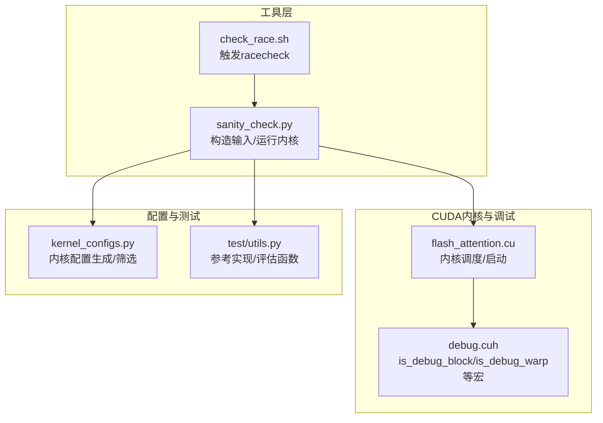
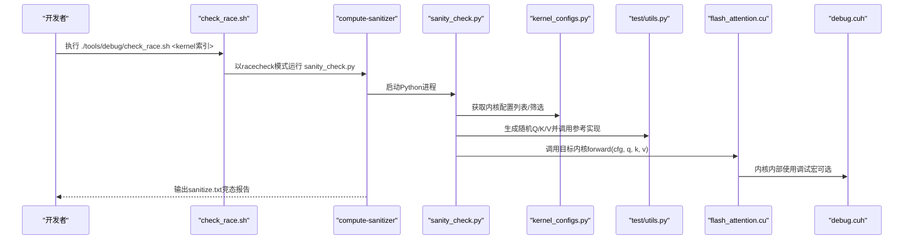
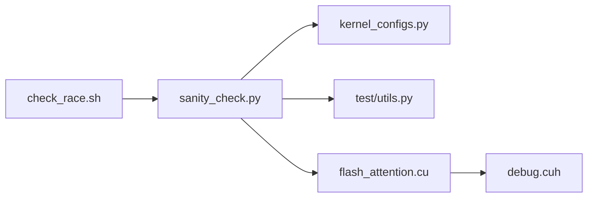

# 竞态条件检测

<cite>
**本文引用的文件**
- [tools/debug/check_race.sh](file://tools/debug/check_race.sh)
- [tools/debug/sanity_check.py](file://tools/debug/sanity_check.py)
- [src/include/debug.cuh](file://src/include/debug.cuh)
- [src/flash_attention.cu](file://src/flash_attention.cu)
- [py/flash_helpers/kernel_configs.py](file://py/flash_helpers/kernel_configs.py)
- [py/flash_helpers/test/utils.py](file://py/flash_helpers/test/utils.py)
</cite>

## 目录
1. [简介](#简介)
2. [项目结构](#项目结构)
3. [核心组件](#核心组件)
4. [架构总览](#架构总览)
5. [详细组件分析](#详细组件分析)
6. [依赖关系分析](#依赖关系分析)
7. [性能考量](#性能考量)
8. [故障排查指南](#故障排查指南)
9. [结论](#结论)
10. [附录](#附录)

## 简介
本文件聚焦于竞态条件检测，系统性讲解如何使用仓库中的脚本与工具链定位并分析CUDA内核中的共享内存竞态问题。重点覆盖：
- 使用脚本触发compute-sanitizer racecheck进行竞态检测
- 通过传递kernel参数选择具体内核配置进行针对性检测
- 结合src/include/debug.cuh中的调试宏在特定线程块与warp中启用竞态检测
- 分析sanitize.txt输出中的竞态报告，形成从发现问题到定位代码位置的完整诊断流程

## 项目结构
围绕竞态检测的相关文件组织如下：
- 工具层：tools/debug/check_race.sh、tools/debug/sanity_check.py
- CUDA内核与调试：src/flash_attention.cu、src/include/debug.cuh
- 内核配置与测试：py/flash_helpers/kernel_configs.py、py/flash_helpers/test/utils.py

图表来源
- [tools/debug/check_race.sh](file://tools/debug/check_race.sh#L1-L4)
- [tools/debug/sanity_check.py](file://tools/debug/sanity_check.py#L1-L78)
- [src/flash_attention.cu](file://src/flash_attention.cu#L1-L150)
- [src/include/debug.cuh](file://src/include/debug.cuh#L1-L120)
- [py/flash_helpers/kernel_configs.py](file://py/flash_helpers/kernel_configs.py#L1-L120)
- [py/flash_helpers/test/utils.py](file://py/flash_helpers/test/utils.py#L1-L120)

章节来源
- [tools/debug/check_race.sh](file://tools/debug/check_race.sh#L1-L4)
- [tools/debug/sanity_check.py](file://tools/debug/sanity_check.py#L1-L78)
- [src/flash_attention.cu](file://src/flash_attention.cu#L1-L150)
- [src/include/debug.cuh](file://src/include/debug.cuh#L1-L120)
- [py/flash_helpers/kernel_configs.py](file://py/flash_helpers/kernel_configs.py#L1-L120)
- [py/flash_helpers/test/utils.py](file://py/flash_helpers/test/utils.py#L1-L120)

## 核心组件
- 竞态检测入口脚本：tools/debug/check_race.sh
  - 调用compute-sanitizer --tool racecheck，将sanity_check.py作为被测程序，传入--kernel=<索引>与--small标志，输出至debug/sanitize.txt
- 内核运行与对比：tools/debug/sanity_check.py
  - 解析命令行参数，按需缩小规模；根据--kernel选择单个内核配置；生成随机Q/K/V；调用参考实现与目标内核，计算差异并打印
- 内核调度与启动：src/flash_attention.cu
  - 将Python侧传入的内核配置映射为C++结构体，校验约束后构建gridDim/blockDim，设置动态共享内存属性并启动内核
- 内核配置与筛选：py/flash_helpers/kernel_configs.py
  - 定义FlashForwardKernelConfig数据类，提供短格式字符串、解析与筛选逻辑；支持按环境变量或键值选择内核集合
- 参考实现与评估：py/flash_helpers/test/utils.py
  - 提供reference_forward_kernel_v2等参考实现；封装generate_qkv、evaluate_kernel等辅助函数
- 调试宏与限定执行范围：src/include/debug.cuh
  - 提供is_debug_block、is_debug_warp等设备端宏，用于在特定线程块与warp中打印调试信息，便于缩小竞态发生范围

章节来源
- [tools/debug/check_race.sh](file://tools/debug/check_race.sh#L1-L4)
- [tools/debug/sanity_check.py](file://tools/debug/sanity_check.py#L1-L78)
- [src/flash_attention.cu](file://src/flash_attention.cu#L1-L150)
- [py/flash_helpers/kernel_configs.py](file://py/flash_helpers/kernel_configs.py#L1-L120)
- [py/flash_helpers/test/utils.py](file://py/flash_helpers/test/utils.py#L1-L120)
- [src/include/debug.cuh](file://src/include/debug.cuh#L1-L120)

## 架构总览
下图展示从脚本到内核执行与竞态检测的整体流程。

图表来源
- [tools/debug/check_race.sh](file://tools/debug/check_race.sh#L1-L4)
- [tools/debug/sanity_check.py](file://tools/debug/sanity_check.py#L1-L78)
- [src/flash_attention.cu](file://src/flash_attention.cu#L1-L150)
- [src/include/debug.cuh](file://src/include/debug.cuh#L1-L120)
- [py/flash_helpers/kernel_configs.py](file://py/flash_helpers/kernel_configs.py#L1-L120)
- [py/flash_helpers/test/utils.py](file://py/flash_helpers/test/utils.py#L1-L120)

## 详细组件分析

### 组件A：竞态检测脚本 check_race.sh
- 功能要点
  - 接收一个kernel参数，表示要检测的目标内核在配置列表中的索引
  - 通过compute-sanitizer --tool racecheck包装sanity_check.py，开启racecheck工具对共享内存访问进行竞态检测
  - 将--small标志传递给sanity_check.py，以便快速复现问题
  - 输出重定向到debug/sanitize.txt，便于后续分析
- 使用建议
  - 在同一终端会话中先确保CUDA环境与compute-sanitizer可用
  - 建议先用--small快速验证，再逐步扩大规模
  - 若需要仅检测某配置，使用--kernel=<索引>精确指定

章节来源
- [tools/debug/check_race.sh](file://tools/debug/check_race.sh#L1-L4)

### 组件B：sanity_check.py 的内核选择与运行流程
- 关键点
  - 解析参数：--small控制输入规模；--diff控制是否打印逐行差异；--kernel指定内核索引
  - 内核配置筛选：当--kernel>=0时，仅保留对应索引的配置项
  - 输入生成：按配置生成随机Q/K/V张量
  - 对比与评估：调用参考实现与目标内核，计算差错统计；可选打印每行差异
  - 运行路径：通过flash_attention.forward(cfg, q, k, v)触发内核执行
- 与竞态检测的关系
  - sanity_check.py是racecheck的直接被测程序，其内部调用flash_attention.cu中的内核，racecheck会捕获其中的共享内存竞态

章节来源
- [tools/debug/sanity_check.py](file://tools/debug/sanity_check.py#L1-L78)
- [py/flash_helpers/test/utils.py](file://py/flash_helpers/test/utils.py#L1-L120)

### 组件C：内核调度与启动 flash_attention.cu
- 关键点
  - Python侧将内核配置转换为C++结构体，进行类型与尺寸校验
  - 计算gridDim与blockDim，设置动态共享内存上限
  - 调用<<<gridDim, blockDim, smem_bytes, stream>>>(args)启动内核
- 与竞态检测的关系
  - 内核启动参数与共享内存大小直接影响racecheck的检测范围与精度
  - 若内核使用大量动态共享内存，需确保已正确设置最大动态共享内存属性

章节来源
- [src/flash_attention.cu](file://src/flash_attention.cu#L1-L150)

### 组件D：内核配置与筛选 kernel_configs.py
- 关键点
  - 定义FlashForwardKernelConfig数据类，包含dtype、d_head、B_r、B_c、n_warps、async_copy、eager_load_blocks、swizzled、Q/K/V的mma加载瓦片数、双缓冲、优化softmax等字段
  - 提供短格式字符串与解析函数，支持从名称推导配置
  - 提供多种内核集合生成策略（自动调优、进度推进等），并通过环境变量或键值选择
- 与竞态检测的关系
  - sanity_check.py通过该模块获取配置列表，配合--kernel参数实现对特定配置的精准检测

章节来源
- [py/flash_helpers/kernel_configs.py](file://py/flash_helpers/kernel_configs.py#L1-L120)

### 组件E：调试宏与限定执行范围 debug.cuh
- 关键点
  - 提供is_debug_block与is_debug_warp等设备端宏，用于在特定线程块与warp中执行打印与检查
  - 通过常量debug_warp_rank与debug_block设定默认目标
  - 提供printf_leader、printf_warp等便捷宏，便于在竞态发生时仅在关键warp中输出
- 与竞态检测的关系
  - 在竞态发生时，可通过这些宏将调试输出限制在可能产生竞态的线程块与warp范围内，降低噪声、提升定位效率
  - 注意：这些宏主要用于调试输出，不改变内核逻辑；竞态检测主要由racecheck完成

章节来源
- [src/include/debug.cuh](file://src/include/debug.cuh#L1-L120)

### 组件F：参考实现与评估 test/utils.py
- 关键点
  - 提供reference_forward_kernel_v2等参考实现，用于与目标内核结果对比
  - 提供generate_qkv生成输入，evaluate_kernel计算误差统计
- 与竞态检测的关系
  - sanity_check.py在运行目标内核前先运行参考实现，得到期望输出，从而判断内核行为是否异常；异常可能与竞态有关

章节来源
- [py/flash_helpers/test/utils.py](file://py/flash_helpers/test/utils.py#L1-L120)

## 依赖关系分析
- 脚本到Python：check_race.sh依赖sanity_check.py
- Python到内核：sanity_check.py依赖kernel_configs.py与test/utils.py，并最终调用flash_attention.cu
- 内核到调试：flash_attention.cu内部可使用debug.cuh中的调试宏
- 配置到内核：kernel_configs.py提供内核配置，影响内核启动参数与共享内存需求

图表来源
- [tools/debug/check_race.sh](file://tools/debug/check_race.sh#L1-L4)
- [tools/debug/sanity_check.py](file://tools/debug/sanity_check.py#L1-L78)
- [src/flash_attention.cu](file://src/flash_attention.cu#L1-L150)
- [src/include/debug.cuh](file://src/include/debug.cuh#L1-L120)
- [py/flash_helpers/kernel_configs.py](file://py/flash_helpers/kernel_configs.py#L1-L120)
- [py/flash_helpers/test/utils.py](file://py/flash_helpers/test/utils.py#L1-L120)

章节来源
- [tools/debug/check_race.sh](file://tools/debug/check_race.sh#L1-L4)
- [tools/debug/sanity_check.py](file://tools/debug/sanity_check.py#L1-L78)
- [src/flash_attention.cu](file://src/flash_attention.cu#L1-L150)
- [src/include/debug.cuh](file://src/include/debug.cuh#L1-L120)
- [py/flash_helpers/kernel_configs.py](file://py/flash_helpers/kernel_configs.py#L1-L120)
- [py/flash_helpers/test/utils.py](file://py/flash_helpers/test/utils.py#L1-L120)

## 性能考量
- racecheck开销
  - racecheck会对共享内存访问进行细粒度跟踪，带来显著运行时开销；建议优先使用--small进行快速定位，再在必要时扩大规模
- 内核启动参数
  - 大量动态共享内存会增加racecheck的追踪成本；确保已正确设置最大动态共享内存属性，避免因资源不足导致的异常
- 调试宏的影响
  - 在竞态发生时，使用调试宏仅在特定warp中输出，有助于减少输出噪声；但频繁的同步与打印仍会引入额外开销

[本节为通用建议，不直接分析具体文件]

## 故障排查指南
- racecheck未输出或无竞态
  - 确认compute-sanitizer已安装且版本兼容当前CUDA工具链
  - 检查脚本是否正确传入--kernel与--small参数
  - 确保sanity_check.py能够成功调用参考实现与目标内核
- sanitize.txt内容解读
  - 竞态报告通常包含访问冲突的线程、共享内存地址、访问类型（读/写）等信息
  - 结合内核源码定位共享内存访问点，关注跨warp或跨CTA的非同步访问
- 调试宏辅助定位
  - 在可能发生竞态的关键路径附近使用is_debug_block/is_debug_warp等宏，仅在目标warp中输出，缩小问题范围
  - 若竞态只在特定线程块/线程束出现，可调整debug.cuh中的debug_block与debug_warp_rank常量以匹配实际场景

章节来源
- [tools/debug/check_race.sh](file://tools/debug/check_race.sh#L1-L4)
- [tools/debug/sanity_check.py](file://tools/debug/sanity_check.py#L1-L78)
- [src/include/debug.cuh](file://src/include/debug.cuh#L1-L120)

## 结论
通过check_race.sh与sanity_check.py的组合，可以系统化地对特定内核配置进行共享内存竞态检测。结合kernel_configs.py提供的配置筛选能力与debug.cuh的调试宏，能够在复杂内核中快速收敛问题范围，最终将竞态报告与源码路径关联，形成闭环的诊断流程。

[本节为总结，不直接分析具体文件]

## 附录

### 使用步骤速查
- 选择内核配置
  - 使用kernel_configs.py生成或筛选目标配置集
- 运行竞态检测
  - 执行tools/debug/check_race.sh <kernel索引>，其中<kernel索引>对应配置列表中的序号
- 分析输出
  - 查看debug/sanitize.txt中的竞态报告，结合内核源码定位共享内存访问冲突
- 缩小范围
  - 在内核源码中使用is_debug_block/is_debug_warp等宏，仅在目标warp中输出，加速定位

章节来源
- [tools/debug/check_race.sh](file://tools/debug/check_race.sh#L1-L4)
- [tools/debug/sanity_check.py](file://tools/debug/sanity_check.py#L1-L78)
- [py/flash_helpers/kernel_configs.py](file://py/flash_helpers/kernel_configs.py#L1-L120)
- [src/include/debug.cuh](file://src/include/debug.cuh#L1-L120)