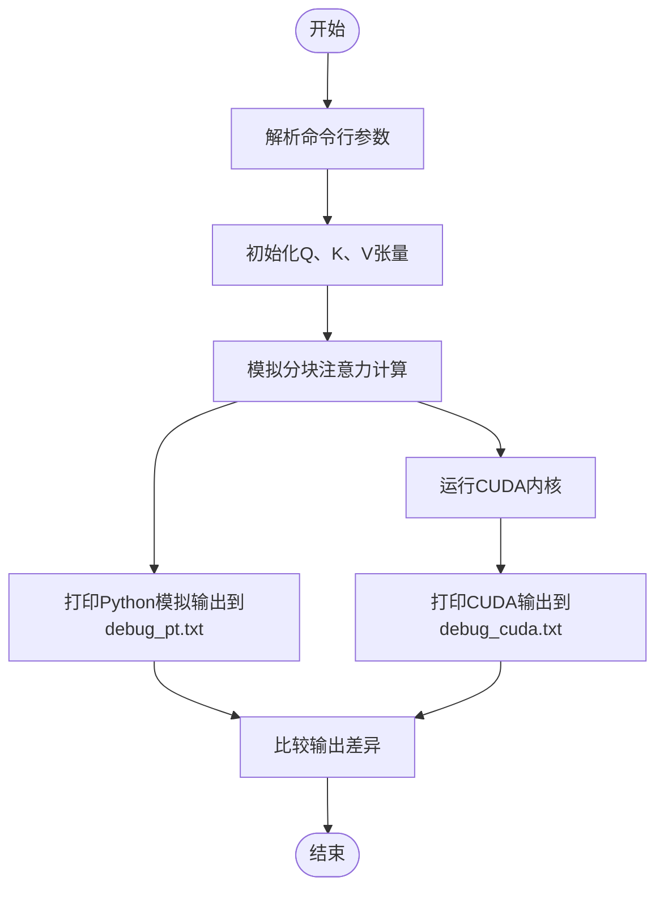
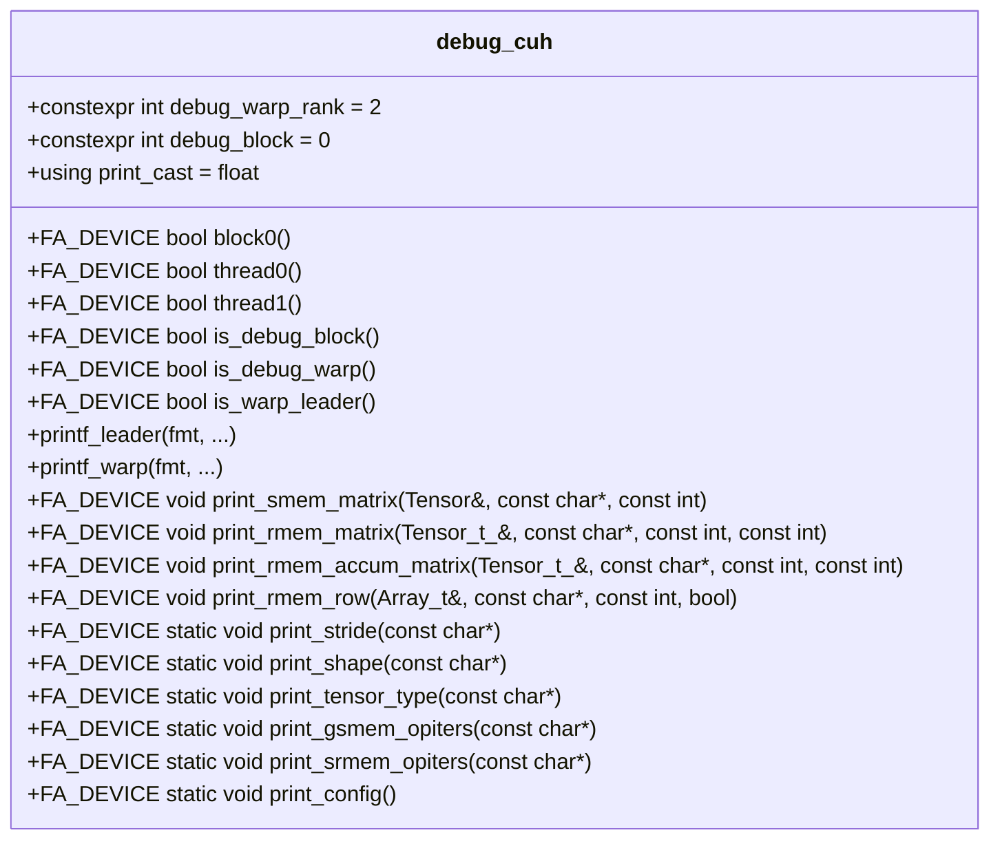

# 调试工具

<cite>
**本文档中引用的文件**   
- [sanity_check.py](file://tools/debug/sanity_check.py)
- [debug.py](file://tools/debug/debug.py)
- [check_race.sh](file://tools/debug/check_race.sh)
- [debug.cuh](file://src/include/debug.cuh)
- [forward_kernel.cuh](file://src/include/forward_kernel.cuh)
- [utils.py](file://py/flash_helpers/test/utils.py)
- [kernel_configs.py](file://py/flash_helpers/kernel_configs.py)
</cite>

## 目录
1. [简介](#简介)
2. [sanity_check.py：功能验证](#sanity_checkpy功能验证)
3. [debug.py：高级调试功能](#debugpy高级调试功能)
4. [check_race.sh：竞态条件检测](#check_racesh竞态条件检测)
5. [debug.cuh：CUDA调试宏](#debugcuhcuda调试宏)
6. [典型工作流示例](#典型工作流示例)
7. [常见错误模式与调试策略](#常见错误模式与调试策略)
8. [结论](#结论)

## 简介
本文档深入探讨Flash Attention项目中的调试工具集，旨在为开发者提供一套完整的验证、诊断和调试方法。文档详细说明了`sanity_check.py`如何执行基础功能测试以验证新内核实现的正确性，包括输入输出一致性检查和数值精度验证。同时，解释了`debug.py`的高级调试功能，如内核参数打印、内存访问越界检测和中间状态dump。此外，文档描述了`check_race.sh`脚本如何利用CUDA工具检测共享内存竞态条件，并结合`src/include/debug.cuh`中的调试宏，指导开发者在CUDA代码中添加有效的调试信息。最后，文档提供了使用这些工具的典型工作流示例，并总结了常见错误模式的识别方法和相应的调试策略。

## sanity_check.py：功能验证

`sanity_check.py`是用于验证Flash Attention内核实现正确性的核心工具。它通过与参考实现进行比较，执行基础功能测试，确保新内核的输出与预期结果一致。该脚本支持小规模和大规模测试，允许开发者在不同配置下验证内核的准确性。

脚本首先解析命令行参数，确定测试规模和是否打印差异。然后，它根据配置生成查询（Q）、键（K）和值（V）张量，并使用`reference_forward_kernel_v2`函数计算参考输出。接着，脚本遍历所有可用的内核配置，执行`flash_attention.forward`函数，并使用`evaluate_kernel`函数评估每个内核的输出与参考输出之间的差异。如果启用了`print_diffs`选项，脚本会打印出超出阈值的差异。

**Section sources**
- [sanity_check.py](file://tools/debug/sanity_check.py#L1-L78)
- [utils.py](file://py/flash_helpers/test/utils.py#L58-L77)

## debug.py：高级调试功能

`debug.py`提供了更高级的调试功能，允许开发者深入分析内核的内部状态和行为。该脚本通过模拟和打印中间计算结果，帮助识别和诊断复杂的错误。

脚本的核心功能是`block_flash_attention`函数，它模拟了Flash Attention的分块计算过程。该函数将输入张量分割成块，并逐块计算注意力。在计算过程中，它可以打印出查询（Q）、键（K）、值（V）、注意力分数（S）、归一化因子（M和L）、概率（P）和输出（O）等中间结果。通过比较这些中间结果与CUDA内核的实际输出，开发者可以精确定位错误的来源。

`main`函数负责解析命令行参数，初始化输入张量，并调用`block_flash_attention`函数。它还支持使用范围值初始化张量，以便于调试和验证。脚本将Python模拟的输出和CUDA内核的输出分别写入`debug_pt.txt`和`debug_cuda.txt`文件，方便开发者进行对比分析。

**Diagram sources **
- [debug.py](file://tools/debug/debug.py#L40-L153)
- [debug.py](file://tools/debug/debug.py#L161-L253)

**Section sources**
- [debug.py](file://tools/debug/debug.py#L1-L253)

## check_race.sh：竞态条件检测

`check_race.sh`是一个Shell脚本，用于检测CUDA内核中的共享内存竞态条件。它利用NVIDIA的Compute Sanitizer工具，通过静态和动态分析来识别潜在的内存访问冲突。

脚本接受一个内核索引作为参数，并调用`compute-sanitizer`工具，指定`--tool racecheck`选项来启用竞态条件检查。然后，它运行`sanity_check.py`脚本，传递指定的内核索引和小规模测试标志。`compute-sanitizer`会监控CUDA内核的执行，检测不同线程对共享内存的并发读写操作，并将检测结果输出到`debug/sanitize.txt`文件中。

通过使用此脚本，开发者可以在开发早期发现并修复竞态条件问题，避免在生产环境中出现难以复现的随机错误。

**Section sources**
- [check_race.sh](file://tools/debug/check_race.sh#L1-L4)

## debug.cuh：CUDA调试宏

`src/include/debug.cuh`头文件定义了一系列用于CUDA内核调试的宏和函数。这些工具允许开发者在GPU代码中插入调试信息，打印共享内存和寄存器内存中的数据，以及检查内核配置。

该文件定义了`is_debug_block`和`is_debug_warp`等函数，用于确定当前执行的线程块和线程束是否为调试目标。`printf_leader`和`printf_warp`宏则用于在指定的线程上打印调试信息。此外，文件还提供了`print_smem_matrix`、`print_rmem_matrix`和`print_config`等模板函数，用于打印共享内存矩阵、寄存器内存矩阵和内核配置的详细信息。

通过在CUDA内核中调用这些函数，开发者可以获取内核执行过程中的详细状态信息，这对于诊断数值溢出、内存越界和逻辑错误至关重要。

**Diagram sources **
- [debug.cuh](file://src/include/debug.cuh#L1-L524)

**Section sources**
- [debug.cuh](file://src/include/debug.cuh#L1-L524)
- [forward_kernel.cuh](file://src/include/forward_kernel.cuh#L9-L16)

## 典型工作流示例

当开发者修改`forward_kernel.cuh`后，应遵循以下典型工作流进行完整验证：

1.  **功能验证**：首先运行`sanity_check.py`脚本，确保新内核的输出与参考实现一致。这可以快速发现明显的功能错误。
2.  **竞态条件检测**：使用`check_race.sh`脚本对新内核进行竞态条件检查，确保没有共享内存访问冲突。
3.  **高级调试**：如果功能验证失败，使用`debug.py`脚本进行深入分析。通过比较Python模拟和CUDA内核的中间状态，定位错误的具体位置。
4.  **CUDA内核调试**：在`forward_kernel.cuh`中添加`debug.cuh`提供的调试宏，打印关键变量的值，验证计算逻辑的正确性。
5.  **迭代优化**：根据调试结果修改代码，并重复上述步骤，直到所有测试通过。

此工作流确保了新内核实现的正确性和稳定性。

**Section sources**
- [sanity_check.py](file://tools/debug/sanity_check.py#L1-L78)
- [check_race.sh](file://tools/debug/check_race.sh#L1-L4)
- [debug.py](file://tools/debug/debug.py#L1-L253)
- [debug.cuh](file://src/include/debug.cuh#L1-L524)
- [forward_kernel.cuh](file://src/include/forward_kernel.cuh#L1-L207)

## 常见错误模式与调试策略

### softmax数值溢出
**识别方法**：在`debug.py`的输出中，如果`S_pre_scaling`或`P`矩阵的值出现`inf`或`nan`，则表明发生了数值溢出。
**调试策略**：检查`softmax_scale`的计算是否正确，确保其值足够小以防止指数运算溢出。可以在`local_softmax`函数中添加调试打印，验证中间计算结果。

### 块间同步问题
**识别方法**：`check_race.sh`脚本报告共享内存竞态条件，或`debug.py`的输出显示不同块的计算结果不一致。
**调试策略**：检查`__syncthreads()`调用的位置是否正确，确保所有线程在访问共享内存前都已完成必要的计算。使用`debug.cuh`中的`print_smem_matrix`函数，在同步点前后打印共享内存内容，验证数据一致性。

### 内存访问越界
**识别方法**：CUDA运行时报告非法内存访问错误，或`debug.py`的输出显示张量形状与预期不符。
**调试策略**：使用`debug.cuh`中的`print_config`函数打印内核配置，验证`B_r`、`B_c`和`d_head`等参数是否正确。在`load_store.cuh`相关的代码中添加边界检查，确保内存访问在有效范围内。

**Section sources**
- [debug.py](file://tools/debug/debug.py#L102-L153)
- [check_race.sh](file://tools/debug/check_race.sh#L1-L4)
- [debug.cuh](file://src/include/debug.cuh#L22-L42)
- [forward_kernel.cuh](file://src/include/forward_kernel.cuh#L149-L152)

## 结论
本文档全面介绍了Flash Attention项目中的调试工具集，包括`sanity_check.py`、`debug.py`、`check_race.sh`和`debug.cuh`。这些工具为开发者提供了从功能验证到高级调试的完整解决方案，能够有效识别和诊断内核实现中的各种错误。通过遵循推荐的典型工作流和调试策略，开发者可以确保新内核的正确性、稳定性和高性能。掌握这些调试工具的使用方法，对于开发和维护复杂的CUDA内核至关重要。