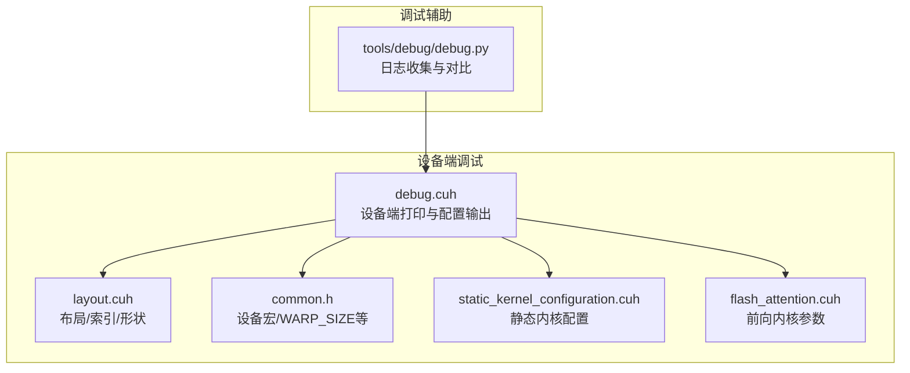
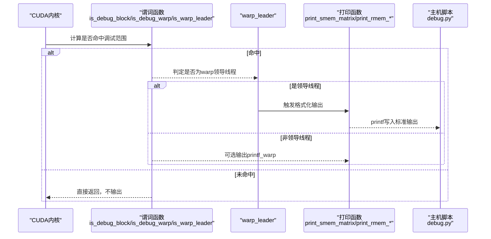
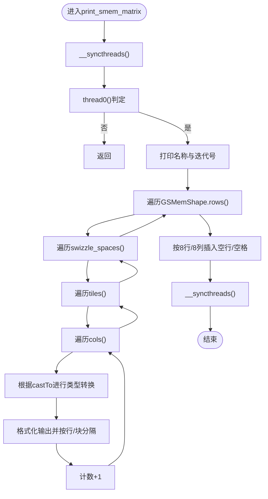
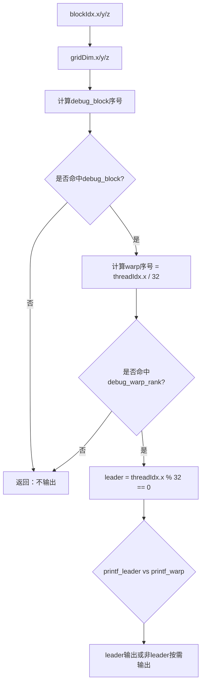
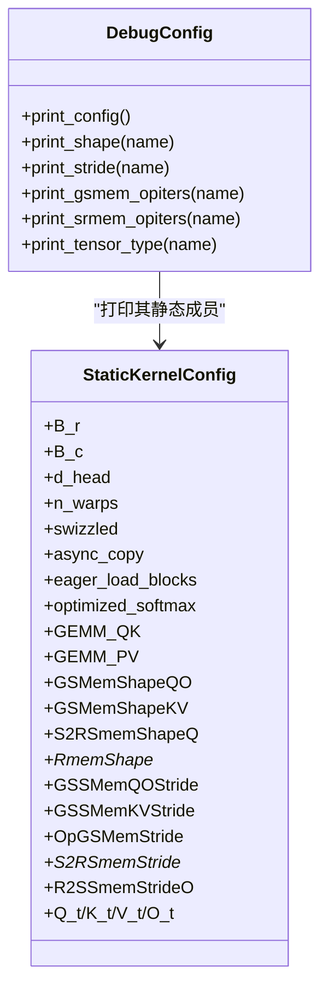
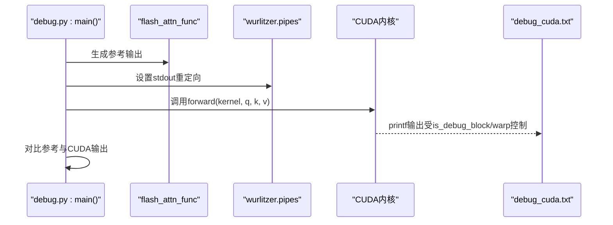
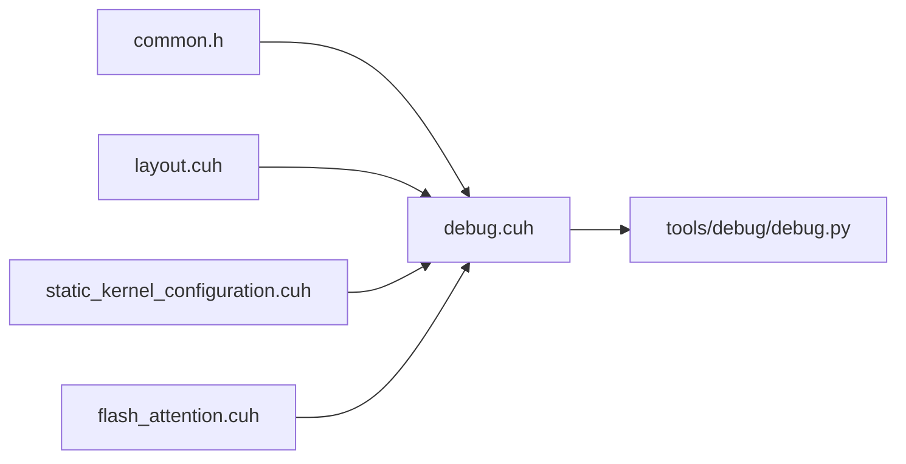

# CUDA内核调试集成

<cite>
**本文引用的文件**
- [src/include/debug.cuh](file://src/include/debug.cuh)
- [tools/debug/debug.py](file://tools/debug/debug.py)
- [src/include/common.h](file://src/include/common.h)
- [src/include/layout.cuh](file://src/include/layout.cuh)
- [src/include/static_kernel_configuration.cuh](file://src/include/static_kernel_configuration.cuh)
- [src/include/flash_attention.cuh](file://src/include/flash_attention.cuh)
</cite>

## 目录
1. [简介](#简介)
2. [项目结构](#项目结构)
3. [核心组件](#核心组件)
4. [架构总览](#架构总览)
5. [详细组件分析](#详细组件分析)
6. [依赖关系分析](#依赖关系分析)
7. [性能考量](#性能考量)
8. [故障排查指南](#故障排查指南)
9. [结论](#结论)
10. [附录：调试工作流与最佳实践](#附录调试工作流与最佳实践)

## 简介
本文件系统化文档化了项目中基于CUDA的内核调试功能，重点覆盖以下方面：
- 设备端打印函数：print_rmem_matrix、print_smem_matrix、print_rmem_accum_matrix、print_rmem_row 的实现原理、模板参数、类型转换与内存布局处理。
- 调试范围控制谓词：is_debug_block、is_debug_warp、is_warp_leader 如何协同限制输出规模，避免海量日志。
- warp_leader 协调机制：通过 warp 内同步与领导线程输出，保证调试信息有序性。
- print_config：如何输出完整的内核配置信息，用于验证编译时参数。
- 实践工作流：如何在实际开发中启用调试功能，并结合 Python 辅助脚本分析日志。

## 项目结构
与调试功能直接相关的代码分布在如下模块：
- 设备端调试工具与谓词：src/include/debug.cuh
- 常量与设备宏：src/include/common.h
- 内存布局与索引：src/include/layout.cuh
- 静态内核配置与张量形状：src/include/static_kernel_configuration.cuh
- 前向内核参数定义：src/include/flash_attention.cuh
- 调试辅助脚本（Python）：tools/debug/debug.py

图表来源
- [src/include/debug.cuh](file://src/include/debug.cuh#L1-L524)
- [src/include/layout.cuh](file://src/include/layout.cuh#L1-L269)
- [src/include/common.h](file://src/include/common.h#L1-L83)
- [src/include/static_kernel_configuration.cuh](file://src/include/static_kernel_configuration.cuh#L1-L294)
- [src/include/flash_attention.cuh](file://src/include/flash_attention.cuh#L1-L110)
- [tools/debug/debug.py](file://tools/debug/debug.py#L1-L253)

章节来源
- [src/include/debug.cuh](file://src/include/debug.cuh#L1-L524)
- [src/include/common.h](file://src/include/common.h#L1-L83)
- [src/include/layout.cuh](file://src/include/layout.cuh#L1-L269)
- [src/include/static_kernel_configuration.cuh](file://src/include/static_kernel_configuration.cuh#L1-L294)
- [src/include/flash_attention.cuh](file://src/include/flash_attention.cuh#L1-L110)
- [tools/debug/debug.py](file://tools/debug/debug.py#L1-L253)

## 核心组件
- 调试常量与类型
  - 调试目标 warp 排名与块选择：debug_warp_rank、debug_block
  - 默认打印类型：print_cast
- 调试谓词
  - is_debug_block：按全局网格坐标选择目标块
  - is_debug_warp：在目标块内按 warp 排名选择目标 warp
  - is_warp_leader：warp 内线线索引为 0 的线程
  - block0/thread0/thread1：简化对块/线程的判断
- 打印宏
  - printf_leader：仅由目标 warp 的领导线程输出
  - printf_warp：仅由目标 warp 输出（非领导线程）
- 设备端打印函数
  - print_smem_matrix：打印共享内存矩阵，支持 swizzle 空间与 tile 迭代
  - print_rmem_matrix：打印寄存器张量矩阵，支持类型2布局与 tile 过滤
  - print_rmem_accum_matrix：打印累加寄存器张量，按列片段步进
  - print_rmem_row：按行打印寄存器数组，支持整 warp 或分段输出
- 配置打印
  - print_config：打印内核配置、形状、步长、OpIters、GEMM 参数等

章节来源
- [src/include/debug.cuh](file://src/include/debug.cuh#L17-L521)
- [src/include/common.h](file://src/include/common.h#L1-L83)

## 架构总览
调试功能围绕“谓词控制 + warp_leader 协调 + 统一打印接口”展开，形成“按需输出”的闭环：
- 通过 is_debug_block/is_debug_warp 限定输出范围，避免全网格日志洪泛
- 通过 is_warp_leader 在 warp 内进行有序输出，减少竞争
- 通过 print_smem_matrix/print_rmem_* 系列函数统一格式化输出
- 通过 print_config 输出完整内核配置，便于验证编译参数

图表来源
- [src/include/debug.cuh](file://src/include/debug.cuh#L22-L51)
- [src/include/debug.cuh](file://src/include/debug.cuh#L43-L51)
- [src/include/debug.cuh](file://src/include/debug.cuh#L52-L165)
- [src/include/debug.cuh](file://src/include/debug.cuh#L167-L270)
- [tools/debug/debug.py](file://tools/debug/debug.py#L233-L239)

## 详细组件分析

### 设备端打印函数族：print_smem_matrix 与 print_rmem_matrix
- 模板参数
  - Tensor：期望具备 GSMemShape/SmemStride 等静态属性
  - castTo：默认使用 print_cast（float），可特化为 int 以打印整数
- 类型转换与格式化
  - 使用 std::is_same_v 进行编译期分支，分别输出整数或浮点格式
- 内存布局处理
  - 共享内存：通过 Tensor::GSMemShape 的 rows/cols/tiles/swizzle_spaces 迭代
  - 寄存器张量：通过 RmemLayout 的 crd2idx/stride 计算偏移；print_rmem_matrix 使用 layout_as_type2，print_rmem_accum_matrix 使用 layout_with_op_tiling_removed
- 同步与范围控制
  - 共享内存打印：在进入/退出时执行 __syncthreads，确保跨线程一致性
  - 寄存器打印：在 warp 内部使用 __syncwarp，避免跨 warp 并发输出
  - 通过 is_debug_warp 控制是否执行打印，is_warp_leader 控制领导线程输出标题与分隔

图表来源
- [src/include/debug.cuh](file://src/include/debug.cuh#L52-L96)
- [src/include/layout.cuh](file://src/include/layout.cuh#L14-L34)

章节来源
- [src/include/debug.cuh](file://src/include/debug.cuh#L52-L165)
- [src/include/layout.cuh](file://src/include/layout.cuh#L14-L34)

### 累加寄存器打印：print_rmem_accum_matrix
- 适用场景：累加阶段的寄存器张量，通常按列片段步进 2，以便成对读取
- 关键差异
  - 使用 layout_with_op_tiling_removed 移除操作平铺，便于线性索引
  - col_fragment 步进为 2，每轮读取两个元素并格式化输出
- 同步策略：与 print_rmem_matrix 相同，使用 __syncwarp 与 warp 内 leader 输出

章节来源
- [src/include/debug.cuh](file://src/include/debug.cuh#L167-L233)
- [src/include/layout.cuh](file://src/include/layout.cuh#L151-L174)

### 行级寄存器打印：print_rmem_row
- 适用场景：按行打印寄存器数组，支持整 warp 或分段输出
- 同步策略：每 4 个线程为一组进行 __syncwarp，leader 线程负责换行

章节来源
- [src/include/debug.cuh](file://src/include/debug.cuh#L235-L270)

### 谓词函数与 warp_leader 协调
- is_debug_block：按全局网格坐标计算目标块编号，仅该块参与调试
- is_debug_warp：在目标块内按 warp 排名选择目标 warp
- is_warp_leader：warp 内线程索引 % 32 == 0 的线程作为 leader
- printf_leader/printf_warp：宏封装，前者仅 leader 输出，后者允许非 leader 输出但受 is_debug_warp 限制

图表来源
- [src/include/debug.cuh](file://src/include/debug.cuh#L30-L51)
- [src/include/debug.cuh](file://src/include/debug.cuh#L43-L51)
- [src/include/common.h](file://src/include/common.h#L17-L21)

章节来源
- [src/include/debug.cuh](file://src/include/debug.cuh#L22-L51)
- [src/include/common.h](file://src/include/common.h#L17-L21)

### print_config：内核配置全量输出
- 输出内容
  - Kernel Configuration：B_r、B_c、d_head、n_warps、swizzled、async_copy、eager_load_blocks、optimized_softmax、mma_double_buffer_loads、各 GEMM 的 K 片段等
  - Tile Configurations：n_threads、d_head_fragments、各 warp/块维度、tile 数量与缓冲大小
  - Dimensions & Constants：SwizzleTileSize、DHeadSwizzleTiles、SRMemTileSize 等
  - Base Strides：OpGSMemStride、OpS2RSmemStride、OpR2SRmemStride 等
  - GSSMem Strides：GSSMemQOStride、GSSMemKVStride
  - OpIters：GSMemLdstConfigQO/KV、S2RMemLdstConfigQ/K/V/O 的 rows/cols/swizzle_spaces/tiles
  - Shapes：GSMemShapeQO/KV、S2RSmemShapeQ、RmemShape* 等
  - Specific Strides：S2RSmemStride*、R2SSmemStrideO
  - Tensor Types：O_accum_t、S_accum_t、P_t、Q_t/K_t/V_t/O_t 的 Shape/Stride/StorageSize 等
  - GEMM Configurations：GEMM_QK、GEMM_PV 的 Tiles/DoubleBuffer 等
- 用途
  - 验证编译时参数与运行时配置的一致性
  - 快速定位形状/步长/缓冲设置问题

图表来源
- [src/include/debug.cuh](file://src/include/debug.cuh#L383-L521)
- [src/include/static_kernel_configuration.cuh](file://src/include/static_kernel_configuration.cuh#L104-L293)

章节来源
- [src/include/debug.cuh](file://src/include/debug.cuh#L383-L521)
- [src/include/static_kernel_configuration.cuh](file://src/include/static_kernel_configuration.cuh#L104-L293)

### Python 调试脚本：main 函数与 warp_leader 协调
- 日志捕获
  - 使用 wurlitzer.pipes 将 CUDA 内核 stdout 重定向到文件，避免与 Python 输出混杂
- 数据生成与对比
  - 通过 flash_attn_func 生成参考输出
  - 通过 block_flash_attention 生成等价的手工实现中间结果，便于比对
- warp_leader 协调
  - 脚本中通过固定 warp_rank（例如 2）与 B_r/B_c 计算基序，模拟内核中 is_debug_warp 的选择逻辑，从而在主机侧复现内核中的“领导线程”输出行为

图表来源
- [tools/debug/debug.py](file://tools/debug/debug.py#L233-L239)
- [tools/debug/debug.py](file://tools/debug/debug.py#L161-L253)

章节来源
- [tools/debug/debug.py](file://tools/debug/debug.py#L1-L253)

## 依赖关系分析
- 设备端调试依赖
  - common.h：提供 FA_DEVICE、WARP_SIZE 等基础常量
  - layout.cuh：提供 SMemStride/GSMemShape/RmemLayout 等布局与索引能力
  - static_kernel_configuration.cuh：提供静态内核配置与张量形状/步长
  - flash_attention.cuh：提供前向内核参数结构体
- 调试函数之间的耦合
  - print_smem_matrix 依赖 Tensor::GSMemShape/SmemStride
  - print_rmem_* 依赖 RmemLayout 的布局变换（layout_as_type2、layout_with_op_tiling_removed）
  - print_config 依赖静态内核配置的所有类型别名与成员
- 外部集成
  - debug.py 通过 wurlitzer.pipes 捕获 CUDA 内核输出，便于离线分析

图表来源
- [src/include/debug.cuh](file://src/include/debug.cuh#L1-L524)
- [src/include/common.h](file://src/include/common.h#L1-L83)
- [src/include/layout.cuh](file://src/include/layout.cuh#L1-L269)
- [src/include/static_kernel_configuration.cuh](file://src/include/static_kernel_configuration.cuh#L1-L294)
- [src/include/flash_attention.cuh](file://src/include/flash_attention.cuh#L1-L110)
- [tools/debug/debug.py](file://tools/debug/debug.py#L1-L253)

章节来源
- [src/include/debug.cuh](file://src/include/debug.cuh#L1-L524)
- [src/include/common.h](file://src/include/common.h#L1-L83)
- [src/include/layout.cuh](file://src/include/layout.cuh#L1-L269)
- [src/include/static_kernel_configuration.cuh](file://src/include/static_kernel_configuration.cuh#L1-L294)
- [src/include/flash_attention.cuh](file://src/include/flash_attention.cuh#L1-L110)
- [tools/debug/debug.py](file://tools/debug/debug.py#L1-L253)

## 性能考量
- 输出开销控制
  - 通过 is_debug_block/is_debug_warp 仅在极少数线程/块上输出，避免日志洪泛
  - 共享内存打印使用 __syncthreads，寄存器打印使用 __syncwarp，尽量减少不必要的同步
- 格式化成本
  - printf 格式化在设备端仍有一定开销，建议仅在必要时启用调试
- 编译优化
  - FA_DEBUG 宏影响循环展开等编译选项，调试时可适当放宽以提升可读性

[本节为通用指导，无需特定文件引用]

## 故障排查指南
- 调试输出为空
  - 检查 debug_block 与 debug_warp_rank 是否与当前网格/线程匹配
  - 确认 is_debug_block/is_debug_warp 返回值，必要时临时在内核中打印 blockIdx/gridDim 等信息
- 输出顺序错乱
  - 确保仅 leader 线程进行标题与分隔输出（printf_leader）
  - 寄存器打印中使用 __syncwarp 保持 warp 内部顺序
- 形状/步长不一致
  - 使用 print_config 输出完整配置，核对 Shape/Stride/OpIters 是否符合预期
- Python 日志未捕获
  - 确认 wurlitzer.pipes 已正确设置，并在 CUDA 同步后关闭文件句柄

章节来源
- [src/include/debug.cuh](file://src/include/debug.cuh#L30-L51)
- [src/include/debug.cuh](file://src/include/debug.cuh#L43-L51)
- [src/include/debug.cuh](file://src/include/debug.cuh#L383-L521)
- [tools/debug/debug.py](file://tools/debug/debug.py#L233-L239)

## 结论
本调试体系通过“谓词控制 + warp_leader 协调 + 统一打印接口”，在保证可观测性的同时有效控制输出规模。print_config 提供了内核配置的全量视图，有助于快速定位参数与布局问题。配合 Python 脚本的日志捕获与手工实现对比，能够高效完成内核调试与回归验证。

[本节为总结，无需特定文件引用]

## 附录：调试工作流与最佳实践

### 启用调试的步骤
- 选择目标块与 warp
  - 修改 debug_block 与 debug_warp_rank，使其与目标网格/线程匹配
- 在内核中插入打印
  - 共享内存：print_smem_matrix(t, name, iter)
  - 寄存器矩阵：print_rmem_matrix(t, name, iter, print_tile)
  - 累加寄存器：print_rmem_accum_matrix(t, name, iter, print_tile)
  - 行级寄存器：print_rmem_row(array, name, iter)
  - 内核配置：print_config<Kernel>()
- 运行并捕获日志
  - 使用 Python 脚本的 wurlitzer.pipes 将 CUDA 输出重定向至文件
  - 同步 CUDA 流后再关闭文件，确保输出完整

### 分析输出的关键要点
- 对齐形状与步长
  - 对照 print_config 中的 Shape/Stride/OpIters，检查是否与 layout.cuh 的布局一致
- 验证数据流
  - 对比 Python 主机侧的手工实现与 CUDA 输出，确认数值一致性
- 逐步缩小范围
  - 优先使用 printf_leader 输出关键阶段标题，再逐步细化到具体 tile/行

### 最佳实践
- 仅在小规模网格上启用调试，避免大规模日志干扰
- 使用 print_tile 与行/列片段过滤，聚焦局部区域
- 将 print_config 放置在内核入口处，便于一次性核验所有配置
- 与 Python 脚本联动，先生成参考输出，再比对 CUDA 输出

章节来源
- [src/include/debug.cuh](file://src/include/debug.cuh#L52-L270)
- [src/include/debug.cuh](file://src/include/debug.cuh#L383-L521)
- [tools/debug/debug.py](file://tools/debug/debug.py#L233-L239)