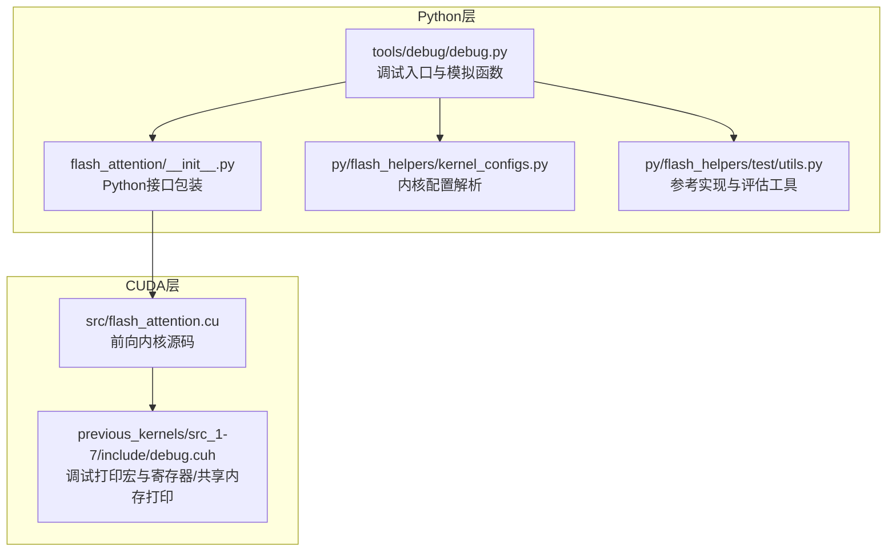
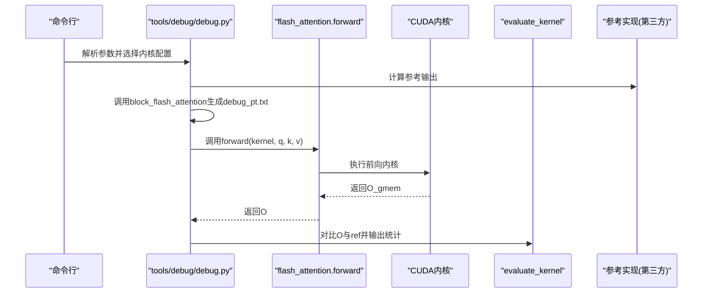
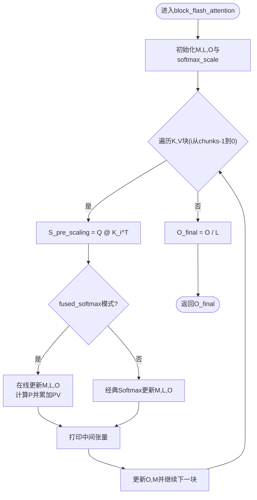
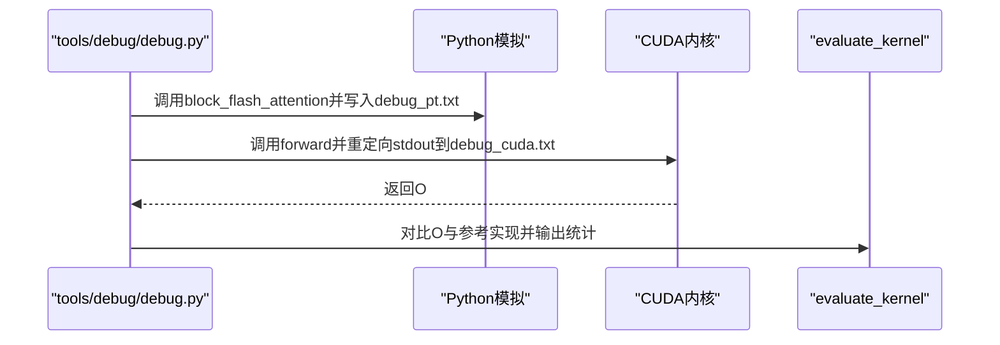
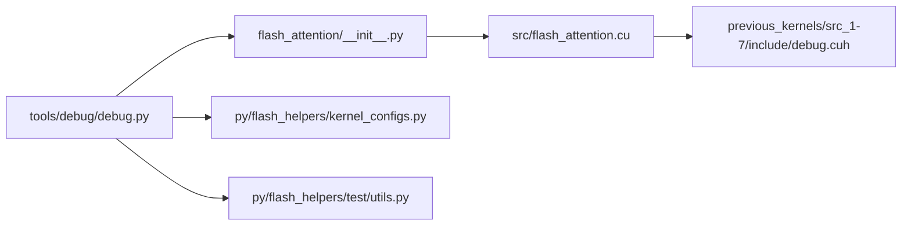

# Python模拟调试

<cite>
**本文引用的文件列表**
- [tools/debug/debug.py](file://tools/debug/debug.py)
- [flash_attention/__init__.py](file://flash_attention/__init__.py)
- [py/flash_helpers/kernel_configs.py](file://py/flash_helpers/kernel_configs.py)
- [py/flash_helpers/test/utils.py](file://py/flash_helpers/test/utils.py)
- [previous_kernels/src_1-7/include/debug.cuh](file://previous_kernels/src_1-7/include/debug.cuh)
- [README.md](file://README.md)
</cite>

## 目录
1. [简介](#简介)
2. [项目结构](#项目结构)
3. [核心组件](#核心组件)
4. [架构总览](#架构总览)
5. [详细组件分析](#详细组件分析)
6. [依赖关系分析](#依赖关系分析)
7. [性能考量](#性能考量)
8. [故障排查指南](#故障排查指南)
9. [结论](#结论)
10. [附录](#附录)

## 简介
本文件围绕 Python 调试脚本 tools/debug/debug.py 中的 block_flash_attention 函数展开，系统性地解释其如何在 Python 端“模拟”Flash Attention 的块式（tiled）计算流程：包括如何按块切分 K、V，如何逐步计算注意力分数 S，如何执行在线 Softmax 归一化，以及如何输出中间结果 O。同时，文档将详细说明函数参数 d_head、q、k、v、B_r、B_c 的作用与对调试过程的影响，并给出如何通过调用该函数生成 debug_pt.txt 文件并与 CUDA 内核输出进行对比验证的方法，帮助开发者理解内核的数值计算流程与块处理逻辑。

## 项目结构
该项目包含：
- CUDA 前向内核与调试工具：位于 src/ 与 previous_kernels/ 下，提供 Flash Attention 的高性能实现与调试打印能力
- Python 包 flash_attention：封装 CUDA 内核的 Python 接口
- Python 工具包 py/flash_helpers：包含内核配置、测试与评估工具
- tools/debug：调试脚本，其中包含本文重点分析的 block_flash_attention

图表来源
- [tools/debug/debug.py](file://tools/debug/debug.py#L161-L252)
- [flash_attention/__init__.py](file://flash_attention/__init__.py#L1-L18)
- [py/flash_helpers/kernel_configs.py](file://py/flash_helpers/kernel_configs.py#L106-L175)
- [py/flash_helpers/test/utils.py](file://py/flash_helpers/test/utils.py#L1-L120)
- [previous_kernels/src_1-7/include/debug.cuh](file://previous_kernels/src_1-7/include/debug.cuh#L1-L109)

章节来源
- [README.md](file://README.md#L1-L63)

## 核心组件
- block_flash_attention：在 Python 端按块迭代计算注意力，输出每一步的关键中间张量，便于与 CUDA 内核输出逐行比对
- flash_attention.forward：Python 层对 CUDA 内核的调用入口
- get_kernel_configs：从环境或预设集合中选择内核配置（含 B_r、B_c 等块大小）
- evaluate_kernel：对 CUDA 输出与参考实现之间的差异进行统计评估

章节来源
- [tools/debug/debug.py](file://tools/debug/debug.py#L40-L155)
- [flash_attention/__init__.py](file://flash_attention/__init__.py#L1-L18)
- [py/flash_helpers/kernel_configs.py](file://py/flash_helpers/kernel_configs.py#L106-L175)
- [py/flash_helpers/test/utils.py](file://py/flash_helpers/test/utils.py#L177-L186)

## 架构总览
下图展示了从命令行到 Python 模拟再到 CUDA 内核的完整调用链路，以及与参考实现的对比流程。

图表来源
- [tools/debug/debug.py](file://tools/debug/debug.py#L161-L252)
- [flash_attention/__init__.py](file://flash_attention/__init__.py#L1-L18)
- [py/flash_helpers/test/utils.py](file://py/flash_helpers/test/utils.py#L177-L186)

## 详细组件分析

### block_flash_attention函数详解
该函数在 Python 端模拟 Flash Attention 的块式计算过程，关键点如下：
- 分块策略
  - 将 K、V 沿序列维按 B_c 切分为若干块，ks、vs 为这些块的列表
  - Q 取当前 warp 对应的行区间（由 B_r 与 n_warps 计算得到），作为当前块的查询窗口
- 初始化
  - M 初始化为负无穷，L 初始化为 0，O 初始化为 0，用于在线 Softmax 的稳定归并
  - softmax_scale 使用缩放因子，配合 fused softmax 的指数换底公式
- 迭代计算
  - 对每个 K_i、V_i 块，先计算 S_pre_scaling = Q @ K_i^T
  - 在 fused softmax 模式下，使用在线更新公式对 M、L、O 进行稳定归并，避免显式 Softmax
  - 每轮迭代输出中间张量（Q、K、S_pre_scaling、M、L、P、V、O_scale、O），便于调试
- 最终归一化
  - 完成所有块后，O_final = O / L

图表来源
- [tools/debug/debug.py](file://tools/debug/debug.py#L40-L155)

章节来源
- [tools/debug/debug.py](file://tools/debug/debug.py#L40-L155)

### 参数说明与调试影响
- d_head
  - 表示头维度，决定缩放因子与 softmax_scale 的计算
  - 在 Python 模拟中，d_head 通常取自 q 的最后一维；在 CUDA 内核中也作为编译期常量参与计算
- q、k、v
  - 输入张量形状通常为 (seq_len, n_heads, d_head)，在调试脚本中会按头切片为单头
  - q 的行区间由 warp_offset 与 warp_rank 计算，确保与 CUDA 内核的 warp 切分一致
- B_r、B_c
  - B_r 为行块大小，控制 Q 的行窗口大小与 warp 切分
  - B_c 为列块大小，控制 K、V 的分块大小，直接影响内存访问与计算吞吐
  - 二者共同决定了块迭代次数与内存带宽利用效率
- n_warps
  - 控制 warp 切分数量，进而决定每个 warp 处理的行数 warp_offset

章节来源
- [tools/debug/debug.py](file://tools/debug/debug.py#L40-L155)
- [py/flash_helpers/kernel_configs.py](file://py/flash_helpers/kernel_configs.py#L106-L175)

### 调用与输出对比流程
- 生成 debug_pt.txt
  - 调用 block_flash_attention，将中间张量写入 debug/debug_pt.txt
  - 同时写入参考实现 self_attention 的前 B_r 行作为对照
- 生成 debug_cuda.txt
  - 通过 flash_attention.forward 获取 CUDA 内核输出，重定向 stdout 到 debug/debug_cuda.txt
  - 写入 O_gmem 作为最终输出
- 统计评估
  - 使用 evaluate_kernel 对比 CUDA 输出与参考实现，输出不匹配元素数量与最大绝对差

图表来源
- [tools/debug/debug.py](file://tools/debug/debug.py#L161-L252)
- [py/flash_helpers/test/utils.py](file://py/flash_helpers/test/utils.py#L177-L186)

章节来源
- [tools/debug/debug.py](file://tools/debug/debug.py#L161-L252)
- [py/flash_helpers/test/utils.py](file://py/flash_helpers/test/utils.py#L177-L186)

### 与CUDA内核调试打印的对应关系
- Python 模拟输出的中间张量名称（如 Q、K、S_pre_scaling、M、L、P、V、O_scale、O、O_final）与 CUDA 内核中的调试打印项一一对应
- CUDA 侧通过 debug.cuh 提供 warp 级别的打印宏，可将寄存器、共享内存等中间值打印出来，便于与 Python 输出逐行比对

章节来源
- [previous_kernels/src_1-7/include/debug.cuh](file://previous_kernels/src_1-7/include/debug.cuh#L1-L109)
- [tools/debug/debug.py](file://tools/debug/debug.py#L100-L155)

## 依赖关系分析
- Python 调试脚本依赖
  - flash_attention.forward：调用 CUDA 内核
  - get_kernel_configs：获取内核配置（B_r、B_c、n_warps 等）
  - evaluate_kernel：对输出进行统计评估
- CUDA 内核依赖
  - debug.cuh：提供 warp/寄存器/共享内存打印能力
  - 内核源码：实现 Flash Attention 前向计算

图表来源
- [tools/debug/debug.py](file://tools/debug/debug.py#L1-L252)
- [flash_attention/__init__.py](file://flash_attention/__init__.py#L1-L18)
- [py/flash_helpers/kernel_configs.py](file://py/flash_helpers/kernel_configs.py#L106-L175)
- [py/flash_helpers/test/utils.py](file://py/flash_helpers/test/utils.py#L177-L186)
- [previous_kernels/src_1-7/include/debug.cuh](file://previous_kernels/src_1-7/include/debug.cuh#L1-L109)

章节来源
- [tools/debug/debug.py](file://tools/debug/debug.py#L1-L252)
- [flash_attention/__init__.py](file://flash_attention/__init__.py#L1-L18)
- [py/flash_helpers/kernel_configs.py](file://py/flash_helpers/kernel_configs.py#L106-L175)
- [py/flash_helpers/test/utils.py](file://py/flash_helpers/test/utils.py#L177-L186)
- [previous_kernels/src_1-7/include/debug.cuh](file://previous_kernels/src_1-7/include/debug.cuh#L1-L109)

## 性能考量
- 块大小 B_r、B_c 的选择直接影响内存带宽与寄存器压力
- fused softmax 在线归并避免了显式 Softmax，减少峰值内存与计算开销
- warp 切分与 n_warps 需与内核配置保持一致，否则会导致行窗口错位，影响调试一致性

## 故障排查指南
- 张量形状不匹配
  - 确保 q、k、v 的 seq_len 与 d_head 符合内核配置；调试脚本默认使用单头切片
- 块大小不一致
  - 若 B_r、B_c 与内核配置不一致，可能导致 Python 模拟与 CUDA 内核输出不一致
- 数值精度问题
  - Python 使用 bfloat16，若需更高精度，可在参考实现中调整 dtype 或 upcast
- 输出比对
  - 使用 debug_pt.txt 与 debug_cuda.txt 逐行比对中间张量，定位差异出现的块位置

章节来源
- [tools/debug/debug.py](file://tools/debug/debug.py#L161-L252)
- [py/flash_helpers/test/utils.py](file://py/flash_helpers/test/utils.py#L177-L186)

## 结论
block_flash_attention 通过在 Python 端精确复刻 Flash Attention 的块式计算与在线 Softmax 归并流程，为开发者提供了强大的调试与验证手段。借助 debug_pt.txt 与 debug_cuda.txt 的逐行比对，可以快速定位内核实现中的数值偏差与块处理逻辑问题，从而加速优化与回归测试。

## 附录
- 如何运行调试脚本
  - 安装项目与工具包后，使用命令行参数指定内核索引与序列倍数，可选 -r 使用范围初始化张量
  - 脚本会自动生成 debug/debug_pt.txt 与 debug/debug_cuda.txt，并输出评估统计

章节来源
- [tools/debug/debug.py](file://tools/debug/debug.py#L161-L252)
- [README.md](file://README.md#L19-L35)