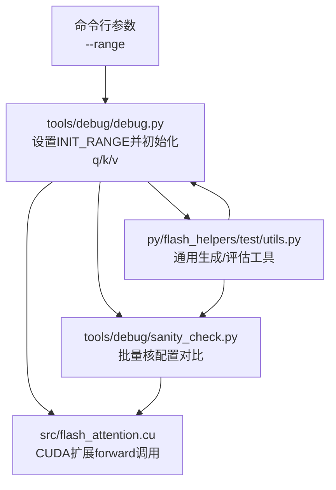
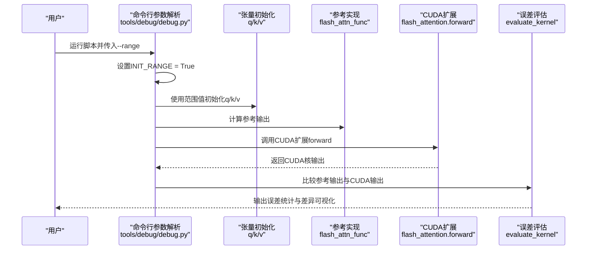
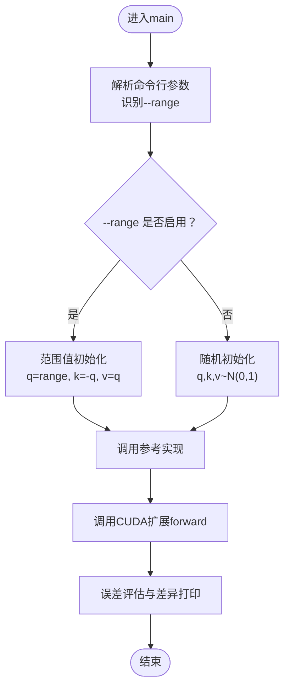
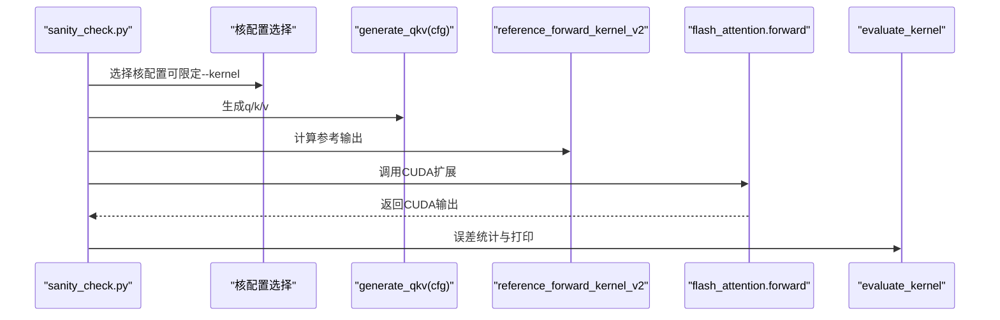
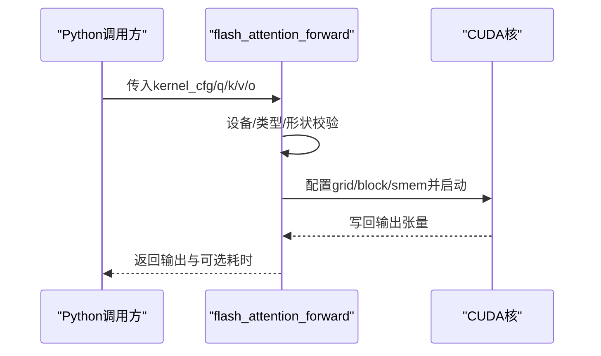
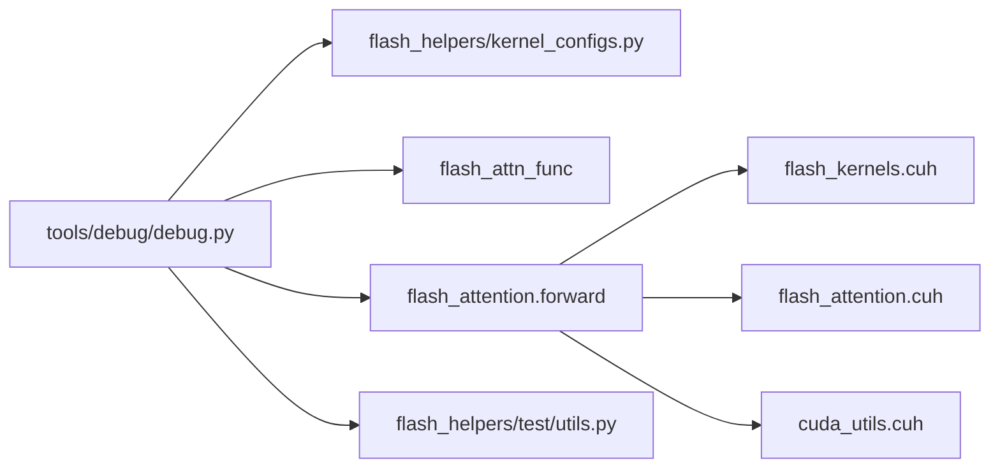

# 可重现调试模式

<cite>
**本文引用的文件**
- [tools/debug/debug.py](file://tools/debug/debug.py)
- [tools/debug/sanity_check.py](file://tools/debug/sanity_check.py)
- [py/flash_helpers/test/utils.py](file://py/flash_helpers/test/utils.py)
- [src/flash_attention.cu](file://src/flash_attention.cu)
- [previous_kernels/src_15/flash_attention.cu](file://previous_kernels/src_15/flash_attention.cu)
</cite>

## 目录
1. [简介](#简介)
2. [项目结构](#项目结构)
3. [核心组件](#核心组件)
4. [架构总览](#架构总览)
5. [详细组件分析](#详细组件分析)
6. [依赖关系分析](#依赖关系分析)
7. [性能考量](#性能考量)
8. [故障排查指南](#故障排查指南)
9. [结论](#结论)
10. [附录](#附录)

## 简介
本文件聚焦于调试过程中的可重现模式：通过--range命令行参数启用INIT_RANGE，使q、k、v三张输入张量以确定性范围值初始化，替代默认的随机初始化。该模式显著提升数值问题的复现性与定位效率，便于在对比不同内核配置或迭代版本时进行一致性验证与回归测试。

## 项目结构
围绕可重现调试模式的关键路径如下：
- Python侧调试入口：tools/debug/debug.py
- Python侧基准/对比工具：tools/debug/sanity_check.py、py/flash_helpers/test/utils.py
- CUDA前向调用封装：src/flash_attention.cu（当前版本）与previous_kernels/src_15/flash_attention.cu（历史版本）
- 命令行参数解析与张量初始化逻辑集中在Python调试脚本中

图表来源
- [tools/debug/debug.py](file://tools/debug/debug.py#L161-L252)
- [tools/debug/sanity_check.py](file://tools/debug/sanity_check.py#L1-L78)
- [py/flash_helpers/test/utils.py](file://py/flash_helpers/test/utils.py#L112-L135)
- [src/flash_attention.cu](file://src/flash_attention.cu#L34-L135)

章节来源
- [tools/debug/debug.py](file://tools/debug/debug.py#L161-L252)
- [tools/debug/sanity_check.py](file://tools/debug/sanity_check.py#L1-L78)
- [py/flash_helpers/test/utils.py](file://py/flash_helpers/test/utils.py#L112-L135)
- [src/flash_attention.cu](file://src/flash_attention.cu#L34-L135)

## 核心组件
- 可重现调试开关INIT_RANGE：由命令行--range开启，控制是否使用范围值初始化q、k、v。
- 张量初始化逻辑：当INIT_RANGE为真时，q按范围序列生成，k取负q，v取正q；否则使用正态分布随机初始化。
- 对比与评估：通过参考实现（如官方Flash Attention）与自研CUDA核输出进行逐元素误差统计与可视化。

章节来源
- [tools/debug/debug.py](file://tools/debug/debug.py#L14-L252)
- [py/flash_helpers/test/utils.py](file://py/flash_helpers/test/utils.py#L112-L135)

## 架构总览
下图展示了从命令行到CUDA核执行的端到端流程，以及可重现模式对张量初始化的影响。

图表来源
- [tools/debug/debug.py](file://tools/debug/debug.py#L161-L252)
- [src/flash_attention.cu](file://src/flash_attention.cu#L34-L135)
- [py/flash_helpers/test/utils.py](file://py/flash_helpers/test/utils.py#L177-L186)

## 详细组件分析

### 组件A：命令行与初始化逻辑（tools/debug/debug.py）
- 参数定义与解析：新增--range开关，用于启用可重现模式。
- 全局变量INIT_RANGE：在解析后置为True，影响后续张量初始化分支。
- 初始化分支：
  - 启用INIT_RANGE：q按范围序列生成，k取负q，v取正q，确保q、k、v之间存在确定性线性关系，便于追踪数值传播。
  - 关闭INIT_RANGE：q、k、v采用正态分布随机初始化，更贴近真实场景但不可复现。
- 调用链：解析参数后，构造输入形状，生成q/k/v，随后分别调用参考实现与CUDA扩展，并进行误差评估。

图表来源
- [tools/debug/debug.py](file://tools/debug/debug.py#L161-L252)

章节来源
- [tools/debug/debug.py](file://tools/debug/debug.py#L161-L252)

### 组件B：调试对比工具（tools/debug/sanity_check.py）
- 批量核配置遍历：根据--kernel选择单个核或全量核配置，统一d_head=128。
- 输入生成：调用generate_qkv(cfg)生成q/k/v，若未显式指定INIT_RANGE，则默认随机初始化。
- 对比流程：对每个核配置，先计算参考输出，再调用flash_attention.forward得到CUDA输出，最后evaluate_kernel统计误差。

图表来源
- [tools/debug/sanity_check.py](file://tools/debug/sanity_check.py#L1-L78)
- [py/flash_helpers/test/utils.py](file://py/flash_helpers/test/utils.py#L112-L135)

章节来源
- [tools/debug/sanity_check.py](file://tools/debug/sanity_check.py#L1-L78)
- [py/flash_helpers/test/utils.py](file://py/flash_helpers/test/utils.py#L112-L135)

### 组件C：CUDA扩展前向调用（src/flash_attention.cu）
- 输入校验：检查设备计算能力、数据类型、形状一致性等。
- 内核调度：根据核配置计算网格/块维度，设置共享内存大小，启动CUDA核。
- 返回值：返回输出张量与可选的运行时间（benchmark模式）。

图表来源
- [src/flash_attention.cu](file://src/flash_attention.cu#L34-L135)

章节来源
- [src/flash_attention.cu](file://src/flash_attention.cu#L34-L135)

### 组件D：历史版本对比（previous_kernels/src_15/flash_attention.cu）
- 结构与当前版本一致，均负责输入校验、内核查找、调度与启动。
- 在本仓库中，当前主版本位于src/flash_attention.cu，历史版本用于演进对比。

章节来源
- [previous_kernels/src_15/flash_attention.cu](file://previous_kernels/src_15/flash_attention.cu#L34-L135)

## 依赖关系分析
- Python调试脚本依赖：
  - flash_helpers.kernel_configs：获取核配置集合。
  - flash_attn_func：参考实现（官方实现）。
  - flash_attention：当前CUDA扩展。
  - flash_helpers.test.utils：生成/评估工具。
- CUDA扩展依赖：
  - flash_kernels.cuh：核函数表与配置映射。
  - flash_attention.cuh：内核参数与调用约定。
  - cuda_utils.cuh：CUDA工具与检查宏。

图表来源
- [tools/debug/debug.py](file://tools/debug/debug.py#L1-L20)
- [src/flash_attention.cu](file://src/flash_attention.cu#L1-L20)

章节来源
- [tools/debug/debug.py](file://tools/debug/debug.py#L1-L20)
- [src/flash_attention.cu](file://src/flash_attention.cu#L1-L20)

## 性能考量
- 可重现模式仅改变输入初始化方式，不改变内核算法与调度，因此对性能无直接影响。
- 在回归测试与对比评测中，建议：
  - 使用--range固定输入，确保对比结果稳定且可重复。
  - 对比不同内核配置或版本时，保持相同的输入分布，避免随机性导致的误判。
  - 如需性能基准，切换至随机初始化并多次采样取统计量。

## 故障排查指南
- 症状：启用--range后，输出差异异常大
  - 排查要点：确认是否正确传入--range；检查核配置是否匹配；确认d_head与块大小约束满足。
- 症状：对比结果不稳定
  - 排查要点：确保每次运行使用相同随机种子（若使用随机初始化）；或始终使用--range。
- 症状：内核未找到或类型不匹配
  - 排查要点：核配置键值与输入dtype一致；核表中包含目标配置；设备计算能力满足要求。

章节来源
- [tools/debug/debug.py](file://tools/debug/debug.py#L161-L252)
- [src/flash_attention.cu](file://src/flash_attention.cu#L34-L135)

## 结论
通过--range与INIT_RANGE，调试脚本实现了确定性输入的可重现模式，使q、k、v以范围值初始化，从而在对比不同内核配置或迭代版本时具备高度一致性。该模式显著提升了数值问题的复现与定位效率，是开发与验证阶段的重要工具。

## 附录

### 使用案例：回归测试与性能对比
- 回归测试（可重现）
  - 步骤：运行调试脚本并传入--range，确保q/k/v为范围值；比较参考实现与CUDA输出；记录误差统计。
  - 价值：稳定输入保证了不同版本/配置间的可比性，便于快速定位回归。
- 性能对比（随机初始化）
  - 步骤：移除--range，使用随机初始化；对多个核配置与序列长度进行多次采样；统计均值/中位数/标准差。
  - 价值：反映真实场景下的吞吐与稳定性，辅助选择最优配置。

章节来源
- [tools/debug/debug.py](file://tools/debug/debug.py#L161-L252)
- [tools/debug/sanity_check.py](file://tools/debug/sanity_check.py#L1-L78)
- [py/flash_helpers/test/utils.py](file://py/flash_helpers/test/utils.py#L177-L186)