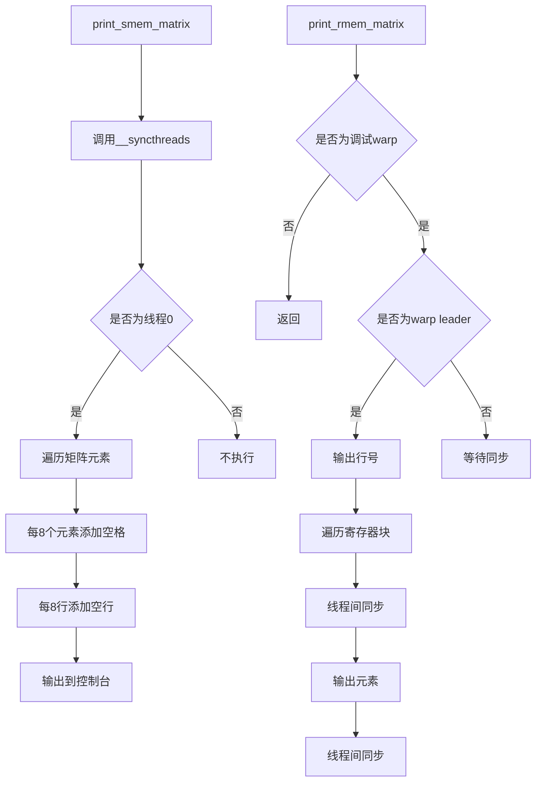

# 张量打印工具

<cite>
**本文档引用文件**   
- [debug.py](file://tools/debug/debug.py#L1-L253)
- [debug.cuh](file://src/include/debug.cuh#L1-L524)
- [tensor.cuh](file://src/include/tensor.cuh#L1-L141)
- [flash_attention.cu](file://src/flash_attention.cu#L1-L150)
</cite>

## 目录
1. [引言](#引言)
2. [PyTorch张量打印工具](#pytorch张量打印工具)
3. [CUDA端张量打印工具](#cuda端张量打印工具)
4. [调试策略与线程同步](#调试策略与线程同步)
5. [实际调试案例](#实际调试案例)
6. [总结](#总结)

## 引言
本文档详细说明了在Flash Attention实现中用于调试的张量打印工具。这些工具分为两个层面：Python端用于打印PyTorch张量的`print_tensor`函数，以及CUDA内核中用于打印寄存器和共享内存数据的`print_rmem_matrix`和`print_smem_matrix`函数。文档将解释这些工具的实现细节、格式化策略以及如何在实际调试中使用它们来观察Q、K、V、S、P、O等关键张量的值。

## PyTorch张量打印工具

`print_tensor`函数是Python端的调试工具，用于将PyTorch张量格式化为可读的文本输出。该函数实现了特定的格式化策略，包括每8个元素分组和行间分隔，以提高输出的可读性。

**Section sources**
- [debug.py](file://tools/debug/debug.py#L18-L37)

## CUDA端张量打印工具

CUDA端的打印工具主要包含`print_smem_matrix`和`print_rmem_matrix`两个函数，分别用于打印共享内存和寄存器中的张量数据。`print_smem_matrix`函数通过`__syncthreads()`确保所有线程同步后，由线程0负责打印共享内存中的矩阵数据。该函数实现了每8个元素分组和每8行添加空行的格式化策略。`print_rmem_matrix`函数则利用`is_debug_warp()`和`is_warp_leader()`来确保只有特定的warp和其leader线程进行打印，避免了多线程同时输出造成的混乱。

**Diagram sources **
- [debug.cuh](file://src/include/debug.cuh#L52-L96)
- [debug.cuh](file://src/include/debug.cuh#L98-L165)

**Section sources**
- [debug.cuh](file://src/include/debug.cuh#L52-L200)

## 调试策略与线程同步

为了确保输出的清晰性和正确性，这些打印工具采用了特定的调试策略和线程同步机制。全局常量`debug_warp_rank`和`debug_block`定义了执行打印操作的特定warp和block。`is_debug_warp()`函数检查当前线程是否属于调试warp，而`is_warp_leader()`函数进一步检查是否为该warp的leader线程。这种设计确保了只有单一的线程负责输出，避免了多线程同时写入stdout造成的输出混乱。对于共享内存的打印，使用`__syncthreads()`确保所有线程完成内存操作后才进行打印；对于寄存器内存的打印，则使用`__syncwarp()`确保warp内所有线程的同步。

**Section sources**
- [debug.cuh](file://src/include/debug.cuh#L17-L45)

## 实际调试案例

在实际调试中，可以通过在内核代码的关键位置插入`print_rmem_matrix`和`print_smem_matrix`调用来观察Q、K、V、S、P、O等关键张量的值。例如，在计算注意力分数后，可以打印S矩阵的值来验证计算的正确性；在输出结果前，可以打印O矩阵的值来检查最终结果。Python端的`block_flash_attention`函数提供了一个完整的调试案例，它通过`print_tensor`函数打印了Q、K、V、S、P、O等张量的值，并将结果输出到文件中，便于后续分析。

**Section sources**
- [debug.py](file://tools/debug/debug.py#L40-L153)
- [debug.cuh](file://src/include/debug.cuh#L52-L200)

## 总结
本文档详细介绍了Flash Attention实现中的张量打印工具，包括Python端的`print_tensor`函数和CUDA端的`print_rmem_matrix`、`print_smem_matrix`函数。这些工具通过特定的格式化策略和线程同步机制，为调试提供了强大的支持。通过合理使用这些工具，开发者可以有效地观察和分析关键张量的值，从而快速定位和解决实现中的问题。