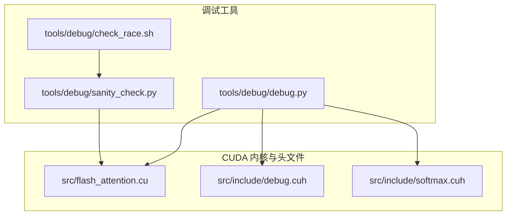
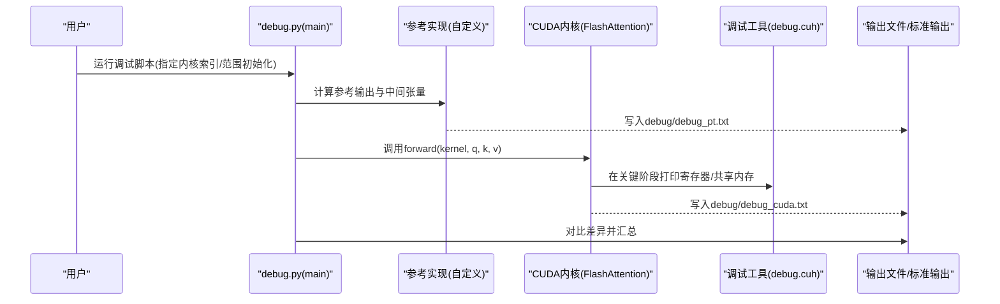
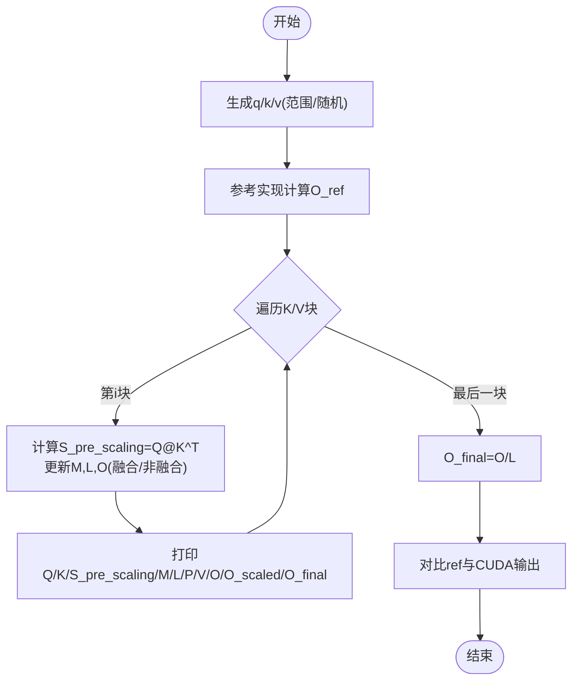
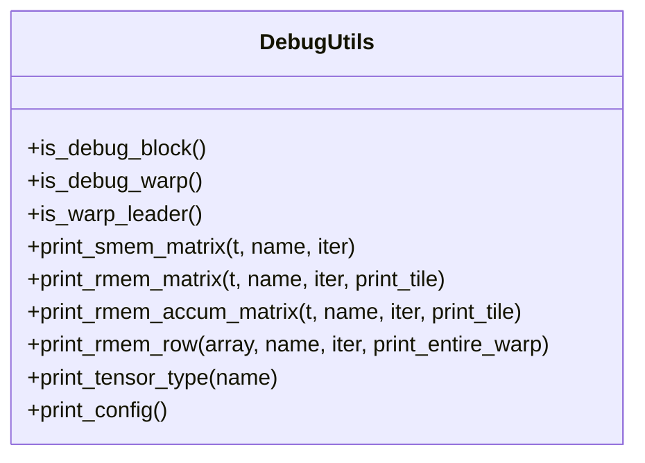
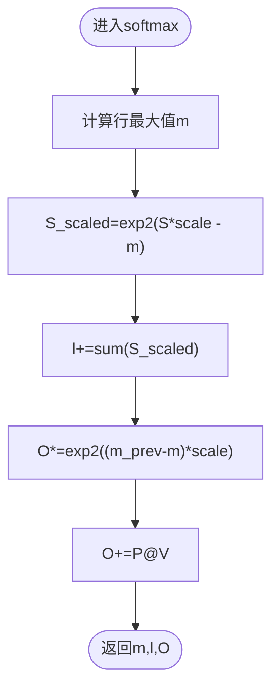
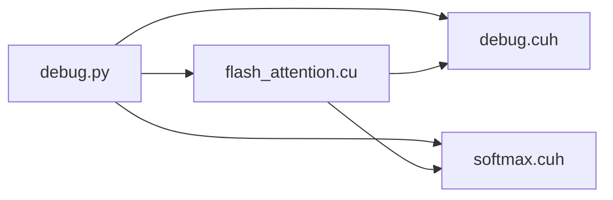

# 高级调试功能

<cite>
**本文引用的文件**
- [tools/debug/debug.py](file://tools/debug/debug.py)
- [src/include/debug.cuh](file://src/include/debug.cuh)
- [src/include/softmax.cuh](file://src/include/softmax.cuh)
- [tools/debug/sanity_check.py](file://tools/debug/sanity_check.py)
- [tools/debug/check_race.sh](file://tools/debug/check_race.sh)
- [src/flash_attention.cu](file://src/flash_attention.cu)
</cite>

## 目录
1. [简介](#简介)
2. [项目结构](#项目结构)
3. [核心组件](#核心组件)
4. [架构总览](#架构总览)
5. [详细组件分析](#详细组件分析)
6. [依赖关系分析](#依赖关系分析)
7. [性能考量](#性能考量)
8. [故障排查指南](#故障排查指南)
9. [结论](#结论)
10. [附录](#附录)

## 简介
本文件系统性地文档化了仓库中的高级调试能力，重点围绕以下目标：
- 深入解析 Python 调试脚本 tools/debug/debug.py 中的 block_flash_attention 函数，如何模拟 Flash Attention 的分块计算流程并输出中间张量（Q、K、V、S、M、L、P、O）。
- 解释 print_tensor 函数如何格式化张量输出，便于人工比对与分析。
- 说明如何通过 INIT_RANGE 参数控制初始化模式，以获得可复现的调试输入。
- 结合 CUDA 头文件 src/include/debug.cuh 中的 print_rmem_matrix、print_smem_matrix 等工具，讲解如何在内核中输出寄存器与共享内存状态。
- 提供针对 softmax 数值溢出、块间同步问题等常见错误的完整调试案例与方法论。

## 项目结构
该仓库采用“Python 调试脚本 + CUDA 内核 + 头文件工具”的分层组织方式：
- tools/debug：包含调试入口脚本、一致性检查脚本与竞态检测脚本。
- src/include：包含内核实现所需的头文件，其中 debug.cuh 提供寄存器/共享内存调试输出工具。
- src：包含 CUDA 扩展入口与内核调用封装。
- previous_kernels：历史版本的内核实现与调试工具，便于对比与回溯。

图表来源
- [tools/debug/debug.py](file://tools/debug/debug.py#L1-L253)
- [src/flash_attention.cu](file://src/flash_attention.cu#L1-L150)
- [src/include/debug.cuh](file://src/include/debug.cuh#L1-L524)
- [src/include/softmax.cuh](file://src/include/softmax.cuh#L51-L105)
- [tools/debug/sanity_check.py](file://tools/debug/sanity_check.py#L1-L78)
- [tools/debug/check_race.sh](file://tools/debug/check_race.sh#L1-L4)

章节来源
- [tools/debug/debug.py](file://tools/debug/debug.py#L1-L253)
- [src/flash_attention.cu](file://src/flash_attention.cu#L1-L150)
- [src/include/debug.cuh](file://src/include/debug.cuh#L1-L524)
- [src/include/softmax.cuh](file://src/include/softmax.cuh#L51-L105)
- [tools/debug/sanity_check.py](file://tools/debug/sanity_check.py#L1-L78)
- [tools/debug/check_race.sh](file://tools/debug/check_race.sh#L1-L4)

## 核心组件
- Python 调试主程序：负责构造输入、运行参考实现与 CUDA 内核、输出对比与差异统计，并支持范围初始化模式。
- 张量打印工具：统一格式化张量输出，便于逐行/逐块比对。
- 分块注意力模拟器：按块迭代计算注意力分数、行最大值、归一化因子与输出累积，输出中间变量。
- CUDA 调试工具：在内核中按 warp/线程维度输出寄存器与共享内存内容，辅助定位布局与数据流问题。
- softmax 实现：提供数值稳定的行最大值与指数化路径，是排查溢出的关键位置。

章节来源
- [tools/debug/debug.py](file://tools/debug/debug.py#L1-L253)
- [src/include/debug.cuh](file://src/include/debug.cuh#L1-L524)
- [src/include/softmax.cuh](file://src/include/softmax.cuh#L51-L105)

## 架构总览
下图展示了从 Python 调试入口到 CUDA 内核执行的端到端流程，以及调试输出的落点。

图表来源
- [tools/debug/debug.py](file://tools/debug/debug.py#L161-L253)
- [src/flash_attention.cu](file://src/flash_attention.cu#L100-L135)
- [src/include/debug.cuh](file://src/include/debug.cuh#L43-L165)

## 详细组件分析

### Python 调试主程序与分块注意力模拟器
- 入口函数 main：
  - 解析命令行参数，支持选择内核配置、设置序列长度倍数、启用范围初始化模式。
  - 根据是否启用范围初始化，生成 q/k/v；否则使用随机正负分布。
  - 运行参考实现得到 ref 输出，随后调用 CUDA 内核得到 out，并进行对比评估。
  - 将 Python 端的中间张量与参考输出写入 debug/debug_pt.txt；将 CUDA 内核输出写入 debug/debug_cuda.txt。
- 分块注意力模拟器 block_flash_attention：
  - 基于给定的 B_r/B_c 将 K/V 按块切分，按块迭代更新行最大值 M、归一化因子 L 与输出 O。
  - 支持两种 softmax 路径：非融合与融合（log2 数值稳定）。
  - 在每轮迭代中输出 Q/K/S_pre_scaling/M/L/P/V/O/O_scaled/O_final 等中间结果，便于逐块定位问题。
- 张量打印工具 print_tensor：
  - 将二维张量按固定块大小分组打印，行列之间增加空格与空行，提升可读性。
  - 适用于 Q、K、V、S、P、O、ref、gmem 输出等场景。

图表来源
- [tools/debug/debug.py](file://tools/debug/debug.py#L40-L154)

章节来源
- [tools/debug/debug.py](file://tools/debug/debug.py#L1-L253)

### CUDA 寄存器与共享内存调试输出
- 调试条件与筛选：
  - 通过 is_debug_block()/is_debug_warp()/is_warp_leader() 精确限定仅在特定 block/warp/leader 线程上输出，避免噪声。
- 寄存器输出：
  - print_rmem_matrix/print_rmem_accum_matrix/print_rmem_row：按行/片段/瓦片维度输出寄存器内容，支持按瓦片选择打印。
  - 使用 __syncwarp() 同步，保证多线程读取同一元素时的可见性。
- 共享内存输出：
  - print_smem_matrix：遍历共享内存布局（含 swizzle），按行列与 tile/stile 维度打印，便于核对布局与访问顺序。
- 类型信息与配置打印：
  - print_tensor_type/print_config/print_shape/print_stride 等工具用于输出张量形状、步长、存储大小、布局细节与内核配置，辅助定位尺寸/步长/布局不一致导致的问题。

图表来源
- [src/include/debug.cuh](file://src/include/debug.cuh#L22-L165)
- [src/include/debug.cuh](file://src/include/debug.cuh#L167-L362)
- [src/include/debug.cuh](file://src/include/debug.cuh#L363-L524)

章节来源
- [src/include/debug.cuh](file://src/include/debug.cuh#L1-L524)

### softmax 数值稳定性与溢出调试
- 融合 softmax 路径：
  - 使用行最大值与 log2 变换，避免直接指数化导致的溢出。
  - 更新公式：M_new、L、O 的缩放与累加均基于 exp2 与行最大值，确保数值稳定。
- 非融合 softmax 路径：
  - 先求 max，再指数化，最后累加 L，同样需要关注极端值导致的溢出。
- 调试建议：
  - 在 softmax 关键步骤前后打印行最大值与 L 的变化，观察是否存在异常跳变或 NaN。
  - 对超大/极小输入进行范围测试，验证边界行为。
  - 使用范围初始化模式快速定位异常输入区间。

图表来源
- [src/include/softmax.cuh](file://src/include/softmax.cuh#L51-L105)

章节来源
- [src/include/softmax.cuh](file://src/include/softmax.cuh#L51-L105)

### 初始化模式与可复现性
- 范围初始化：
  - 当启用 --range 或 -r 时，q 为连续递增序列，k 为其相反数，v 与其相同，便于观察数值单调性与对称性。
  - 该模式有助于快速定位数值溢出、精度损失与布局问题。
- 随机初始化：
  - 默认使用正态分布生成 q/k/v，更贴近真实场景，但需多次运行以确认稳定性。

章节来源
- [tools/debug/debug.py](file://tools/debug/debug.py#L161-L210)

## 依赖关系分析
- Python 调试脚本依赖：
  - flash_attn 库作为参考实现，用于生成 O_ref。
  - flash_helpers 提供内核配置与评估工具。
  - wurlitzer 将 CUDA 内核 stdout 重定向到文件。
- CUDA 内核依赖：
  - debug.cuh 提供调试输出工具。
  - softmax.cuh 提供数值稳定的 softmax 实现。
  - flash_attention.cu 作为扩展入口，负责参数校验、网格/块维度计算与内核调度。

图表来源
- [tools/debug/debug.py](file://tools/debug/debug.py#L1-L253)
- [src/flash_attention.cu](file://src/flash_attention.cu#L1-L150)
- [src/include/debug.cuh](file://src/include/debug.cuh#L1-L524)
- [src/include/softmax.cuh](file://src/include/softmax.cuh#L51-L105)

章节来源
- [tools/debug/debug.py](file://tools/debug/debug.py#L1-L253)
- [src/flash_attention.cu](file://src/flash_attention.cu#L1-L150)
- [src/include/debug.cuh](file://src/include/debug.cuh#L1-L524)
- [src/include/softmax.cuh](file://src/include/softmax.cuh#L51-L105)

## 性能考量
- 调试输出会引入额外的同步与打印开销，仅在定位问题时开启。
- print_smem_matrix/print_rmem_matrix 会遍历较大内存区域，建议按需打印（如仅打印特定 tile）。
- 范围初始化虽然便于调试，但可能掩盖某些随机性带来的竞争条件，建议在问题定位后切换为随机初始化进行最终验证。

## 故障排查指南

### 案例一：softmax 数值溢出
- 现象
  - 输出出现 NaN 或 Inf，或 L 呈现异常增长。
- 排查步骤
  - 在 softmax 关键路径前后打印行最大值与 L 的变化，确认是否存在极端输入导致溢出。
  - 切换到范围初始化模式，逐步增大输入幅度，观察阈值点。
  - 对比融合与非融合路径的差异，确认是否为数值稳定性问题。
- 参考实现位置
  - [融合 softmax 更新逻辑](file://src/include/softmax.cuh#L51-L105)

章节来源
- [src/include/softmax.cuh](file://src/include/softmax.cuh#L51-L105)
- [tools/debug/debug.py](file://tools/debug/debug.py#L100-L154)

### 案例二：块间同步问题
- 现象
  - 不同块输出不一致，或出现竞态导致的数据覆盖。
- 排查步骤
  - 使用 compute-sanitizer 的 racecheck 工具检测潜在竞态。
  - 在内核关键同步点前后插入 print_rmem_matrix/print_smem_matrix，核对寄存器/共享内存状态是否按预期更新。
  - 缩小块大小或减少异步拷贝，验证是否为同步不足导致。
- 参考工具位置
  - [竞态检测脚本](file://tools/debug/check_race.sh#L1-L4)
  - [寄存器/共享内存打印工具](file://src/include/debug.cuh#L43-L165)

章节来源
- [tools/debug/check_race.sh](file://tools/debug/check_race.sh#L1-L4)
- [src/include/debug.cuh](file://src/include/debug.cuh#L43-L165)

### 案例三：布局/步长不一致导致的错位
- 现象
  - 输出与参考存在明显错位或形状不匹配。
- 排查步骤
  - 使用 print_tensor_type/print_config/print_stride/print_shape 打印张量类型与布局信息，核对形状、步长与存储大小。
  - 对比不同内核配置下的布局差异，确认是否为 swizzle 或 tile 配置不当。
- 参考工具位置
  - [类型与配置打印工具](file://src/include/debug.cuh#L345-L524)

章节来源
- [src/include/debug.cuh](file://src/include/debug.cuh#L345-L524)

### 案例四：范围初始化下的异常定位
- 现象
  - 在随机初始化下难以复现，在范围初始化下可稳定复现。
- 排查步骤
  - 启用 --range/-r，逐步调整输入范围，定位异常输入区间。
  - 对异常区间进行局部放大（减小块大小、降低 dtype 精度）以加速定位。
- 参考入口位置
  - [范围初始化与主流程](file://tools/debug/debug.py#L161-L210)

章节来源
- [tools/debug/debug.py](file://tools/debug/debug.py#L161-L210)

## 结论
本仓库提供了从 Python 层到 CUDA 内核层的全链路调试能力：
- Python 端通过 block_flash_attention 与 print_tensor 提供可复现、可比对的中间结果输出。
- CUDA 端通过 debug.cuh 的寄存器/共享内存打印工具与 softmax 的数值稳定实现，帮助快速定位数值溢出、同步与布局问题。
- 结合 sanity_check 与 compute-sanitizer 的竞态检测，形成从算法正确性到硬件行为的闭环验证体系。

## 附录

### 快速使用清单
- 运行调试：python tools/debug/debug.py <kernel_idx> <seq_B_r> [-r/--range]
- 查看输出：debug/debug_pt.txt（Python 模拟）、debug/debug_cuda.txt（CUDA 输出）
- 竞态检测：bash tools/debug/check_race.sh <kernel>

章节来源
- [tools/debug/debug.py](file://tools/debug/debug.py#L161-L253)
- [tools/debug/check_race.sh](file://tools/debug/check_race.sh#L1-L4)