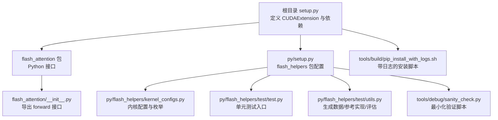
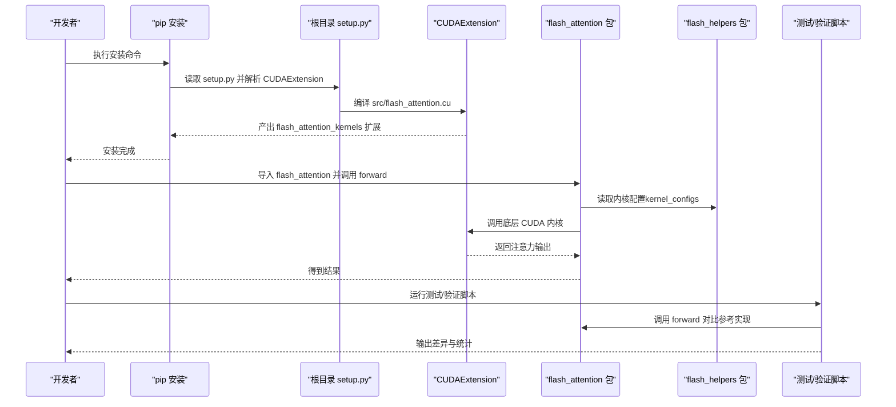
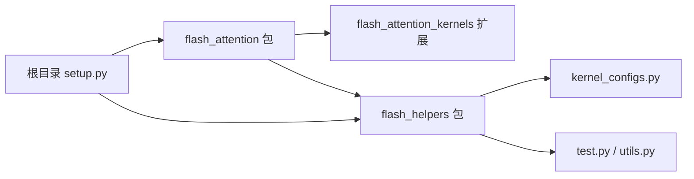

# 快速开始

<cite>
**本文引用的文件**
- [setup.py](file://setup.py)
- [README.md](file://README.md)
- [flash_attention/__init__.py](file://flash_attention/__init__.py)
- [py/setup.py](file://py/setup.py)
- [py/flash_helpers/test/test.py](file://py/flash_helpers/test/test.py)
- [py/flash_helpers/kernel_configs.py](file://py/flash_helpers/kernel_configs.py)
- [tools/build/pip_install_with_logs.sh](file://tools/build/pip_install_with_logs.sh)
- [tools/debug/sanity_check.py](file://tools/debug/sanity_check.py)
- [py/flash_helpers/test/utils.py](file://py/flash_helpers/test/utils.py)
</cite>

## 目录
1. [简介](#简介)
2. [项目结构](#项目结构)
3. [核心组件](#核心组件)
4. [架构总览](#架构总览)
5. [详细组件分析](#详细组件分析)
6. [依赖关系分析](#依赖关系分析)
7. [性能与使用建议](#性能与使用建议)
8. [故障排查指南](#故障排查指南)
9. [结论](#结论)
10. [附录：示例与命令清单](#附录示例与命令清单)

## 简介
本指南面向首次接触 Flash Attention 的开发者，目标是在约 10 分钟内完成安装、验证与运行首个示例。内容覆盖：
- 通过 setup.py 安装（源码安装与 pip 打包）
- 导入 flash_attention 模块并调用 forward 执行注意力计算
- 环境验证（CUDA 可用性、PyTorch 集成）
- 常见安装错误与解决思路
- 使用测试用例与工具进行验证

## 项目结构
该仓库包含两部分 Python 包：
- 主包 flash_attention：提供 Python 接口与 CUDA 内核扩展
- 辅助包 flash_helpers：提供内核配置、测试工具与参考实现

图表来源
- [setup.py](file://setup.py#L1-L76)
- [flash_attention/__init__.py](file://flash_attention/__init__.py#L1-L18)
- [py/setup.py](file://py/setup.py#L1-L20)
- [py/flash_helpers/kernel_configs.py](file://py/flash_helpers/kernel_configs.py#L1-L120)
- [py/flash_helpers/test/test.py](file://py/flash_helpers/test/test.py#L1-L104)
- [py/flash_helpers/test/utils.py](file://py/flash_helpers/test/utils.py#L1-L202)
- [tools/build/pip_install_with_logs.sh](file://tools/build/pip_install_with_logs.sh#L1-L31)
- [tools/debug/sanity_check.py](file://tools/debug/sanity_check.py#L1-L78)

章节来源
- [README.md](file://README.md#L1-L63)
- [setup.py](file://setup.py#L1-L76)
- [py/setup.py](file://py/setup.py#L1-L20)

## 核心组件
- Python 接口：在 flash_attention 包中导出 forward 与 forward_timed 两个函数，用于执行注意力前向计算。
- 内核配置：通过 flash_helpers 提供的 FlashForwardKernelConfig 数据类描述内核参数（如 dtype、d_head、tile 尺寸等）。
- 测试与验证：提供基于 unittest 的测试用例与最小化验证脚本，便于快速比对结果与定位问题。

章节来源
- [flash_attention/__init__.py](file://flash_attention/__init__.py#L1-L18)
- [py/flash_helpers/kernel_configs.py](file://py/flash_helpers/kernel_configs.py#L102-L175)
- [py/flash_helpers/test/test.py](file://py/flash_helpers/test/test.py#L1-L104)
- [tools/debug/sanity_check.py](file://tools/debug/sanity_check.py#L1-L78)

## 架构总览
下图展示了从安装到运行的端到端流程，以及关键模块之间的交互。

图表来源
- [setup.py](file://setup.py#L1-L76)
- [flash_attention/__init__.py](file://flash_attention/__init__.py#L1-L18)
- [py/flash_helpers/kernel_configs.py](file://py/flash_helpers/kernel_configs.py#L102-L175)
- [py/flash_helpers/test/test.py](file://py/flash_helpers/test/test.py#L1-L104)
- [tools/debug/sanity_check.py](file://tools/debug/sanity_check.py#L1-L78)

## 详细组件分析

### 安装与打包（setup.py）
- 核心要点
  - 使用 torch.utils.cpp_extension 的 BuildExtension 与 CUDAExtension 编译 CUDA 源码。
  - NVCC 编译参数固定生成 sm_80 目标（Ampere 架构），需确保 CUDA/GPU 支持。
  - 安装依赖包含 PyTorch 与 einops；构建期依赖包含 packaging、psutil、ninja。
  - 提供带日志的安装脚本，便于定位编译问题。

- 安装步骤
  - 在仓库根目录执行安装（推荐先查看 README 的安装说明）。
  - 若需要更详细的日志，可使用 tools/build/pip_install_with_logs.sh 脚本。

章节来源
- [setup.py](file://setup.py#L1-L76)
- [README.md](file://README.md#L19-L35)
- [tools/build/pip_install_with_logs.sh](file://tools/build/pip_install_with_logs.sh#L1-L31)

### Python 接口与内核配置
- 接口导出
  - flash_attention/__init__.py 导出 forward 与 forward_timed 两个函数，前者返回注意力输出，后者同时返回运行时。
- 内核配置
  - FlashForwardKernelConfig 描述了 dtype、d_head、tile 尺寸、warp 数、异步拷贝、预加载、swizzle、mma 双缓冲、优化 softmax 等参数。
  - 提供多种解析与筛选策略，支持自动调优与内核演进配置。

章节来源
- [flash_attention/__init__.py](file://flash_attention/__init__.py#L1-L18)
- [py/flash_helpers/kernel_configs.py](file://py/flash_helpers/kernel_configs.py#L102-L175)
- [py/flash_helpers/kernel_configs.py](file://py/flash_helpers/kernel_configs.py#L389-L486)

### 测试与验证
- 单元测试
  - py/flash_helpers/test/test.py 使用 unittest 与 parameterized，遍历内核配置集合，对比 flash_attention.forward 与参考实现（PyTorch + einops 或 flash-attn CUDA）。
- 最小化验证
  - tools/debug/sanity_check.py 提供简化流程，快速生成输入、调用 flash_attention.forward 并评估与参考实现的差异。

章节来源
- [py/flash_helpers/test/test.py](file://py/flash_helpers/test/test.py#L1-L104)
- [tools/debug/sanity_check.py](file://tools/debug/sanity_check.py#L1-L78)
- [py/flash_helpers/test/utils.py](file://py/flash_helpers/test/utils.py#L1-L202)

## 依赖关系分析
- 外部依赖
  - PyTorch：用于张量运算与 CUDA 设备管理。
  - einops：用于注意力计算的张量重排与缩放。
  - ninja：加速构建过程。
- 内部依赖
  - flash_attention_kernels：由 CUDAExtension 生成的底层扩展。
  - flash_helpers：提供内核配置、测试工具与参考实现。

图表来源
- [setup.py](file://setup.py#L1-L76)
- [flash_attention/__init__.py](file://flash_attention/__init__.py#L1-L18)
- [py/flash_helpers/kernel_configs.py](file://py/flash_helpers/kernel_configs.py#L1-L120)
- [py/flash_helpers/test/test.py](file://py/flash_helpers/test/test.py#L1-L104)

章节来源
- [setup.py](file://setup.py#L60-L76)
- [py/setup.py](file://py/setup.py#L1-L20)

## 性能与使用建议
- 架构适配
  - NVCC 固定生成 sm_80 目标，适用于 A100、RTX 3090/4090 等 Ampere 架构 GPU。
- 输入尺寸与精度
  - 默认 head 维度为 128；支持 fp16/bf16 输入，softmax 计算在 fp32 中进行。
  - 测试用例默认使用 bf16，seq_len 通常较大，建议根据显存选择 batch 与 head 数。
- 自动调优
  - 可通过 get_kernels_to_build/get_autotuning_kernel_configs 获取候选配置，按需选择以平衡性能与稳定性。

章节来源
- [setup.py](file://setup.py#L14-L42)
- [py/flash_helpers/kernel_configs.py](file://py/flash_helpers/kernel_configs.py#L389-L486)
- [py/flash_helpers/test/utils.py](file://py/flash_helpers/test/utils.py#L1-L60)

## 故障排查指南
- CUDA 版本与架构不匹配
  - 现象：编译失败或无法加载内核。
  - 解决：确保 CUDA Toolkit 与驱动满足 Ampere 架构要求；若需其他架构，请修改 NVCC 目标（当前固定 sm_80）。
- 编译器问题
  - 现象：编译报错或链接失败。
  - 解决：使用 tools/build/pip_install_with_logs.sh 带日志安装，查看详细错误；必要时设置 TORCH_CUDA_ARCH_LIST 或调整编译参数。
- PyTorch 未正确集成
  - 现象：导入失败或 CUDA 不可用。
  - 解决：确认已安装与当前 Python 环境匹配的 PyTorch；使用 tools/debug/sanity_check.py 的设备检查逻辑验证 CUDA 可用性。
- 内核配置不当
  - 现象：运行时报错或结果异常。
  - 解决：优先使用 get_kernels_to_build 生成的配置；逐步缩小到单个配置进行验证。

章节来源
- [setup.py](file://setup.py#L14-L42)
- [tools/build/pip_install_with_logs.sh](file://tools/build/pip_install_with_logs.sh#L1-L31)
- [tools/debug/sanity_check.py](file://tools/debug/sanity_check.py#L180-L202)
- [py/flash_helpers/kernel_configs.py](file://py/flash_helpers/kernel_configs.py#L389-L486)

## 结论
通过本指南，您可以在 10 分钟内完成安装、验证并运行首个注意力计算示例。建议优先使用带日志的安装脚本与最小化验证脚本，快速定位问题并建立信心。后续可结合测试用例与内核配置工具，进一步探索性能与稳定性。

## 附录：示例与命令清单

- 安装命令
  - 使用 pip 安装主包与辅助包（参考 README 的安装说明）。
  - 如需详细日志，可使用带日志的安装脚本。

- 环境验证
  - 使用 sanity_check.py 的设备检查逻辑确认 CUDA 可用性与 GPU 架构信息。
  - 运行测试用例对比参考实现，验证正确性。

- 示例调用（参考路径）
  - 导入接口与内核配置：参见 [flash_attention/__init__.py](file://flash_attention/__init__.py#L1-L18) 与 [py/flash_helpers/kernel_configs.py](file://py/flash_helpers/kernel_configs.py#L102-L175)
  - 运行测试用例：参见 [py/flash_helpers/test/test.py](file://py/flash_helpers/test/test.py#L1-L104)
  - 最小化验证：参见 [tools/debug/sanity_check.py](file://tools/debug/sanity_check.py#L1-L78)

章节来源
- [README.md](file://README.md#L19-L35)
- [tools/build/pip_install_with_logs.sh](file://tools/build/pip_install_with_logs.sh#L1-L31)
- [tools/debug/sanity_check.py](file://tools/debug/sanity_check.py#L180-L202)
- [py/flash_helpers/test/test.py](file://py/flash_helpers/test/test.py#L1-L104)