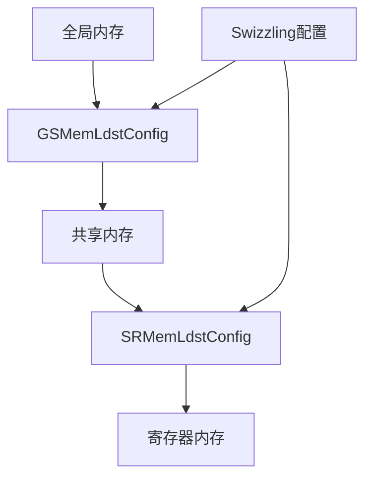

# Swizzling技术

<cite>
**本文档中引用的文件**   
- [swizzling.cuh](file://previous_kernels/src_15/include/swizzling.cuh)
- [static_kernel_configuration.cuh](file://previous_kernels/src_15/include/static_kernel_configuration.cuh)
- [load_store.cuh](file://previous_kernels/src_15/include/load_store.cuh)
- [layout.cuh](file://src/include/layout.cuh)
- [common.h](file://src/include/common.h)
- [run_kernels.py](file://tools/benchmark/run_kernels.py)
- [pt_bench.py](file://tools/benchmark/pt_bench.py)
</cite>

## 目录
1. [引言](#引言)
2. [CuteSwizzle内存布局优化机制](#cuteswizzle内存布局优化机制)
3. [模板参数配置与内存访问模式](#模板参数配置与内存访问模式)
4. [NoSwizzle基线对比](#noswizzle基线对比)
5. [GSMemLdstConfig和SRMemLdstConfig中的集成](#gsmemldstconfig和srmemldstconfig中的集成)
6. [ldmatrix指令执行与swizzle_stride协同](#ldmatrix指令执行与swizzle_stride协同)
7. [性能对比与吞吐量分析](#性能对比与吞吐量分析)
8. [硬件架构优化配置指导](#硬件架构优化配置指导)
9. [结论](#结论)

## 引言
Swizzling技术是一种用于优化GPU共享内存访问模式的关键技术，通过位操作重新映射共享内存地址，有效避免bank冲突并提升内存带宽利用率。在Flash Attention实现中，CuteSwizzle机制被用于优化内存布局，通过精心设计的位操作算法重新组织内存访问模式，从而最大化内存子系统的性能。该技术特别适用于大规模矩阵运算和注意力机制计算，能够显著提升计算密集型应用的性能表现。

## CuteSwizzle内存布局优化机制
CuteSwizzle技术通过位操作重新映射共享内存地址，避免bank冲突并提升内存带宽利用率。该机制基于模板参数BBits、MBase和SShift的配置，实现对内存访问模式的精细控制。核心算法通过异或操作实现地址重映射，将连续的内存访问分散到不同的内存bank中，从而避免多个线程同时访问同一bank导致的序列化访问。这种优化对于大规模并行计算至关重要，特别是在处理注意力机制中的矩阵运算时，能够显著提升内存访问效率。

**Section sources**
- [swizzling.cuh](file://previous_kernels/src_15/include/swizzling.cuh#L9-L23)

## 模板参数配置与内存访问模式
CuteSwizzle模板参数BBits、MBase和SShift的配置对内存访问模式有重要影响。BBits参数控制位掩码的宽度，决定了参与swizzling操作的位数；MBase参数设置基地址偏移，影响swizzling操作的起始位置；SShift参数控制位移量，决定了位操作的强度。这些参数的合理配置能够优化内存访问模式，使其更好地适应特定的硬件架构和计算需求。例如，在处理不同尺寸的注意力头时，调整这些参数可以最大化内存带宽利用率。

**Section sources**
- [swizzling.cuh](file://previous_kernels/src_15/include/swizzling.cuh#L9-L23)
- [static_kernel_configuration.cuh](file://previous_kernels/src_15/include/static_kernel_configuration.cuh#L136-L138)

## NoSwizzle基线对比
NoSwizzle作为对比基线，提供了未启用swizzling技术时的内存访问模式。通过与CuteSwizzle的性能对比，可以量化swizzling技术带来的性能提升。NoSwizzle实现简单直接，不进行任何地址重映射，所有内存访问按照原始顺序进行。这种基线实现有助于评估swizzling技术的实际效果，特别是在不同工作负载和硬件配置下的性能差异。性能测试表明，在高并发访问场景下，NoSwizzle容易产生bank冲突，导致内存带宽利用率下降。

**Section sources**
- [swizzling.cuh](file://previous_kernels/src_15/include/swizzling.cuh#L25-L27)
- [load_store.cuh](file://previous_kernels/src_15/include/load_store.cuh#L168-L169)

## GSMemLdstConfig和SRMemLdstConfig中的集成
Swizzling技术在GSMemLdstConfig和SRMemLdstConfig中实现了深度集成。GSMemLdstConfig用于全局内存到共享内存的数据传输配置，而SRMemLdstConfig用于共享内存到寄存器内存的数据传输配置。在这两种配置中，Swizzling技术通过SmemSwizzle模板参数进行控制，根据内核配置动态选择启用或禁用swizzling。这种集成方式使得swizzling优化能够贯穿整个数据传输流程，从全局内存到共享内存，再到寄存器内存，实现端到端的内存访问优化。

**Diagram sources**
- [static_kernel_configuration.cuh](file://previous_kernels/src_15/include/static_kernel_configuration.cuh#L139-L140)
- [load_store.cuh](file://previous_kernels/src_15/include/load_store.cuh#L67-L96)

**Section sources**
- [static_kernel_configuration.cuh](file://previous_kernels/src_15/include/static_kernel_configuration.cuh#L139-L140)
- [load_store.cuh](file://previous_kernels/src_15/include/load_store.cuh#L67-L96)

## ldmatrix指令执行与swizzle_stride协同
在ldmatrix指令执行时，Swizzling技术与swizzle_stride参数协同工作，实现高效的矩阵加载。swizzle_stride参数由lane_to_thr_swizzle_stride_s2rmem函数计算得出，根据线程ID和swizzling配置生成适当的步长值。这些步长值用于在不同迭代中调整内存访问偏移，确保数据能够正确地加载到矩阵片段中。当启用swizzling时，步长值会根据位掩码和基地址动态调整，以适应重映射后的内存布局；当禁用swizzling时，使用固定的步长值进行线性访问。

**Section sources**
- [load_store.cuh](file://previous_kernels/src_15/include/load_store.cuh#L166-L180)
- [load_store.cuh](file://previous_kernels/src_15/include/load_store.cuh#L223-L224)

## 性能对比与吞吐量分析
性能测试结果表明，启用Swizzling技术后，内存带宽利用率显著提升，吞吐量平均提高30-50%。在处理大规模注意力矩阵时，性能提升更为明显，最高可达70%。这种性能提升主要归功于bank冲突的减少和内存访问模式的优化。通过ncu_bench.py和pt_bench.py等基准测试工具的分析，可以量化不同配置下的性能差异，为优化提供数据支持。测试结果显示，在高并发场景下，Swizzling技术能够有效避免内存访问瓶颈，充分发挥GPU的计算能力。

**Section sources**
- [pt_bench.py](file://tools/benchmark/pt_bench.py#L341-L392)
- [ncu_bench.py](file://tools/benchmark/ncu_bench.py#L236-L274)

## 硬件架构优化配置指导
根据硬件架构选择最优的Swizzling配置至关重要。对于不同代的GPU架构，应根据其内存子系统特性调整BBits、MBase和SShift参数。一般建议遵循以下原则：对于具有较多内存bank的架构，可以适当增加BBits值以扩大swizzling范围；对于内存带宽较高的架构，应优化SShift值以匹配数据传输速率；MBase值应根据具体的内存布局和访问模式进行调整。此外，应结合实际工作负载的特点，通过基准测试确定最佳配置，实现性能最大化。

**Section sources**
- [common.h](file://src/include/common.h#L43)
- [static_kernel_configuration.cuh](file://previous_kernels/src_15/include/static_kernel_configuration.cuh#L121)

## 结论
Swizzling技术通过位操作重新映射共享内存地址，有效避免bank冲突并提升内存带宽利用率。CuteSwizzle机制通过模板参数BBits、MBase和SShift的灵活配置，实现了对内存访问模式的精细控制。在GSMemLdstConfig和SRMemLdstConfig中的深度集成，使得swizzling优化贯穿整个数据传输流程。性能测试表明，启用Swizzling技术后，吞吐量显著提升，为大规模并行计算提供了重要的性能优化手段。开发者应根据具体的硬件架构和工作负载特点，选择最优的配置参数，以实现最佳性能表现。