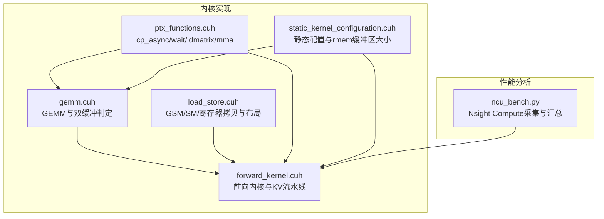
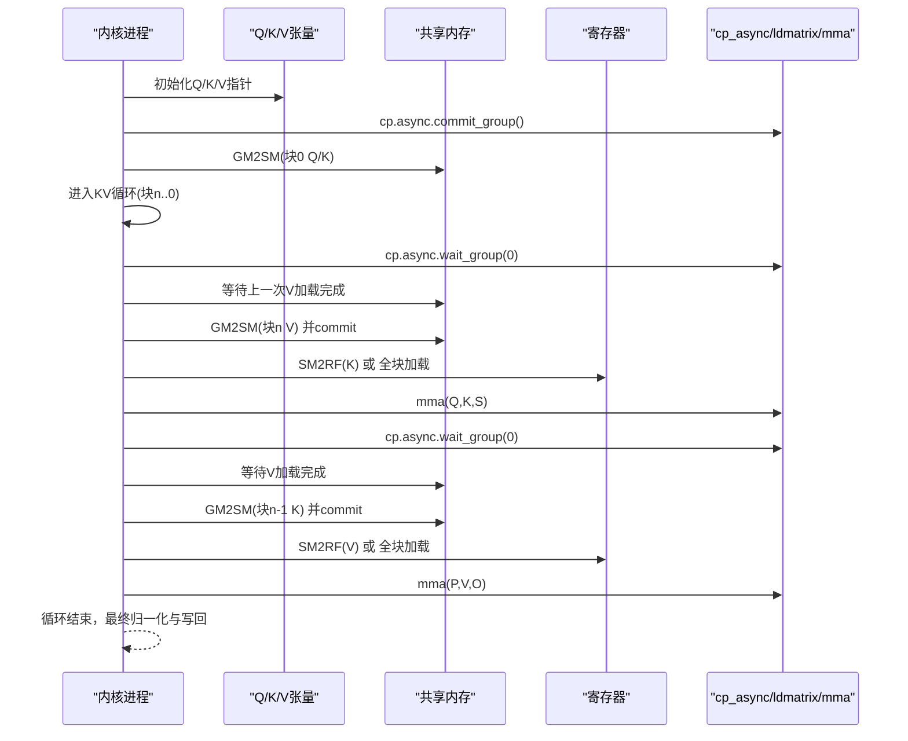
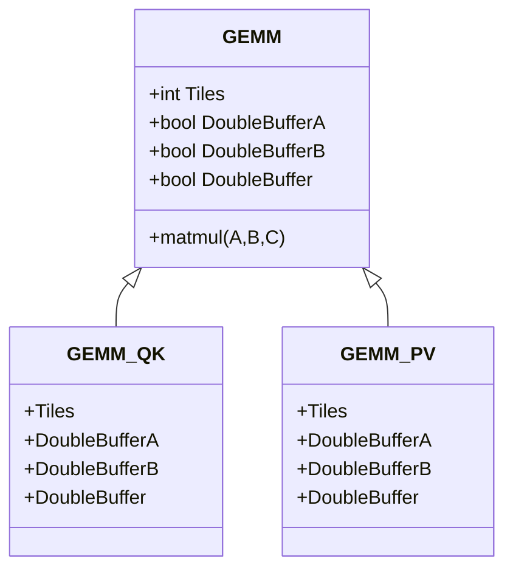
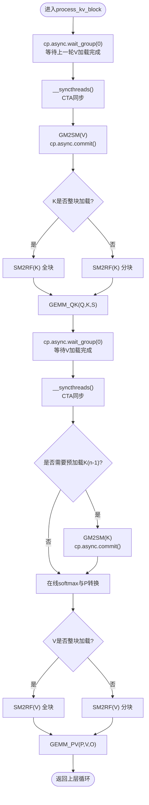
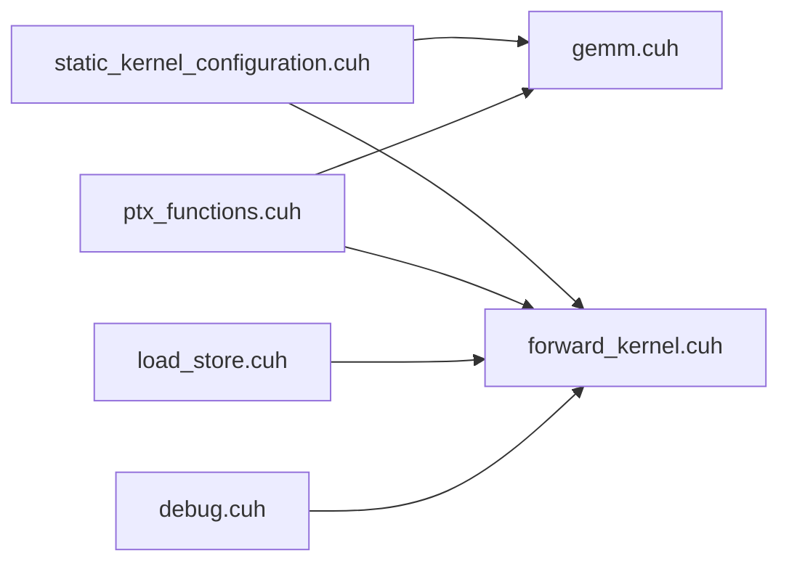

# 双缓冲技术

<cite>
**本文引用的文件**
- [gemm.cuh](file://previous_kernels/src_15/include/gemm.cuh)
- [forward_kernel.cuh](file://previous_kernels/src_15/include/forward_kernel.cuh)
- [load_store.cuh](file://previous_kernels/src_15/include/load_store.cuh)
- [ptx_functions.cuh](file://previous_kernels/src_15/include/ptx_functions.cuh)
- [static_kernel_configuration.cuh](file://previous_kernels/src_15/include/static_kernel_configuration.cuh)
- [debug.cuh](file://previous_kernels/src_15/include/debug.cuh)
- [ncu_bench.py](file://tools/benchmark/ncu_bench.py)
</cite>

## 目录
1. [引言](#引言)
2. [项目结构](#项目结构)
3. [核心组件](#核心组件)
4. [架构总览](#架构总览)
5. [详细组件分析](#详细组件分析)
6. [依赖关系分析](#依赖关系分析)
7. [性能考量](#性能考量)
8. [故障排查指南](#故障排查指南)
9. [结论](#结论)
10. [附录](#附录)

## 引言
本文件围绕“双缓冲技术”展开，聚焦于如何在计算与内存传输之间实现重叠（overlap），以提升整体吞吐。文档基于仓库中的前向内核实现，系统阐述以下要点：
- 编译期判断：依据寄存器内存（rmem）分块缓冲区大小与加载策略，动态启用双缓冲（GEMM::DoubleBufferA/B）。
- 流水线结构：在KV处理阶段，当前块的P、V乘加（PV）计算与下一区块的K/V预加载并发执行。
- 同步策略：cp_async_wait与__syncthreads的协同，确保内存访问安全。
- 性能分析：使用NVIDIA Nsight Compute进行度量，指导如何通过调节缓冲区大小优化计算掩盖率。

## 项目结构
本项目采用按版本演进的多目录组织方式，核心实现位于 previous_kernels/src_15/include 下，包含GEMM、前向内核、加载存储、PTX指令封装、静态内核配置等模块；tools/benchmark 提供性能分析脚本。

图示来源
- [gemm.cuh](file://previous_kernels/src_15/include/gemm.cuh#L1-L126)
- [forward_kernel.cuh](file://previous_kernels/src_15/include/forward_kernel.cuh#L1-L207)
- [load_store.cuh](file://previous_kernels/src_15/include/load_store.cuh#L1-L356)
- [ptx_functions.cuh](file://previous_kernels/src_15/include/ptx_functions.cuh#L1-L216)
- [static_kernel_configuration.cuh](file://previous_kernels/src_15/include/static_kernel_configuration.cuh#L1-L294)
- [ncu_bench.py](file://tools/benchmark/ncu_bench.py#L1-L464)

章节来源
- [gemm.cuh](file://previous_kernels/src_15/include/gemm.cuh#L1-L126)
- [forward_kernel.cuh](file://previous_kernels/src_15/include/forward_kernel.cuh#L1-L207)
- [load_store.cuh](file://previous_kernels/src_15/include/load_store.cuh#L1-L356)
- [ptx_functions.cuh](file://previous_kernels/src_15/include/ptx_functions.cuh#L1-L216)
- [static_kernel_configuration.cuh](file://previous_kernels/src_15/include/static_kernel_configuration.cuh#L1-L294)
- [ncu_bench.py](file://tools/benchmark/ncu_bench.py#L1-L464)

## 核心组件
- GEMM与双缓冲判定：通过模板参数与编译期常量，决定是否对A/B或两者启用双缓冲，并在循环中交错加载不同阶段的数据。
- 前向内核与KV流水线：在每个KV块处理周期内，先等待上一阶段的V加载完成，再启动下一阶段的K/V预加载，同时进行当前块的S=QK与P=PV计算。
- 加载存储与布局：提供GM2SM异步加载、SM2RF/RF2SM拷贝、ldmatrix/mma等底层PTX指令封装。
- 静态配置与rmem缓冲区：根据配置项与分块片段数，推导rmem分块缓冲区大小（1或2），并据此影响双缓冲启用与否。
- 调试与打印：提供丰富的打印接口，便于验证数据流与同步点位置。

章节来源
- [gemm.cuh](file://previous_kernels/src_15/include/gemm.cuh#L1-L126)
- [forward_kernel.cuh](file://previous_kernels/src_15/include/forward_kernel.cuh#L1-L207)
- [load_store.cuh](file://previous_kernels/src_15/include/load_store.cuh#L1-L356)
- [static_kernel_configuration.cuh](file://previous_kernels/src_15/include/static_kernel_configuration.cuh#L1-L294)
- [debug.cuh](file://previous_kernels/src_15/include/debug.cuh#L1-L524)

## 架构总览
双缓冲在本实现中贯穿“内存搬运—计算—预取”的流水线，目标是让访存与计算尽可能重叠，减少空闲时间。整体流程如下：

图示来源
- [forward_kernel.cuh](file://previous_kernels/src_15/include/forward_kernel.cuh#L1-L207)
- [ptx_functions.cuh](file://previous_kernels/src_15/include/ptx_functions.cuh#L1-L216)
- [load_store.cuh](file://previous_kernels/src_15/include/load_store.cuh#L1-L356)

## 详细组件分析

### 组件A：GEMM与双缓冲判定（编译期）
- 双缓冲判定逻辑
  - 对A/B分别判定：当非整块加载且rmem_tile_buffer_size > 1时启用双缓冲。
  - 整体双缓冲标志由A/B任一启用决定。
- 双缓冲加载策略
  - 在循环中，当前迭代开始前，提前加载下一阶段的A/B到寄存器，从而与当前计算重叠。
  - 若某侧为整块加载，则无需分阶段加载，直接全块拷贝至寄存器。
- GEMM_QK与GEMM_PV
  - QK阶段：S_accum为寄存器累加器，P中间结果也保持在寄存器。
  - PV阶段：O_accum为寄存器累加器，最终转换后写回共享内存再写回全局内存。

图示来源
- [gemm.cuh](file://previous_kernels/src_15/include/gemm.cuh#L1-L126)
- [static_kernel_configuration.cuh](file://previous_kernels/src_15/include/static_kernel_configuration.cuh#L1-L294)

章节来源
- [gemm.cuh](file://previous_kernels/src_15/include/gemm.cuh#L1-L126)
- [static_kernel_configuration.cuh](file://previous_kernels/src_15/include/static_kernel_configuration.cuh#L1-L294)

### 组件B：前向内核与KV流水线（运行时）
- KV块处理流程
  - 每个块内：先等待上一轮V加载完成，再启动本轮V加载；随后进行S=QK计算；再等待V加载完成，启动下一轮K加载；最后进行P=PV计算。
  - 使用cp_async_commit与cp_async_wait协调异步拷贝与等待。
  - 使用__syncthreads保证CTA范围内可见性与一致性。
- 初始阶段
  - 启动Q/K的初始块加载，等待Q全块加载完成后进入主循环。
- 最终阶段
  - 完成所有块后，进行在线softmax归一化，将O从寄存器写入共享内存，再写回全局内存。

图示来源
- [forward_kernel.cuh](file://previous_kernels/src_15/include/forward_kernel.cuh#L1-L207)
- [ptx_functions.cuh](file://previous_kernels/src_15/include/ptx_functions.cuh#L1-L216)

章节来源
- [forward_kernel.cuh](file://previous_kernels/src_15/include/forward_kernel.cuh#L1-L207)
- [ptx_functions.cuh](file://previous_kernels/src_15/include/ptx_functions.cuh#L1-L216)

### 组件C：加载存储与PTX封装
- 异步加载
  - cp_async_commit：提交一组异步拷贝任务。
  - cp_async_wait：等待指定组的任务完成。
  - cp_async：发起单次异步拷贝，通常配合commit使用。
- 寄存器/共享内存/全局内存拷贝
  - SM2RF/RF2SM拷贝路径由配置决定，支持转置/非转置两种路径。
- MMA与ldmatrix
  - ldmatrix_x4：将共享内存中的(16,16)片段加载到寄存器碎片。
  - mma_m16n8k16_f32_accum：执行16x8x16的F32累加MMA。

章节来源
- [load_store.cuh](file://previous_kernels/src_15/include/load_store.cuh#L1-L356)
- [ptx_functions.cuh](file://previous_kernels/src_15/include/ptx_functions.cuh#L1-L216)

### 组件D：静态配置与rmem缓冲区大小
- rmem分块缓冲区大小
  - 当某侧不需要分块加载（load_K_fragments为0）时，rmem缓冲区大小等于该侧的总分块数。
  - 否则，若开启双缓冲（mma_double_buffer_loads为真），缓冲区大小为2；否则为1。
- GEMM模板参数
  - 通过静态配置推导出GEMM::Tiles、DoubleBufferA/B、DoubleBuffer等，用于驱动运行时的双缓冲加载策略。

章节来源
- [static_kernel_configuration.cuh](file://previous_kernels/src_15/include/static_kernel_configuration.cuh#L1-L294)

## 依赖关系分析
- GEMM依赖
  - 依赖静态配置推导的rmem缓冲区大小，进而决定是否启用DoubleBufferA/B。
  - 依赖PTX封装的SM2RF/RF2SM与MMA指令。
- 前向内核依赖
  - 依赖GEMM模板与静态配置，构造Q/K/V/S_accum/P/O等张量类型。
  - 依赖PTX封装的cp_async/wait与ldmatrix/mma。
- 调试与打印
  - 提供打印配置、张量形状与stride信息，辅助定位同步点与数据流问题。

图示来源
- [static_kernel_configuration.cuh](file://previous_kernels/src_15/include/static_kernel_configuration.cuh#L1-L294)
- [gemm.cuh](file://previous_kernels/src_15/include/gemm.cuh#L1-L126)
- [forward_kernel.cuh](file://previous_kernels/src_15/include/forward_kernel.cuh#L1-L207)
- [ptx_functions.cuh](file://previous_kernels/src_15/include/ptx_functions.cuh#L1-L216)
- [load_store.cuh](file://previous_kernels/src_15/include/load_store.cuh#L1-L356)
- [debug.cuh](file://previous_kernels/src_15/include/debug.cuh#L1-L524)

章节来源
- [static_kernel_configuration.cuh](file://previous_kernels/src_15/include/static_kernel_configuration.cuh#L1-L294)
- [gemm.cuh](file://previous_kernels/src_15/include/gemm.cuh#L1-L126)
- [forward_kernel.cuh](file://previous_kernels/src_15/include/forward_kernel.cuh#L1-L207)
- [ptx_functions.cuh](file://previous_kernels/src_15/include/ptx_functions.cuh#L1-L216)
- [load_store.cuh](file://previous_kernels/src_15/include/load_store.cuh#L1-L356)
- [debug.cuh](file://previous_kernels/src_15/include/debug.cuh#L1-L524)

## 性能考量
- 计算掩盖率提升
  - 通过cp_async与__syncthreads的组合，使访存与计算重叠，减少等待时间。
  - 双缓冲可将“加载下一阶段数据”的时间与“当前阶段计算”重叠，提高掩盖率。
- Nsight Compute度量
  - 使用脚本采集MemoryWorkloadAnalysis，关注“Duration/Cycles”等指标，对比不同配置下的性能差异。
  - 可通过切换rmem缓冲区大小、是否启用双缓冲、是否整块加载等参数，观察掩盖效果变化。
- 调优建议
  - 当rmem_tile_buffer_size较大且非整块加载时，启用双缓冲（DoubleBufferA/B）可显著提升吞吐。
  - 若硬件带宽受限或访存瓶颈明显，适当增大缓冲区大小（在不越界前提下）可进一步提升掩盖率。
  - 注意同步点的放置：cp_async_wait与__syncthreads必须成对出现，确保数据可见性与一致性。

章节来源
- [ncu_bench.py](file://tools/benchmark/ncu_bench.py#L1-L464)
- [forward_kernel.cuh](file://previous_kernels/src_15/include/forward_kernel.cuh#L1-L207)
- [static_kernel_configuration.cuh](file://previous_kernels/src_15/include/static_kernel_configuration.cuh#L1-L294)

## 故障排查指南
- 常见问题
  - 数据竞争：未正确使用__syncthreads导致部分warp尚未完成上一轮计算，就访问了新块数据。
  - 同步点错误：仅使用cp_async_wait而忽略__syncthreads，可能导致线程间可见性问题。
  - 缓冲区不足：rmem缓冲区过小导致频繁等待，掩盖率下降。
- 调试手段
  - 使用debug.cuh提供的打印接口，输出张量形状、stride、rmem缓冲区大小等信息，确认配置与预期一致。
  - 在关键同步点前后插入打印，验证cp_async与__syncthreads的时机是否正确。
- 排查步骤
  - 核对静态配置中rmem缓冲区大小与是否启用双缓冲。
  - 检查KV循环内的cp_async/wait与__syncthreads配对情况。
  - 使用Nsight Compute查看访存与计算的时序重叠情况，定位瓶颈。

章节来源
- [debug.cuh](file://previous_kernels/src_15/include/debug.cuh#L1-L524)
- [forward_kernel.cuh](file://previous_kernels/src_15/include/forward_kernel.cuh#L1-L207)

## 结论
本实现通过编译期静态配置与运行时流水线协作，实现了计算与内存传输的高效重叠。双缓冲在GEMM与KV流水线中均有体现：前者通过rmem分块缓冲区大小与整块加载策略决定是否启用，后者通过cp_async与__syncthreads的协同调度，使当前块的PV计算与下一块的K/V预加载并发执行。借助Nsight Compute的度量与调试工具，开发者可以量化掩盖率并针对性地调整缓冲区大小与加载策略，获得更优性能。

## 附录
- 关键实现路径参考
  - GEMM双缓冲判定与加载：[gemm.cuh](file://previous_kernels/src_15/include/gemm.cuh#L1-L126)
  - KV流水线与同步策略：[forward_kernel.cuh](file://previous_kernels/src_15/include/forward_kernel.cuh#L1-L207)
  - 异步加载与PTX封装：[ptx_functions.cuh](file://previous_kernels/src_15/include/ptx_functions.cuh#L1-L216)
  - rmem缓冲区大小与GEMM参数：[static_kernel_configuration.cuh](file://previous_kernels/src_15/include/static_kernel_configuration.cuh#L1-L294)
  - 调试与打印：[debug.cuh](file://previous_kernels/src_15/include/debug.cuh#L1-L524)
  - 性能分析脚本：[ncu_bench.py](file://tools/benchmark/ncu_bench.py#L1-L464)