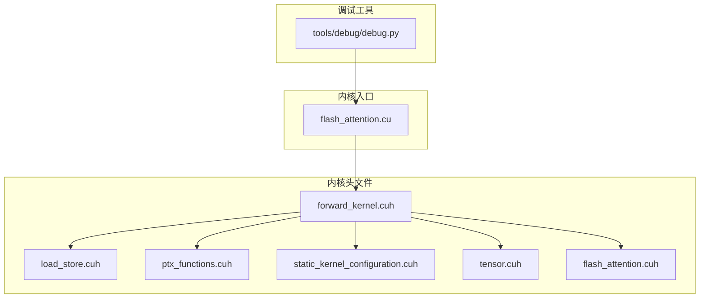
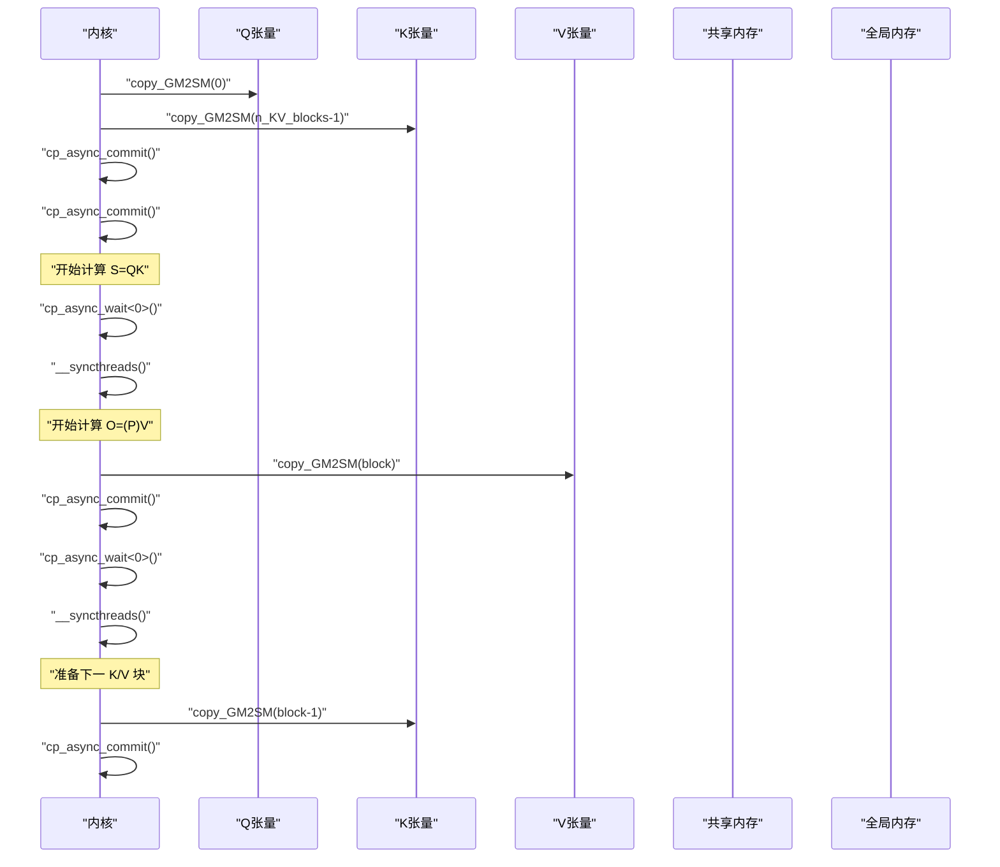
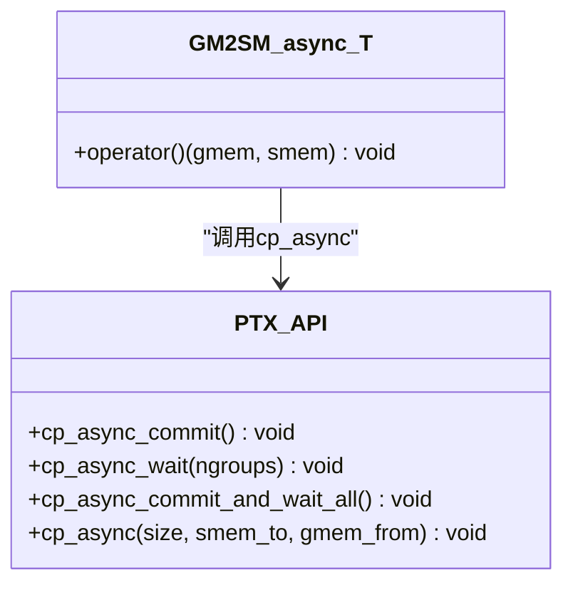
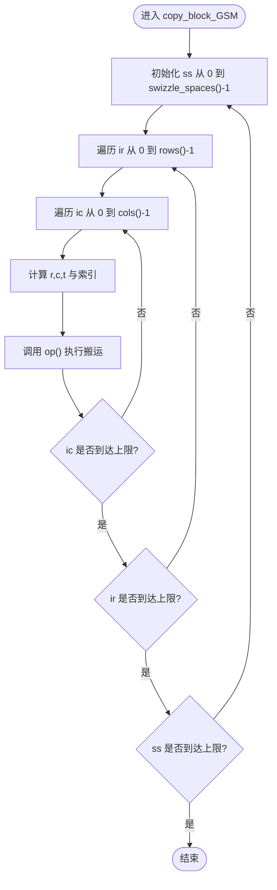
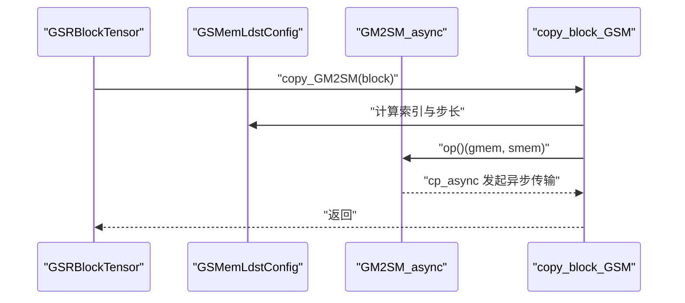
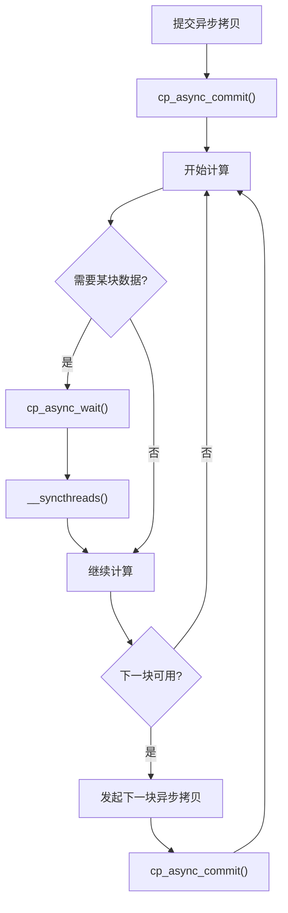
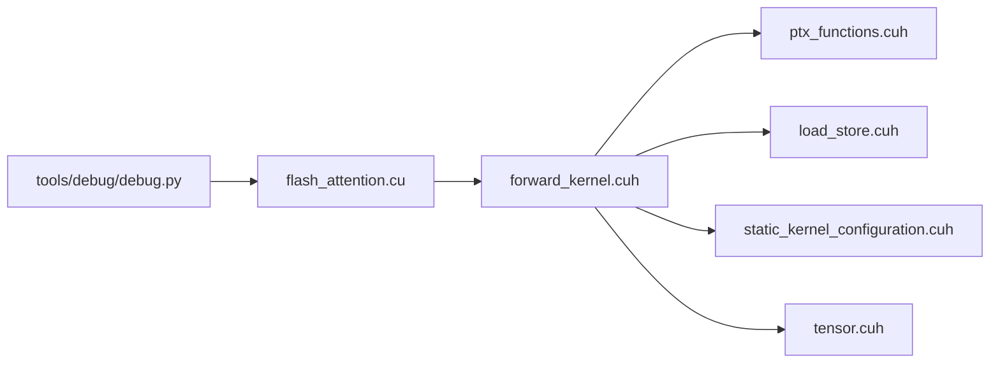

# 异步内存复制

<cite>
**本文引用的文件**
- [forward_kernel.cuh](file://previous_kernels/src_15/include/forward_kernel.cuh)
- [load_store.cuh](file://previous_kernels/src_15/include/load_store.cuh)
- [ptx_functions.cuh](file://previous_kernels/src_15/include/ptx_functions.cuh)
- [static_kernel_configuration.cuh](file://previous_kernels/src_15/include/static_kernel_configuration.cuh)
- [tensor.cuh](file://previous_kernels/src_15/include/tensor.cuh)
- [flash_attention.cuh](file://previous_kernels/src_15/include/flash_attention.cuh)
- [flash_attention.cu](file://previous_kernels/src_15/flash_attention.cu)
- [debug.py](file://tools/debug/debug.py)
</cite>

## 目录
1. [简介](#简介)
2. [项目结构](#项目结构)
3. [核心组件](#核心组件)
4. [架构总览](#架构总览)
5. [详细组件分析](#详细组件分析)
6. [依赖关系分析](#依赖关系分析)
7. [性能考量](#性能考量)
8. [故障排查指南](#故障排查指南)
9. [结论](#结论)
10. [附录](#附录)

## 简介
本文件围绕异步内存复制展开，重点阐述以下主题：
- cp_async 在隐藏全局内存（GM）到共享内存（SM）延迟的关键作用
- GM2SM_async 模板如何封装 PTX 级别的异步加载指令
- 多层级循环展开下，GSMemLdstConfig 中 copy_block_GSM 的异步传输调度机制
- cp_async_commit 和 cp_async_wait 的同步语义及其在双缓冲流水线中的协调
- 基于 forward_kernel.cuh 中 Q/K/V 预加载序列，展示异步复制与计算的重叠
- 调试技巧：使用 NVIDIA Nsight 工具观察内存传输与计算重叠
- 避免死锁的最佳实践

## 项目结构
该仓库包含多个版本的内核实现，本文聚焦于版本 15 的头文件与内核入口，它们共同构成了异步内存复制的完整实现链路。

图表来源
- [forward_kernel.cuh](file://previous_kernels/src_15/include/forward_kernel.cuh#L1-L207)
- [load_store.cuh](file://previous_kernels/src_15/include/load_store.cuh#L1-L356)
- [ptx_functions.cuh](file://previous_kernels/src_15/include/ptx_functions.cuh#L1-L216)
- [static_kernel_configuration.cuh](file://previous_kernels/src_15/include/static_kernel_configuration.cuh#L1-L294)
- [tensor.cuh](file://previous_kernels/src_15/include/tensor.cuh#L1-L143)
- [flash_attention.cuh](file://previous_kernels/src_15/include/flash_attention.cuh#L1-L110)
- [flash_attention.cu](file://previous_kernels/src_15/flash_attention.cu#L114-L150)
- [debug.py](file://tools/debug/debug.py#L1-L200)

章节来源
- [forward_kernel.cuh](file://previous_kernels/src_15/include/forward_kernel.cuh#L1-L207)
- [flash_attention.cu](file://previous_kernels/src_15/flash_attention.cu#L114-L150)

## 核心组件
- 异步加载封装：GM2SM_async 模板通过 cp_async 将 GM 到 SM 的数据搬运交给硬件流水线，避免阻塞当前线程。
- 传输调度：GSMemLdstConfig 与 copy_block_GSM 提供多层级循环展开，按 swizzle 空间、行、列等维度组织传输，确保每个线程/线程块独立且高效地搬运数据。
- 同步控制：cp_async_commit 提交一批异步传输；cp_async_wait 等待指定组完成，配合 __syncthreads 实现跨 warp/CTA 的屏障。
- 双缓冲流水线：在 Q/K/V 预加载序列中，先提交当前块的异步拷贝，再进行计算，随后在下一次迭代前等待并推进下一个块，形成流水线。
- 类型与布局：GSRBlockTensor 抽象了 Q/K/V/O 的视图与布局，结合静态配置（StaticForwardKernelConfig）决定是否整块加载到寄存器或按瓦片加载。

章节来源
- [load_store.cuh](file://previous_kernels/src_15/include/load_store.cuh#L16-L126)
- [ptx_functions.cuh](file://previous_kernels/src_15/include/ptx_functions.cuh#L9-L28)
- [forward_kernel.cuh](file://previous_kernels/src_15/include/forward_kernel.cuh#L140-L204)
- [static_kernel_configuration.cuh](file://previous_kernels/src_15/include/static_kernel_configuration.cuh#L104-L291)
- [tensor.cuh](file://previous_kernels/src_15/include/tensor.cuh#L49-L140)

## 架构总览
异步内存复制贯穿“预加载—计算—写回”三阶段，通过 cp_async 与同步原语实现与计算的重叠。

图表来源
- [forward_kernel.cuh](file://previous_kernels/src_15/include/forward_kernel.cuh#L140-L184)
- [ptx_functions.cuh](file://previous_kernels/src_15/include/ptx_functions.cuh#L9-L28)
- [load_store.cuh](file://previous_kernels/src_15/include/load_store.cuh#L107-L126)

## 详细组件分析

### 组件A：GM2SM_async 与 PTX 级异步加载
- GM2SM_async 将 GM2SM 操作替换为 cp_async，每次搬运固定向量宽度的数据，绕过 L1 缓存，直接进入 L2/全局路径，降低缓存污染。
- cp_async_commit 提交当前批次的异步传输；cp_async_wait 按组等待，支持等待全部或特定组；cp_async_commit_and_wait_all 是组合形式。
- 这些原语由 PTX 内联汇编实现，保证与硬件流水线对齐。

图表来源
- [load_store.cuh](file://previous_kernels/src_15/include/load_store.cuh#L16-L21)
- [ptx_functions.cuh](file://previous_kernels/src_15/include/ptx_functions.cuh#L9-L28)

章节来源
- [load_store.cuh](file://previous_kernels/src_15/include/load_store.cuh#L16-L21)
- [ptx_functions.cuh](file://previous_kernels/src_15/include/ptx_functions.cuh#L9-L28)

### 组件B：GSMemLdstConfig 与 copy_block_GSM 的多层级调度
- GSMemLdstConfig 定义了操作空间、步长、swizzle 等布局参数，OpIters 描述按 swizzle_space、rows、cols 的展开维度。
- copy_block_GSM 使用三层循环（swizzle_space、rows、cols），在每层中计算 gmem/smem 的索引，调用 op() 执行搬运。GM2SM_async 作为 op 将 cp_async 应用于每个片段，从而实现细粒度的异步传输调度。

图表来源
- [load_store.cuh](file://previous_kernels/src_15/include/load_store.cuh#L63-L126)

章节来源
- [load_store.cuh](file://previous_kernels/src_15/include/load_store.cuh#L63-L126)

### 组件C：GSRBlockTensor 的预加载与流水线
- GSRBlockTensor 将 Q/K/V/O 的 GM/SM 视图抽象为张量对象，copy_GM2SM 通过 copy_block_GSM 结合 GM2SM_async 实现异步搬运。
- 在内核启动时，先对 Q/K 的首块发起异步拷贝并提交；随后进行 S=QK 计算；在需要 V 前等待 V 拷贝完成并同步；随后对 K/V 的下一块发起异步拷贝并提交，形成双缓冲流水线。

图表来源
- [tensor.cuh](file://previous_kernels/src_15/include/tensor.cuh#L109-L114)
- [load_store.cuh](file://previous_kernels/src_15/include/load_store.cuh#L107-L126)
- [load_store.cuh](file://previous_kernels/src_15/include/load_store.cuh#L16-L21)

章节来源
- [tensor.cuh](file://previous_kernels/src_15/include/tensor.cuh#L109-L114)
- [forward_kernel.cuh](file://previous_kernels/src_15/include/forward_kernel.cuh#L140-L184)

### 组件D：同步语义与双缓冲协调
- cp_async_commit：提交当前批次的异步传输，允许后续计算继续执行。
- cp_async_wait：等待指定组的传输完成。在 Q/K/V 预加载序列中，先等待 V 完成，再进行 O=(P)V 计算；随后在下一次迭代前等待 K/V 下一块完成，再推进新的异步拷贝。
- __syncthreads：在 cp_async_wait 之后，确保整个 CTA 的读取一致性，避免部分线程提前读取未完成的数据。

图表来源
- [forward_kernel.cuh](file://previous_kernels/src_15/include/forward_kernel.cuh#L140-L184)
- [ptx_functions.cuh](file://previous_kernels/src_15/include/ptx_functions.cuh#L9-L28)

章节来源
- [forward_kernel.cuh](file://previous_kernels/src_15/include/forward_kernel.cuh#L140-L184)
- [ptx_functions.cuh](file://previous_kernels/src_15/include/ptx_functions.cuh#L9-L28)

### 组件E：Q/K/V 预加载序列与计算重叠
- 内核启动时，对 Q 和最后一个 K 块发起异步拷贝并提交，然后进行 S=QK 计算。
- 在处理第一个 K 块时，先等待 V 拷贝完成并同步，再进行 O=(P)V 计算；随后对 K 的上一块发起异步拷贝并提交，为下一次迭代做准备。
- 通过这种交错，异步传输与计算在时间轴上重叠，显著隐藏内存延迟。

章节来源
- [forward_kernel.cuh](file://previous_kernels/src_15/include/forward_kernel.cuh#L140-L184)

## 依赖关系分析
- forward_kernel.cuh 依赖 ptx_functions.cuh（cp_async_*）、load_store.cuh（GM2SM_async、copy_block_GSM）、static_kernel_configuration.cuh（静态布局与形状配置）、tensor.cuh（GSRBlockTensor）。
- flash_attention.cu 作为 Python 扩展入口，负责设置动态共享内存属性并调用内核。
- tools/debug/debug.py 提供参考实现与对比，便于验证异步复制的效果。

图表来源
- [forward_kernel.cuh](file://previous_kernels/src_15/include/forward_kernel.cuh#L1-L207)
- [ptx_functions.cuh](file://previous_kernels/src_15/include/ptx_functions.cuh#L1-L216)
- [load_store.cuh](file://previous_kernels/src_15/include/load_store.cuh#L1-L356)
- [static_kernel_configuration.cuh](file://previous_kernels/src_15/include/static_kernel_configuration.cuh#L1-L294)
- [tensor.cuh](file://previous_kernels/src_15/include/tensor.cuh#L1-L143)
- [flash_attention.cu](file://previous_kernels/src_15/flash_attention.cu#L114-L150)
- [debug.py](file://tools/debug/debug.py#L1-L200)

章节来源
- [forward_kernel.cuh](file://previous_kernels/src_15/include/forward_kernel.cuh#L1-L207)
- [flash_attention.cu](file://previous_kernels/src_15/flash_attention.cu#L114-L150)

## 性能考量
- 传输粒度：GM2SM_async 以固定向量宽度搬运，减少缓存污染，提升带宽利用率。
- 多层级展开：copy_block_GSM 的三层循环覆盖 swizzle_space、rows、cols，使每个线程/线程块独立搬运，提高并发性。
- 双缓冲流水线：通过 cp_async_commit/commit_and_wait_all 与 __syncthreads 协调，最大化隐藏内存延迟。
- 静态配置：StaticForwardKernelConfig 提供布局、形状、swizzle 等静态信息，确保 copy_block_GSM 的索引计算稳定高效。

[本节为通用性能讨论，不直接分析具体文件]

## 故障排查指南
- 使用 NVIDIA Nsight Compute/Systems 分析内核：
  - 在 Nsight Compute 中启用“内存访问模式”和“流水线阶段”视图，观察 cp.async 指令的提交与完成时机，确认与计算阶段的重叠程度。
  - 在 Nsight Systems 中查看全局内存带宽占用与 L2 命中率，评估异步传输是否有效缓解内存瓶颈。
- 观察同步点：
  - 确认在 cp_async_wait 之后有 __syncthreads，避免部分线程提前读取未完成数据导致的竞态。
  - 若出现性能退化，检查 cp_async_commit 的调用频率与等待组号是否正确。
- 死锁规避最佳实践：
  - 每个 CTA 的异步传输必须在下一次迭代前被等待并推进，避免“只提交不推进”的状态。
  - 对于整块加载到寄存器的张量（如 Q），应在等待后显式同步，确保所有线程都已准备好。
  - 避免在不同组之间产生隐式依赖，必要时使用更细粒度的等待组号或分段提交。
- 调试参考：
  - 使用 tools/debug/debug.py 生成参考输出，对比 CUDA 实现结果，定位异步复制导致的数值差异（通常与同步时机有关）。

章节来源
- [debug.py](file://tools/debug/debug.py#L1-L200)

## 结论
通过 GM2SM_async 与 PTX 级 cp_async 指令，结合 GSMemLdstConfig 的多层级循环展开与 copy_block_GSM 的异步传输调度，内核实现了高效的 GM→SM 异步搬运。配合 cp_async_commit/commit_and_wait_all 与 __syncthreads，形成稳定的双缓冲流水线，显著隐藏内存延迟，实现计算与传输的重叠。遵循同步语义与死锁规避最佳实践，可进一步提升稳定性与性能。

[本节为总结性内容，不直接分析具体文件]

## 附录
- 关键符号与含义
  - cp_async：PTX 级异步加载指令封装
  - cp_async_commit：提交当前批次异步传输
  - cp_async_wait：等待指定组完成
  - GM2SM_async：GM→SM 异步搬运适配器
  - copy_block_GSM：按布局配置进行多层级循环展开的搬运
  - 双缓冲流水线：异步传输与计算交错推进的调度策略

[本节为概念性内容，不直接分析具体文件]