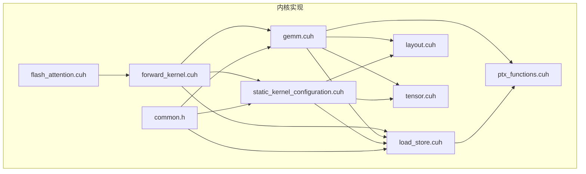
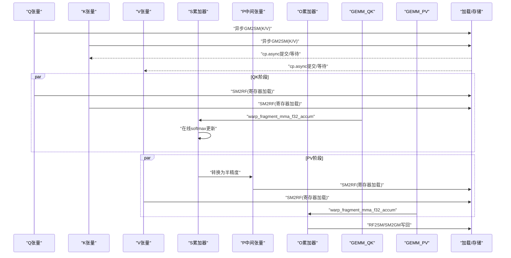
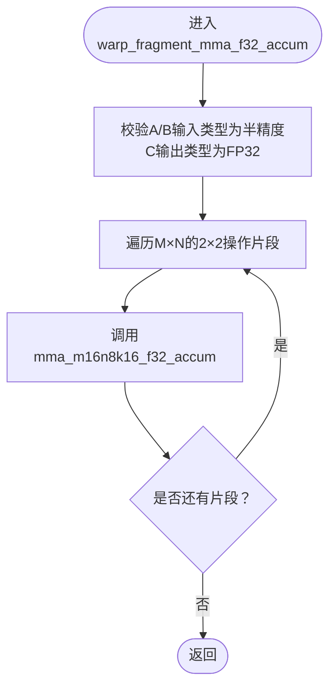
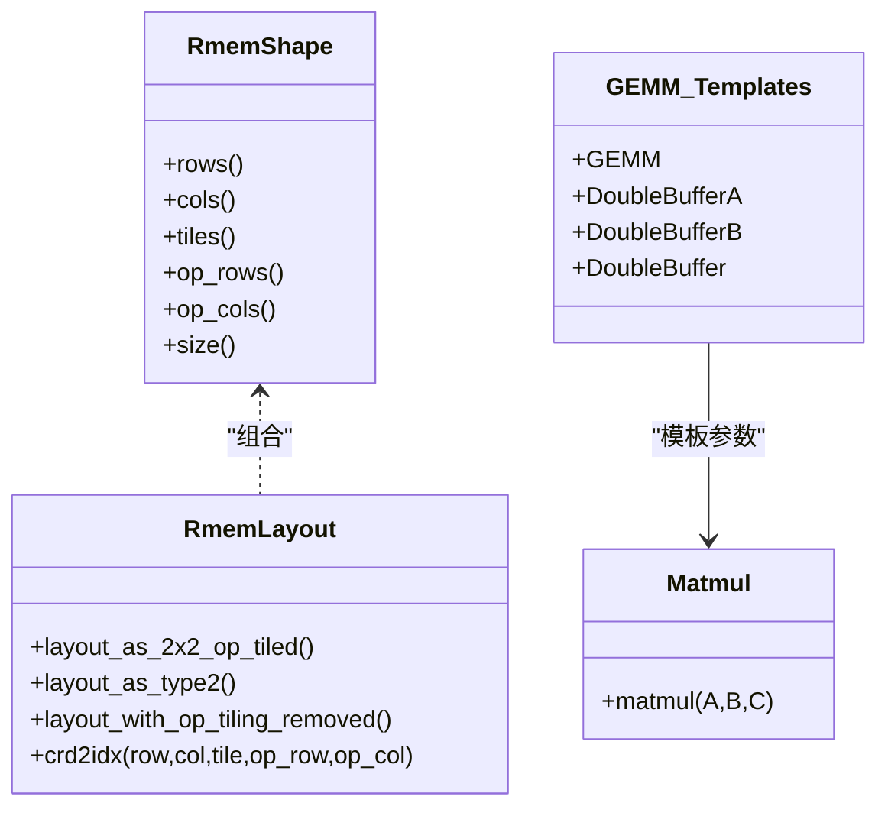
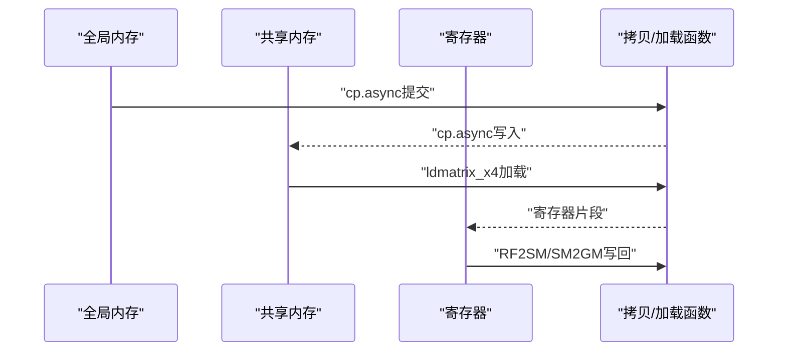
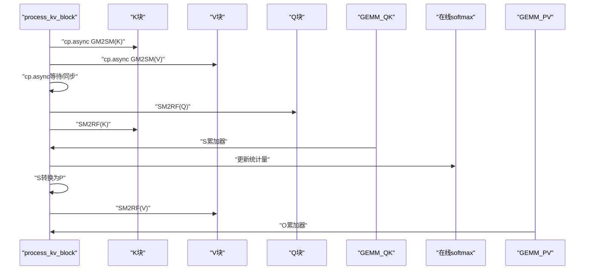
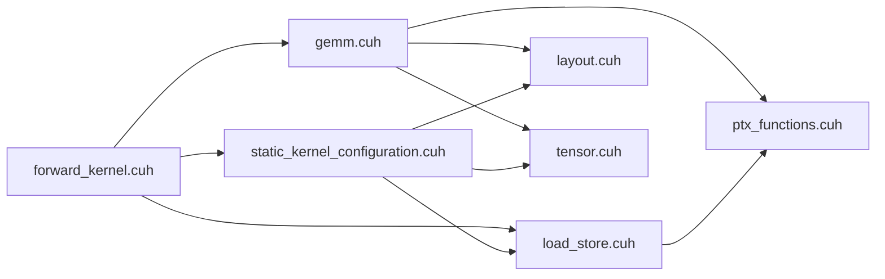

# 张量核心利用

<cite>
**本文引用的文件**
- [gemm.cuh](file://previous_kernels/src_15/include/gemm.cuh)
- [forward_kernel.cuh](file://previous_kernels/src_15/include/forward_kernel.cuh)
- [static_kernel_configuration.cuh](file://previous_kernels/src_15/include/static_kernel_configuration.cuh)
- [load_store.cuh](file://previous_kernels/src_15/include/load_store.cuh)
- [ptx_functions.cuh](file://previous_kernels/src_15/include/ptx_functions.cuh)
- [layout.cuh](file://previous_kernels/src_15/include/layout.cuh)
- [tensor.cuh](file://previous_kernels/src_15/include/tensor.cuh)
- [common.h](file://previous_kernels/src_15/include/common.h)
- [flash_attention.cuh](file://previous_kernels/src_15/include/flash_attention.cuh)
- [README.md](file://README.md)
</cite>

## 目录
1. [引言](#引言)
2. [项目结构](#项目结构)
3. [核心组件](#核心组件)
4. [架构总览](#架构总览)
5. [详细组件分析](#详细组件分析)
6. [依赖关系分析](#依赖关系分析)
7. [性能考量](#性能考量)
8. [故障排查指南](#故障排查指南)
9. [结论](#结论)
10. [附录](#附录)

## 引言
本文件聚焦于张量核心（Tensor Core）在Flash Attention中的高效应用，围绕以下目标展开：
- 解释gemm.cuh中warp_fragment_mma_f32_accum如何调用mma_m16n8k16_f32_accum实现FP16输入到FP32累加的矩阵乘法。
- 阐述GEMM模板中的DoubleBuffer机制如何与matmul函数配合实现计算与加载的流水线。
- 结合forward_kernel.cuh中的process_kv_block函数，说明QK和PV两个GEMM阶段如何利用张量核心完成注意力计算。
- 提供寄存器分块策略分析，包括MMA_M/N/K维度的取值依据，并指导开发者如何根据d_head调整分块参数以最大化张量核心利用率。

## 项目结构
该仓库包含多版本迭代的内核实现，其中第15代实现提供了完整的张量核心路径。关键头文件分布如下：
- GEMM与张量核心：gemm.cuh、ptx_functions.cuh
- 前向内核与KV块处理：forward_kernel.cuh
- 静态内核配置与张量布局：static_kernel_configuration.cuh、layout.cuh、tensor.cuh
- 内存拷贝与寄存器加载：load_store.cuh
- 公共常量与类型：common.h
- 运行时参数与内核配置：flash_attention.cuh
- 性能对比与说明：README.md

图表来源
- [forward_kernel.cuh](file://previous_kernels/src_15/include/forward_kernel.cuh#L1-L207)
- [gemm.cuh](file://previous_kernels/src_15/include/gemm.cuh#L1-L126)
- [ptx_functions.cuh](file://previous_kernels/src_15/include/ptx_functions.cuh#L1-L216)
- [load_store.cuh](file://previous_kernels/src_15/include/load_store.cuh#L1-L356)
- [layout.cuh](file://previous_kernels/src_15/include/layout.cuh#L1-L269)
- [tensor.cuh](file://previous_kernels/src_15/include/tensor.cuh#L1-L143)
- [static_kernel_configuration.cuh](file://previous_kernels/src_15/include/static_kernel_configuration.cuh#L1-L294)
- [common.h](file://previous_kernels/src_15/include/common.h#L1-L81)
- [flash_attention.cuh](file://previous_kernels/src_15/include/flash_attention.cuh#L1-L110)

章节来源
- [README.md](file://README.md#L1-L63)

## 核心组件
- GEMM与张量核心
  - GEMM模板定义了双缓冲策略与块级循环，warp_fragment_mma_f32_accum封装了张量核心的FP16→FP32累加。
  - mma_m16n8k16_f32_accum通过PTX指令直接驱动Tensor Core。
- 寄存器分块与布局
  - ROWS_PER_FRAGMENT/COLS_PER_FRAGMENT定义每个寄存器片段的尺寸；THR_COLS_PER_ACCUM_FRAGMENT影响累加器列方向的分块。
  - RmemShape/RmemLayout描述寄存器中的张量布局与操作平铺。
- 内存拷贝与异步加载
  - load_store.cuh提供GM2SM/SM2GM/SM2RF/RF2SM等拷贝路径，支持异步cp.async与ldmatrix.x4。
- 前向内核与KV块处理
  - forward_kernel.cuh的process_kv_block串联QK与PV两个GEMM阶段，并在软最大值前后进行数据转换与写回。

章节来源
- [gemm.cuh](file://previous_kernels/src_15/include/gemm.cuh#L1-L126)
- [ptx_functions.cuh](file://previous_kernels/src_15/include/ptx_functions.cuh#L1-L216)
- [load_store.cuh](file://previous_kernels/src_15/include/load_store.cuh#L1-L356)
- [layout.cuh](file://previous_kernels/src_15/include/layout.cuh#L1-L269)
- [tensor.cuh](file://previous_kernels/src_15/include/tensor.cuh#L1-L143)
- [forward_kernel.cuh](file://previous_kernels/src_15/include/forward_kernel.cuh#L1-L207)
- [common.h](file://previous_kernels/src_15/include/common.h#L1-L81)
- [flash_attention.cuh](file://previous_kernels/src_15/include/flash_attention.cuh#L1-L110)

## 架构总览
下图展示了前向内核中QK与PV两个阶段的张量核心流水线：异步加载K/V到共享内存，寄存器中执行GEMM，软最大值在线更新，再进行P→V的GEMM。

图表来源
- [forward_kernel.cuh](file://previous_kernels/src_15/include/forward_kernel.cuh#L1-L207)
- [gemm.cuh](file://previous_kernels/src_15/include/gemm.cuh#L1-L126)
- [load_store.cuh](file://previous_kernels/src_15/include/load_store.cuh#L1-L356)
- [ptx_functions.cuh](file://previous_kernels/src_15/include/ptx_functions.cuh#L1-L216)

## 详细组件分析

### 组件A：GEMM与张量核心（FP16→FP32累加）
- warp_fragment_mma_f32_accum
  - 负责遍历每个M×N的2×2操作片段，调用mma_m16n8k16_f32_accum执行张量核心运算。
  - 输入A/B为半精度（half/bfloat16），输出C为浮点（float）累加器。
  - 通过视图与布局移除操作平铺后，确保索引与寄存器布局一致。
- mma_m16n8k16_f32_accum
  - 使用PTX的mma.sync指令，指定m16n8k16的张量核心形状，输入为半精度，累加到FP32。
  - 条件编译区分half与bfloat16两种输入类型。
- matmul与DoubleBuffer
  - matmul在每轮tile中先预取下一组tile到寄存器，然后执行当前tile的外积累加。
  - 双缓冲条件由GEMM模板的DoubleBufferA/DoubleBufferB决定，避免寄存器加载阻塞计算。

图表来源
- [gemm.cuh](file://previous_kernels/src_15/include/gemm.cuh#L41-L87)
- [ptx_functions.cuh](file://previous_kernels/src_15/include/ptx_functions.cuh#L47-L77)

章节来源
- [gemm.cuh](file://previous_kernels/src_15/include/gemm.cuh#L1-L126)
- [ptx_functions.cuh](file://previous_kernels/src_15/include/ptx_functions.cuh#L1-L216)

### 组件B：寄存器分块与布局（MMA_M/N/K维度）
- 分块常量
  - ROWS_PER_FRAGMENT = 8，COLS_PER_FRAGMENT = 8，定义每个寄存器片段的行列元素数。
  - THR_COLS_PER_ACCUM_FRAGMENT = 2，控制累加器列方向的线程分块粒度。
  - LDMATRIX_MAT_SIZE = 8，ldmatrix每次加载8×8的子块，形成2×2的寄存器片段。
- MMA维度
  - 宏定义MMA_M=16、MMA_N=8、MMA_K=16，对应mma.sync.m16n8k16的张量核心形状。
  - 每次ldmatrix.x4加载一个8×8子块，两个ldmatrix.x4组成16×8的A片段，B片段为8×16的半精度块。
- 寄存器形状与布局
  - RmemShape/RmemLayout描述寄存器中张量的形状、平铺与stride，支持2×2操作平铺与类型化布局（如half2）。
  - copy_warp_fragment_SM2RF/copy_warp_fragment_transposed_SM2RF分别处理非转置与转置场景下的寄存器加载。

图表来源
- [layout.cuh](file://previous_kernels/src_15/include/layout.cuh#L80-L174)
- [gemm.cuh](file://previous_kernels/src_15/include/gemm.cuh#L24-L39)
- [gemm.cuh](file://previous_kernels/src_15/include/gemm.cuh#L89-L123)

章节来源
- [common.h](file://previous_kernels/src_15/include/common.h#L1-L81)
- [layout.cuh](file://previous_kernels/src_15/include/layout.cuh#L1-L269)
- [gemm.cuh](file://previous_kernels/src_15/include/gemm.cuh#L1-L126)

### 组件C：内存拷贝与异步加载（GM2SM/SM2RF/RF2SM）
- 异步加载
  - cp.async提供128B粒度的全局到共享内存异步拷贝，cp.async.commit/wait用于成组提交与等待。
- 寄存器加载
  - ldmatrix_x4通过共享内存加载8×8子块到寄存器，支持转置与非转置两种路径。
- 写回与合并
  - RF2SM/SM2GM使用向量store指令，提升写回带宽与合并性。

图表来源
- [ptx_functions.cuh](file://previous_kernels/src_15/include/ptx_functions.cuh#L1-L45)
- [load_store.cuh](file://previous_kernels/src_15/include/load_store.cuh#L1-L126)
- [load_store.cuh](file://previous_kernels/src_15/include/load_store.cuh#L203-L312)

章节来源
- [ptx_functions.cuh](file://previous_kernels/src_15/include/ptx_functions.cuh#L1-L216)
- [load_store.cuh](file://previous_kernels/src_15/include/load_store.cuh#L1-L356)

### 组件D：前向内核与KV块处理（QK与PV两阶段）
- process_kv_block
  - 在每个KV块上执行：
    - 等待K/V异步加载完成，同步屏障保证跨warp一致性。
    - 若整块可驻留寄存器，则一次性加载所有tile。
    - 执行GEMM_QK（Q×K^T）得到S累加器，随后在线softmax更新。
    - 将S转换为半精度得到P，执行GEMM_PV（P×V）累积到O。
  - 通过异步拷贝与寄存器加载的重叠，最大化计算与访存并行度。

图表来源
- [forward_kernel.cuh](file://previous_kernels/src_15/include/forward_kernel.cuh#L19-L83)

章节来源
- [forward_kernel.cuh](file://previous_kernels/src_15/include/forward_kernel.cuh#L1-L207)

### 组件E：静态内核配置与张量类型
- StaticForwardKernelConfig
  - 基于运行时配置（FlashForwardKernelConfig）生成静态类型与张量形状，包括：
    - Q/K/V/S/P/O的寄存器与共享内存布局。
    - GEMM_QK/GEMM_PV的模板参数（tiles、value_t等）。
    - d_head、B_r、B_c、n_warps等维度的派生分块。
- 类型与数值
  - value_t根据dtype选择half或bfloat16；累加器统一为float。

章节来源
- [static_kernel_configuration.cuh](file://previous_kernels/src_15/include/static_kernel_configuration.cuh#L1-L294)
- [flash_attention.cuh](file://previous_kernels/src_15/include/flash_attention.cuh#L1-L110)

## 依赖关系分析
- 组件耦合
  - forward_kernel.cuh依赖GEMM模板与load_store.cuh实现流水线；GEMM模板依赖ptx_functions.cuh与layout.cuh。
  - static_kernel_configuration.cuh将运行时配置映射为编译期类型，耦合tensor.cuh与load_store.cuh的布局配置。
- 外部依赖
  - CUDA内置类型half/bfloat16与PTX指令集。
  - 异步拷贝与向量化store依赖硬件特性。

图表来源
- [forward_kernel.cuh](file://previous_kernels/src_15/include/forward_kernel.cuh#L1-L207)
- [gemm.cuh](file://previous_kernels/src_15/include/gemm.cuh#L1-L126)
- [load_store.cuh](file://previous_kernels/src_15/include/load_store.cuh#L1-L356)
- [layout.cuh](file://previous_kernels/src_15/include/layout.cuh#L1-L269)
- [tensor.cuh](file://previous_kernels/src_15/include/tensor.cuh#L1-L143)
- [static_kernel_configuration.cuh](file://previous_kernels/src_15/include/static_kernel_configuration.cuh#L1-L294)
- [ptx_functions.cuh](file://previous_kernels/src_15/include/ptx_functions.cuh#L1-L216)

## 性能考量
- 张量核心利用率
  - 使用m16n8k16的MMA形状与ldmatrix.x4的8×8子块加载，确保寄存器片段与张量核心形状匹配。
  - 通过THR_COLS_PER_ACCUM_FRAGMENT=2与2×2操作平铺，使线程列方向的累加粒度与寄存器布局一致。
- 流水线与重叠
  - DoubleBuffer机制在每轮tile前预取下一组tile，避免寄存器加载阻塞计算。
  - 异步cp.async与寄存器加载重叠，减少访存等待时间。
- 寄存器与共享内存分块
  - d_head按寄存器片段大小（8×8）进行分块，SRMemTileSize与RSMemTileSize控制不同阶段的寄存器块大小。
  - 通过Swizzle与GSMemStride优化访存合并与带宽利用。

章节来源
- [gemm.cuh](file://previous_kernels/src_15/include/gemm.cuh#L34-L39)
- [gemm.cuh](file://previous_kernels/src_15/include/gemm.cuh#L96-L123)
- [load_store.cuh](file://previous_kernels/src_15/include/load_store.cuh#L1-L126)
- [static_kernel_configuration.cuh](file://previous_kernels/src_15/include/static_kernel_configuration.cuh#L160-L211)
- [common.h](file://previous_kernels/src_15/include/common.h#L24-L42)

## 故障排查指南
- 类型不匹配
  - A/B必须为半精度（half/bfloat16），C必须为FP32；否则warp_fragment_mma_f32_accum会触发断言。
- 布局不一致
  - 寄存器布局与操作平铺需保持一致；若移除了操作平铺，索引访问应使用对应的视图方法。
- 异步拷贝未等待
  - cp.async完成后需commit并wait，否则可能出现读取未完成的数据。
- 寄存器/共享内存溢出
  - d_head过大时，需调整寄存器块大小与双缓冲策略，确保寄存器与共享内存容量满足需求。

章节来源
- [gemm.cuh](file://previous_kernels/src_15/include/gemm.cuh#L41-L87)
- [ptx_functions.cuh](file://previous_kernels/src_15/include/ptx_functions.cuh#L1-L21)
- [load_store.cuh](file://previous_kernels/src_15/include/load_store.cuh#L1-L126)
- [static_kernel_configuration.cuh](file://previous_kernels/src_15/include/static_kernel_configuration.cuh#L1-L103)

## 结论
本实现通过以下关键点充分利用张量核心：
- 明确的MMA_M/N/K维度与寄存器片段尺寸，确保硬件指令与软件布局完全匹配。
- 双缓冲与异步加载的流水线设计，最大化计算与访存并行度。
- 静态内核配置将运行时参数映射为编译期类型，减少分支与开销。
- 在QK与PV两个阶段均采用张量核心，结合在线softmax与半精度转换，实现高吞吐的注意力计算。

## 附录
- 开发者建议
  - 当d_head变化时，优先调整寄存器块大小（SRMemTileSize/RSMemTileSize）与d_head_fragments，确保分块整除且与MMA形状匹配。
  - 合理设置mma_double_buffer_loads与Q/K/V的load_K_fragments，平衡寄存器占用与流水线深度。
  - 使用异步cp.async与ldmatrix.x4组合，确保访存与计算充分重叠。

章节来源
- [static_kernel_configuration.cuh](file://previous_kernels/src_15/include/static_kernel_configuration.cuh#L1-L103)
- [common.h](file://previous_kernels/src_15/include/common.h#L24-L42)
- [README.md](file://README.md#L1-L63)