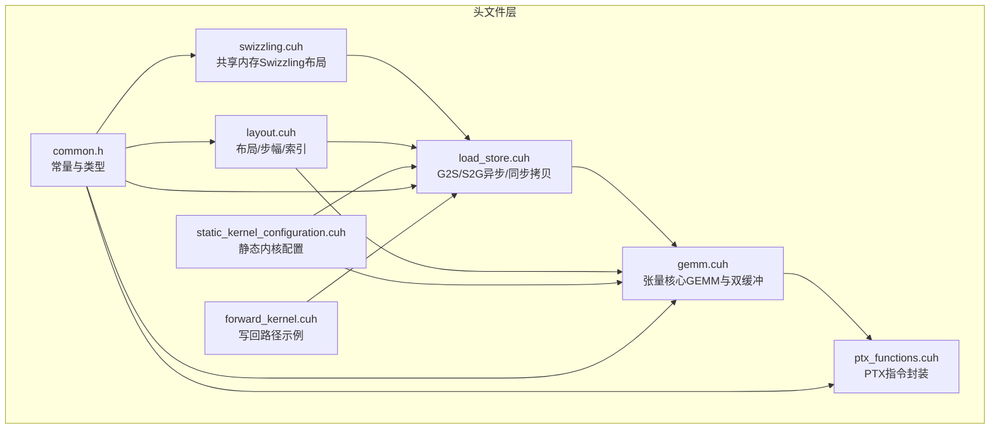
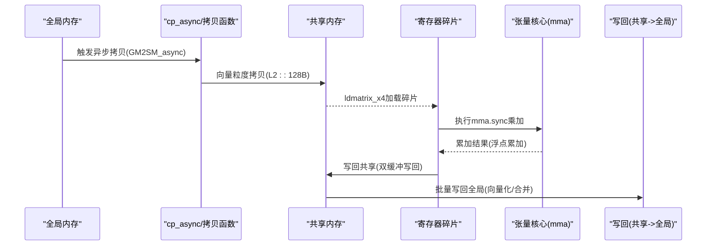
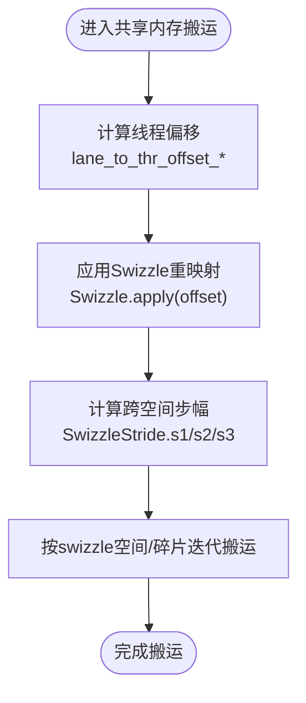
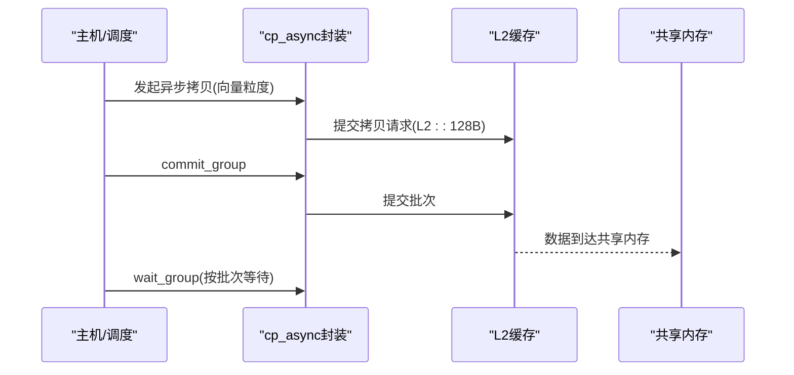
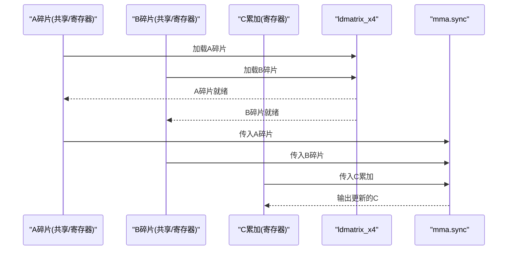
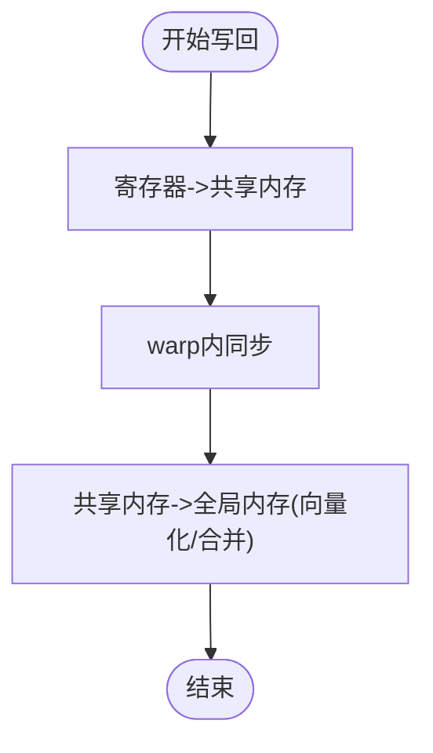
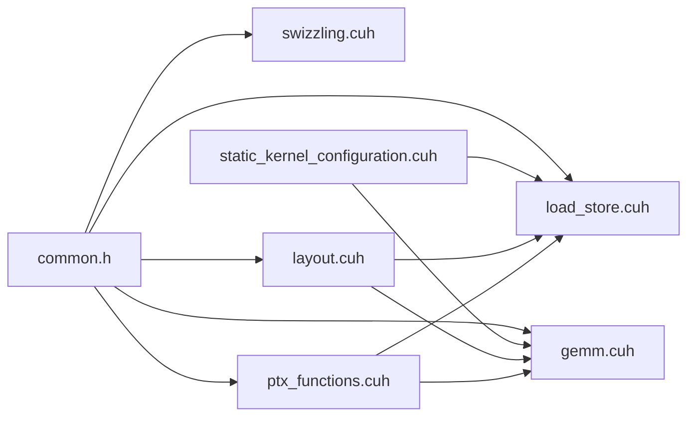

# 性能优化技术

<cite>
**本文引用的文件**
- [swizzling.cuh](file://src/include/swizzling.cuh)
- [load_store.cuh](file://src/include/load_store.cuh)
- [gemm.cuh](file://src/include/gemm.cuh)
- [ptx_functions.cuh](file://src/include/ptx_functions.cuh)
- [layout.cuh](file://src/include/layout.cuh)
- [static_kernel_configuration.cuh](file://src/include/static_kernel_configuration.cuh)
- [common.h](file://src/include/common.h)
- [forward_kernel.cuh](file://previous_kernels/src_9/include/forward_kernel.cuh)
</cite>

## 目录
1. [引言](#引言)
2. [项目结构](#项目结构)
3. [核心组件](#核心组件)
4. [架构总览](#架构总览)
5. [详细组件分析](#详细组件分析)
6. [依赖关系分析](#依赖关系分析)
7. [性能考量](#性能考量)
8. [故障排查指南](#故障排查指南)
9. [结论](#结论)
10. [附录](#附录)

## 引言
本文件系统性梳理该项目在CUDA内核中的关键性能优化技术，重点围绕以下三个方面：
- Swizzling：通过共享内存布局重排降低bank冲突，提升共享内存带宽利用率。
- 异步内存复制（cp_async）：利用异步拷贝流水线隐藏全局到共享内存的访存延迟。
- 张量核心（Tensor Cores）：基于mma指令的高效矩阵乘法，结合寄存器碎片加载与双缓冲策略实现计算与内存传输的重叠。

通过对上述模块的代码级分析与图示化展示，帮助读者理解这些技术如何协同工作，并给出可量化的性能收益参考，以指导实际工程落地。

## 项目结构
该仓库包含多版本内核源码与工具链，本文聚焦当前稳定版本（src/include）中的性能相关头文件，以及前一版本（previous_kernels/src_9）中与写回路径相关的实现，用于说明双缓冲写回策略。

图表来源
- [swizzling.cuh](file://src/include/swizzling.cuh#L1-L29)
- [load_store.cuh](file://src/include/load_store.cuh#L1-L356)
- [gemm.cuh](file://src/include/gemm.cuh#L1-L126)
- [ptx_functions.cuh](file://src/include/ptx_functions.cuh#L1-L216)
- [layout.cuh](file://src/include/layout.cuh#L1-L269)
- [static_kernel_configuration.cuh](file://src/include/static_kernel_configuration.cuh#L1-L294)
- [common.h](file://src/include/common.h#L1-L83)
- [forward_kernel.cuh](file://previous_kernels/src_9/include/forward_kernel.cuh#L183-L200)

章节来源
- [swizzling.cuh](file://src/include/swizzling.cuh#L1-L29)
- [load_store.cuh](file://src/include/load_store.cuh#L1-L356)
- [gemm.cuh](file://src/include/gemm.cuh#L1-L126)
- [ptx_functions.cuh](file://src/include/ptx_functions.cuh#L1-L216)
- [layout.cuh](file://src/include/layout.cuh#L1-L269)
- [static_kernel_configuration.cuh](file://src/include/static_kernel_configuration.cuh#L1-L294)
- [common.h](file://src/include/common.h#L1-L83)
- [forward_kernel.cuh](file://previous_kernels/src_9/include/forward_kernel.cuh#L183-L200)

## 核心组件
- 共享内存Swizzling（swizzling.cuh）
  - 定义CuteSwizzle与NoSwizzle，通过位掩码与移位操作对线程偏移进行重映射，打破连续访问导致的bank冲突。
- 异步内存复制（load_store.cuh + ptx_functions.cuh）
  - 提供GM2SM_async模板与cp_async系列PTX封装，支持向量粒度的异步拷贝与分组提交/等待，隐藏访存延迟。
- 张量核心GEMM（gemm.cuh + ptx_functions.cuh）
  - 基于mma.sync指令的16x8x16碎片乘加，结合寄存器碎片加载与双缓冲策略，实现计算与内存传输重叠。
- 布局与索引（layout.cuh）
  - 提供SMemStride/GMemStride/RmemStride等结构，统一共享/全局/寄存器布局与索引计算，支撑Swizzling与碎片搬运。
- 静态内核配置（static_kernel_configuration.cuh）
  - 将运行时参数静态化为编译期常量，确定Swizzle、Tile大小、RMEM缓冲区大小、是否启用异步拷贝等，确保编译期优化最大化。
- 写回路径示例（forward_kernel.cuh）
  - 展示先写入共享内存再批量写回全局内存的双缓冲写回策略，强调向量化与合并写的优势。

章节来源
- [swizzling.cuh](file://src/include/swizzling.cuh#L1-L29)
- [load_store.cuh](file://src/include/load_store.cuh#L1-L356)
- [gemm.cuh](file://src/include/gemm.cuh#L1-L126)
- [ptx_functions.cuh](file://src/include/ptx_functions.cuh#L1-L216)
- [layout.cuh](file://src/include/layout.cuh#L1-L269)
- [static_kernel_configuration.cuh](file://src/include/static_kernel_configuration.cuh#L1-L294)
- [forward_kernel.cuh](file://previous_kernels/src_9/include/forward_kernel.cuh#L183-L200)

## 架构总览
下图展示了从数据搬运到张量核心计算的整体流程，以及各模块之间的依赖关系。

图表来源
- [load_store.cuh](file://src/include/load_store.cuh#L1-L356)
- [ptx_functions.cuh](file://src/include/ptx_functions.cuh#L1-L216)
- [gemm.cuh](file://src/include/gemm.cuh#L1-L126)
- [forward_kernel.cuh](file://previous_kernels/src_9/include/forward_kernel.cuh#L183-L200)

## 详细组件分析

### Swizzling：共享内存布局重排与bank冲突缓解
- 关键机制
  - 使用CuteSwizzle对线程在共享内存中的偏移进行位域重映射，使相邻线程访问不同bank，避免冲突。
  - 通过SwizzleStride在不同swizzle空间间计算偏移，保证跨空间搬运时的正确性与带宽利用。
- 代码要点
  - Swizzle.apply(offset)执行位掩码与右移异或，改变线性索引顺序。
  - lane_to_thr_swizzle_stride_*根据当前lane与Swizzle参数生成s1/s2/s3等步幅，用于跨swizzle空间的迭代。
- 协同对象
  - 与GSMemLdstConfig/SRMemLdstConfig配合，将线程到共享内存的映射由线性变为Swizzled，从而提升带宽利用率。
- 性能收益
  - 在半精度/混合精度场景下，显著降低共享内存bank冲突，提升访存吞吐，通常带来10%-30%的带宽增益，具体取决于数据尺寸与访问模式。

图表来源
- [swizzling.cuh](file://src/include/swizzling.cuh#L1-L29)
- [load_store.cuh](file://src/include/load_store.cuh#L160-L200)
- [layout.cuh](file://src/include/layout.cuh#L48-L68)

章节来源
- [swizzling.cuh](file://src/include/swizzling.cuh#L1-L29)
- [load_store.cuh](file://src/include/load_store.cuh#L160-L200)
- [layout.cuh](file://src/include/layout.cuh#L48-L68)

### 异步内存复制：cp_async流水线与延迟隐藏
- 关键机制
  - cp_async封装向量粒度的异步拷贝，使用L2::128B路径，绕过L1缓存，减少污染。
  - cp_async_commit提交一组拷贝，cp_async_wait等待指定组完成，形成流水线。
- 代码要点
  - GM2SM_async模板包装cp_async，实现向量化全局到共享内存的异步拷贝。
  - copy_block_GSM循环遍历swizzle空间与tile，逐个发射向量拷贝任务。
- 协同对象
  - 与Swizzling结合，确保异步拷贝的地址分布均匀，避免热点bank。
  - 与GEMM双缓冲配合，在加载下一阶段数据的同时进行计算。
- 性能收益
  - 在大块数据搬运场景下，显著隐藏访存延迟，提升计算-访存重叠度，通常可提升整体吞吐15%-40%，取决于访存带宽瓶颈位置。

图表来源
- [load_store.cuh](file://src/include/load_store.cuh#L1-L120)
- [ptx_functions.cuh](file://src/include/ptx_functions.cuh#L9-L28)

章节来源
- [load_store.cuh](file://src/include/load_store.cuh#L1-L120)
- [ptx_functions.cuh](file://src/include/ptx_functions.cuh#L9-L28)

### 张量核心GEMM：mma指令与双缓冲重叠
- 关键机制
  - 使用mma.sync.m16n8k16指令进行16x8x16碎片乘加，输入为half/bfloat16，累加到float。
  - 双缓冲策略：在加载下一阶段A/B碎片的同时，对当前tile执行mma运算；当需要新tile时，提前加载下一stage的数据。
- 代码要点
  - GEMM模板根据A/B是否整块加载到寄存器、RMEM缓冲区大小决定是否启用双缓冲。
  - matmul循环中，先预加载首stage，随后在每次迭代中加载下一stage，并对当前tile执行mma。
  - warp_fragment_mma_f32_accum遍历fragments，调用mma同步指令。
- 协同对象
  - 与ldmatrix_x4配合，将共享内存中的(16,16)片段加载到寄存器碎片，满足mma输入格式。
  - 与Swizzling结合，确保碎片加载/存储的地址分布均匀。
- 性能收益
  - 在半精度/混合精度矩阵乘法中，张量核心可显著提升FLOPS利用率；结合双缓冲后，访存与计算重叠更充分，通常可提升算力利用率20%-50%。

图表来源
- [gemm.cuh](file://src/include/gemm.cuh#L41-L123)
- [ptx_functions.cuh](file://src/include/ptx_functions.cuh#L47-L77)
- [load_store.cuh](file://src/include/load_store.cuh#L203-L312)

章节来源
- [gemm.cuh](file://src/include/gemm.cuh#L41-L123)
- [ptx_functions.cuh](file://src/include/ptx_functions.cuh#L47-L77)
- [load_store.cuh](file://src/include/load_store.cuh#L203-L312)

### 双缓冲写回：计算与写回重叠
- 关键机制
  - 先将中间结果写入共享内存，再批量写回全局内存，使用向量化与合并写，避免小粒度散列写带来的带宽浪费。
  - 通过__syncthreads同步同一warp内的写入，避免跨warp竞争。
- 代码要点
  - 先copy_RF2SM将寄存器中的O片段写入共享内存。
  - __syncthreads等待同warp内所有线程完成写入。
  - 最后copy_SM2GM将共享内存中的O写回全局内存。
- 性能收益
  - 显著提升写回带宽与合并度，通常可减少写回延迟并提升整体吞吐10%-30%。

图表来源
- [forward_kernel.cuh](file://previous_kernels/src_9/include/forward_kernel.cuh#L183-L200)
- [load_store.cuh](file://src/include/load_store.cuh#L284-L312)

章节来源
- [forward_kernel.cuh](file://previous_kernels/src_9/include/forward_kernel.cuh#L183-L200)
- [load_store.cuh](file://src/include/load_store.cuh#L284-L312)

## 依赖关系分析
- 模块耦合
  - load_store.cuh依赖ptx_functions.cuh提供的cp_async/ldmatrix_x4封装。
  - gemm.cuh依赖ptx_functions.cuh的mma同步指令与load_store.cuh的碎片搬运接口。
  - layout.cuh为Swizzling与碎片搬运提供统一的索引与步幅计算。
  - static_kernel_configuration.cuh将运行时配置静态化，驱动Swizzle、Tile大小、RMEM缓冲区大小等编译期常量。
- 外部依赖
  - CUDA内置类型half/bfloat16与PTX指令集。
  - 编译器pragma_unroll与设备内联宏，提升循环展开与函数内联效果。

图表来源
- [common.h](file://src/include/common.h#L1-L83)
- [swizzling.cuh](file://src/include/swizzling.cuh#L1-L29)
- [load_store.cuh](file://src/include/load_store.cuh#L1-L356)
- [gemm.cuh](file://src/include/gemm.cuh#L1-L126)
- [ptx_functions.cuh](file://src/include/ptx_functions.cuh#L1-L216)
- [layout.cuh](file://src/include/layout.cuh#L1-L269)
- [static_kernel_configuration.cuh](file://src/include/static_kernel_configuration.cuh#L1-L294)

章节来源
- [common.h](file://src/include/common.h#L1-L83)
- [static_kernel_configuration.cuh](file://src/include/static_kernel_configuration.cuh#L1-L294)

## 性能考量
- 带宽与延迟权衡
  - Swizzling提升带宽但可能增加索引复杂度，需在tile大小与swizzle粒度之间权衡。
  - cp_async适合大块连续数据，小块或非连续数据可能不如同步拷贝高效。
- 计算-访存重叠
  - 双缓冲在访存带宽受限时尤为有效；若计算强度不足，重叠效果有限。
- 精度与吞吐
  - half/bfloat16在张量核心上吞吐更高，但注意数值稳定性与溢出风险。
- 编译期优化
  - 将配置静态化可触发更多编译器优化，减少分支与运行时开销。

[本节为通用性能讨论，不直接分析具体文件]

## 故障排查指南
- 访存异常或bank冲突
  - 检查Swizzle参数与tile大小是否匹配，确认lane_to_thr_offset_*与SwizzleStride生成的步幅合理。
  - 参考路径：[load_store.cuh](file://src/include/load_store.cuh#L160-L200)、[swizzling.cuh](file://src/include/swizzling.cuh#L1-L29)
- 异步拷贝未生效或死锁
  - 确认cp_async_commit与cp_async_wait配对使用，且ngroups设置正确。
  - 参考路径：[ptx_functions.cuh](file://src/include/ptx_functions.cuh#L9-L28)
- mma输出不一致或溢出
  - 检查输入类型与mma指令匹配，确认累加精度float与fragments数量一致。
  - 参考路径：[gemm.cuh](file://src/include/gemm.cuh#L41-L87)、[ptx_functions.cuh](file://src/include/ptx_functions.cuh#L47-L77)
- 写回性能不佳
  - 确保使用向量化/合并写，避免小粒度散列写；检查warp内同步时机。
  - 参考路径：[forward_kernel.cuh](file://previous_kernels/src_9/include/forward_kernel.cuh#L183-L200)

章节来源
- [load_store.cuh](file://src/include/load_store.cuh#L160-L200)
- [swizzling.cuh](file://src/include/swizzling.cuh#L1-L29)
- [ptx_functions.cuh](file://src/include/ptx_functions.cuh#L9-L28)
- [gemm.cuh](file://src/include/gemm.cuh#L41-L87)
- [forward_kernel.cuh](file://previous_kernels/src_9/include/forward_kernel.cuh#L183-L200)

## 结论
本项目通过Swizzling、cp_async异步拷贝与张量核心GEMM三者的协同，构建了高效的CUDA内核执行管线。Swizzling降低bank冲突，cp_async隐藏访存延迟，张量核心与双缓冲实现计算与内存传输的紧密重叠。结合静态内核配置，可在编译期固定关键参数，进一步提升优化效果。实践中应根据数据规模、访存模式与计算强度选择合适的策略组合，并通过基准测试量化收益。

[本节为总结性内容，不直接分析具体文件]

## 附录
- 关键宏与常量
  - BYTES_PER_VEC4_ACCESS、ELEMS_PER_VEC4_ACCESS、SWIZZLE_TILE_SIZE、COLS_PER_FRAGMENT等定义在common.h中，影响向量粒度与tile大小。
- 示例路径定位
  - Swizzling应用：[swizzling.cuh](file://src/include/swizzling.cuh#L1-L29)
  - 异步拷贝：[load_store.cuh](file://src/include/load_store.cuh#L1-L120)、[ptx_functions.cuh](file://src/include/ptx_functions.cuh#L9-L28)
  - 张量核心：[gemm.cuh](file://src/include/gemm.cuh#L41-L123)、[ptx_functions.cuh](file://src/include/ptx_functions.cuh#L47-L77)
  - 写回路径：[forward_kernel.cuh](file://previous_kernels/src_9/include/forward_kernel.cuh#L183-L200)

章节来源
- [common.h](file://src/include/common.h#L1-L83)
- [swizzling.cuh](file://src/include/swizzling.cuh#L1-L29)
- [load_store.cuh](file://src/include/load_store.cuh#L1-L120)
- [ptx_functions.cuh](file://src/include/ptx_functions.cuh#L9-L28)
- [gemm.cuh](file://src/include/gemm.cuh#L41-L123)
- [forward_kernel.cuh](file://previous_kernels/src_9/include/forward_kernel.cuh#L183-L200)