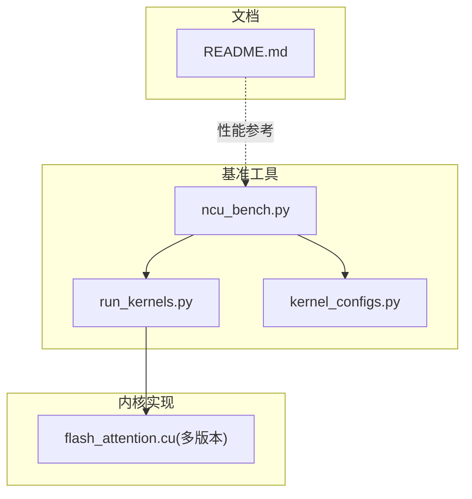
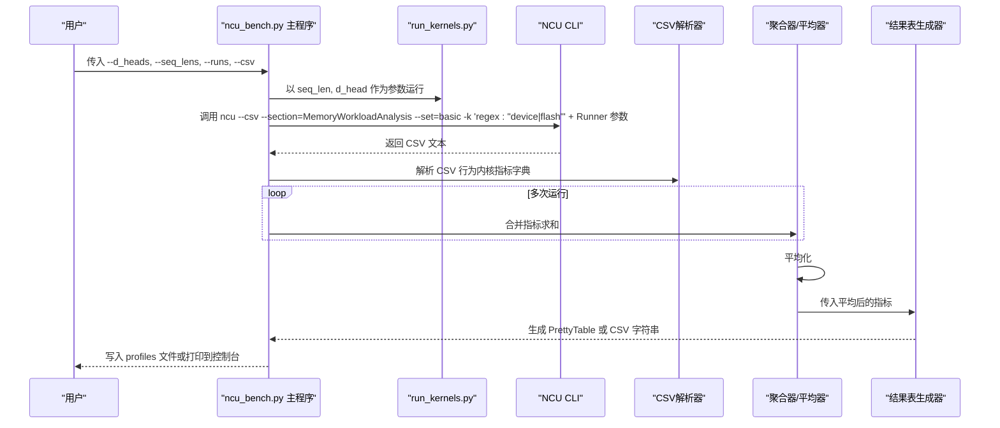
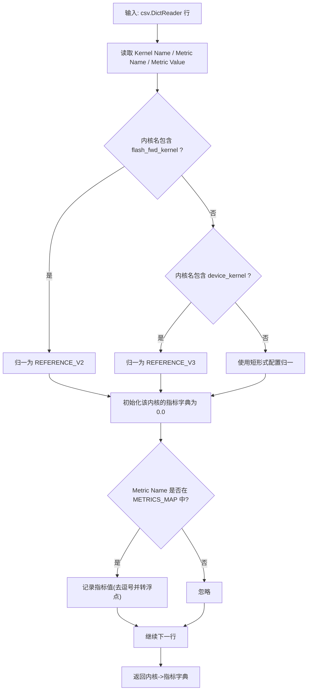
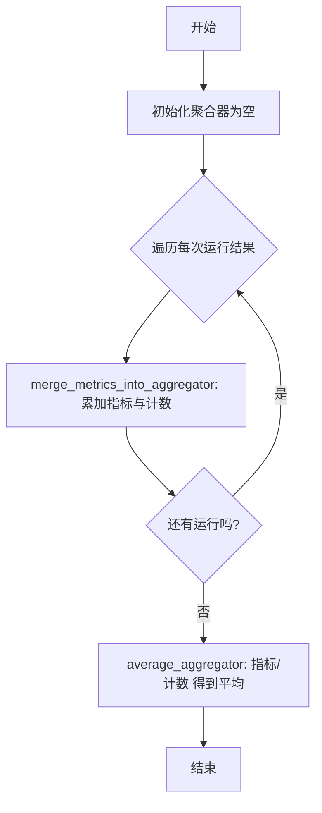
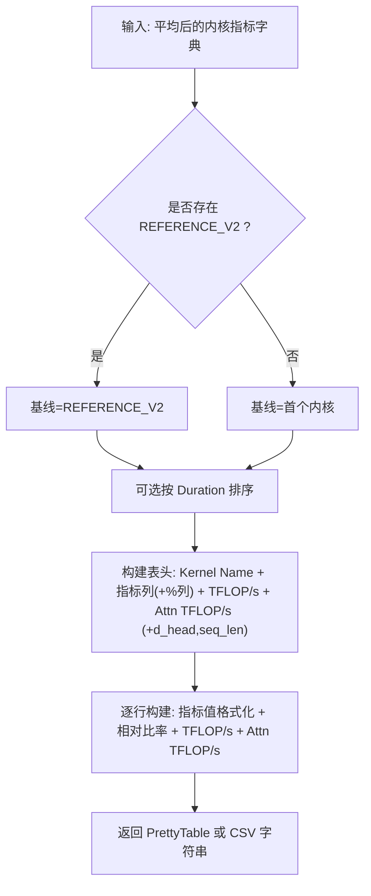
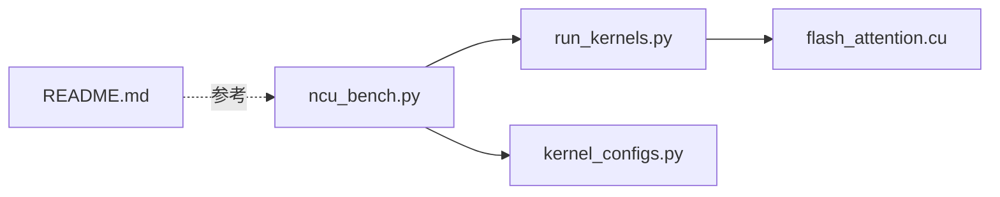

# Nsight Compute性能剖析

<cite>
**本文引用的文件**
- [ncu_bench.py](file://tools/benchmark/ncu_bench.py)
- [run_kernels.py](file://tools/benchmark/run_kernels.py)
- [kernel_configs.py](file://py/flash_helpers/kernel_configs.py)
- [README.md](file://README.md)
</cite>

## 目录
1. [简介](#简介)
2. [项目结构](#项目结构)
3. [核心组件](#核心组件)
4. [架构总览](#架构总览)
5. [详细组件分析](#详细组件分析)
6. [依赖关系分析](#依赖关系分析)
7. [性能考量](#性能考量)
8. [故障排查指南](#故障排查指南)
9. [结论](#结论)
10. [附录](#附录)

## 简介
本指南围绕 ncu_bench.py 的深度使用展开，重点说明其与 NVIDIA Nsight Compute（NCU）的集成机制，包括：
- 如何通过 call_ncu_and_store_output 调用 NCU 命令行工具收集性能数据；
- 如何使用 parse_ncu_csv_rows 解析 NCU CSV 输出；
- METRICS_MAP 中 Duration、Cycles、L2 Hit Rate 等关键指标的含义与用途；
- generate_results_table 如何计算 TFLOP/s 与注意力操作 TFLOP/s，并生成包含相对性能比率的对比表格；
- 如何通过 --csv 参数导出数据，以及结果如何自动保存到 profiles 目录；
- 性能瓶颈分析示例：基于 SM 利用率与内存带宽数据优化内核配置。

## 项目结构
ncu_bench.py 所在的工具链位于 tools/benchmark 目录，配合 run_kernels.py 运行内核，kernel_configs.py 提供 FLOP 计算与内核配置解析，README.md 提供整体性能背景。



图表来源
- [ncu_bench.py](file://tools/benchmark/ncu_bench.py#L311-L350)
- [run_kernels.py](file://tools/benchmark/run_kernels.py#L1-L159)
- [kernel_configs.py](file://py/flash_helpers/kernel_configs.py#L81-L104)
- [README.md](file://README.md#L40-L60)

章节来源
- [ncu_bench.py](file://tools/benchmark/ncu_bench.py#L311-L350)
- [run_kernels.py](file://tools/benchmark/run_kernels.py#L1-L159)
- [kernel_configs.py](file://py/flash_helpers/kernel_configs.py#L81-L104)
- [README.md](file://README.md#L40-L60)

## 核心组件
- NCU 集成与数据采集：call_ncu_and_store_output 使用 ncu CLI 收集 CSV 数据，过滤目标内核并解析为字典。
- 指标映射与解析：METRICS_MAP 定义逻辑指标名、CSV 字段名、显示名、格式化函数与是否展示相对比率；parse_ncu_csv_rows 将 CSV 行转换为按内核名分组的指标字典。
- 结果聚合与统计：merge_metrics_into_aggregator 与 average_aggregator 对多次运行进行求和与平均。
- 结果表格生成：generate_results_table 构建 PrettyTable，计算 TFLOP/s 与注意力 TFLOP/s，并可选输出 CSV。
- 命令行与输出管理：解析 --d_heads、--seq_lens、--runs、--csv、--no_sort；自动编号 profiles 目录并写入日志文件。

章节来源
- [ncu_bench.py](file://tools/benchmark/ncu_bench.py#L31-L56)
- [ncu_bench.py](file://tools/benchmark/ncu_bench.py#L76-L121)
- [ncu_bench.py](file://tools/benchmark/ncu_bench.py#L123-L165)
- [ncu_bench.py](file://tools/benchmark/ncu_bench.py#L170-L309)
- [ncu_bench.py](file://tools/benchmark/ncu_bench.py#L311-L350)
- [ncu_bench.py](file://tools/benchmark/ncu_bench.py#L365-L464)

## 架构总览
下图展示了从命令行到内核执行、再到 NCU 分析与结果汇总的整体流程。



图表来源
- [ncu_bench.py](file://tools/benchmark/ncu_bench.py#L311-L350)
- [ncu_bench.py](file://tools/benchmark/ncu_bench.py#L123-L165)
- [ncu_bench.py](file://tools/benchmark/ncu_bench.py#L170-L309)
- [run_kernels.py](file://tools/benchmark/run_kernels.py#L1-L159)

## 详细组件分析

### NCU 集成与命令行调用
- 调用方式：通过 subprocess 调用 ncu，传入 --csv、--section、--set、-k 正则筛选 device 与 flash 内核，再附加 run_kernels.py 的参数（seq_len、d_head）。
- 错误处理：返回码非零时打印错误信息；未找到 ncu 命令时提示 PATH 问题；异常捕获后返回空字典。
- CSV 解析：跳过 CSV 头部前的非表头行，定位以 "ID" 开头的表头，交由 csv.DictReader 解析。

```mermaid
flowchart TD
Start(["开始"]) --> BuildCmd["构建 ncu 命令参数<br/>--csv/--section/--set/-k + Runner 参数"]
BuildCmd --> Exec["subprocess 执行 ncu"]
Exec --> RC{"返回码==0?"}
RC --> |否| Err["打印错误并返回空字典"]
RC --> |是| Split["分割 stdout 为行列表"]
Split --> FindHdr["查找以 \"ID\" 开头的表头行"]
FindHdr --> Slice["截取表头及后续行"]
Slice --> DictReader["csv.DictReader 解析"]
DictReader --> Parse["parse_ncu_csv_rows 解析为内核指标字典"]
Parse --> End(["结束"])
```

图表来源
- [ncu_bench.py](file://tools/benchmark/ncu_bench.py#L311-L350)
- [ncu_bench.py](file://tools/benchmark/ncu_bench.py#L76-L121)

章节来源
- [ncu_bench.py](file://tools/benchmark/ncu_bench.py#L311-L350)

### CSV 指标解析与归一化
- 内核名归一化：若包含 flash_fwd_kernel 归一为 REFERENCE_V2；包含 device_kernel 归一为 REFERENCE_V3；否则使用 parse_flash_forward_kernel_config().short_form()。
- 指标匹配：遍历 CSV 行，若 Metric Name 与 METRICS_MAP 中的 csv_name 匹配，则记录对应值（去除千分位逗号并转浮点）。
- 初始化：每个内核名首次出现时，初始化所有 METRICS_MAP 中的键为 0.0。



图表来源
- [ncu_bench.py](file://tools/benchmark/ncu_bench.py#L76-L121)

章节来源
- [ncu_bench.py](file://tools/benchmark/ncu_bench.py#L76-L121)

### 指标聚合与平均
- 聚合：对每次运行的结果字典，按内核名累加各指标与计数器。
- 平均：将聚合结果中的指标除以计数得到平均值。



图表来源
- [ncu_bench.py](file://tools/benchmark/ncu_bench.py#L123-L165)

章节来源
- [ncu_bench.py](file://tools/benchmark/ncu_bench.py#L123-L165)

### 结果表格生成与性能指标计算
- 基线选择：优先选择 REFERENCE_V2，否则取第一个内核作为基线。
- 排序：可选按 Duration 升序排列；将 REFERENCE_V2/V3 放置在前。
- 列定义：先“Kernel Name”，然后按 METRICS_MAP 的顺序列出指标列，若 show_ratio 为真则追加“% 逆向显示名”列。
- TFLOP/s 与注意力 TFLOP/s：
  - 总体 TFLOP/s：根据内核配置计算总 FLOP，除以 Duration（纳秒）与缩放因子。
  - 注意力 TFLOP/s：使用 calc_self_attn_flop 计算注意力阶段 FLOP，同样除以 Duration。
- 可选 CSV 输出：当 --csv 为真时，额外追加 d_head、seq_len 两列。



图表来源
- [ncu_bench.py](file://tools/benchmark/ncu_bench.py#L170-L309)
- [kernel_configs.py](file://py/flash_helpers/kernel_configs.py#L81-L104)

章节来源
- [ncu_bench.py](file://tools/benchmark/ncu_bench.py#L170-L309)
- [kernel_configs.py](file://py/flash_helpers/kernel_configs.py#L81-L104)

### 命令行参数与输出管理
- 参数：
  - --d_heads、--seq_lens：逗号分隔的整数列表，组合笛卡尔积运行。
  - --runs：每组配置重复运行次数（用于平均）。
  - --csv：输出 CSV 格式而非文本表格。
  - --no_sort：不按 Duration 排序。
- 输出：
  - 自动编号 profiles/local_profiles 下的文件（.txt 或 .csv），同时输出到控制台。
  - 若非 CSV 模式，会记录当前 Git 提交号。

章节来源
- [ncu_bench.py](file://tools/benchmark/ncu_bench.py#L365-L464)

## 依赖关系分析
- ncu_bench.py 依赖：
  - flash_helpers.kernel_configs：calc_total_flop、calc_self_attn_flop、parse_kernel_name_into_config、parse_flash_forward_kernel_config（短形式归一化）。
  - flash_helpers.test.utils：BENCHMARK_BATCH_SIZE、BENCHMARK_N_HEADS。
  - 第三方库：csv、argparse、logging、os、re、subprocess、sys、itertools、PrettyTable。
- 运行链路：
  - ncu_bench.py -> run_kernels.py（传递 seq_len、d_head 与 --n_runs 等参数）-> CUDA 内核（flash_attention.cu）。
- 性能参考：
  - README.md 提供不同内核迭代与设备的 TFLOP 参考，便于对比。



图表来源
- [ncu_bench.py](file://tools/benchmark/ncu_bench.py#L12-L20)
- [run_kernels.py](file://tools/benchmark/run_kernels.py#L1-L159)
- [kernel_configs.py](file://py/flash_helpers/kernel_configs.py#L81-L104)
- [README.md](file://README.md#L40-L60)

章节来源
- [ncu_bench.py](file://tools/benchmark/ncu_bench.py#L12-L20)
- [run_kernels.py](file://tools/benchmark/run_kernels.py#L1-L159)
- [kernel_configs.py](file://py/flash_helpers/kernel_configs.py#L81-L104)
- [README.md](file://README.md#L40-L60)

## 性能考量
- 指标选择与用途：
  - Duration：内核持续时间（毫秒级单位经格式化为秒），用于计算吞吐量与相对性能。
  - Cycles：内核占用的时钟周期，反映指令密度与调度效率。
  - Registers Per Thread：寄存器使用量，影响寄存器压力与并发度。
  - L2 Hit Rate：L2 缓存命中率，衡量内存访问局部性与带宽利用效率。
- 相对性能比率：
  - 对于 show_ratio 为真的指标，表格会显示“基线值/当前值 × 100%”的相对性能，便于直观比较。
- TFLOP/s 与注意力 TFLOP/s：
  - 总体 TFLOP/s：基于内核配置计算总 FLOP，除以 Duration（纳秒）与缩放因子。
  - 注意力 TFLOP/s：仅计算注意力阶段 FLOP，除以 Duration，便于聚焦注意力计算瓶颈。
- 内核配置归一化：
  - 通过短形式配置统一不同内核名称，确保跨版本/不同命名风格的内核在同一表格中对比。

章节来源
- [ncu_bench.py](file://tools/benchmark/ncu_bench.py#L31-L56)
- [ncu_bench.py](file://tools/benchmark/ncu_bench.py#L170-L309)
- [kernel_configs.py](file://py/flash_helpers/kernel_configs.py#L81-L104)

## 故障排查指南
- 无法找到 ncu 命令
  - 现象：提示 ncu 未安装或不在 PATH。
  - 处理：确认已安装 NVIDIA Nsight Compute，并将其路径加入系统 PATH。
- NCU 返回码非零
  - 现象：打印 stderr 并返回空字典。
  - 处理：检查 run_kernels.py 的参数与内核编译状态；确认 CUDA 设备可用。
- CSV 解析失败
  - 现象：表头未找到或字段缺失导致解析异常。
  - 处理：确认 --section 与 --set 设置正确；确保目标内核名称包含 device 或 flash。
- 输出未保存到 profiles
  - 现象：未生成文件或文件名未递增。
  - 处理：确认目录存在且有写权限；检查 get_highest_profile_number 是否能正确识别已有文件。

章节来源
- [ncu_bench.py](file://tools/benchmark/ncu_bench.py#L311-L350)
- [ncu_bench.py](file://tools/benchmark/ncu_bench.py#L406-L414)
- [ncu_bench.py](file://tools/benchmark/ncu_bench.py#L416-L423)

## 结论
ncu_bench.py 将 NCU 的性能剖析能力与内核基准测试无缝结合，通过 METRICS_MAP 精准提取关键指标，借助 generate_results_table 实现可读性强的对比表格与 CSV 导出。配合 kernel_configs 的 FLOP 计算，能够快速评估注意力计算与整体内核的性能表现，并为优化 SM 利用率与内存带宽提供量化依据。

## 附录

### 关键指标与用途速查
- Duration（毫秒）：用于计算吞吐量与相对性能。
- Cycles：反映指令密度与调度效率。
- Registers Per Thread：评估寄存器压力与并发度。
- L2 Hit Rate：衡量内存访问局部性与带宽利用效率。

章节来源
- [ncu_bench.py](file://tools/benchmark/ncu_bench.py#L31-L56)

### 使用示例与最佳实践
- 基本运行
  - 指定 d_head 与 seq_len 组合，设置 --runs 进行多次运行取平均。
  - 使用 --csv 导出 CSV，便于进一步分析与可视化。
- 性能瓶颈分析思路
  - 若 L2 Hit Rate 较低：检查全局内存访问模式、块大小与共享内存复用策略。
  - 若 Cycles 较高：关注指令选择、寄存器分配与流水线停顿。
  - 若 Duration 显著高于基线：对比 REFERENCE_V2/V3 的指标差异，定位具体内核配置问题。
- 输出与保存
  - 自动保存至 profiles/local_profiles，文件名按序号递增；CSV 模式自动写入 .csv，文本模式写入 .txt。

章节来源
- [ncu_bench.py](file://tools/benchmark/ncu_bench.py#L365-L464)
- [README.md](file://README.md#L40-L60)