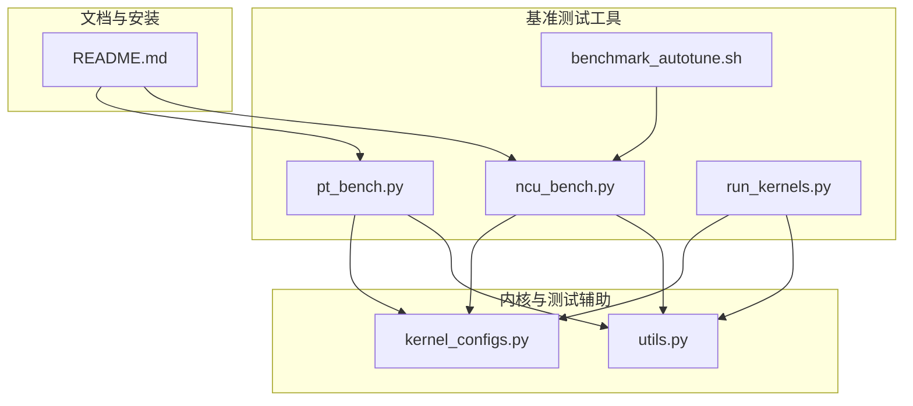
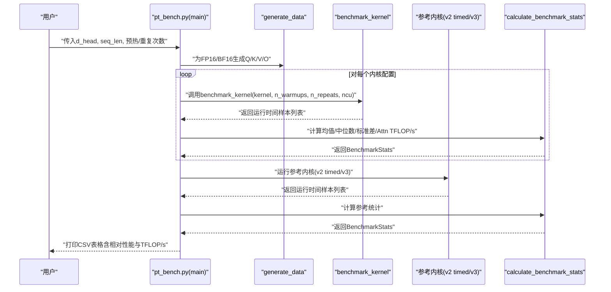
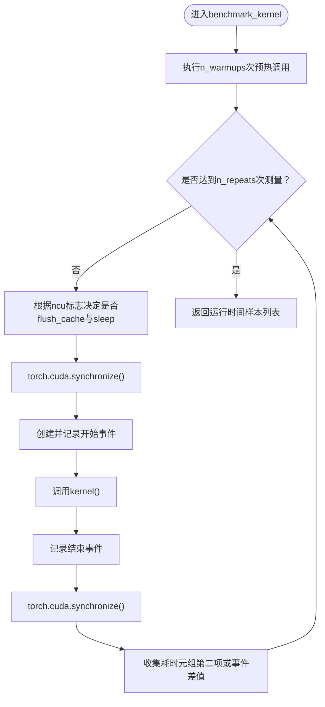
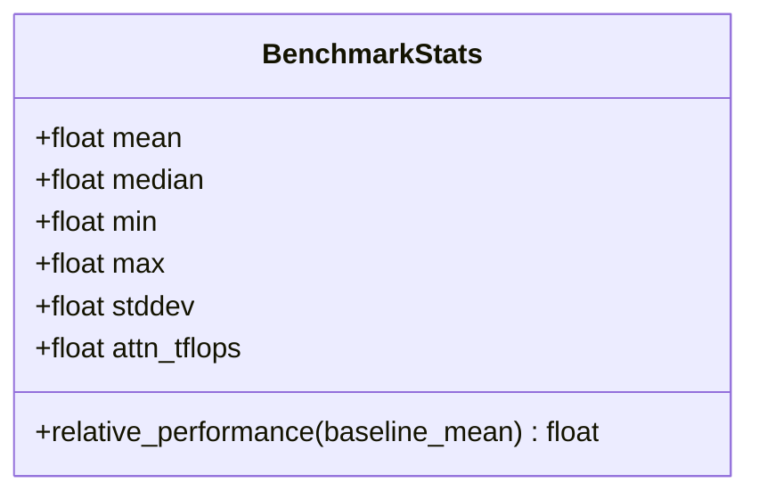
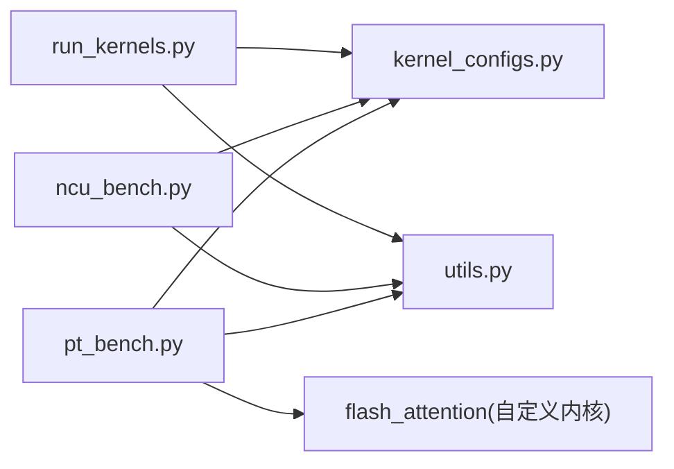

# PyTorch基准测试

<cite>
**本文引用的文件**
- [pt_bench.py](file://tools/benchmark/pt_bench.py)
- [ncu_bench.py](file://tools/benchmark/ncu_bench.py)
- [run_kernels.py](file://tools/benchmark/run_kernels.py)
- [kernel_configs.py](file://py/flash_helpers/kernel_configs.py)
- [utils.py](file://py/flash_helpers/test/utils.py)
- [benchmark_autotune.sh](file://tools/benchmark/benchmark_autotune.sh)
- [README.md](file://README.md)
</cite>

## 目录
1. [简介](#简介)
2. [项目结构](#项目结构)
3. [核心组件](#核心组件)
4. [架构总览](#架构总览)
5. [详细组件分析](#详细组件分析)
6. [依赖关系分析](#依赖关系分析)
7. [性能考量](#性能考量)
8. [故障排查指南](#故障排查指南)
9. [结论](#结论)
10. [附录](#附录)

## 简介
本文件围绕基于PyTorch的基准测试工具pt_bench.py展开，系统讲解其在Flash Attention内核性能评测中的使用方法，重点覆盖以下方面：
- benchmark_kernel函数中的预热机制、多次测量与CUDA事件计时技术
- 通过parse_cmd_args配置d_head与seq_len参数组合进行性能测试
- BenchmarkStats类中均值、中位数、标准差等统计指标的计算方法，以及相对性能与Attn TFLOP/s的评估方式
- 通过set_clock_speed与flush_cache稳定测试环境
- 实际使用示例：如何解读CSV格式性能数据表，并比较不同内核配置与参考实现的性能差异

## 项目结构
该基准测试工具位于tools/benchmark目录下，配合flash_helpers中的内核配置与测试工具使用。整体结构如下图所示：

图表来源
- [pt_bench.py](file://tools/benchmark/pt_bench.py#L1-L416)
- [ncu_bench.py](file://tools/benchmark/ncu_bench.py#L1-L464)
- [run_kernels.py](file://tools/benchmark/run_kernels.py#L1-L159)
- [kernel_configs.py](file://py/flash_helpers/kernel_configs.py#L1-L486)
- [utils.py](file://py/flash_helpers/test/utils.py#L1-L202)
- [benchmark_autotune.sh](file://tools/benchmark/benchmark_autotune.sh#L1-L4)
- [README.md](file://README.md#L1-L63)

章节来源
- [pt_bench.py](file://tools/benchmark/pt_bench.py#L1-L416)
- [README.md](file://README.md#L1-L63)

## 核心组件
- 基准统计类BenchmarkStats：封装均值、中位数、最小/最大值、标准差与Attn TFLOP/s，并提供相对性能百分比计算
- 基准内核运行器benchmark_kernel：执行预热与多次采样，使用CUDA事件计时或返回内核提供的耗时
- 参数解析parse_cmd_args：支持d_head与seq_len的逗号分隔列表、预热次数与重复次数等
- 环境稳定化：set_clock_speed设置GPU目标频率，flush_cache清空缓存以减少抖动
- 数据生成与参考内核：generate_data与reference_forward_kernel_v2_timed/v3用于对比基线
- 统计汇总与CSV输出：按均值排序、计算相对性能与TFLOP/s，并输出CSV表格

章节来源
- [pt_bench.py](file://tools/benchmark/pt_bench.py#L39-L175)
- [pt_bench.py](file://tools/benchmark/pt_bench.py#L181-L222)
- [pt_bench.py](file://tools/benchmark/pt_bench.py#L224-L413)
- [kernel_configs.py](file://py/flash_helpers/kernel_configs.py#L102-L104)
- [utils.py](file://py/flash_helpers/test/utils.py#L79-L98)

## 架构总览
pt_bench.py的主流程负责：
- 解析命令行参数（d_head、seq_len、预热/重复次数）
- 针对每个(d_head, seq_len)组合生成Q/K/V/O张量
- 运行自定义内核集合与参考内核（v2 timed与v3）
- 计算统计指标与TFLOP/s，按均值排序后输出CSV

图表来源
- [pt_bench.py](file://tools/benchmark/pt_bench.py#L224-L413)
- [pt_bench.py](file://tools/benchmark/pt_bench.py#L145-L175)
- [pt_bench.py](file://tools/benchmark/pt_bench.py#L55-L78)
- [utils.py](file://py/flash_helpers/test/utils.py#L79-L98)

## 详细组件分析

### benchmark_kernel：预热、多次测量与CUDA事件计时
- 预热阶段：先执行若干次kernel调用，使缓存、驱动状态稳定
- 测量阶段：每次迭代前可选择flush_cache与短暂CPU睡眠，随后使用CUDA事件计时
  - 同步GPU上下文，记录开始事件，调用kernel，记录结束事件，再次同步
  - 若kernel返回元组且包含耗时字段，则直接采用该值；否则使用elapsed_time(start, end)
- 可选NCU模式：当ncu=True时，每次测量前flush_cache并触发一次GPU空闲睡眠，以模拟更稳定的计时条件

图表来源
- [pt_bench.py](file://tools/benchmark/pt_bench.py#L145-L175)

章节来源
- [pt_bench.py](file://tools/benchmark/pt_bench.py#L145-L175)

### parse_cmd_args：参数解析与组合生成
- 支持的参数
  - --d_heads：逗号分隔的整数列表，默认包含常见维度
  - --seq_lens：逗号分隔的整数列表，默认包含多尺度序列长度
  - --num_warmups：预热次数，默认10
  - --num_repeats：重复次数，默认64
  - --noncu：关闭NCU模式（即不尝试稳定化）
- 返回值：d_heads、seq_lens、num_warmups、num_repeats、ncu布尔标志

章节来源
- [pt_bench.py](file://tools/benchmark/pt_bench.py#L181-L222)

### BenchmarkStats与统计指标计算
- 字段：mean、median、min、max、stddev、attn_tflops
- 计算逻辑
  - 均值、中位数、最值：直接从样本列表统计
  - 标准差：样本数>1时计算样本标准差，否则为0
  - Attn TFLOP/s：基于注意力FLOPs与平均运行时间换算
  - 相对性能：以参考内核均值为基准，计算“参考均值/当前均值”的百分比
- 注意：Attn TFLOP/s使用毫秒到纳秒转换与单位换算，确保结果为TFLOP/s

图表来源
- [pt_bench.py](file://tools/benchmark/pt_bench.py#L39-L78)

章节来源
- [pt_bench.py](file://tools/benchmark/pt_bench.py#L39-L78)
- [kernel_configs.py](file://py/flash_helpers/kernel_configs.py#L102-L104)

### set_clock_speed与flush_cache：环境稳定性
- set_clock_speed：通过nvidia-smi设置SM与内存目标频率，优先使用较高但稳定的频率组合；A100与非A100设备采用不同默认值
- reset_clock_speed：在测试结束后恢复默认频率与复位
- flush_cache：预先分配一块显存并清零，作为“刷缓存”手段，降低L2/L1缓存命中率波动对计时的影响
- run_shell_command：封装子进程调用，静默执行shell命令

章节来源
- [pt_bench.py](file://tools/benchmark/pt_bench.py#L98-L135)
- [pt_bench.py](file://tools/benchmark/pt_bench.py#L102-L110)

### 数据生成与参考内核
- generate_data：根据QKVConfig生成Q/K/V/O四路张量
- reference_forward_kernel_v2_timed：调用官方参考内核（带计时），返回(输出, 耗时)
- reference_forward_kernel_v3：调用参考内核v3，返回输出

章节来源
- [pt_bench.py](file://tools/benchmark/pt_bench.py#L177-L179)
- [utils.py](file://py/flash_helpers/test/utils.py#L79-L98)

### 主流程：遍历参数组合与CSV输出
- 遍历d_head与seq_len组合，按批次大小映射规则生成配置
- 为每种精度（FP16/BF16）分别生成数据
- 运行所有内核配置与参考内核，按均值升序排序
- 计算注意力FLOPs并输出包含“相对性能”和“Attn TFLOP/s”的CSV表格

章节来源
- [pt_bench.py](file://tools/benchmark/pt_bench.py#L224-L413)
- [kernel_configs.py](file://py/flash_helpers/kernel_configs.py#L102-L104)

## 依赖关系分析
- pt_bench.py依赖
  - flash_helpers.kernel_configs：计算注意力FLOPs、内核配置枚举
  - flash_helpers.test.utils：批量大小映射、QKV配置、参考内核接口
  - flash_attention：自定义内核包装（forward_timed等）
  - torch与prettytable：CUDA计时与表格输出
- ncu_bench.py与run_kernels.py提供替代方案：通过NVIDIA Nsight Compute采集更精细指标，适合需要周期、寄存器、L2命中率等指标的场景

图表来源
- [pt_bench.py](file://tools/benchmark/pt_bench.py#L1-L416)
- [ncu_bench.py](file://tools/benchmark/ncu_bench.py#L1-L464)
- [run_kernels.py](file://tools/benchmark/run_kernels.py#L1-L159)
- [kernel_configs.py](file://py/flash_helpers/kernel_configs.py#L1-L486)
- [utils.py](file://py/flash_helpers/test/utils.py#L1-L202)

章节来源
- [pt_bench.py](file://tools/benchmark/pt_bench.py#L1-L416)
- [ncu_bench.py](file://tools/benchmark/ncu_bench.py#L1-L464)
- [run_kernels.py](file://tools/benchmark/run_kernels.py#L1-L159)

## 性能考量
- 计时准确性
  - 使用CUDA事件计时，避免Python层开销干扰
  - 在NCU模式下，每次测量前flush_cache并sleep，有助于消除缓存与驱动抖动
- 统计稳健性
  - 多次重复测量（默认64次）与标准差评估，便于识别异常波动
  - 按均值排序，便于快速定位最优配置
- TFLOP/s评估
  - 使用注意力FLOPs与平均耗时换算，统一衡量吞吐
  - 相对性能以参考内核均值为基准，直观反映优化收益

[本节为通用性能讨论，无需特定文件引用]

## 故障排查指南
- CUDA不可用或设备信息异常
  - 检查CUDA驱动与GPU可用性；若不可用，设备信息查询会返回提示
- 权限问题（设置频率）
  - set_clock_speed依赖sudo权限调用nvidia-smi；如无权限，需提升权限或跳过此步骤
- ncu_bench.py无法找到ncu
  - 请确认已安装并加入PATH；否则将提示命令未找到
- 内核配置无效
  - 若指定的内核字符串无法解析，将抛出错误；检查短名或完整签名是否正确
- 批次大小与序列长度不匹配
  - BATCH_SIZE_FOR_SEQ_LEN映射仅覆盖部分seq_len；超出映射范围可能导致OOM或不一致结果

章节来源
- [pt_bench.py](file://tools/benchmark/pt_bench.py#L80-L92)
- [ncu_bench.py](file://tools/benchmark/ncu_bench.py#L311-L360)
- [utils.py](file://py/flash_helpers/test/utils.py#L1-L17)

## 结论
pt_bench.py提供了简洁而稳健的PyTorch内核性能评测流程：通过预热、多次测量与CUDA事件计时，结合flush_cache与频率设置，获得稳定可靠的运行时间样本；借助BenchmarkStats完成统计与TFLOP/s评估，并以参考内核为基准进行相对性能对比。对于需要更细粒度指标的场景，可使用ncu_bench.py与run_kernels.py配合Nsight Compute进行深入分析。

[本节为总结性内容，无需特定文件引用]

## 附录

### 使用示例与CSV解读
- 基本用法
  - 指定d_head与seq_len组合，例如：--d_heads="128,256" --seq_lens="512,1024"
  - 调整预热与重复次数：--num_warmups=10 --num_repeats=64
  - 关闭NCU模式：--noncu
- 输出CSV字段说明
  - Kernel Name：内核配置短名或“Reference/V3”
  - d_head、seq_len：当前配置维度与序列长度
  - Mean/Median/Min/Max：运行时间均值/中位数/最小/最大（毫秒）
  - StdDev：样本标准差（毫秒）
  - Relative Performance：以参考内核均值为基准的相对性能百分比
  - Attn TFLOP/s：注意力FLOPs与平均耗时换算得到的吞吐
- 比较策略
  - 将各内核按Mean升序排列，优先关注相对性能高且StdDev小的配置
  - 对比Reference与V3，观察优化带来的吞吐提升与稳定性变化

章节来源
- [pt_bench.py](file://tools/benchmark/pt_bench.py#L315-L413)
- [kernel_configs.py](file://py/flash_helpers/kernel_configs.py#L102-L104)

### 自动调优脚本
- benchmark_autotune.sh通过ncu_bench.py对不同序列长度进行自动调优，并输出CSV供后续分析

章节来源
- [benchmark_autotune.sh](file://tools/benchmark/benchmark_autotune.sh#L1-L4)
- [ncu_bench.py](file://tools/benchmark/ncu_bench.py#L362-L404)

### 与其他工具的关系
- run_kernels.py：一次性运行指定内核与参考内核，适合快速验证单次性能
- ncu_bench.py：通过ncu采集周期、寄存器、L2命中率等指标，适合深入分析瓶颈

章节来源
- [run_kernels.py](file://tools/benchmark/run_kernels.py#L1-L159)
- [ncu_bench.py](file://tools/benchmark/ncu_bench.py#L1-L464)