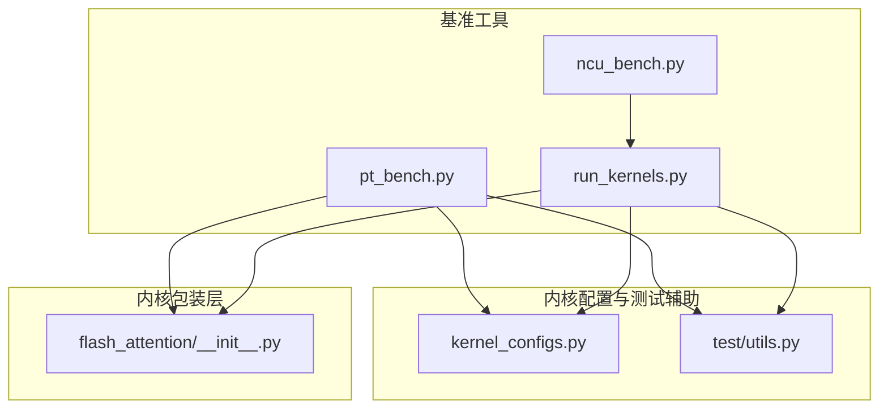
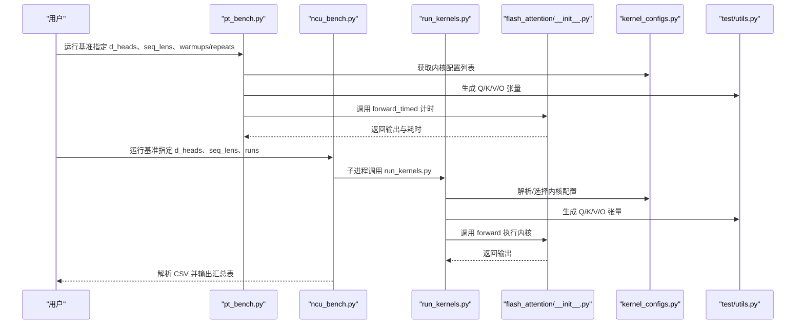
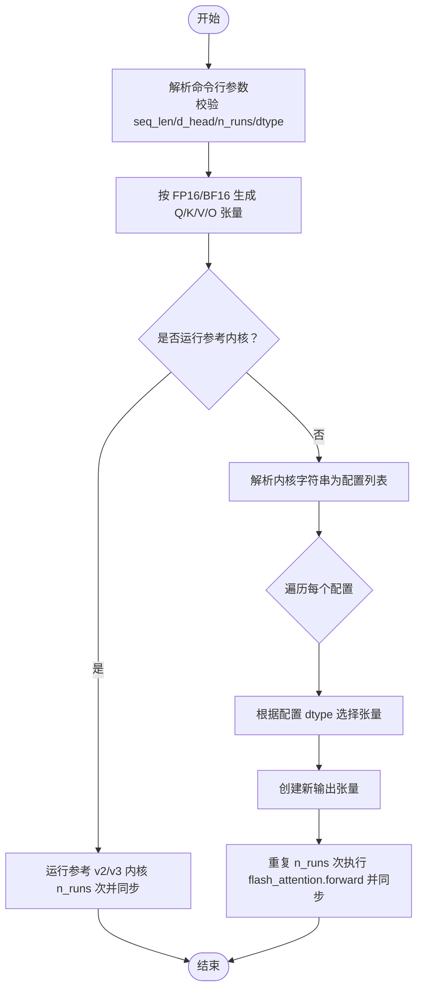
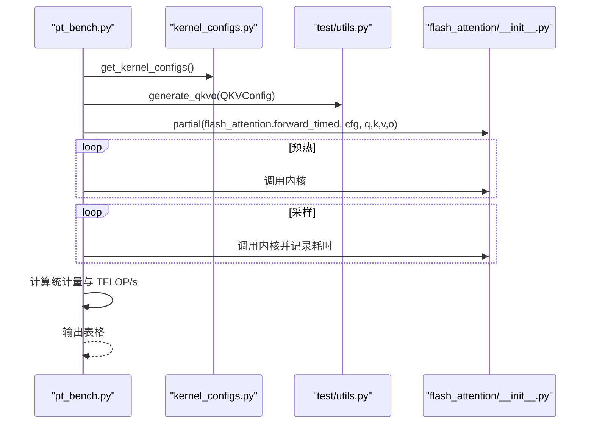
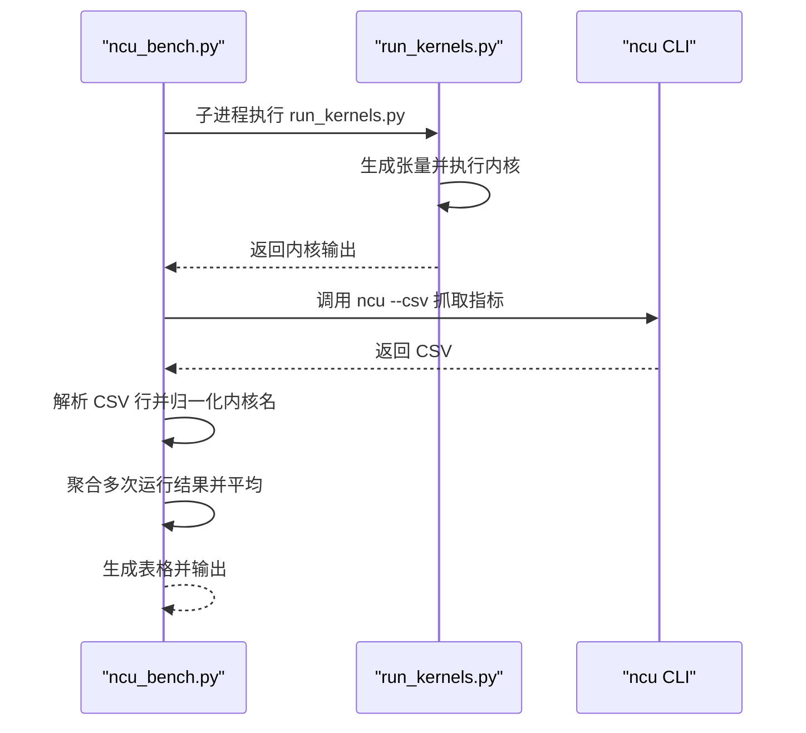
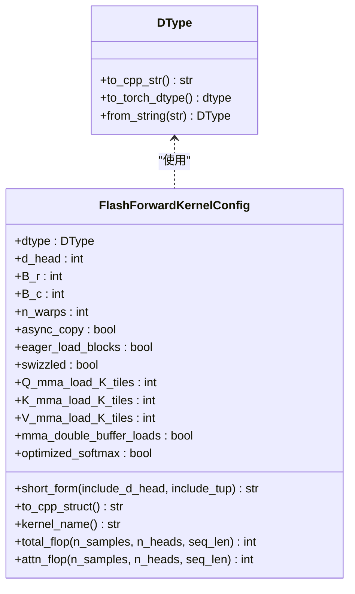
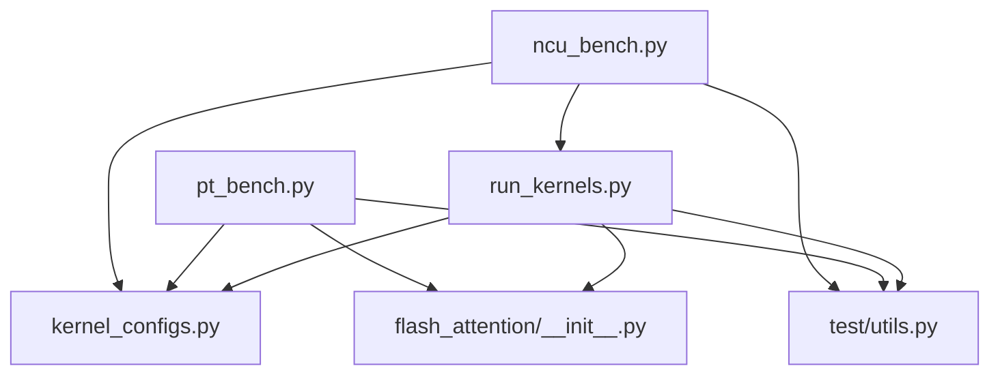

# 基准测试工作流程

<cite>
**本文引用的文件**
- [README.md](file://README.md)
- [run_kernels.py](file://tools/benchmark/run_kernels.py)
- [pt_bench.py](file://tools/benchmark/pt_bench.py)
- [ncu_bench.py](file://tools/benchmark/ncu_bench.py)
- [kernel_configs.py](file://py/flash_helpers/kernel_configs.py)
- [utils.py](file://py/flash_helpers/test/utils.py)
- [flash_attention/__init__.py](file://flash_attention/__init__.py)
</cite>

## 目录
1. [简介](#简介)
2. [项目结构](#项目结构)
3. [核心组件](#核心组件)
4. [架构总览](#架构总览)
5. [详细组件分析](#详细组件分析)
6. [依赖关系分析](#依赖关系分析)
7. [性能考量](#性能考量)
8. [故障排查指南](#故障排查指南)
9. [结论](#结论)
10. [附录](#附录)

## 简介
本指南围绕基准测试工作流程展开，重点说明 run_kernels.py 如何作为测试执行引擎被 pt_bench.py 和 ncu_bench.py 调用；如何实例化不同版本的 Flash Attention 内核并执行前向传播；以及与 kernel_configs.py 的集成方式，如何遍历所有内核配置进行系统性性能评估。文档还解释测试参数（如序列长度、头维度等）的传递机制，并提供端到端的测试案例，展示从测试执行到结果分析的完整流程，以支持性能优化决策。

## 项目结构
该项目包含 CUDA 内核实现、Python 包装层、基准测试工具与辅助配置。关键目录与文件如下：
- tools/benchmark：包含基准测试入口与执行引擎
  - run_kernels.py：测试执行引擎，负责构造输入张量、选择内核配置、调用内核并同步
  - pt_bench.py：基于 PyTorch CUDA 事件的基准工具，生成统计表并计算 TFLOP/s
  - ncu_bench.py：基于 Nsight Compute 的基准工具，解析 CSV 指标并输出表格
- py/flash_helpers：内核配置与测试辅助
  - kernel_configs.py：定义内核配置数据结构、解析与生成策略、FLOP 计算
  - test/utils.py：批量大小、头数、参考内核、张量生成与误差统计
- flash_attention：Python 包装层，导出 forward 与 forward_timed 接口
- previous_kernels/src_*：历史版本内核源码
- src：当前迭代实现的内核源码

图表来源
- [pt_bench.py](file://tools/benchmark/pt_bench.py#L1-L416)
- [ncu_bench.py](file://tools/benchmark/ncu_bench.py#L1-L464)
- [run_kernels.py](file://tools/benchmark/run_kernels.py#L1-L159)
- [kernel_configs.py](file://py/flash_helpers/kernel_configs.py#L1-L486)
- [utils.py](file://py/flash_helpers/test/utils.py#L1-L202)
- [flash_attention/__init__.py](file://flash_attention/__init__.py#L1-L18)

章节来源
- [README.md](file://README.md#L1-L63)

## 核心组件
- 测试执行引擎 run_kernels.py
  - 解析命令行参数（序列长度、头维度、运行次数、内核列表、数据类型）
  - 构造 Q/K/V/O 张量，按 FP16/BF16 两种精度分别准备
  - 可选运行参考内核（v2/v3），或运行指定内核配置
  - 通过 flash_attention.forward 执行内核，使用 CUDA 同步保证测量准确
- 基于 PyTorch 的基准工具 pt_bench.py
  - 读取 d_heads 与 seq_lens 列表，生成 QKV 配置
  - 为每种内核配置构造 partial 函数并调用 flash_attention.forward_timed
  - 使用 CUDA 事件计时，计算均值、中位数、最小/最大、标准差与 TFLOP/s
  - 输出 CSV 表格，便于后续分析
- 基于 Nsight Compute 的基准工具 ncu_bench.py
  - 通过子进程调用 ncu CLI，筛选包含“device|flash”的内核
  - 解析 CSV 输出，聚合多次运行结果并计算平均指标
  - 将内核名称映射为短形式，计算 TFLOP/s 与注意力 TFLOP/s
- 内核配置与解析 kernel_configs.py
  - 定义 DType、FlashForwardKernelConfig 数据结构与方法
  - 提供多种内核配置生成策略（自动调优、进度推进、全集）
  - 提供 FLOP 计算函数（总 FLOP、注意力 FLOP）
  - 支持从内核名解析配置（短形式、demangled 名称等）
- 测试辅助 utils.py
  - 定义 BATCH_SIZE_FOR_SEQ_LEN、BENCHMARK_N_HEADS
  - 提供参考内核（v2/v3）调用接口与带计时的 v2 版本
  - 提供 QKVConfig、张量生成（generate_qkv/generate_qkvo）
  - 提供误差统计与设备信息查询

章节来源
- [run_kernels.py](file://tools/benchmark/run_kernels.py#L1-L159)
- [pt_bench.py](file://tools/benchmark/pt_bench.py#L1-L416)
- [ncu_bench.py](file://tools/benchmark/ncu_bench.py#L1-L464)
- [kernel_configs.py](file://py/flash_helpers/kernel_configs.py#L1-L486)
- [utils.py](file://py/flash_helpers/test/utils.py#L1-L202)
- [flash_attention/__init__.py](file://flash_attention/__init__.py#L1-L18)

## 架构总览
下图展示了基准测试工作流的整体架构：pt_bench.py 与 ncu_bench.py 分别作为高层入口，调用底层执行引擎 run_kernels.py；run_kernels.py 与内核包装层 flash_attention/__init__.py 协作，最终调用 CUDA 内核；kernel_configs.py 提供内核配置与 FLOP 计算；utils.py 提供张量生成与参考内核。

图表来源
- [pt_bench.py](file://tools/benchmark/pt_bench.py#L1-L416)
- [ncu_bench.py](file://tools/benchmark/ncu_bench.py#L1-L464)
- [run_kernels.py](file://tools/benchmark/run_kernels.py#L1-L159)
- [flash_attention/__init__.py](file://flash_attention/__init__.py#L1-L18)
- [kernel_configs.py](file://py/flash_helpers/kernel_configs.py#L1-L486)
- [utils.py](file://py/flash_helpers/test/utils.py#L1-L202)

## 详细组件分析

### 组件A：测试执行引擎 run_kernels.py
- 参数解析与校验
  - 序列长度、头维度必须为正整数
  - 运行次数必须为正整数
  - 数据类型解析（FP16/BF16），异常时退出
- 张量生成与设备设置
  - 根据序列长度查表确定 batch_size，固定 BENCHMARK_N_HEADS
  - 在 CUDA 设备上为 FP16 与 BF16 各生成一组 Q/K/V/O
- 参考内核与自定义内核
  - 可选运行参考 v2 或 v3 内核，重复 n_runs 次并同步
  - 若提供内核字符串列表，则逐个解析为配置对象，按配置 dtype 选择对应张量，重复 n_runs 次并同步
- 调用内核包装层
  - 通过 flash_attention.forward 执行内核，返回输出张量

图表来源
- [run_kernels.py](file://tools/benchmark/run_kernels.py#L1-L159)
- [flash_attention/__init__.py](file://flash_attention/__init__.py#L1-L18)
- [utils.py](file://py/flash_helpers/test/utils.py#L1-L202)

章节来源
- [run_kernels.py](file://tools/benchmark/run_kernels.py#L1-L159)
- [flash_attention/__init__.py](file://flash_attention/__init__.py#L1-L18)

### 组件B：PyTorch 基准工具 pt_bench.py
- 参数解析
  - d_heads、seq_lens 为逗号分隔的整数列表
  - num_warmups、num_repeats 控制预热与重复次数
  - 可选非 NCU 模式（不强制缓存刷新与睡眠）
- 数据生成
  - 为 FP16 与 BF16 各生成 Q/K/V/O
  - 通过 partial 封装 flash_attention.forward_timed，传入 kernel_cfg、q/k/v/o
- 计时与统计
  - 预热若干次后，记录 CUDA Event，计算均值、中位数、最小/最大、标准差
  - 计算注意力 FLOP 并换算为 TFLOP/s
- 结果输出
  - 按均值排序，输出包含内核名、d_head、seq_len、统计量、相对性能、TFLOP/s 的表格

图表来源
- [pt_bench.py](file://tools/benchmark/pt_bench.py#L1-L416)
- [kernel_configs.py](file://py/flash_helpers/kernel_configs.py#L1-L486)
- [utils.py](file://py/flash_helpers/test/utils.py#L1-L202)
- [flash_attention/__init__.py](file://flash_attention/__init__.py#L1-L18)

章节来源
- [pt_bench.py](file://tools/benchmark/pt_bench.py#L1-L416)

### 组件C：Nsight Compute 基准工具 ncu_bench.py
- 子进程调用
  - 通过 ncu CLI 以 CSV 模式抓取包含“device|flash”的内核指标
  - 仅保留 MemoryWorkloadAnalysis 基础集
- 指标解析与聚合
  - 解析 CSV 行，归一化内核名（参考内核映射为 V2/V3，其他内核解析为短形式）
  - 多次运行求和，最后取平均
- 结果表格
  - 计算 TFLOP/s 与注意力 TFLOP/s，可选按持续时间排序
  - 支持输出 CSV，附加 d_head 与 seq_len 字段

图表来源
- [ncu_bench.py](file://tools/benchmark/ncu_bench.py#L1-L464)
- [run_kernels.py](file://tools/benchmark/run_kernels.py#L1-L159)

章节来源
- [ncu_bench.py](file://tools/benchmark/ncu_bench.py#L1-L464)

### 组件D：内核配置与解析 kernel_configs.py
- 数据结构
  - DType：枚举 FP16/BF16，提供字符串解析与 torch dtype 映射
  - FlashForwardKernelConfig：包含 dtype、d_head、B_r、B_c、n_warps、异步拷贝、急加载、swizzle、各 MMA 加载 tiles 数、双缓冲、优化 softmax 等字段
  - 提供 short_form、to_cpp_struct、kernel_name、total_flop、attn_flop 等方法
- 配置生成与过滤
  - should_autotune_config：过滤不合理的配置组合
  - get_autotuning_kernel_configs：笛卡尔积生成自动调优配置
  - get_kernel_progression_configs：按步骤推进的配置序列
  - get_kernels_to_build：汇总待构建的内核集合
  - get_kernel_configs：根据环境变量或关键字选择配置集（prog/all/tune/指定 B_r,B_c）
- FLOP 计算
  - calc_total_flop、calc_self_attn_flop：用于性能指标换算

图表来源
- [kernel_configs.py](file://py/flash_helpers/kernel_configs.py#L1-L486)

章节来源
- [kernel_configs.py](file://py/flash_helpers/kernel_configs.py#L1-L486)

### 组件E：测试辅助 utils.py
- 全局配置
  - BATCH_SIZE_FOR_SEQ_LEN：按序列长度映射 batch_size
  - BENCHMARK_N_HEADS：固定头数
- 参考内核
  - reference_forward_kernel_v2 / v3：调用官方 CUDA 内核
  - reference_forward_kernel_v2_timed：返回输出与耗时
- 张量生成
  - QKVConfig：封装 n_heads、d_head、batch_size、seq_len、dtype、device
  - generate_qkv / generate_qkvo：生成 Q/K/V/O 张量
- 误差统计与设备信息
  - error_stats：计算不匹配元素数量、百分比与最大绝对差
  - get_cuda_device_info / is_a100：查询设备信息

章节来源
- [utils.py](file://py/flash_helpers/test/utils.py#L1-L202)

## 依赖关系分析
- run_kernels.py
  - 依赖 flash_attention.forward（内核包装层）
  - 依赖 kernel_configs.DType、get_kernel_configs、parse_kernel_name_into_config
  - 依赖 test/utils 的 QKVConfig、generate_qkv、reference_* 内核
- pt_bench.py
  - 依赖 kernel_configs.calc_self_attn_flop、get_kernel_configs
  - 依赖 test/utils 的 generate_qkvo、reference_* 内核
  - 依赖 flash_attention.forward_timed
- ncu_bench.py
  - 依赖 kernel_configs.calc_total_flop、calc_self_attn_flop、parse_flash_forward_kernel_config、parse_kernel_name_into_config
  - 依赖 test/utils 的 BENCHMARK_BATCH_SIZE、BENCHMARK_N_HEADS
  - 依赖子进程调用 run_kernels.py
- flash_attention/__init__.py
  - 导出 forward 与 forward_timed，内部委托 flash_attention_kernels

图表来源
- [run_kernels.py](file://tools/benchmark/run_kernels.py#L1-L159)
- [pt_bench.py](file://tools/benchmark/pt_bench.py#L1-L416)
- [ncu_bench.py](file://tools/benchmark/ncu_bench.py#L1-L464)
- [kernel_configs.py](file://py/flash_helpers/kernel_configs.py#L1-L486)
- [utils.py](file://py/flash_helpers/test/utils.py#L1-L202)
- [flash_attention/__init__.py](file://flash_attention/__init__.py#L1-L18)

章节来源
- [run_kernels.py](file://tools/benchmark/run_kernels.py#L1-L159)
- [pt_bench.py](file://tools/benchmark/pt_bench.py#L1-L416)
- [ncu_bench.py](file://tools/benchmark/ncu_bench.py#L1-L464)
- [kernel_configs.py](file://py/flash_helpers/kernel_configs.py#L1-L486)
- [utils.py](file://py/flash_helpers/test/utils.py#L1-L202)
- [flash_attention/__init__.py](file://flash_attention/__init__.py#L1-L18)

## 性能考量
- 计时准确性
  - 使用 torch.cuda.synchronize 与 CUDA Event 记录，避免 CPU 侧开销影响
  - ncu_bench.py 在非 NCU 模式下通过缓存刷新与短暂睡眠降低抖动
- 缓存与内存带宽
  - ncu_bench.py 中的缓存刷新与时钟设置有助于稳定测量条件
- FLOP 计算
  - 使用注意力 FLOP 与总 FLOP 计算 TFLOP/s，便于跨配置比较
- 配置空间探索
  - 通过 get_autotuning_kernel_configs 与 get_kernel_progression_configs 系统性覆盖关键参数组合

[本节为通用指导，无需列出具体文件来源]

## 故障排查指南
- 命令行参数错误
  - seq_len/d_head 必须为正整数；n_runs 必须为正整数
  - dtype 解析失败会直接退出
- 内核配置解析失败
  - run_kernels.py 对内核字符串解析失败会打印错误并退出
  - ncu_bench.py 解析 CSV 时若找不到 ncu 命令或返回码非零，会提示安装与路径问题
- 设备不可用
  - utils.py 的设备信息查询在 CUDA 不可用时会抛出异常
- 性能异常
  - 若 TFLOP/s 异常低，检查 batch_size 与 d_head 是否与配置匹配
  - 确认内核编译与安装正确，确保 flash_attention_kernels 可用

章节来源
- [run_kernels.py](file://tools/benchmark/run_kernels.py#L1-L159)
- [ncu_bench.py](file://tools/benchmark/ncu_bench.py#L1-L464)
- [utils.py](file://py/flash_helpers/test/utils.py#L1-L202)

## 结论
本工作流通过 run_kernels.py 作为统一的测试执行引擎，结合 pt_bench.py 与 ncu_bench.py 的不同计时策略，实现了对 Flash Attention 内核的系统性性能评估。kernel_configs.py 提供了灵活的配置生成与解析能力，utils.py 提供了稳定的张量生成与参考内核接口。通过端到端的流程，用户可以快速定位性能瓶颈并指导内核优化方向。

[本节为总结，无需列出具体文件来源]

## 附录

### 端到端测试案例
- 场景一：使用 PyTorch 事件计时进行系统性评估
  - 步骤
    1) 设置 d_heads 与 seq_lens 列表
    2) 调用 pt_bench.py，内部通过 get_kernel_configs 获取配置集
    3) 为每种配置生成 Q/K/V/O 张量并调用 flash_attention.forward_timed
    4) 计算统计量与 TFLOP/s，输出 CSV 表格
  - 关键点
    - 预热与重复次数可调，统计量稳定
    - 注意力 FLOP 与总 FLOP 用于对比与归因
- 场景二：使用 Nsight Compute 进行指标级分析
  - 步骤
    1) 调用 ncu_bench.py，传入 d_heads、seq_lens、runs
    2) 子进程执行 run_kernels.py，生成张量并执行内核
    3) ncu CLI 抓取 CSV，解析并聚合多次运行结果
    4) 输出包含 Duration、Cycles、寄存器数、L2 命中率等指标的表格
  - 关键点
    - 仅筛选包含“device|flash”的内核，聚焦目标
    - 可输出 CSV 以便进一步分析

章节来源
- [pt_bench.py](file://tools/benchmark/pt_bench.py#L1-L416)
- [ncu_bench.py](file://tools/benchmark/ncu_bench.py#L1-L464)
- [run_kernels.py](file://tools/benchmark/run_kernels.py#L1-L159)
- [kernel_configs.py](file://py/flash_helpers/kernel_configs.py#L1-L486)
- [utils.py](file://py/flash_helpers/test/utils.py#L1-L202)
- [flash_attention/__init__.py](file://flash_attention/__init__.py#L1-L18)