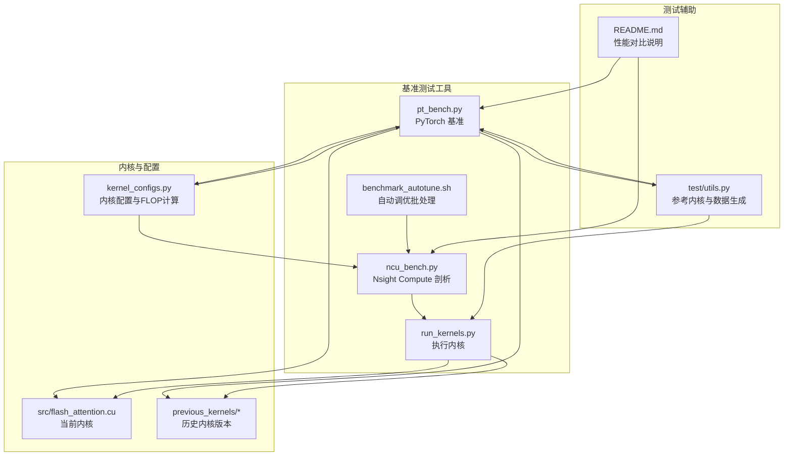
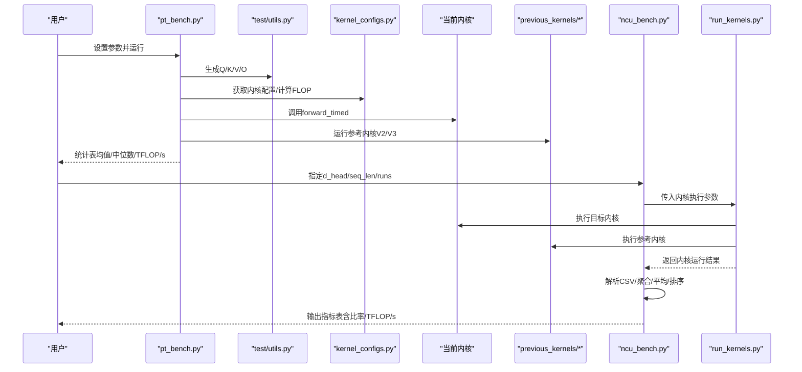
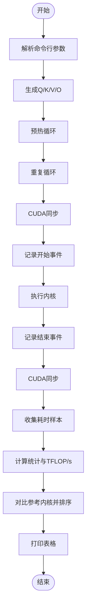
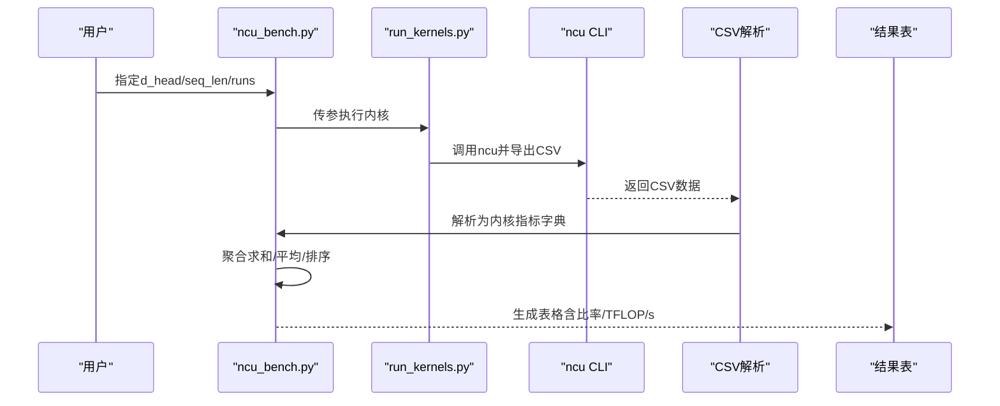
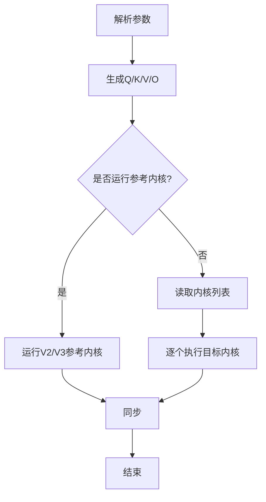
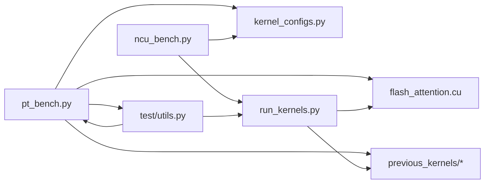

# 性能基准测试

<cite>
**本文引用的文件**
- [README.md](file://README.md)
- [pt_bench.py](file://tools/benchmark/pt_bench.py)
- [ncu_bench.py](file://tools/benchmark/ncu_bench.py)
- [run_kernels.py](file://tools/benchmark/run_kernels.py)
- [kernel_configs.py](file://py/flash_helpers/kernel_configs.py)
- [test/utils.py](file://py/flash_helpers/test/utils.py)
- [benchmark_autotune.sh](file://tools/benchmark/benchmark_autotune.sh)
- [flash_attention.cu](file://previous_kernels/src_15/flash_attention.cu)
</cite>

## 目录
1. [简介](#简介)
2. [项目结构](#项目结构)
3. [核心组件](#核心组件)
4. [架构总览](#架构总览)
5. [详细组件分析](#详细组件分析)
6. [依赖关系分析](#依赖关系分析)
7. [性能考量](#性能考量)
8. [故障排查指南](#故障排查指南)
9. [结论](#结论)
10. [附录](#附录)

## 简介
本文件围绕仓库中的性能基准测试工具，系统性地指导如何评估与比较内核性能，涵盖：
- 基于 PyTorch 的基准测试框架使用方法（pt_bench.py），包括参数设置、运行流程、统计输出与结果解读；
- 与 NVIDIA Nsight Compute 集成的深入剖析（ncu_bench.py），如何采集 SM 利用率、内存带宽等关键指标；
- 基准测试最佳实践：预热、多次测量取均值、时钟稳定、缓存刷新等；
- 使用工具比较不同内核版本（previous_kernels）的性能差异，支撑性能优化决策；
- 常见性能瓶颈识别与优化建议。

## 项目结构
该仓库以 CUDA 内核实现的 Flash Attention 为核心，配套了多套基准测试与剖析脚本，便于在不同维度评估内核性能。

图表来源
- [pt_bench.py](file://tools/benchmark/pt_bench.py#L1-L416)
- [ncu_bench.py](file://tools/benchmark/ncu_bench.py#L1-L464)
- [run_kernels.py](file://tools/benchmark/run_kernels.py#L1-L159)
- [kernel_configs.py](file://py/flash_helpers/kernel_configs.py#L1-L486)
- [test/utils.py](file://py/flash_helpers/test/utils.py#L1-L202)
- [README.md](file://README.md#L1-L63)
- [flash_attention.cu](file://previous_kernels/src_15/flash_attention.cu#L1-L150)

章节来源
- [README.md](file://README.md#L1-L63)

## 核心组件
- PyTorch 基准测试（pt_bench.py）
  - 支持预热、同步计时、多次采样、统计汇总（均值、中位数、极差、标准差）、TFLOP/s 计算；
  - 自动设置 GPU 时钟频率、缓存刷新、设备信息打印；
  - 对比自研内核与参考内核（V2/V3）的性能表现。
- NVIDIA Nsight Compute 剖析（ncu_bench.py）
  - 调用 run_kernels.py 执行内核，通过 ncu CLI 导出 CSV，解析关键指标（时长、周期、寄存器/线程、L2 命中率等）；
  - 提供聚合与平均、排序、比率列、TFLOP/s 与注意力 TFLOP/s 输出。
- 内核执行器（run_kernels.py）
  - 解析命令行参数，按配置生成 Q/K/V/O 张量，运行参考内核或指定内核多次；
  - 支持 dtype 选择（FP16/BF16）与内核列表过滤。
- 内核配置与 FLOP 计算（kernel_configs.py）
  - 定义 FlashForwardKernelConfig 数据结构与短名格式；
  - 提供总 FLOP 与注意力 FLOP 计算函数，用于性能归一化。
- 测试辅助（test/utils.py）
  - 生成 Q/K/V/O 数据，提供参考内核（V2/V3）接口；
  - 设备信息查询、批量大小映射等。

章节来源
- [pt_bench.py](file://tools/benchmark/pt_bench.py#L1-L416)
- [ncu_bench.py](file://tools/benchmark/ncu_bench.py#L1-L464)
- [run_kernels.py](file://tools/benchmark/run_kernels.py#L1-L159)
- [kernel_configs.py](file://py/flash_helpers/kernel_configs.py#L1-L486)
- [test/utils.py](file://py/flash_helpers/test/utils.py#L1-L202)

## 架构总览
下图展示了从命令行到内核执行与结果输出的整体流程，以及与 Nsight Compute 的集成路径。

图表来源
- [pt_bench.py](file://tools/benchmark/pt_bench.py#L1-L416)
- [ncu_bench.py](file://tools/benchmark/ncu_bench.py#L1-L464)
- [run_kernels.py](file://tools/benchmark/run_kernels.py#L1-L159)
- [kernel_configs.py](file://py/flash_helpers/kernel_configs.py#L1-L486)
- [test/utils.py](file://py/flash_helpers/test/utils.py#L1-L202)
- [flash_attention.cu](file://previous_kernels/src_15/flash_attention.cu#L1-L150)

## 详细组件分析

### PyTorch 基准测试（pt_bench.py）
- 参数与运行流程
  - 支持 d_head、seq_len、预热次数、重复次数、是否启用“稳定化”（ncu 模式）等参数；
  - 自动生成 Q/K/V/O，分别针对 FP16/BF16 运行；
  - 对比自研内核与参考内核（V2/V3），并按均值排序输出。
- 关键机制
  - 预热：先执行若干次内核以稳定缓存与功耗；
  - 同步计时：使用 CUDA Event 记录开始/结束时间；
  - 缓存刷新：在 ncu 模式下刷新 L2 缓存并短暂睡眠，降低抖动；
  - 统计：均值、中位数、极差、标准差；TFLOP/s = FLOP / 平均耗时（ns）/ 1e3；
  - 时钟管理：根据设备类型设置/重置 GPU 时钟频率，减少波动。
- 结果解读
  - “相对性能”以参考内核均值为基准，百分比越高越快；
  - “Attn TFLOP/s”用于注意力计算吞吐，便于跨配置横向比较。

图表来源
- [pt_bench.py](file://tools/benchmark/pt_bench.py#L1-L416)

章节来源
- [pt_bench.py](file://tools/benchmark/pt_bench.py#L1-L416)
- [test/utils.py](file://py/flash_helpers/test/utils.py#L1-L202)
- [kernel_configs.py](file://py/flash_helpers/kernel_configs.py#L1-L486)

### NVIDIA Nsight Compute 剖析（ncu_bench.py）
- 工作流
  - 调用 run_kernels.py 执行内核（可选参考内核），由 ncu CLI 导出 CSV；
  - 解析 CSV 行，标准化内核名称，提取所需指标（时长、周期、寄存器/线程、L2 命中率等）；
  - 多次运行求和后取平均，生成最终表格，支持 CSV 输出与排序。
- 指标说明
  - Duration：内核时长（毫秒转纳秒用于 TFLOP/s 计算）；
  - Cycles：Elapsed Cycles；
  - Registers Per Thread：寄存器占用；
  - L2 Hit Rate：L2 命中率；
  - Ratio 列：以基线内核为基准的逆向比例（越小越好，但 Duration 的比率越低越慢）。
- 输出字段
  - 包含“Kernel Name”、“Dur(ms)”、“Cycles”、“Regs”、“L2 Hit %”、“TFLOP/s”、“Attn TFLOP/s”，以及 d_head、seq_len（CSV 模式）。

图表来源
- [ncu_bench.py](file://tools/benchmark/ncu_bench.py#L1-L464)
- [run_kernels.py](file://tools/benchmark/run_kernels.py#L1-L159)

章节来源
- [ncu_bench.py](file://tools/benchmark/ncu_bench.py#L1-L464)
- [run_kernels.py](file://tools/benchmark/run_kernels.py#L1-L159)
- [kernel_configs.py](file://py/flash_helpers/kernel_configs.py#L1-L486)

### 内核执行器（run_kernels.py）
- 功能要点
  - 解析命令行：seq_len、d_head、n_runs、内核列表、dtype（FP16/BF16）、是否仅运行参考内核；
  - 生成张量：按配置生成 Q/K/V/O，并同步 CUDA；
  - 循环执行：参考内核（V2/V3）与目标内核，每次运行后同步；
  - 输出：打印内核名称与 dtype 信息，便于对照。
- 与 previous_kernels 的关系
  - 通过 flash_attention.forward 或参考内核接口调用对应实现；
  - previous_kernels 中的历史版本在编译后可被调用，用于对比。

图表来源
- [run_kernels.py](file://tools/benchmark/run_kernels.py#L1-L159)
- [flash_attention.cu](file://previous_kernels/src_15/flash_attention.cu#L1-L150)

章节来源
- [run_kernels.py](file://tools/benchmark/run_kernels.py#L1-L159)
- [flash_attention.cu](file://previous_kernels/src_15/flash_attention.cu#L1-L150)

### 内核配置与 FLOP 计算（kernel_configs.py）
- 数据结构
  - FlashForwardKernelConfig：包含 dtype、d_head、B_r、B_c、n_warps、异步拷贝、急加载、Swizzle、各 MMA 加载块数、双缓冲、优化 softmax 等特征；
  - short_form：生成人类可读的内核短名，便于表格展示与对比。
- FLOP 计算
  - calc_total_flop：计算总 FLOP（含收尾阶段）；
  - calc_self_attn_flop：计算注意力 FLOP；
  - 用于将耗时转换为 TFLOP/s 与 Attn TFLOP/s，便于跨配置公平比较。

章节来源
- [kernel_configs.py](file://py/flash_helpers/kernel_configs.py#L1-L486)

### 测试辅助（test/utils.py）
- 数据生成：按配置生成 Q/K/V/O，支持批量大小映射与 dtype；
- 参考内核：提供 V2/V3 接口（调用第三方 CUDA 扩展），并支持带计时的 V2 版本；
- 设备信息：查询 GPU 名称、计算能力、显存、SM 数量，辅助判断设备类型。

章节来源
- [test/utils.py](file://py/flash_helpers/test/utils.py#L1-L202)

## 依赖关系分析
- 组件耦合
  - pt_bench.py 依赖 kernel_configs.py（FLOP 计算）、test/utils.py（数据生成与参考内核）、flash_attention（当前内核）；
  - ncu_bench.py 通过 run_kernels.py 调用内核，依赖 kernel_configs.py（解析内核名与 FLOP）；
  - run_kernels.py 依赖 flash_attention（当前内核）与 previous_kernels（历史内核）。
- 外部依赖
  - CUDA、PyTorch、Nsight Compute（ncu）、第三方 Flash Attention CUDA 扩展（V2/V3）。

图表来源
- [pt_bench.py](file://tools/benchmark/pt_bench.py#L1-L416)
- [ncu_bench.py](file://tools/benchmark/ncu_bench.py#L1-L464)
- [run_kernels.py](file://tools/benchmark/run_kernels.py#L1-L159)
- [kernel_configs.py](file://py/flash_helpers/kernel_configs.py#L1-L486)
- [test/utils.py](file://py/flash_helpers/test/utils.py#L1-L202)
- [flash_attention.cu](file://previous_kernels/src_15/flash_attention.cu#L1-L150)

章节来源
- [pt_bench.py](file://tools/benchmark/pt_bench.py#L1-L416)
- [ncu_bench.py](file://tools/benchmark/ncu_bench.py#L1-L464)
- [run_kernels.py](file://tools/benchmark/run_kernels.py#L1-L159)
- [kernel_configs.py](file://py/flash_helpers/kernel_configs.py#L1-L486)
- [test/utils.py](file://py/flash_helpers/test/utils.py#L1-L202)
- [flash_attention.cu](file://previous_kernels/src_15/flash_attention.cu#L1-L150)

## 性能考量
- 最佳实践
  - 预热：在正式计时前执行若干次内核，使缓存与功耗稳定；
  - 多次测量取平均：减少瞬时抖动影响，提高统计可靠性；
  - 时钟稳定：在 A100/其他 GPU 上设置/重置 GPU 时钟，避免频率波动；
  - 缓存刷新：在 ncu 模式下刷新 L2 缓存并短暂睡眠，降低缓存命中对结果的影响；
  - 设备信息：打印 GPU 名称与计算能力，便于跨设备对比。
- 指标解读
  - Duration/L2 Hit Rate：时长越短、命中率越高通常越好；
  - Registers Per Thread：过高可能受限于寄存器资源；
  - TFLOP/s 与 Attn TFLOP/s：用于归一化比较，排除数据规模差异。
- 自动调优
  - 使用 benchmark_autotune.sh 快速遍历序列长度，导出 CSV 以便后续分析。

章节来源
- [pt_bench.py](file://tools/benchmark/pt_bench.py#L1-L416)
- [ncu_bench.py](file://tools/benchmark/ncu_bench.py#L1-L464)
- [benchmark_autotune.sh](file://tools/benchmark/benchmark_autotune.sh#L1-L4)

## 故障排查指南
- ncu 命令未找到
  - 现象：提示 ncu 未安装或不在 PATH；
  - 处理：确保已安装 NVIDIA Nsight Compute，并将其加入 PATH。
- 内核配置不匹配
  - 现象：运行时报错提示内核配置未找到或 dtype 不匹配；
  - 处理：确认传入的内核配置与输入张量 dtype 一致，且已在编译时生成对应实例。
- 设备不可用或计算能力不足
  - 现象：CUDA 设备不可用或 SM 小于要求；
  - 处理：检查 CUDA 环境与 GPU 计算能力，确保满足内核要求。
- 批次大小与序列长度不匹配
  - 现象：运行时报错序列长度与分块不整除；
  - 处理：调整 seq_len 使其为 B_r/B_c 的整数倍，或修改内核配置。

章节来源
- [ncu_bench.py](file://tools/benchmark/ncu_bench.py#L1-L464)
- [run_kernels.py](file://tools/benchmark/run_kernels.py#L1-L159)
- [flash_attention.cu](file://previous_kernels/src_15/flash_attention.cu#L1-L150)

## 结论
- pt_bench.py 适合快速、稳定的 PyTorch 端计时对比，便于在本地环境快速迭代；
- ncu_bench.py 通过 Nsight Compute 提供更深入的硬件级指标，适合精细剖析与优化；
- 结合 kernel_configs.py 的 FLOP 计算与 test/utils.py 的数据生成，可构建统一的性能评估体系；
- 使用 previous_kernels 的历史版本进行对比，有助于量化优化收益并指导后续改进方向。

## 附录
- 使用示例与参数说明（基于源码注释与默认行为）
  - pt_bench.py
    - 参数：--d_heads、--seq_lens、--num_warmups、--num_repeats、--noncu；
    - 输出：CSV 表格，包含均值/中位数/极差/标准差/相对性能/TFLOP/s。
  - ncu_bench.py
    - 参数：--d_heads、--seq_lens、--runs、--csv、--no_sort；
    - 输出：文本或 CSV 表格，包含 Duration、Cycles、Registers/Thread、L2 Hit %、TFLOP/s、Attn TFLOP/s。
  - run_kernels.py
    - 参数：seq_len、d_head、--ref/--ref_v3、--n_runs、--kernels、--dtype；
    - 输出：内核名称与 dtype 信息，便于对照。
  - benchmark_autotune.sh
    - 用法：指定序列长度集合，自动遍历并导出 CSV。

章节来源
- [pt_bench.py](file://tools/benchmark/pt_bench.py#L1-L416)
- [ncu_bench.py](file://tools/benchmark/ncu_bench.py#L1-L464)
- [run_kernels.py](file://tools/benchmark/run_kernels.py#L1-L159)
- [benchmark_autotune.sh](file://tools/benchmark/benchmark_autotune.sh#L1-L4)