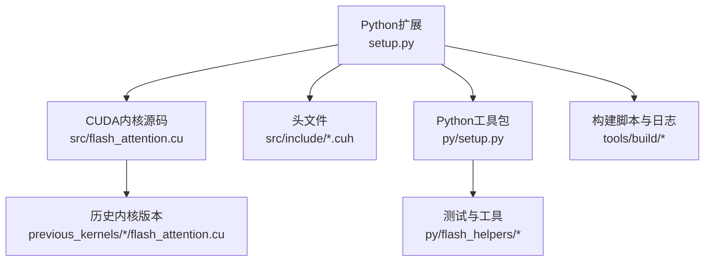
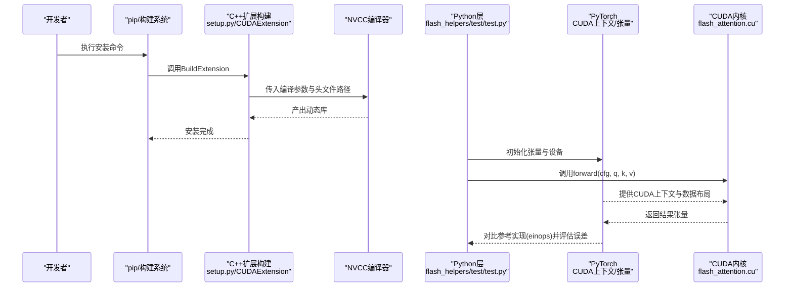
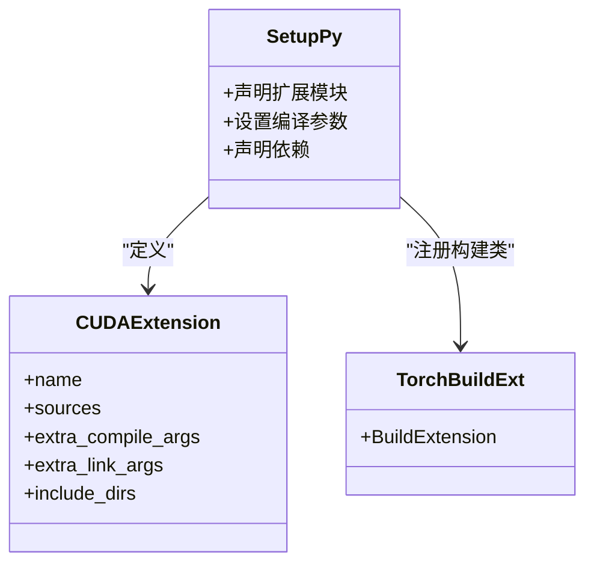
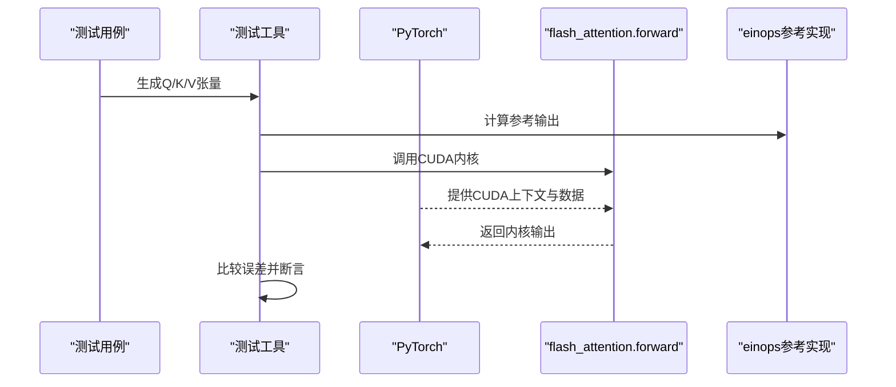
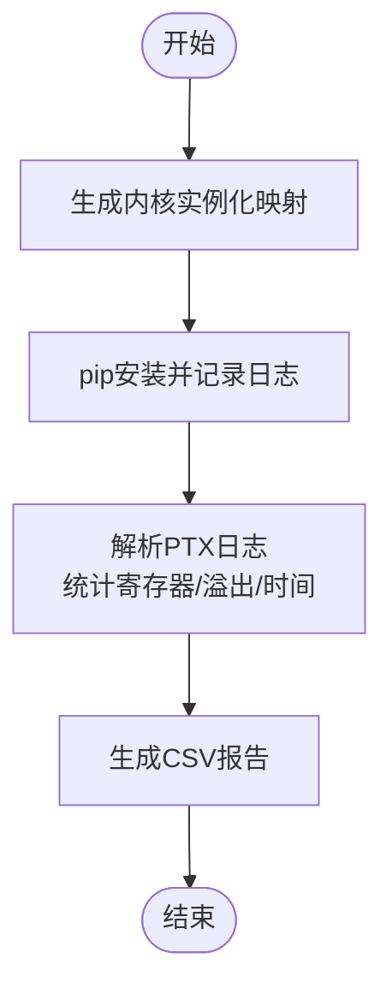
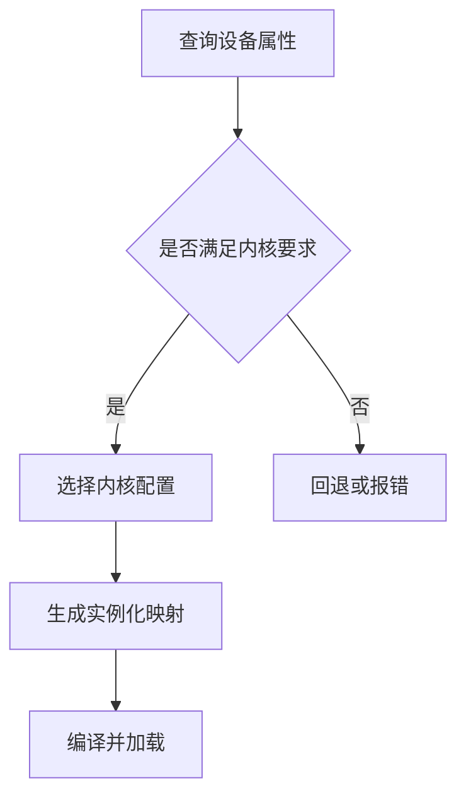
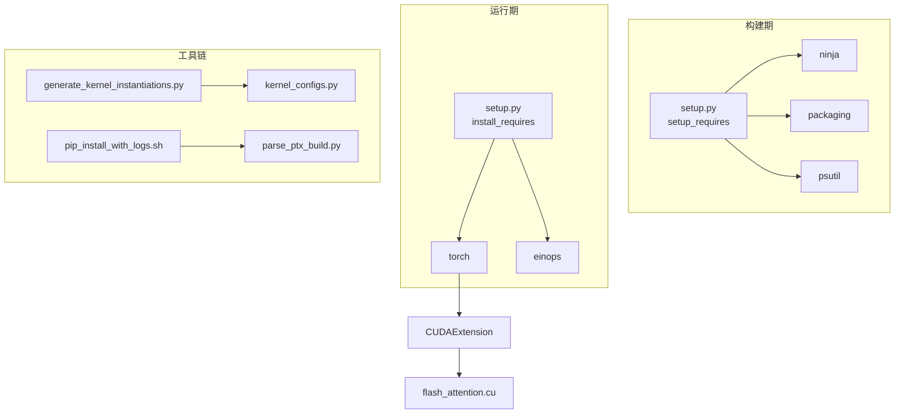

# 技术栈与依赖

<cite>
**本文引用的文件**
- [setup.py](file://setup.py)
- [py/setup.py](file://py/setup.py)
- [README.md](file://README.md)
- [tools/build/pip_install_with_logs.sh](file://tools/build/pip_install_with_logs.sh)
- [tools/build/parse_ptx_build.py](file://tools/build/parse_ptx_build.py)
- [tools/build/generate_kernel_instantiations.py](file://tools/build/generate_kernel_instantiations.py)
- [py/flash_helpers/test/test.py](file://py/flash_helpers/test/test.py)
- [py/flash_helpers/test/utils.py](file://py/flash_helpers/test/utils.py)
- [py/flash_helpers/kernel_configs.py](file://py/flash_helpers/kernel_configs.py)
- [src/include/cuda_utils.cuh](file://src/include/cuda_utils.cuh)
- [previous_kernels/src_1-7/include/cuda_utils.cuh](file://previous_kernels/src_1-7/include/cuda_utils.cuh)
</cite>

## 目录
1. [引言](#引言)
2. [项目结构](#项目结构)
3. [核心组件](#核心组件)
4. [架构总览](#架构总览)
5. [详细组件分析](#详细组件分析)
6. [依赖关系分析](#依赖关系分析)
7. [性能考量](#性能考量)
8. [故障排查指南](#故障排查指南)
9. [结论](#结论)
10. [附录](#附录)

## 引言
本文件聚焦于项目在CUDA C++与Python协同开发中的技术栈与依赖，重点说明以下方面：
- 外部依赖的作用：PyTorch（CUDA上下文与张量操作）、einops（张量重排与缩并）、ninja（构建加速）、psutil（系统资源监控）、packaging（包版本解析）。
- PyTorch在CUDA内核构建与运行中的关键角色：通过C++扩展接口提供CUDA上下文、编译参数与设备能力查询。
- ninja在编译CUDA内核时的重要性：提升构建速度与可维护性。
- psutil与packaging在系统监控与包管理中的用途。
- 不同CUDA与PyTorch版本的兼容性矩阵与环境配置最佳实践。
- 完整的依赖安装命令示例与常见冲突的解决方案。

## 项目结构
该项目采用“Python扩展 + CUDA内核”的混合架构：
- Python侧通过C++扩展暴露CUDA内核接口，并提供测试与工具脚本。
- CUDA内核位于src与previous_kernels目录，按迭代版本组织。
- 工具链包括构建日志解析、注册表统计、自动实例化生成等。

图表来源
- [setup.py](file://setup.py#L1-L76)
- [py/setup.py](file://py/setup.py#L1-L20)

章节来源
- [setup.py](file://setup.py#L1-L76)
- [py/setup.py](file://py/setup.py#L1-L20)

## 核心组件
- Python扩展构建与依赖声明：通过setuptools与PyTorch的C++扩展接口定义CUDAExtension，声明install_requires与setup_requires。
- CUDA内核与头文件：提供Flash Attention前向内核及通用CUDA工具函数。
- Python测试与工具：基于unittest与参数化测试，结合einops进行参考实现对比；使用PyTorch进行设备信息查询与张量运算。
- 构建与分析工具：自动实例化生成、PTX日志解析、安装日志记录与寄存器使用统计。

章节来源
- [setup.py](file://setup.py#L1-L76)
- [py/flash_helpers/test/test.py](file://py/flash_helpers/test/test.py#L1-L104)
- [py/flash_helpers/test/utils.py](file://py/flash_helpers/test/utils.py#L148-L201)
- [tools/build/generate_kernel_instantiations.py](file://tools/build/generate_kernel_instantiations.py#L1-L57)
- [tools/build/parse_ptx_build.py](file://tools/build/parse_ptx_build.py#L39-L170)

## 架构总览
下图展示了从Python调用到CUDA内核执行的端到端流程，以及依赖在各阶段的作用。

图表来源
- [setup.py](file://setup.py#L1-L76)
- [py/flash_helpers/test/test.py](file://py/flash_helpers/test/test.py#L1-L104)
- [py/flash_helpers/test/utils.py](file://py/flash_helpers/test/utils.py#L148-L201)

## 详细组件分析

### 组件A：Python扩展与CUDA内核集成
- 关键点
  - 使用PyTorch的BuildExtension与CUDAExtension定义扩展模块，指定源文件、额外编译参数、链接参数与包含目录。
  - 编译参数中启用C++20、快速数学、行号信息与资源使用统计，并针对特定架构生成目标代码。
  - 依赖声明中，install_requires包含torch与einops；setup_requires包含packaging、psutil、ninja，用于构建期与运行期支持。

图表来源
- [setup.py](file://setup.py#L1-L76)

章节来源
- [setup.py](file://setup.py#L1-L76)

### 组件B：Python测试与参考实现
- 关键点
  - 测试使用unittest与参数化，遍历内核配置集合，调用Python侧参考实现（einops）与CUDA内核，比较最大绝对误差。
  - 设备信息通过PyTorch查询，确保仅在可用GPU上运行。
  - 通过环境变量控制内核集合，便于自动化测试与基准。

图表来源
- [py/flash_helpers/test/test.py](file://py/flash_helpers/test/test.py#L1-L104)
- [py/flash_helpers/test/utils.py](file://py/flash_helpers/test/utils.py#L148-L201)

章节来源
- [py/flash_helpers/test/test.py](file://py/flash_helpers/test/test.py#L1-L104)
- [py/flash_helpers/test/utils.py](file://py/flash_helpers/test/utils.py#L148-L201)

### 组件C：构建与分析工具链
- 自动实例化生成：根据内核配置生成C++映射表，减少手工维护成本。
- PTX日志解析：从pip安装日志中提取编译信息，统计寄存器使用、栈帧与溢出情况。
- 安装日志记录：统一记录pip安装过程，便于定位构建问题。

图表来源
- [tools/build/generate_kernel_instantiations.py](file://tools/build/generate_kernel_instantiations.py#L1-L57)
- [tools/build/parse_ptx_build.py](file://tools/build/parse_ptx_build.py#L39-L170)
- [tools/build/pip_install_with_logs.sh](file://tools/build/pip_install_with_logs.sh#L1-L31)

章节来源
- [tools/build/generate_kernel_instantiations.py](file://tools/build/generate_kernel_instantiations.py#L1-L57)
- [tools/build/parse_ptx_build.py](file://tools/build/parse_ptx_build.py#L39-L170)
- [tools/build/pip_install_with_logs.sh](file://tools/build/pip_install_with_logs.sh#L1-L31)

### 组件D：CUDA设备能力与内核选择
- 通过PyTorch查询设备属性（名称、计算能力、SM数量、显存），用于内核选择与调试。
- 内核配置由Python侧枚举与解析，最终映射到C++模板实例化。

图表来源
- [py/flash_helpers/test/utils.py](file://py/flash_helpers/test/utils.py#L187-L198)
- [py/flash_helpers/kernel_configs.py](file://py/flash_helpers/kernel_configs.py#L1-L200)
- [src/include/cuda_utils.cuh](file://src/include/cuda_utils.cuh#L29-L48)
- [previous_kernels/src_1-7/include/cuda_utils.cuh](file://previous_kernels/src_1-7/include/cuda_utils.cuh#L29-L48)

章节来源
- [py/flash_helpers/test/utils.py](file://py/flash_helpers/test/utils.py#L187-L198)
- [py/flash_helpers/kernel_configs.py](file://py/flash_helpers/kernel_configs.py#L1-L200)
- [src/include/cuda_utils.cuh](file://src/include/cuda_utils.cuh#L29-L48)
- [previous_kernels/src_1-7/include/cuda_utils.cuh](file://previous_kernels/src_1-7/include/cuda_utils.cuh#L29-L48)

## 依赖关系分析
- 外部依赖功能概览
  - PyTorch：提供CUDA上下文、张量类型与设备查询、C++扩展构建接口。
  - einops：用于Python侧参考实现的张量重排与缩并，便于与CUDA内核输出对比。
  - ninja：加速构建过程，提升迭代效率。
  - psutil：用于系统资源监控与诊断（如进程资源占用）。
  - packaging：用于包版本解析与兼容性判断。
- 依赖在构建与运行中的位置
  - 构建期：setup_requires包含ninja、packaging、psutil，确保构建工具链齐全。
  - 运行期：install_requires包含torch、einops，保证测试与使用时的依赖可用。

图表来源
- [setup.py](file://setup.py#L1-L76)
- [tools/build/generate_kernel_instantiations.py](file://tools/build/generate_kernel_instantiations.py#L1-L57)
- [py/flash_helpers/kernel_configs.py](file://py/flash_helpers/kernel_configs.py#L1-L200)
- [tools/build/pip_install_with_logs.sh](file://tools/build/pip_install_with_logs.sh#L1-L31)
- [tools/build/parse_ptx_build.py](file://tools/build/parse_ptx_build.py#L39-L170)

章节来源
- [setup.py](file://setup.py#L1-L76)
- [tools/build/generate_kernel_instantiations.py](file://tools/build/generate_kernel_instantiations.py#L1-L57)
- [py/flash_helpers/kernel_configs.py](file://py/flash_helpers/kernel_configs.py#L1-L200)
- [tools/build/pip_install_with_logs.sh](file://tools/build/pip_install_with_logs.sh#L1-L31)
- [tools/build/parse_ptx_build.py](file://tools/build/parse_ptx_build.py#L39-L170)

## 性能考量
- 编译优化参数：启用快速数学、行号信息、资源使用统计与特定架构目标，有助于内核性能与调试。
- 寄存器与溢出分析：通过PTX日志解析工具统计寄存器使用与栈溢出，指导内核优化。
- 设备能力适配：根据设备计算能力选择合适内核配置，避免不匹配导致的性能下降或崩溃。

章节来源
- [setup.py](file://setup.py#L1-L76)
- [tools/build/parse_ptx_build.py](file://tools/build/parse_ptx_build.py#L39-L170)
- [py/flash_helpers/test/utils.py](file://py/flash_helpers/test/utils.py#L187-L198)

## 故障排查指南
- 安装失败与日志定位
  - 使用安装日志脚本记录pip安装过程，失败时打印日志并退出，便于快速定位问题。
  - 解析日志以提取编译时间、寄存器使用与溢出信息，辅助优化。
- 常见依赖冲突
  - CUDA与PyTorch版本不匹配：确保PyTorch与CUDA驱动版本兼容，必要时降级或升级。
  - ninja版本过旧：更新ninja以获得更好的构建性能与稳定性。
  - 包版本解析异常：使用packaging提供的版本解析能力，检查依赖范围约束。
- 环境变量与架构
  - 设置TORCH_CUDA_ARCH_LIST为8.0以匹配A100/RTX 3090等设备架构，避免生成不兼容的PTX。
  - 在测试前确认CUDA可用与设备能力满足内核要求。

章节来源
- [tools/build/pip_install_with_logs.sh](file://tools/build/pip_install_with_logs.sh#L1-L31)
- [tools/build/parse_ptx_build.py](file://tools/build/parse_ptx_build.py#L39-L170)
- [setup.py](file://setup.py#L1-L76)
- [py/flash_helpers/test/utils.py](file://py/flash_helpers/test/utils.py#L187-L198)

## 结论
本项目通过PyTorch的C++扩展机制将Python与CUDA内核紧密集成，借助einops进行参考实现对比，利用ninja提升构建效率，配合psutil与packaging完善系统监控与包管理。通过工具链与日志分析，能够有效定位构建问题并指导内核优化。遵循兼容性矩阵与最佳实践，可显著降低环境搭建与依赖冲突的风险。

## 附录

### 兼容性矩阵（CUDA与PyTorch）
- 说明：以下矩阵基于项目中对Ampere架构（sm_80）的编译目标与设备能力要求整理。实际兼容性需结合具体PyTorch发行版与CUDA驱动版本进行验证。
- 推荐组合
  - CUDA 11.8 + PyTorch 2.1.x：匹配sm_80目标，适合A100/RTX 3090/4090。
  - CUDA 12.1 + PyTorch 2.3.x：较新的编译器与运行时，建议优先尝试。
- 注意事项
  - 若设备为其他架构（如sm_75、sm_90），需调整TORCH_CUDA_ARCH_LIST与编译参数。
  - PyTorch版本过低可能缺少必要的C++扩展接口或头文件，建议使用2.1+。

章节来源
- [setup.py](file://setup.py#L1-L76)
- [py/flash_helpers/test/utils.py](file://py/flash_helpers/test/utils.py#L187-L198)

### 环境配置最佳实践
- 安装顺序
  - 首先安装CUDA驱动与编译器（确保与PyTorch发行版匹配）。
  - 安装Python虚拟环境并升级pip。
  - 安装构建依赖：ninja、packaging、psutil。
  - 安装PyTorch（CPU/GPU二选一，或同时安装）。
  - 安装项目主包与工具包。
- 关键环境变量
  - TORCH_CUDA_ARCH_LIST：设置为8.0以匹配Ampere架构。
  - FA_DEBUG：开启调试编译参数（-g -G -DFA_DEBUG -O0）。
- 验证步骤
  - 运行测试脚本，确保CUDA可用且设备能力满足要求。
  - 对比einops参考实现与CUDA内核输出，检查最大绝对误差。

章节来源
- [README.md](file://README.md#L1-L63)
- [tools/build/pip_install_with_logs.sh](file://tools/build/pip_install_with_logs.sh#L1-L31)
- [setup.py](file://setup.py#L1-L76)
- [py/flash_helpers/test/test.py](file://py/flash_helpers/test/test.py#L1-L104)

### 依赖安装命令示例
- 安装构建依赖
  - pip install ninja packaging psutil
- 安装PyTorch（以CUDA 11.8为例）
  - pip install torch torchvision torchaudio --index-url https://download.pytorch.org/whl/cu118
- 安装项目主包与工具包
  - pip install --no-build-isolation .
  - pip install ./py
- 安装后验证
  - python py/flash_helpers/test/test.py

章节来源
- [README.md](file://README.md#L1-L63)
- [setup.py](file://setup.py#L1-L76)
- [py/setup.py](file://py/setup.py#L1-L20)