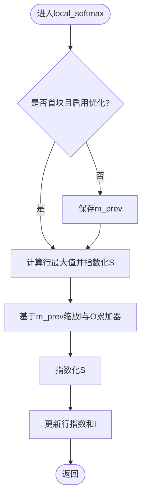

# Flash Attention原理

<cite>
**本文引用的文件**
- [forward_kernel.cuh](file://previous_kernels/src_15/include/forward_kernel.cuh)
- [flash_attention.cuh](file://previous_kernels/src_15/include/flash_attention.cuh)
- [softmax.cuh](file://previous_kernels/src_15/include/softmax.cuh)
- [load_store.cuh](file://previous_kernels/src_15/include/load_store.cuh)
- [gemm.cuh](file://previous_kernels/src_15/include/gemm.cuh)
- [layout.cuh](file://previous_kernels/src_15/include/layout.cuh)
- [static_kernel_configuration.cuh](file://previous_kernels/src_15/include/static_kernel_configuration.cuh)
- [tensor_view.cuh](file://previous_kernels/src_15/include/tensor_view.cuh)
- [common.h](file://previous_kernels/src_15/include/common.h)
- [flash_attention.cu](file://previous_kernels/src_15/flash_attention.cu)
</cite>

## 目录
1. [引言](#引言)
2. [项目结构](#项目结构)
3. [核心组件](#核心组件)
4. [架构总览](#架构总览)
5. [详细组件分析](#详细组件分析)
6. [依赖关系分析](#依赖关系分析)
7. [性能考量](#性能考量)
8. [故障排查指南](#故障排查指南)
9. [结论](#结论)
10. [附录](#附录)

## 引言
本文件围绕Flash Attention 2的实现，系统阐述其通过“分块（tiling）”与“共享内存（smem）局部计算”减少高带宽内存（HBM）访问次数、提升内存效率的机制。重点解析forward_kernel.cuh中的flash_forward_kernel函数如何组织线程块（CTA），如何在共享内存中完成QK与PV两阶段GEMM，以及如何通过在线计算softmax避免中间S矩阵的显式存储，从而显著降低内存占用与带宽压力。同时给出面向初学者的流程图与面向高级用户的复杂度与访问模式分析。

## 项目结构
该仓库包含多版本实现，本文以previous_kernels/src_15为基准，聚焦以下关键头文件：
- 前向内核与主循环：forward_kernel.cuh
- 内核参数与配置：flash_attention.cuh
- softmax在线计算：softmax.cuh
- 加载/存储与异步拷贝：load_store.cuh
- GEMM与mma融合：gemm.cuh
- 数据布局与索引：layout.cuh
- 静态内核配置与张量类型：static_kernel_configuration.cuh
- 张量视图与类型转换：tensor_view.cuh
- 公共常量与宏：common.h
- Python绑定与启动器：flash_attention.cu

图表来源
- [forward_kernel.cuh](file://previous_kernels/src_15/include/forward_kernel.cuh#L85-L204)
- [flash_attention.cuh](file://previous_kernels/src_15/include/flash_attention.cuh#L1-L110)
- [softmax.cuh](file://previous_kernels/src_15/include/softmax.cuh#L1-L130)
- [gemm.cuh](file://previous_kernels/src_15/include/gemm.cuh#L1-L126)
- [load_store.cuh](file://previous_kernels/src_15/include/load_store.cuh#L1-L356)
- [layout.cuh](file://previous_kernels/src_15/include/layout.cuh#L1-L269)
- [static_kernel_configuration.cuh](file://previous_kernels/src_15/include/static_kernel_configuration.cuh#L1-L294)
- [tensor_view.cuh](file://previous_kernels/src_15/include/tensor_view.cuh#L1-L82)
- [common.h](file://previous_kernels/src_15/include/common.h#L1-L81)
- [flash_attention.cu](file://previous_kernels/src_15/flash_attention.cu#L1-L150)

章节来源
- [forward_kernel.cuh](file://previous_kernels/src_15/include/forward_kernel.cuh#L85-L204)
- [flash_attention.cu](file://previous_kernels/src_15/flash_attention.cu#L1-L150)

## 核心组件
- 线程块（CTA）组织与主循环：flash_forward_kernel根据批、头、Q序列块划分CTA，每个CTA负责一个样本×头×Q序列块的前向计算。
- 分块加载与共享内存：通过GSMem/Smem/Rmem三层布局，将Q、K、V按(B_r, d_head)、(B_c, d_head)等块加载至共享内存，避免一次性加载整条序列。
- 在线softmax：在每轮KV块处理时即时计算softmax，不存储完整S矩阵，仅用寄存器累积O。
- GEMM融合：先QK块乘得到S累加器，再用P=softmax(S)与V做PV乘更新O累加器，最后统一归一化。

章节来源
- [forward_kernel.cuh](file://previous_kernels/src_15/include/forward_kernel.cuh#L85-L204)
- [static_kernel_configuration.cuh](file://previous_kernels/src_15/include/static_kernel_configuration.cuh#L104-L294)
- [load_store.cuh](file://previous_kernels/src_15/include/load_store.cuh#L1-L356)
- [gemm.cuh](file://previous_kernels/src_15/include/gemm.cuh#L1-L126)
- [softmax.cuh](file://previous_kernels/src_15/include/softmax.cuh#L1-L130)

## 架构总览
下图展示了从输入张量到输出张量的端到端数据流：Q、K、V按块从HBM加载到共享内存，CTA内的warp并行执行QK与PV两阶段GEMM，期间在线计算softmax并增量更新O累加器，最终将O从寄存器写回共享内存再落盘。

图表来源
- [flash_attention.cu](file://previous_kernels/src_15/flash_attention.cu#L1-L150)
- [forward_kernel.cuh](file://previous_kernels/src_15/include/forward_kernel.cuh#L85-L204)
- [gemm.cuh](file://previous_kernels/src_15/include/gemm.cuh#L1-L126)
- [softmax.cuh](file://previous_kernels/src_15/include/softmax.cuh#L1-L130)
- [load_store.cuh](file://previous_kernels/src_15/include/load_store.cuh#L1-L356)

## 详细组件分析

### 组件A：线程块组织与主循环（flash_forward_kernel）
- CTA维度：按批、头、Q序列块划分，gridDim={n_Q_blocks, n_heads, batch_size}，blockDim=n_warps×WARP_SIZE。
- 每个CTA负责一个样本×头×一个Q序列块的计算，Q与O各读写一个B_r块，K/V读取整个序列但按B_c分块处理。
- 共享内存布局：Q、K、V分别映射到连续区域，O作为中间累加器也驻留共享内存，最后统一写回HBM。
- 主循环：先预加载最后一块K，然后逐块处理KV，每块结束后进行在线softmax与O累加器更新，最后统一归一化并写回。

图表来源
- [forward_kernel.cuh](file://previous_kernels/src_15/include/forward_kernel.cuh#L85-L204)

章节来源
- [forward_kernel.cuh](file://previous_kernels/src_15/include/forward_kernel.cuh#L85-L204)
- [flash_attention.cu](file://previous_kernels/src_15/flash_attention.cu#L100-L135)

### 组件B：分块加载与共享内存布局（load_store.cuh + static_kernel_configuration.cuh + layout.cuh）
- 分块策略：Q按(B_r, d_head)、K/V按(B_c, d_head)分块；每个warp独立加载其负责的行数，其余行由其他warp补齐，形成“warp级并行+块级计算”的协作。
- 共享内存布局：Q、K、V在SMem中按固定stride排列，配合swizzle打散以提升访存带宽；O累加器同样驻留SMem，最后统一写回。
- 异步拷贝：使用cp_async异步加载，配合commit/wait与同步屏障，确保不同阶段的加载与计算流水化。
- 数据布局：Rmem（寄存器）、Smem（共享内存）、GMem（全局内存）三者通过布局类与stride描述，支持2x2操作平铺与类型2打包，便于高效访存与mma融合。

图表来源
- [load_store.cuh](file://previous_kernels/src_15/include/load_store.cuh#L63-L201)
- [layout.cuh](file://previous_kernels/src_15/include/layout.cuh#L1-L269)
- [static_kernel_configuration.cuh](file://previous_kernels/src_15/include/static_kernel_configuration.cuh#L131-L294)

章节来源
- [load_store.cuh](file://previous_kernels/src_15/include/load_store.cuh#L1-L356)
- [layout.cuh](file://previous_kernels/src_15/include/layout.cuh#L1-L269)
- [static_kernel_configuration.cuh](file://previous_kernels/src_15/include/static_kernel_configuration.cuh#L1-L294)

### 组件C：在线softmax与O累加器更新（softmax.cuh）
- 行最大值与指数化：每轮计算当前块的行最大值，指数化S后更新行指数和l，实现稳定且可并行的softmax。
- 在线更新：非首块时，利用上一块的m_prev缩放l与O累加器，避免重算历史信息。
- 最终归一化：所有行的l求和后取倒数，再整体乘以O累加器，得到最终输出。

图表来源
- [softmax.cuh](file://previous_kernels/src_15/include/softmax.cuh#L1-L130)

章节来源
- [softmax.cuh](file://previous_kernels/src_15/include/softmax.cuh#L1-L130)

### 组件D：GEMM与mma融合（gemm.cuh + static_kernel_configuration.cuh）
- QK阶段：Q与K在共享内存中按tile分块，通过ldmatrix.x4加载到寄存器fragments，mma_m16n8k16融合累加到S累加器。
- PV阶段：P（来自softmax）与V在共享内存中按tile分块，mma融合累加到O累加器。
- 双缓冲与预取：当未将整块加载到寄存器时，采用双缓冲预取下一tile，提升吞吐。

图表来源
- [gemm.cuh](file://previous_kernels/src_15/include/gemm.cuh#L1-L126)
- [static_kernel_configuration.cuh](file://previous_kernels/src_15/include/static_kernel_configuration.cuh#L274-L289)

章节来源
- [gemm.cuh](file://previous_kernels/src_15/include/gemm.cuh#L1-L126)
- [static_kernel_configuration.cuh](file://previous_kernels/src_15/include/static_kernel_configuration.cuh#L274-L289)

### 组件E：张量视图与类型转换（tensor_view.cuh + load_store.cuh）
- 张量视图：通过TensorView与布局类，支持移除操作平铺、类型2打包等，便于在寄存器与SMem之间高效搬运。
- 类型转换：将float累加器转换为半精度或bfloat16输出，便于后续存储与传输。

章节来源
- [tensor_view.cuh](file://previous_kernels/src_15/include/tensor_view.cuh#L1-L82)
- [load_store.cuh](file://previous_kernels/src_15/include/load_store.cuh#L314-L356)

## 依赖关系分析
- forward_kernel.cuh依赖gemm.cuh进行GEMM融合，依赖softmax.cuh进行在线softmax，依赖load_store.cuh进行异步加载与搬运，依赖static_kernel_configuration.cuh生成静态类型与布局配置，依赖tensor_view.cuh与layout.cuh管理张量布局与索引。
- flash_attention.cu负责Python绑定、参数校验、grid/cta设置与内核启动。

图表来源
- [flash_attention.cu](file://previous_kernels/src_15/flash_attention.cu#L1-L150)
- [forward_kernel.cuh](file://previous_kernels/src_15/include/forward_kernel.cuh#L85-L204)
- [gemm.cuh](file://previous_kernels/src_15/include/gemm.cuh#L1-L126)
- [softmax.cuh](file://previous_kernels/src_15/include/softmax.cuh#L1-L130)
- [load_store.cuh](file://previous_kernels/src_15/include/load_store.cuh#L1-L356)
- [static_kernel_configuration.cuh](file://previous_kernels/src_15/include/static_kernel_configuration.cuh#L1-L294)
- [tensor_view.cuh](file://previous_kernels/src_15/include/tensor_view.cuh#L1-L82)
- [layout.cuh](file://previous_kernels/src_15/include/layout.cuh#L1-L269)
- [common.h](file://previous_kernels/src_15/include/common.h#L1-L81)

章节来源
- [flash_attention.cu](file://previous_kernels/src_15/flash_attention.cu#L1-L150)
- [forward_kernel.cuh](file://previous_kernels/src_15/include/forward_kernel.cuh#L85-L204)

## 性能考量
- 内存效率优化
  - 分块（tiling）：Q按(B_r, d_head)、K/V按(B_c, d_head)分块，避免一次性加载整条序列，显著降低HBM带宽需求。
  - 共享内存驻留：S与O在寄存器/共享内存中局部计算，仅在必要时写回，减少HBM往返。
  - 异步拷贝：cp_async流水化加载，配合同步屏障保证安全，最大化访存与计算重叠。
  - 在线softmax：不存储完整S矩阵，仅用寄存器维护m、l与O累加器，大幅降低内存占用。
- 计算效率优化
  - 2x2操作平铺与类型2打包：通过布局变换与类型2打包，提高访存吞吐与寄存器利用率。
  - 双缓冲预取：在GEMM阶段预取下一tile，减少等待时间。
  - ldmatrix.x4与mma融合：充分利用SM80架构特性，提升吞吐。
- 时间复杂度
  - 对于长度为L的序列，Q、K、V形状均为(batch, heads, L, d_head)，Flash Attention的复杂度约为O(B_r × B_c × d_head + batch × heads × L × d_head)。其中B_r、B_c为分块大小，d_head为通道维。
  - 由于分块与在线softmax，避免了O(L^2 × d_head)的S矩阵存储，显著降低内存峰值与带宽压力。

[本节为通用性能讨论，无需列出具体文件来源]

## 故障排查指南
- 输入形状与分块约束
  - 序列长度需满足对B_r与B_c的整除性要求，否则会触发断言错误。
- 数据类型与设备能力
  - 仅支持fp16与bf16，且要求SM_80及以上架构。
- 共享内存不足
  - 内核动态共享内存按配置计算，若超过限制需调整配置或内核属性。
- 访存异常
  - 检查异步拷贝commit/wait配对与同步屏障位置，避免竞态。
- softmax数值稳定性
  - 确保使用在线softmax的行最大值减法与指数化，避免溢出。

章节来源
- [flash_attention.cu](file://previous_kernels/src_15/flash_attention.cu#L42-L83)
- [flash_attention.cu](file://previous_kernels/src_15/flash_attention.cu#L117-L135)
- [forward_kernel.cuh](file://previous_kernels/src_15/include/forward_kernel.cuh#L149-L174)
- [softmax.cuh](file://previous_kernels/src_15/include/softmax.cuh#L1-L130)

## 结论
Flash Attention 2通过分块（tiling）与共享内存驻留，结合在线softmax与异步加载，有效减少了HBM访问次数与内存占用。其核心在于：将Q、K、V按(B_r, d_head)、(B_c, d_head)分块，CTA内warp协作完成局部计算；在寄存器/共享内存中完成QK与PV两阶段GEMM，期间在线计算softmax并增量更新O累加器，最终统一归一化与写回。该设计在保持高吞吐的同时显著降低了内存带宽压力，适用于长序列注意力计算场景。

[本节为总结性内容，无需列出具体文件来源]

## 附录
- 关键宏与常量
  - WARP_SIZE、SHFL掩码、向量化访问宽度、fragments尺寸等常量定义于common.h，用于控制访存与融合计算的粒度。
- 参数与配置
  - FlashForwardKernelConfig包含dtype、d_head、B_r、B_c、n_warps、async_copy、eager_load_blocks、swizzled、mma双缓冲与优化softmax等选项，smem_bytes用于动态共享内存设置。

章节来源
- [common.h](file://previous_kernels/src_15/include/common.h#L1-L81)
- [flash_attention.cuh](file://previous_kernels/src_15/include/flash_attention.cuh#L31-L110)
- [flash_attention.cu](file://previous_kernels/src_15/flash_attention.cu#L117-L135)