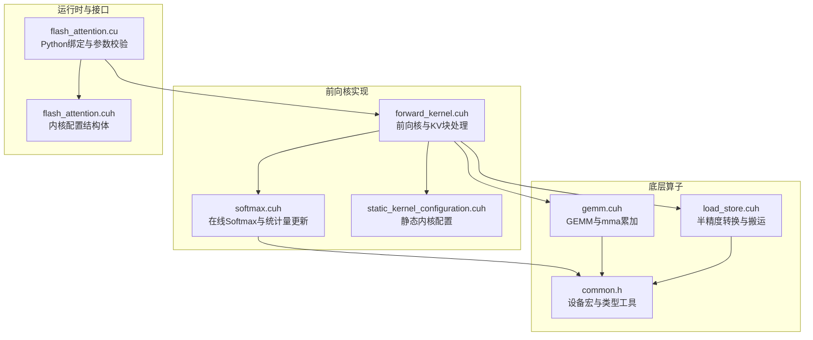
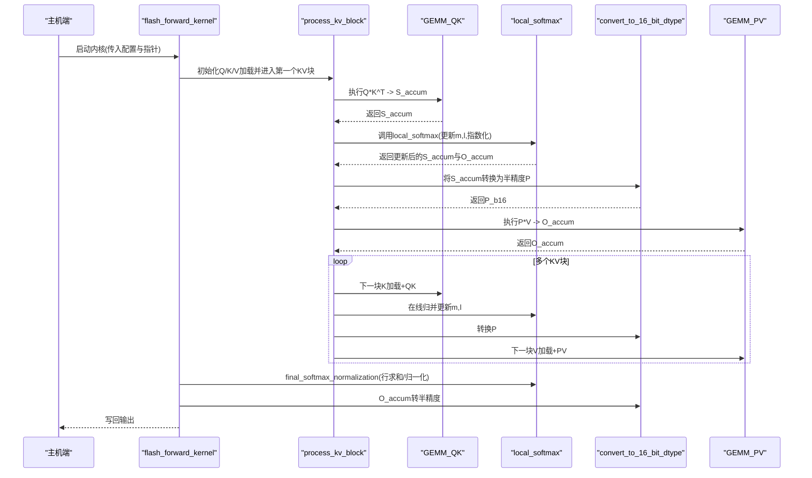
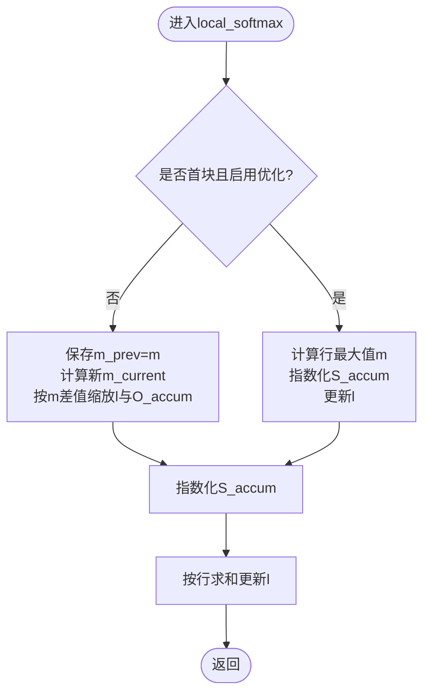
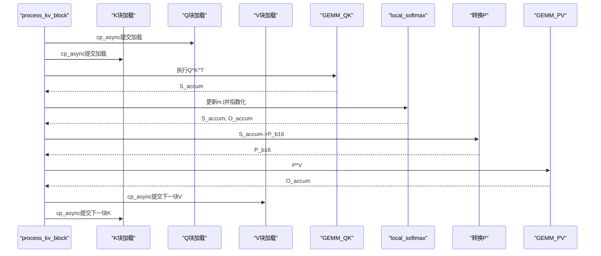
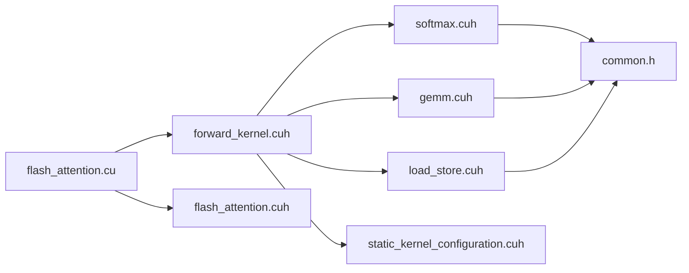

# 在线Softmax实现

<cite>
**本文引用的文件**
- [softmax.cuh](file://previous_kernels/src_15/include/softmax.cuh)
- [forward_kernel.cuh](file://previous_kernels/src_15/include/forward_kernel.cuh)
- [static_kernel_configuration.cuh](file://previous_kernels/src_15/include/static_kernel_configuration.cuh)
- [flash_attention.cu](file://previous_kernels/src_15/flash_attention.cu)
- [flash_attention.cuh](file://previous_kernels/src_15/include/flash_attention.cuh)
- [common.h](file://previous_kernels/src_15/include/common.h)
- [gemm.cuh](file://previous_kernels/src_15/include/gemm.cuh)
- [load_store.cuh](file://previous_kernels/src_15/include/load_store.cuh)
</cite>

## 目录
1. [引言](#引言)
2. [项目结构](#项目结构)
3. [核心组件](#核心组件)
4. [架构总览](#架构总览)
5. [详细组件分析](#详细组件分析)
6. [依赖关系分析](#依赖关系分析)
7. [性能考量](#性能考量)
8. [故障排查指南](#故障排查指南)
9. [结论](#结论)
10. [附录](#附录)

## 引言
本文件围绕“在线Softmax”在CUDA核中的实现进行系统化解读，重点解释如何在不显式存储完整QK矩阵的前提下完成softmax归一化，并通过局部（per-block）更新最大值与归一化因子，实现数值稳定的在线归并。文档同时阐述：
- local_softmax函数的实现机制：最大值m与归一化因子l的迭代更新、指数化与行求和；
- forward_kernel.cuh中process_kv_block如何将在线Softmax与QK、PV矩阵乘法流水线协同；
- optimized_softmax配置项对精度与性能的影响；
- 面向初学者的数学推导与等价性证明；
- 面向高级用户的fp16/bf16精度控制与溢出处理策略。

## 项目结构
该仓库包含多版本源码与内核实现，本次分析聚焦于previous_kernels/src_15目录下的实现，涵盖：
- Softmax相关函数与在线归并逻辑：softmax.cuh
- 前向核主流程与KV块处理：forward_kernel.cuh
- 静态内核配置与张量布局：static_kernel_configuration.cuh
- Python绑定与运行时参数传递：flash_attention.cu、flash_attention.cuh
- 矩阵乘法与数据搬运：gemm.cuh、load_store.cuh
- 公共常量与设备宏：common.h

图表来源
- [forward_kernel.cuh](file://previous_kernels/src_15/include/forward_kernel.cuh#L1-L207)
- [softmax.cuh](file://previous_kernels/src_15/include/softmax.cuh#L1-L130)
- [static_kernel_configuration.cuh](file://previous_kernels/src_15/include/static_kernel_configuration.cuh#L1-L294)
- [flash_attention.cu](file://previous_kernels/src_15/flash_attention.cu#L1-L150)
- [flash_attention.cuh](file://previous_kernels/src_15/include/flash_attention.cuh#L1-L110)
- [gemm.cuh](file://previous_kernels/src_15/include/gemm.cuh#L1-L126)
- [load_store.cuh](file://previous_kernels/src_15/include/load_store.cuh)
- [common.h](file://previous_kernels/src_15/include/common.h#L1-L81)

章节来源
- [forward_kernel.cuh](file://previous_kernels/src_15/include/forward_kernel.cuh#L1-L207)
- [softmax.cuh](file://previous_kernels/src_15/include/softmax.cuh#L1-L130)
- [static_kernel_configuration.cuh](file://previous_kernels/src_15/include/static_kernel_configuration.cuh#L1-L294)
- [flash_attention.cu](file://previous_kernels/src_15/flash_attention.cu#L1-L150)
- [flash_attention.cuh](file://previous_kernels/src_15/include/flash_attention.cuh#L1-L110)
- [gemm.cuh](file://previous_kernels/src_15/include/gemm.cuh#L1-L126)
- [load_store.cuh](file://previous_kernels/src_15/include/load_store.cuh)
- [common.h](file://previous_kernels/src_15/include/common.h#L1-L81)

## 核心组件
- 在线Softmax模块（softmax.cuh）
  - 行最大值计算：calc_row_max
  - 指数化：exponentiate_tensor
  - 归一化因子更新：update_row_exp_sum
  - 在线归并：scale_l_O
  - 最终归一化：final_softmax_normalization
  - 主函数：local_softmax（支持is_first与optimized_softmax分支）

- 前向核与KV块处理（forward_kernel.cuh）
  - process_kv_block：在每个KV块上执行QK矩阵乘法、在线Softmax、P转换、PV矩阵乘法
  - flash_forward_kernel：调度循环、初始化m/l、调用local_softmax与最终归一化

- 静态内核配置（static_kernel_configuration.cuh）
  - 定义张量布局、寄存器/共享内存配置、GEMM类型别名、行统计数组类型

- 运行时与接口（flash_attention.cu、flash_attention.cuh）
  - 参数校验、内核启动、动态共享内存设置、配置结构体定义

章节来源
- [softmax.cuh](file://previous_kernels/src_15/include/softmax.cuh#L1-L130)
- [forward_kernel.cuh](file://previous_kernels/src_15/include/forward_kernel.cuh#L1-L207)
- [static_kernel_configuration.cuh](file://previous_kernels/src_15/include/static_kernel_configuration.cuh#L1-L294)
- [flash_attention.cu](file://previous_kernels/src_15/flash_attention.cu#L1-L150)
- [flash_attention.cuh](file://previous_kernels/src_15/include/flash_attention.cuh#L1-L110)

## 架构总览
下图展示了前向核的执行流程，强调在线Softmax如何与QK、PV流水线协同工作。

图表来源
- [forward_kernel.cuh](file://previous_kernels/src_15/include/forward_kernel.cuh#L1-L207)
- [softmax.cuh](file://previous_kernels/src_15/include/softmax.cuh#L1-L130)
- [gemm.cuh](file://previous_kernels/src_15/include/gemm.cuh#L1-L126)
- [load_store.cuh](file://previous_kernels/src_15/include/load_store.cuh)

章节来源
- [forward_kernel.cuh](file://previous_kernels/src_15/include/forward_kernel.cuh#L1-L207)
- [softmax.cuh](file://previous_kernels/src_15/include/softmax.cuh#L1-L130)
- [gemm.cuh](file://previous_kernels/src_15/include/gemm.cuh#L1-L126)
- [load_store.cuh](file://previous_kernels/src_15/include/load_store.cuh)

## 详细组件分析

### 在线Softmax与统计量更新
在线Softmax通过逐块更新行最大值m与归一化因子l，避免显式保存完整S矩阵，从而显著降低内存占用。其核心步骤如下：
- 行最大值计算：对当前块的S_accum按行取最大值，得到m_current
- 指数化：将S_accum按行减去m_current并指数化，得到exp(S*scale - max)
- 归一化因子更新：累计每行的指数和，得到l_current
- 在非首块时，使用scale_l_O将前一块的O_accum缩放以匹配新的m，确保行间一致性

图表来源
- [softmax.cuh](file://previous_kernels/src_15/include/softmax.cuh#L1-L130)

章节来源
- [softmax.cuh](file://previous_kernels/src_15/include/softmax.cuh#L1-L130)

### local_softmax函数机制详解
- 参数与作用域
  - S_accum_untiled：当前块的S累积张量（移除操作平铺后视图）
  - O_accum_untiled：当前块的O累积张量（同上）
  - m、l：行级统计数组，分别记录每行的最大值与指数和
  - softmax_scale：缩放系数（与head维度相关）
- 分支逻辑
  - is_first且optimized_softmax为真：直接计算m、指数化S、更新l
  - 否则：先保存m_prev，再计算m_current，调用scale_l_O缩放l与O_accum，随后指数化S并更新l
- 数值稳定性
  - 通过减去行最大值再指数化，避免exp溢出
  - 使用行内warp级归约（shuffle xor）保证每行统计一致

章节来源
- [softmax.cuh](file://previous_kernels/src_15/include/softmax.cuh#L1-L130)

### 与矩阵乘法流水线的协同（process_kv_block）
- 数据流
  - QK阶段：Q与K块经GEMM_QK得到S_accum
  - Softmax阶段：调用local_softmax更新m/l并指数化S_accum
  - P转换：将S_accum转换为半精度P_b16
  - PV阶段：P_b16与V块经GEMM_PV得到O_accum
- 流水与异步
  - 使用cp_async等待/提交与__syncthreads同步，使K/V加载与GEMM重叠
  - 在QK完成后立即开始V的异步加载，避免流水停顿
  - 在PV完成后准备下一轮K/V加载，保持高带宽利用率

图表来源
- [forward_kernel.cuh](file://previous_kernels/src_15/include/forward_kernel.cuh#L1-L207)
- [gemm.cuh](file://previous_kernels/src_15/include/gemm.cuh#L1-L126)
- [load_store.cuh](file://previous_kernels/src_15/include/load_store.cuh)

章节来源
- [forward_kernel.cuh](file://previous_kernels/src_15/include/forward_kernel.cuh#L1-L207)
- [gemm.cuh](file://previous_kernels/src_15/include/gemm.cuh#L1-L126)
- [load_store.cuh](file://previous_kernels/src_15/include/load_store.cuh)

### 优化配置项optimized_softmax的影响
- 启用条件
  - 当is_first且optimized_softmax为真时，local_softmax采用“一次性计算m、指数化、更新l”的路径
- 性能影响
  - 减少一次m_prev拷贝与scale_l_O缩放，降低寄存器与访存开销
  - 适合首块或对精度要求严格且可接受少量寄存器使用的场景
- 精度影响
  - 由于未进行跨块缩放，需确保首块统计量与后续块统计量一致（由算法保证）
  - 对于非首块，必须走标准分支以正确归并

章节来源
- [softmax.cuh](file://previous_kernels/src_15/include/softmax.cuh#L1-L130)
- [forward_kernel.cuh](file://previous_kernels/src_15/include/forward_kernel.cuh#L1-L207)
- [flash_attention.cuh](file://previous_kernels/src_15/include/flash_attention.cuh#L1-L110)

### 数值稳定性与数学推导（面向初学者）
- 目标
  - 在不存储完整S矩阵的情况下，实现与传统softmax等价的归一化
- 关键思想
  - 对每行减去行最大值，再指数化，避免溢出
  - 通过在线归并，将多块的行最大值与指数和合并，保持行间一致性
- 等价性证明思路
  - 设第k块的行最大值为m_k，指数和为l_k，O^{(k)}为第k块贡献
  - 定义缩放因子α_k = exp(m_{k-1} - m_k)，则有：
    - l_k ← α_k · l_{k-1} + Σ_j exp(s_{kj} - m_k)
    - O^{(k)} ← α_k · O^{(k-1)} + exp(-m_k) · V_k
  - 最终归一化：P ← O / Σ_q l_q
  - 该递推与分块累积的softmax完全等价

章节来源
- [softmax.cuh](file://previous_kernels/src_15/include/softmax.cuh#L1-L130)

### 高级主题：fp16/bf16精度控制与溢出处理
- 类型选择
  - 内核根据配置选择half或nv_bfloat16作为输入/输出类型
  - 累加器使用float以提升精度
- 精度策略
  - softmax_scale通常与head维度有关，确保尺度合理
  - 在指数化前减去行最大值，避免exp溢出
- 溢出与下溢
  - 行最大值减法有效抑制上溢
  - 若存在极小值导致下溢，可通过适当调整softmax_scale或引入稳定常数（在实现中通常由scale与log-sum-exp的组合保证）
- 半精度转换
  - 在QK完成后将S_accum转换为半精度P_b16，减少后续PV阶段的带宽压力

章节来源
- [static_kernel_configuration.cuh](file://previous_kernels/src_15/include/static_kernel_configuration.cuh#L1-L294)
- [load_store.cuh](file://previous_kernels/src_15/include/load_store.cuh)
- [common.h](file://previous_kernels/src_15/include/common.h#L1-L81)

## 依赖关系分析
- 组件耦合
  - forward_kernel.cuh依赖softmax.cuh完成在线归并
  - forward_kernel.cuh依赖gemm.cuh执行GEMM
  - forward_kernel.cuh依赖load_store.cuh进行半精度转换
  - flash_attention.cu负责参数校验与内核启动
- 外部依赖
  - CUDA内置类型（half、nv_bfloat16）、设备宏（__shfl_xor_sync等）
  - PyTorch绑定（用于Python侧调用）

图表来源
- [flash_attention.cu](file://previous_kernels/src_15/flash_attention.cu#L1-L150)
- [forward_kernel.cuh](file://previous_kernels/src_15/include/forward_kernel.cuh#L1-L207)
- [softmax.cuh](file://previous_kernels/src_15/include/softmax.cuh#L1-L130)
- [gemm.cuh](file://previous_kernels/src_15/include/gemm.cuh#L1-L126)
- [load_store.cuh](file://previous_kernels/src_15/include/load_store.cuh)
- [static_kernel_configuration.cuh](file://previous_kernels/src_15/include/static_kernel_configuration.cuh#L1-L294)
- [flash_attention.cuh](file://previous_kernels/src_15/include/flash_attention.cuh#L1-L110)
- [common.h](file://previous_kernels/src_15/include/common.h#L1-L81)

章节来源
- [flash_attention.cu](file://previous_kernels/src_15/flash_attention.cu#L1-L150)
- [forward_kernel.cuh](file://previous_kernels/src_15/include/forward_kernel.cuh#L1-L207)
- [softmax.cuh](file://previous_kernels/src_15/include/softmax.cuh#L1-L130)
- [gemm.cuh](file://previous_kernels/src_15/include/gemm.cuh#L1-L126)
- [load_store.cuh](file://previous_kernels/src_15/include/load_store.cuh)
- [static_kernel_configuration.cuh](file://previous_kernels/src_15/include/static_kernel_configuration.cuh#L1-L294)
- [flash_attention.cuh](file://previous_kernels/src_15/include/flash_attention.cuh#L1-L110)
- [common.h](file://previous_kernels/src_15/include/common.h#L1-L81)

## 性能考量
- 寄存器与共享内存
  - S_accum与P_b16全程驻留寄存器，减少全局访存
  - O_accum在核末尾转换为半精度并写入共享内存，再统一写回，提高带宽利用率
- 流水与异步
  - cp_async与__syncthreads配合，最大化K/V加载与GEMM的重叠
  - GEMM内部双缓冲策略（当需要从共享内存加载时）进一步提升吞吐
- 精度与性能平衡
  - optimized_softmax在首块减少一次缩放，提升吞吐但增加寄存器压力
  - 半精度转换减少带宽，但需注意数值范围与精度损失

[本节为通用性能讨论，无需列出具体文件来源]

## 故障排查指南
- 输入形状与类型不匹配
  - 确认Q/K/V类型一致，且满足SM_80以上要求
- 分块大小约束
  - seq_len需能被B_r与B_c整除
- 动态共享内存不足
  - 根据配置计算smem_bytes并设置最大动态共享内存
- 归一化异常
  - 检查softmax_scale是否与head维度一致
  - 确保final_softmax_normalization中行内warp归约正确执行

章节来源
- [flash_attention.cu](file://previous_kernels/src_15/flash_attention.cu#L1-L150)
- [flash_attention.cuh](file://previous_kernels/src_15/include/flash_attention.cuh#L1-L110)

## 结论
本实现通过在线Softmax在不存储完整QK矩阵的前提下完成softmax归一化，结合QK与PV的流水线执行，实现了高吞吐与低内存占用。local_softmax通过行最大值与指数和的在线归并，保证了数值稳定性与等价性；optimized_softmax在首块提供性能优化。针对fp16/bf16，通过半精度转换与float累加器在精度与带宽之间取得平衡。建议在实际部署中根据head维度与硬件能力选择合适的配置，并关注动态共享内存限制与流水线重叠效果。

[本节为总结性内容，无需列出具体文件来源]

## 附录
- 关键实现位置参考
  - 在线Softmax主函数：[softmax.cuh](file://previous_kernels/src_15/include/softmax.cuh#L85-L105)
  - KV块处理与流水线：[forward_kernel.cuh](file://previous_kernels/src_15/include/forward_kernel.cuh#L19-L83)
  - 静态内核配置与类型选择：[static_kernel_configuration.cuh](file://previous_kernels/src_15/include/static_kernel_configuration.cuh#L104-L120)
  - 运行时参数与内核启动：[flash_attention.cu](file://previous_kernels/src_15/flash_attention.cu#L1-L150)
  - GEMM与mma累加：[gemm.cuh](file://previous_kernels/src_15/include/gemm.cuh#L1-L126)
  - 半精度转换：[load_store.cuh](file://previous_kernels/src_15/include/load_store.cuh)
  - 设备宏与类型工具：[common.h](file://previous_kernels/src_15/include/common.h#L1-L81)

[本节为索引性内容，无需列出具体文件来源]