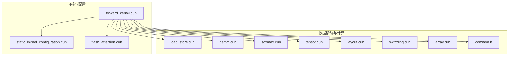
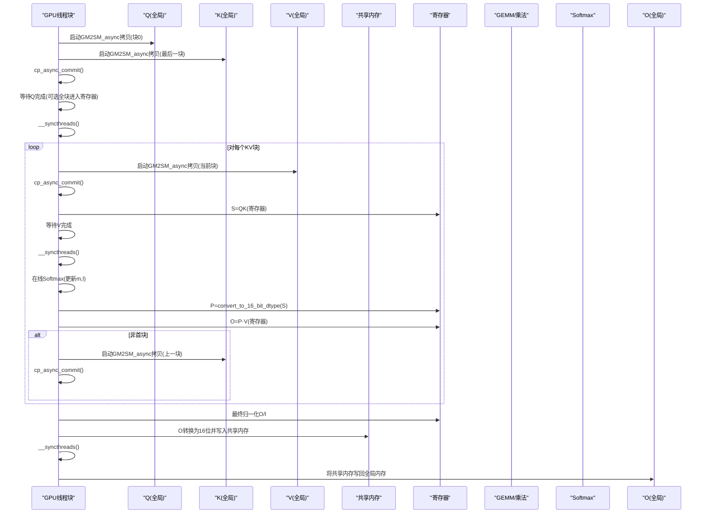
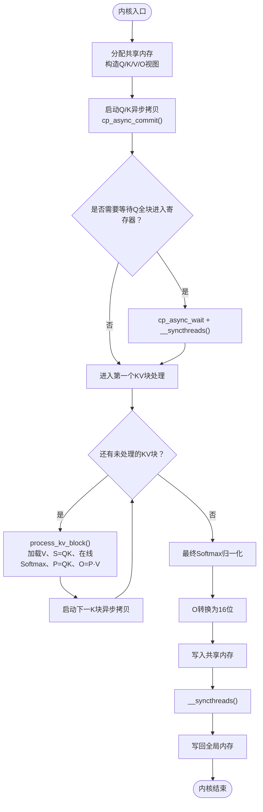
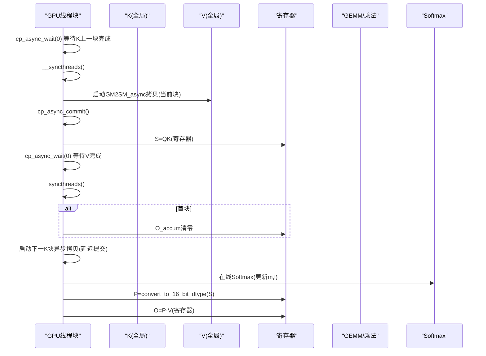
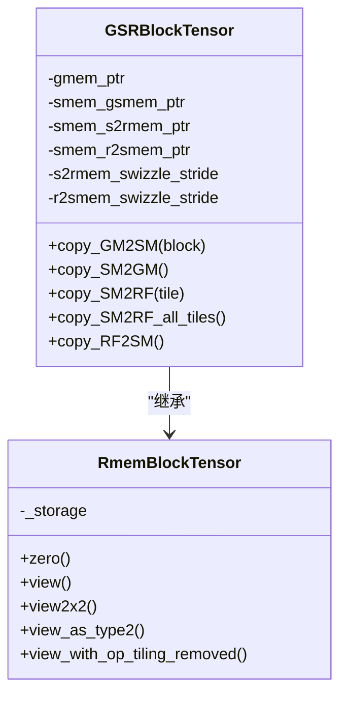
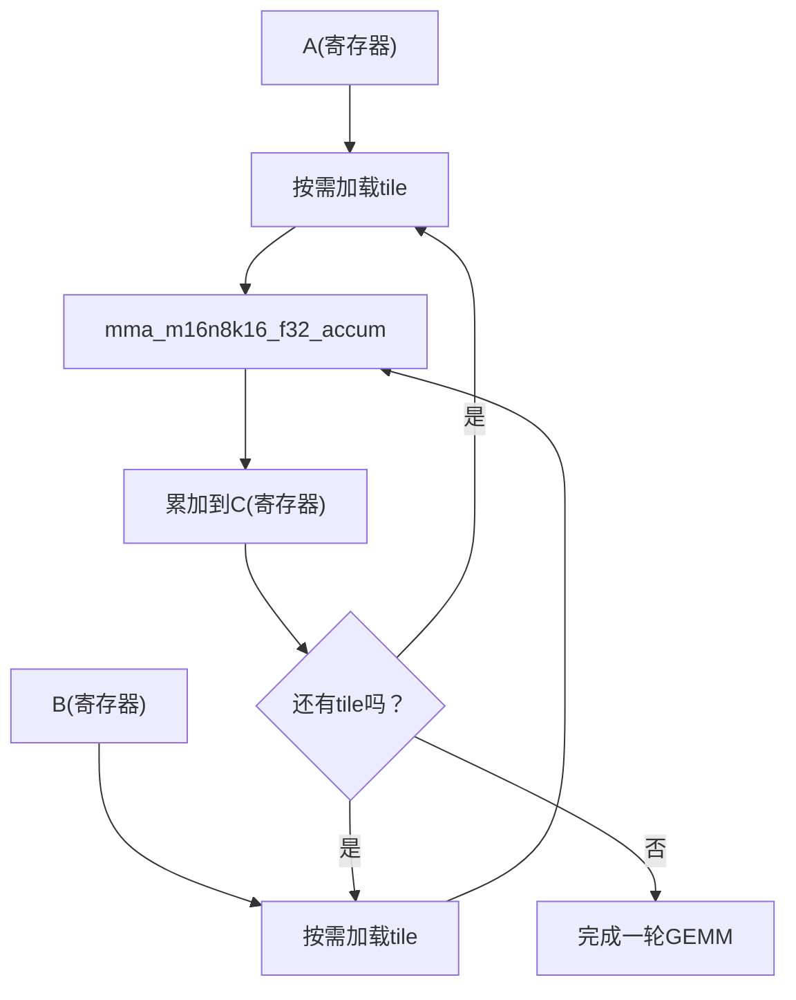
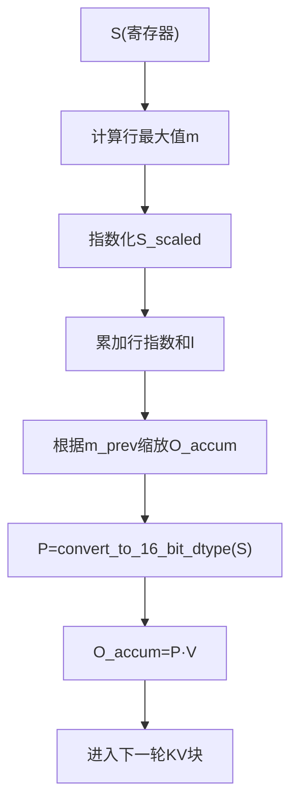
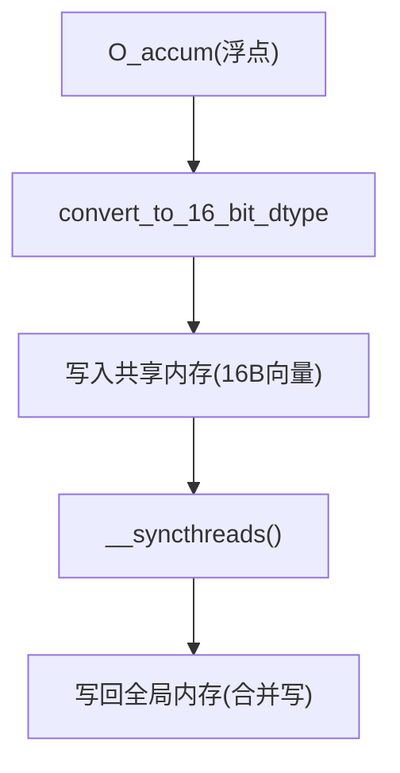
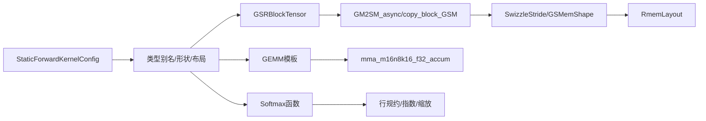

# 数据流分析

<cite>
**本文引用的文件**
- [forward_kernel.cuh](file://previous_kernels/src_15/include/forward_kernel.cuh)
- [load_store.cuh](file://previous_kernels/src_15/include/load_store.cuh)
- [softmax.cuh](file://previous_kernels/src_15/include/softmax.cuh)
- [gemm.cuh](file://previous_kernels/src_15/include/gemm.cuh)
- [tensor.cuh](file://previous_kernels/src_15/include/tensor.cuh)
- [layout.cuh](file://previous_kernels/src_15/include/layout.cuh)
- [static_kernel_configuration.cuh](file://previous_kernels/src_15/include/static_kernel_configuration.cuh)
- [flash_attention.cuh](file://previous_kernels/src_15/include/flash_attention.cuh)
- [common.h](file://previous_kernels/src_15/include/common.h)
- [array.cuh](file://previous_kernels/src_15/include/array.cuh)
- [swizzling.cuh](file://previous_kernels/src_15/include/swizzling.cuh)
</cite>

## 目录
1. [引言](#引言)
2. [项目结构](#项目结构)
3. [核心组件](#核心组件)
4. [架构总览](#架构总览)
5. [详细组件分析](#详细组件分析)
6. [依赖分析](#依赖分析)
7. [性能考量](#性能考量)
8. [故障排查指南](#故障排查指南)
9. [结论](#结论)

## 引言
本文件围绕Flash Attention 2的前向计算内核，系统性梳理从Q、K、V输入张量到O输出张量的完整数据流路径。重点聚焦于forward_kernel.cuh中的flash_forward_kernel函数，解释全局内存、共享内存与寄存器之间的数据移动，以及异步内存复制（cp_async）如何与计算重叠，形成流水线式执行。同时，阐明Q、K、V块的加载顺序、同步机制（cp_async_wait与__syncthreads），以及最终结果通过convert_to_16_bit_dtype函数转换为16位数据类型并写回全局内存的过程。文档还提供面向初学者的数据流时序图，以及面向高级用户的内存带宽利用率与计算吞吐量优化策略。

## 项目结构
该仓库采用按功能域分层的组织方式：核心内核与工具函数分布在include目录下，CUDA源文件位于根目录或子目录中。与本分析直接相关的头文件包括：
- 前向内核与流程控制：forward_kernel.cuh
- 内存拷贝与数据类型转换：load_store.cuh
- Softmax与行统计更新：softmax.cuh
- GEMM矩阵乘法与mma指令封装：gemm.cuh
- 张量抽象与布局：tensor.cuh、layout.cuh
- 静态内核配置与模板参数：static_kernel_configuration.cuh
- 外部接口参数：flash_attention.cuh
- 公共常量与宏：common.h
- 数组容器：array.cuh
- Swizzle混洗：swizzling.cuh

图表来源
- [forward_kernel.cuh](file://previous_kernels/src_15/include/forward_kernel.cuh#L85-L204)
- [static_kernel_configuration.cuh](file://previous_kernels/src_15/include/static_kernel_configuration.cuh#L104-L293)
- [flash_attention.cuh](file://previous_kernels/src_15/include/flash_attention.cuh#L1-L110)
- [load_store.cuh](file://previous_kernels/src_15/include/load_store.cuh#L1-L356)
- [gemm.cuh](file://previous_kernels/src_15/include/gemm.cuh#L1-L126)
- [softmax.cuh](file://previous_kernels/src_15/include/softmax.cuh#L1-L130)
- [tensor.cuh](file://previous_kernels/src_15/include/tensor.cuh#L1-L143)
- [layout.cuh](file://previous_kernels/src_15/include/layout.cuh#L1-L269)
- [swizzling.cuh](file://previous_kernels/src_15/include/swizzling.cuh#L1-L29)
- [array.cuh](file://previous_kernels/src_15/include/array.cuh#L1-L45)
- [common.h](file://previous_kernels/src_15/include/common.h#L1-L81)

章节来源
- [forward_kernel.cuh](file://previous_kernels/src_15/include/forward_kernel.cuh#L85-L204)
- [static_kernel_configuration.cuh](file://previous_kernels/src_15/include/static_kernel_configuration.cuh#L104-L293)

## 核心组件
- 前向内核flash_forward_kernel：负责初始化共享内存布局、启动异步拷贝、迭代处理KV块、在线Softmax、累积O、最终归一化与写回。
- 张量抽象GSRBlockTensor：封装Q/K/V/O的全局/共享/寄存器三段式数据移动与视图操作。
- 内存拷贝与转换：GM2SM_async、copy_block_GSM、ldmatrix系列拷贝、convert_to_16_bit_dtype。
- GEMM与mma封装：GEMM模板、warp_fragment_mma_f32_accum、matmul流水线。
- Softmax与行统计：local_softmax、final_softmax_normalization、行最大值与指数化、l缩放与累加。
- 布局与混洗：GSMemShape、RmemLayout、SwizzleStride、CuteSwizzle。

章节来源
- [forward_kernel.cuh](file://previous_kernels/src_15/include/forward_kernel.cuh#L85-L204)
- [tensor.cuh](file://previous_kernels/src_15/include/tensor.cuh#L49-L141)
- [load_store.cuh](file://previous_kernels/src_15/include/load_store.cuh#L1-L356)
- [gemm.cuh](file://previous_kernels/src_15/include/gemm.cuh#L1-L126)
- [softmax.cuh](file://previous_kernels/src_15/include/softmax.cuh#L1-L130)
- [layout.cuh](file://previous_kernels/src_15/include/layout.cuh#L1-L269)
- [swizzling.cuh](file://previous_kernels/src_15/include/swizzling.cuh#L1-L29)

## 架构总览
Flash Attention 2的前向内核以CTA为单位，每个CTA处理一个样本、一个序列块与一个头。其数据流分为三个阶段：
1) 初始化与预取：启动Q、K的异步拷贝，并在需要时等待Q全部进入寄存器后进行跨Warp同步。
2) KV块循环：每轮先加载V，再计算S=QK，随后在线Softmax得到P并计算O=P·V，期间交错启动下一K块的异步拷贝。
3) 结果写回：最终对O进行归一化，转换为16位，先写入共享内存再一次性写回全局内存。

图表来源
- [forward_kernel.cuh](file://previous_kernels/src_15/include/forward_kernel.cuh#L142-L204)
- [load_store.cuh](file://previous_kernels/src_15/include/load_store.cuh#L16-L20)
- [gemm.cuh](file://previous_kernels/src_15/include/gemm.cuh#L90-L123)
- [softmax.cuh](file://previous_kernels/src_15/include/softmax.cuh#L85-L129)
- [load_store.cuh](file://previous_kernels/src_15/include/load_store.cuh#L314-L353)

## 详细组件分析

### 组件A：前向内核与数据流主控（flash_forward_kernel）
- 初始化共享内存布局与指针，构造Q/K/V/O的张量视图。
- 启动Q、K的异步拷贝，必要时等待Q全块进入寄存器并进行CTA级同步。
- 调用process_kv_block处理第一个KV块，随后循环处理其余块。
- 完成所有KV块后，进行最终Softmax归一化，将O从浮点累加转换为半精度并写回全局内存。

图表来源
- [forward_kernel.cuh](file://previous_kernels/src_15/include/forward_kernel.cuh#L142-L204)

章节来源
- [forward_kernel.cuh](file://previous_kernels/src_15/include/forward_kernel.cuh#L85-L204)

### 组件B：KV块处理流程（process_kv_block）
- 等待上一轮V拷贝完成，确保S=QK计算安全。
- 启动当前V块的异步拷贝并提交。
- 若K已全块进入寄存器，则直接从寄存器读取；否则按tile逐步加载。
- 计算S=QK，等待V完成后进行在线Softmax，得到P并转换为16位。
- 若O_accum尚未初始化则清零，随后计算O=P·V。
- 在非首块时，提前启动上一块K的异步拷贝，形成流水线。

图表来源
- [forward_kernel.cuh](file://previous_kernels/src_15/include/forward_kernel.cuh#L19-L84)
- [load_store.cuh](file://previous_kernels/src_15/include/load_store.cuh#L16-L20)
- [gemm.cuh](file://previous_kernels/src_15/include/gemm.cuh#L90-L123)
- [softmax.cuh](file://previous_kernels/src_15/include/softmax.cuh#L85-L129)
- [load_store.cuh](file://previous_kernels/src_15/include/load_store.cuh#L314-L353)

章节来源
- [forward_kernel.cuh](file://previous_kernels/src_15/include/forward_kernel.cuh#L19-L84)

### 组件C：张量抽象与数据移动（GSRBlockTensor）
- GSRBlockTensor封装了从全局到共享再到寄存器的三段式数据移动，以及从寄存器到共享再到全局的反向移动。
- 提供copy_GM2SM、copy_SM2GM、copy_SM2RF、copy_RF2SM等方法，配合不同布局与混洗策略。
- 通过SwizzleStride与GSMemShape/RmemLayout确定线程到内存的映射，保证向量化访问与高带宽。

图表来源
- [tensor.cuh](file://previous_kernels/src_15/include/tensor.cuh#L49-L141)
- [layout.cuh](file://previous_kernels/src_15/include/layout.cuh#L1-L269)
- [swizzling.cuh](file://previous_kernels/src_15/include/swizzling.cuh#L1-L29)

章节来源
- [tensor.cuh](file://previous_kernels/src_15/include/tensor.cuh#L49-L141)
- [layout.cuh](file://previous_kernels/src_15/include/layout.cuh#L1-L269)
- [swizzling.cuh](file://previous_kernels/src_15/include/swizzling.cuh#L1-L29)

### 组件D：GEMM与mma指令流水线
- GEMM模板定义Tiles数量、双缓冲策略与输入类型约束。
- matmul在每轮tile中按需加载A/B到寄存器，然后调用mma_m16n8k16_f32_accum执行外积累加。
- 双缓冲策略允许在加载下一tile的同时执行当前tile的乘法，提升利用率。

图表来源
- [gemm.cuh](file://previous_kernels/src_15/include/gemm.cuh#L24-L123)

章节来源
- [gemm.cuh](file://previous_kernels/src_15/include/gemm.cuh#L1-L126)

### 组件E：Softmax与行统计更新
- local_softmax在每轮KV块中更新行最大值m与指数和l，支持优化路径与非优化路径。
- final_softmax_normalization对所有行进行最终归一化，使行和为1。

图表来源
- [softmax.cuh](file://previous_kernels/src_15/include/softmax.cuh#L13-L129)
- [load_store.cuh](file://previous_kernels/src_15/include/load_store.cuh#L314-L353)

章节来源
- [softmax.cuh](file://previous_kernels/src_15/include/softmax.cuh#L1-L130)
- [load_store.cuh](file://previous_kernels/src_15/include/load_store.cuh#L314-L353)

### 组件F：数据类型转换与写回
- convert_to_16_bit_dtype将浮点累加结果转换为半精度或bfloat16，按2元素打包为half2/bfloat162。
- O最终先写入共享内存，再一次性写回全局内存，利用16字节向量存储与合并写提高带宽利用率。

图表来源
- [load_store.cuh](file://previous_kernels/src_15/include/load_store.cuh#L314-L353)
- [forward_kernel.cuh](file://previous_kernels/src_15/include/forward_kernel.cuh#L188-L204)

章节来源
- [load_store.cuh](file://previous_kernels/src_15/include/load_store.cuh#L314-L353)
- [forward_kernel.cuh](file://previous_kernels/src_15/include/forward_kernel.cuh#L188-L204)

## 依赖分析
- 模板配置依赖：StaticForwardKernelConfig根据运行时配置生成静态类型别名（如value_t、GEMM_QK、GEMM_PV、张量形状等），驱动内核编译期展开。
- 数据移动依赖：GSRBlockTensor依赖GSMemShape、RmemLayout、SwizzleStride与ldmatrix拷贝路径，确保向量化与混洗正确。
- 计算依赖：GEMM依赖mma指令与寄存器布局，Softmax依赖行规约与指数运算。
- 同步依赖：cp_async_wait与__syncthreads共同保证异步拷贝完成与CTA内一致性。

图表来源
- [static_kernel_configuration.cuh](file://previous_kernels/src_15/include/static_kernel_configuration.cuh#L104-L293)
- [tensor.cuh](file://previous_kernels/src_15/include/tensor.cuh#L49-L141)
- [load_store.cuh](file://previous_kernels/src_15/include/load_store.cuh#L1-L356)
- [gemm.cuh](file://previous_kernels/src_15/include/gemm.cuh#L1-L126)
- [softmax.cuh](file://previous_kernels/src_15/include/softmax.cuh#L1-L130)
- [layout.cuh](file://previous_kernels/src_15/include/layout.cuh#L1-L269)
- [swizzling.cuh](file://previous_kernels/src_15/include/swizzling.cuh#L1-L29)

章节来源
- [static_kernel_configuration.cuh](file://previous_kernels/src_15/include/static_kernel_configuration.cuh#L104-L293)
- [tensor.cuh](file://previous_kernels/src_15/include/tensor.cuh#L49-L141)
- [load_store.cuh](file://previous_kernels/src_15/include/load_store.cuh#L1-L356)
- [gemm.cuh](file://previous_kernels/src_15/include/gemm.cuh#L1-L126)
- [softmax.cuh](file://previous_kernels/src_15/include/softmax.cuh#L1-L130)
- [layout.cuh](file://previous_kernels/src_15/include/layout.cuh#L1-L269)
- [swizzling.cuh](file://previous_kernels/src_15/include/swizzling.cuh#L1-L29)

## 性能考量
- 内存带宽利用率
  - 使用16字节向量存储与合并写（st_global_na_relaxed_sys）减少访存次数，提升带宽利用率。
  - 通过Swizzle混洗降低冲突，提高全局访存效率。
  - 利用异步拷贝cp_async与commit/commit_group组合，隐藏访存延迟。
- 计算吞吐量
  - GEMM双缓冲策略在加载下一tile的同时执行当前tile的乘法，最大化mma利用率。
  - ldmatrix.x4批量加载寄存器片段，减少寄存器读取开销。
  - 在线Softmax避免中间结果溢出，减少额外访存。
- 同步与流水线
  - cp_async_wait与__syncthreads配合，确保异步拷贝完成后再进行后续计算，避免竞态。
  - KV块循环中，V拷贝与S=QK、在线Softmax、O=P·V交错执行，形成多阶段流水线。

[本节为通用性能讨论，不直接分析具体代码文件]

## 故障排查指南
- 异步拷贝未完成导致的错误
  - 症状：计算结果异常或越界访问。
  - 排查：确认cp_async_wait与__syncthreads的配对使用，确保在读取前已等待对应块完成。
- 寄存器/共享内存不足
  - 症状：编译失败或寄存器溢出。
  - 排查：检查StaticForwardKernelConfig中的d_head、B_r、B_c与n_warps设置，适当减小tile尺寸或n_warps。
- 数据类型不匹配
  - 症状：转换函数断言失败或结果错误。
  - 排查：确保convert_to_16_bit_dtype输入为float，输出为目标半精度类型；检查Rmem布局与op_tiling移除逻辑。
- Softmax数值不稳定
  - 症状：NaN或Inf。
  - 排查：确认行最大值计算与指数化步骤正确，避免溢出；检查final归一化前后的l值。

章节来源
- [forward_kernel.cuh](file://previous_kernels/src_15/include/forward_kernel.cuh#L142-L204)
- [load_store.cuh](file://previous_kernels/src_15/include/load_store.cuh#L314-L353)
- [softmax.cuh](file://previous_kernels/src_15/include/softmax.cuh#L1-L130)
- [static_kernel_configuration.cuh](file://previous_kernels/src_15/include/static_kernel_configuration.cuh#L104-L293)

## 结论
Flash Attention 2通过精心设计的内存流水线与计算重叠，实现了从Q、K、V到O的高效数据流。异步拷贝cp_async与同步屏障cp_async_wait/__syncthreads确保了数据一致性；GEMM双缓冲与在线Softmax进一步提升了吞吐量。最终通过convert_to_16_bit_dtype与共享内存合并写，兼顾了精度与带宽效率。理解这些组件与它们之间的交互，有助于在实际部署中进行性能调优与问题定位。