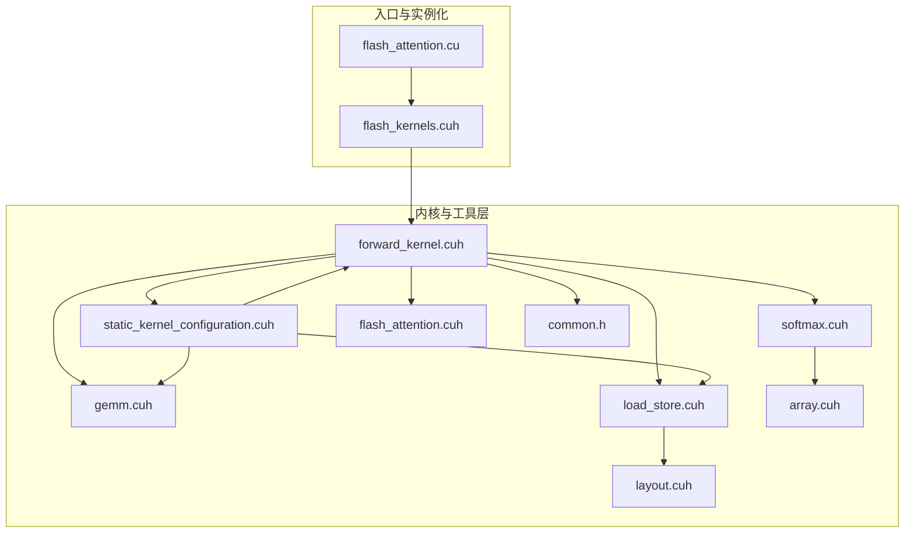
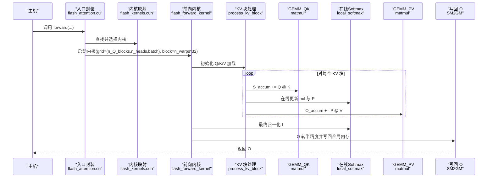
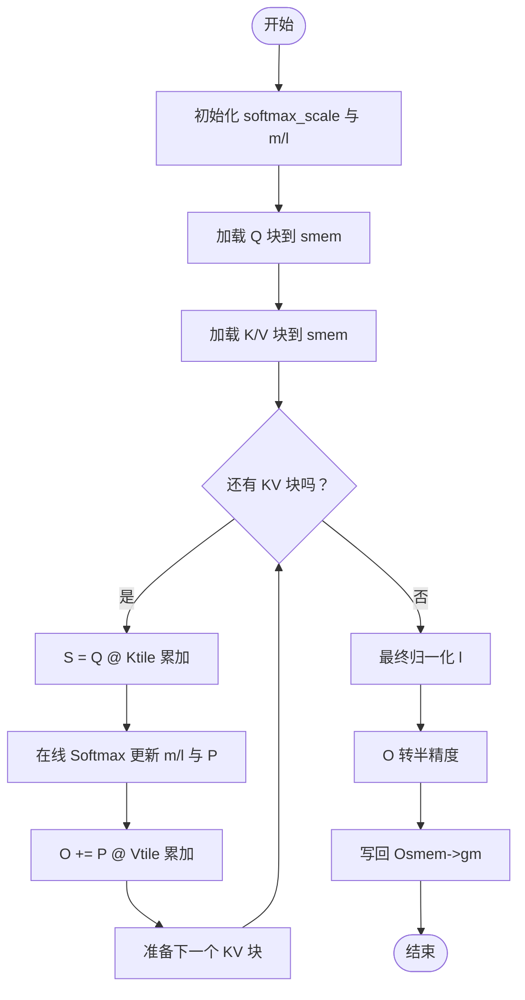
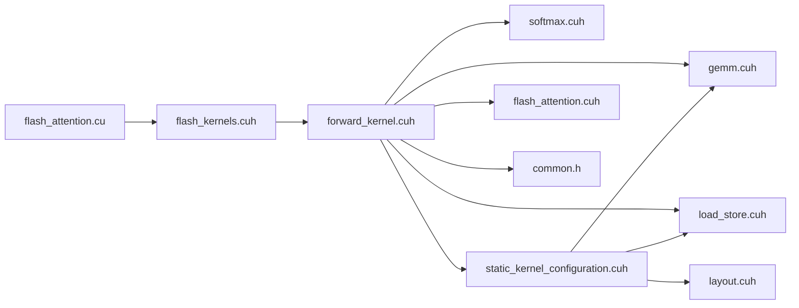

# 核心算法详解

<cite>
**本文引用的文件**
- [forward_kernel.cuh](file://previous_kernels/src_15/include/forward_kernel.cuh)
- [softmax.cuh](file://previous_kernels/src_15/include/softmax.cuh)
- [gemm.cuh](file://previous_kernels/src_15/include/gemm.cuh)
- [load_store.cuh](file://previous_kernels/src_15/include/load_store.cuh)
- [static_kernel_configuration.cuh](file://previous_kernels/src_15/include/static_kernel_configuration.cuh)
- [layout.cuh](file://previous_kernels/src_15/include/layout.cuh)
- [array.cuh](file://previous_kernels/src_15/include/array.cuh)
- [flash_attention.cuh](file://previous_kernels/src_15/include/flash_attention.cuh)
- [flash_kernels.cuh](file://previous_kernels/src_15/include/flash_kernels.cuh)
- [flash_attention.cu](file://previous_kernels/src_15/flash_attention.cu)
- [common.h](file://previous_kernels/src_15/include/common.h)
</cite>

## 目录
1. [引言](#引言)
2. [项目结构](#项目结构)
3. [核心组件](#核心组件)
4. [架构总览](#架构总览)
5. [详细组件分析](#详细组件分析)
6. [依赖关系分析](#依赖关系分析)
7. [性能考量](#性能考量)
8. [故障排查指南](#故障排查指南)
9. [结论](#结论)
10. [附录](#附录)

## 引言
本文件围绕 Flash Attention 2 的非因果注意力前向传播实现进行深入解析，聚焦以下目标：
- 解释分块（tiling）与异步拷贝如何降低 HBM 访问，提升内存效率；
- 阐述在线 Softmax 的数学原理与实现机制，展示如何在不存储完整 QK^T 矩阵的前提下完成归一化；
- 追踪从 Q、K、V 到 O 的完整数据流；
- 使用 forward_kernel.cuh 中的关键函数路径说明 QK^T 矩阵乘法、softmax 归一化、PV 乘法等步骤；
- 提供面向初学者的流程图与面向高级用户的数值稳定性与精度控制策略。

## 项目结构
该仓库采用“静态内核配置 + 模板内核 + 分层头文件”的组织方式，核心前向内核位于 include 层，入口封装位于 CUDA 源文件中，并通过映射表选择具体实例化内核。

图表来源
- [forward_kernel.cuh](file://previous_kernels/src_15/include/forward_kernel.cuh#L1-L207)
- [softmax.cuh](file://previous_kernels/src_15/include/softmax.cuh#L1-L130)
- [gemm.cuh](file://previous_kernels/src_15/include/gemm.cuh#L1-L126)
- [load_store.cuh](file://previous_kernels/src_15/include/load_store.cuh#L1-L356)
- [static_kernel_configuration.cuh](file://previous_kernels/src_15/include/static_kernel_configuration.cuh#L1-L294)
- [layout.cuh](file://previous_kernels/src_15/include/layout.cuh#L1-L269)
- [array.cuh](file://previous_kernels/src_15/include/array.cuh#L1-L45)
- [flash_attention.cuh](file://previous_kernels/src_15/include/flash_attention.cuh#L1-L110)
- [flash_kernels.cuh](file://previous_kernels/src_15/include/flash_kernels.cuh#L1-L23)
- [flash_attention.cu](file://previous_kernels/src_15/flash_attention.cu#L1-L150)
- [common.h](file://previous_kernels/src_15/include/common.h#L1-L81)

章节来源
- [flash_attention.cu](file://previous_kernels/src_15/flash_attention.cu#L1-L150)
- [flash_kernels.cuh](file://previous_kernels/src_15/include/flash_kernels.cuh#L1-L23)

## 核心组件
- 前向内核与处理循环：flash_forward_kernel 负责调度 Q/K/V 的分块加载、S=QK 的累积、在线 softmax 更新、P=softmax(S) 的转换以及 O=PV 的累积。
- 在线 Softmax：local_softmax 与 final_softmax_normalization 实现行级最大值与指数化、行级指数和的更新与最终归一化。
- GEMM 封装：matmul 与 warp_fragment_mma_f32_accum 将分块乘法与 MMA 指令结合，支持双缓冲与异步加载。
- 内存搬运：GM2SM/SM2GM、SM2RF/RF2SM、异步 cp_async 等，配合 swizzle 与向量化访问提升带宽利用率。
- 静态内核配置：根据 d_head、B_r、B_c、n_warps 等参数生成张量布局、寄存器/共享内存形状、tile 缓冲大小等。

章节来源
- [forward_kernel.cuh](file://previous_kernels/src_15/include/forward_kernel.cuh#L85-L204)
- [softmax.cuh](file://previous_kernels/src_15/include/softmax.cuh#L1-L130)
- [gemm.cuh](file://previous_kernels/src_15/include/gemm.cuh#L1-L126)
- [load_store.cuh](file://previous_kernels/src_15/include/load_store.cuh#L1-L356)
- [static_kernel_configuration.cuh](file://previous_kernels/src_15/include/static_kernel_configuration.cuh#L1-L294)

## 架构总览
下图展示了非因果注意力前向传播的端到端流程：输入 Q、K、V 经过分块加载与异步拷贝，S=QK 逐步累积，同时在线更新行级统计量；随后将 S 转换为 P 并与 V 做乘法累积得到 O，最后进行最终归一化写回。

图表来源
- [flash_attention.cu](file://previous_kernels/src_15/flash_attention.cu#L1-L150)
- [flash_kernels.cuh](file://previous_kernels/src_15/include/flash_kernels.cuh#L1-L23)
- [forward_kernel.cuh](file://previous_kernels/src_15/include/forward_kernel.cuh#L85-L204)
- [softmax.cuh](file://previous_kernels/src_15/include/softmax.cuh#L85-L130)
- [gemm.cuh](file://previous_kernels/src_15/include/gemm.cuh#L89-L126)
- [load_store.cuh](file://previous_kernels/src_15/include/load_store.cuh#L1-L356)

## 详细组件分析

### 1) 分块与内存效率：tiling 与异步拷贝
- 分块维度
  - Q/O：按 B_r 行分块，每 CTAs 处理一个样本、一个序列块、一个头；
  - K/V：按 B_c 行分块，整条序列被分块加载到共享内存；
  - 头维：每个 head 由独立 CTAs 处理，避免跨头竞争。
- 共享内存布局
  - smem_Q、smem_K、smem_V 顺序排列，避免 bank conflict；
  - 通过 swizzle 与向量化访问（vec4=16 字节）提升带宽。
- 异步拷贝与流水线
  - 使用 cp_async_commit/wait 实现 GM2SM 异步拷贝；
  - 在一次迭代中提前启动下一块 K/V 的拷贝，与当前 S=QK 和 PV 乘法重叠；
  - 通过 __syncthreads 保证不同 warp 的同步点，避免竞态。
- 寄存器与共享内存的权衡
  - S/P 与 O 累加器完全驻留在寄存器，减少共享内存占用；
  - O 在写回前先写入 smem，再统一写回 GM，使用 16B 向量化与全合并写以提升吞吐。

章节来源
- [forward_kernel.cuh](file://previous_kernels/src_15/include/forward_kernel.cuh#L120-L204)
- [load_store.cuh](file://previous_kernels/src_15/include/load_store.cuh#L1-L356)
- [static_kernel_configuration.cuh](file://previous_kernels/src_15/include/static_kernel_configuration.cuh#L1-L294)

### 2) 在线 Softmax：数学原理与实现
- 数学原理
  - 对于每行 q，定义行最大值 m_q 与指数和 l_q；
  - 在新块到来时，利用 m_prev/m_cur 与指数变换更新 O 累加器与 l_q；
  - 最终在所有块结束后，对 l_q 取倒数并乘到 O 上完成归一化。
- 关键步骤
  - 行最大值计算：对当前块 S 的每行取最大值；
  - 指数化：将 S 按行中心化后做指数；
  - 行指数和更新：累加 P 的行和；
  - O 缩放：根据 m 的差值进行指数缩放，保持数值稳定；
  - 最终归一化：在所有块结束后，完成行内归一化。
- 优化开关
  - optimized_softmax 控制是否启用更少的分支与更紧凑的更新路径；
  - 非优化路径会显式初始化 m 与 l，优化路径在首块直接计算。

章节来源
- [softmax.cuh](file://previous_kernels/src_15/include/softmax.cuh#L1-L130)
- [forward_kernel.cuh](file://previous_kernels/src_15/include/forward_kernel.cuh#L66-L105)

### 3) 数据流：从 Q、K、V 到 O 的完整路径
- 输入张量
  - Q、K、V、O 的内存布局一致，按 (batch, seq_len, n_heads, d_head) 存储；
  - 通过 ForwardKernelArgs 提供批、头、序列步长与块计数。
- 步骤分解
  - Q/K/V 分块加载：按 B_r/B_c 读取，K/V 支持 eager_load_blocks；
  - S=QK 累积：使用 GEMM 封装执行 tile-wise 累加；
  - 在线 softmax：更新 m/l 与 P，并将 P 与 V 相乘累积到 O；
  - O 转换与写回：将 O 累加器转为半精度，先写入 smem 再写回 GM。
- 关键调用路径
  - flash_forward_kernel -> process_kv_block -> matmul(GEMM_QK) -> local_softmax -> convert_to_16_bit_dtype -> matmul(GEMM_PV) -> final_softmax_normalization -> SM2GM。

章节来源
- [flash_attention.cuh](file://previous_kernels/src_15/include/flash_attention.cuh#L1-L110)
- [forward_kernel.cuh](file://previous_kernels/src_15/include/forward_kernel.cuh#L85-L204)
- [gemm.cuh](file://previous_kernels/src_15/include/gemm.cuh#L89-L126)
- [load_store.cuh](file://previous_kernels/src_15/include/load_store.cuh#L314-L356)

### 4) GEMM 与 MMA：tile-wise 累积与双缓冲
- GEMM 结构
  - GEMM 模板包含 Tiles、双缓冲开关、A/B 是否整块加载到寄存器等；
  - matmul 循环中按 tile 顺序加载寄存器碎片并执行 warp_fragment_mma_f32_accum。
- MMA 指令
  - warp_fragment_mma_f32_accum 将半精度/混合精度输入经 MMA 聚合到 float 累加器；
  - 通过 16×8×16 的 fragment 规模与 2×2 op tile 组合，最大化吞吐。
- 双缓冲与异步加载
  - 当未整块加载时，使用 SM2RF 双缓冲，提前加载下一 tile；
  - 与 Q/K/V 的 GM2SM 异步拷贝配合，形成流水线。

章节来源
- [gemm.cuh](file://previous_kernels/src_15/include/gemm.cuh#L1-L126)
- [load_store.cuh](file://previous_kernels/src_15/include/load_store.cuh#L203-L313)

### 5) 张量布局与视图：op_tiling 移除与类型转换
- 布局系统
  - layout.cuh 定义了 SMemStride/GMemStride/RmemStride/RmemShape；
  - RmemLayout 提供 2x2 op tiled、type2、移除 op_tiling 等布局变换；
  - process_kv_block 使用 view_with_op_tiling_removed 使 S/P/O 的索引与计算一致。
- 类型转换
  - convert_to_16_bit_dtype 将 float 累加器转换为半精度/混合精度输出；
  - 通过 with_op_tiling_removed 与 as_type2 保证转换后的连续性与对齐。

章节来源
- [layout.cuh](file://previous_kernels/src_15/include/layout.cuh#L1-L269)
- [forward_kernel.cuh](file://previous_kernels/src_15/include/forward_kernel.cuh#L66-L83)
- [load_store.cuh](file://previous_kernels/src_15/include/load_store.cuh#L314-L356)

### 6) 算法流程图（面向初学者）

图表来源
- [forward_kernel.cuh](file://previous_kernels/src_15/include/forward_kernel.cuh#L149-L204)
- [softmax.cuh](file://previous_kernels/src_15/include/softmax.cuh#L85-L130)
- [gemm.cuh](file://previous_kernels/src_15/include/gemm.cuh#L89-L126)
- [load_store.cuh](file://previous_kernels/src_15/include/load_store.cuh#L314-L356)

### 7) 数值稳定性与精度控制（面向高级用户）
- 行中心化与指数化
  - 使用行最大值 m_q 对 S 进行中心化，避免 exp 溢出；
  - 采用指数换底公式与 rsqrt(d_head) 缩放，确保 softmax 的数值稳定。
- 累加器类型
  - S/P/O 累加器使用 float，避免半精度累加误差累积；
  - 输出阶段统一转换为半精度/混合精度，兼顾精度与带宽。
- 行内规约与广播
  - 使用 __shfl_xor_sync 完成行内最大值与求和规约，减少共享内存依赖；
  - 最终归一化时对 O 的每个元素乘以 1/l_q，确保行和为 1。
- 精度与性能平衡
  - optimized_softmax 减少分支与冗余操作，提高吞吐；
  - 双缓冲与异步拷贝在保证正确性的前提下最大化流水线效率。

章节来源
- [softmax.cuh](file://previous_kernels/src_15/include/softmax.cuh#L1-L130)
- [forward_kernel.cuh](file://previous_kernels/src_15/include/forward_kernel.cuh#L149-L187)
- [common.h](file://previous_kernels/src_15/include/common.h#L1-L81)

## 依赖关系分析
- 模块耦合
  - forward_kernel.cuh 依赖 softmax.cuh、gemm.cuh、load_store.cuh、static_kernel_configuration.cuh、flash_attention.cuh；
  - static_kernel_configuration.cuh 依赖 layout.cuh、load_store.cuh、gemm.cuh、flash_attention.cuh；
  - flash_attention.cu 通过 flash_kernels.cuh 映射到具体模板实例化内核。
- 外部接口
  - Python 扩展入口封装参数校验、内核选择、网格/块维度计算与事件计时。

图表来源
- [flash_attention.cu](file://previous_kernels/src_15/flash_attention.cu#L1-L150)
- [flash_kernels.cuh](file://previous_kernels/src_15/include/flash_kernels.cuh#L1-L23)
- [forward_kernel.cuh](file://previous_kernels/src_15/include/forward_kernel.cuh#L1-L207)
- [static_kernel_configuration.cuh](file://previous_kernels/src_15/include/static_kernel_configuration.cuh#L1-L294)

章节来源
- [flash_attention.cu](file://previous_kernels/src_15/flash_attention.cu#L1-L150)
- [flash_kernels.cuh](file://previous_kernels/src_15/include/flash_kernels.cuh#L1-L23)

## 性能考量
- 带宽优化
  - 向量化访问（vec4=16B）、swizzle、全合并写回显著提升访存效率；
  - 异步拷贝与流水线减少等待时间。
- 计算吞吐
  - MMA 16×8×16 与 2×2 op tile 组合最大化寄存器利用率；
  - 双缓冲在加载与计算之间建立重叠。
- 内存占用
  - S/P/O 累加器仅在寄存器，共享内存仅存放 Q/K/V 的分块；
  - 通过合理的 B_r/B_c 与 n_warps 配置平衡吞吐与资源占用。

[本节为通用性能讨论，无需列出具体文件来源]

## 故障排查指南
- 输入形状与步长
  - 确保 Q、K、V 形状一致且 dtype 为 fp16/bf16；
  - seq_len 必须是 B_r 与 B_c 的倍数。
- 设备能力
  - SM 80+ 才能运行 MMA 指令与相关特性。
- 内核配置
  - d_head、B_r、B_c、n_warps 等需满足静态配置约束；
  - 若 smem 超过 48KB，需设置动态共享内存属性。
- 调试建议
  - 使用 FA_DEBUG 宏控制展开与调试信息；
  - 检查 cp_async 等待与同步点，避免竞态；
  - 对比不同 optimized_softmax 选项的性能差异。

章节来源
- [flash_attention.cu](file://previous_kernels/src_15/flash_attention.cu#L1-L150)
- [common.h](file://previous_kernels/src_15/include/common.h#L1-L81)

## 结论
Flash Attention 2 的非因果前向内核通过分块与异步拷贝有效降低 HBM 访问，借助在线 Softmax 在不存储完整 QK^T 的前提下完成归一化，结合 GEMM 与 MMA 的 tile-wise 累积与双缓冲流水线，实现了高吞吐与高带宽利用率。静态内核配置与布局系统进一步提升了可移植性与可调优空间。对于初学者，建议从流程图入手理解数据流；对于高级用户，应关注数值稳定性、精度控制与硬件特性适配。

[本节为总结性内容，无需列出具体文件来源]

## 附录
- 关键实现路径参考
  - QK^T 矩阵乘法：[matmul](file://previous_kernels/src_15/include/gemm.cuh#L89-L126)
  - 在线 Softmax：[local_softmax](file://previous_kernels/src_15/include/softmax.cuh#L85-L105)、[final_softmax_normalization](file://previous_kernels/src_15/include/softmax.cuh#L107-L129)
  - PV 乘法：[matmul](file://previous_kernels/src_15/include/gemm.cuh#L89-L126)
  - 类型转换：[convert_to_16_bit_dtype](file://previous_kernels/src_15/include/load_store.cuh#L314-L356)
  - KV 块处理主循环：[process_kv_block](file://previous_kernels/src_15/include/forward_kernel.cuh#L19-L84)
  - 前向内核入口：[flash_forward_kernel](file://previous_kernels/src_15/include/forward_kernel.cuh#L85-L204)

[本节为参考清单，无需列出具体文件来源]