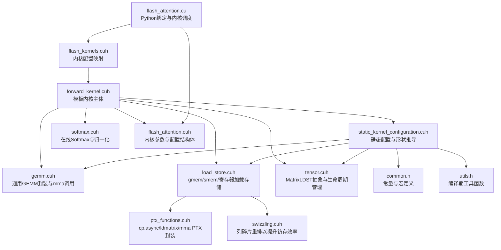
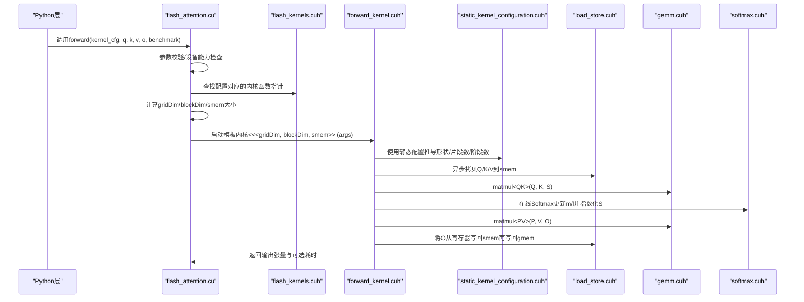
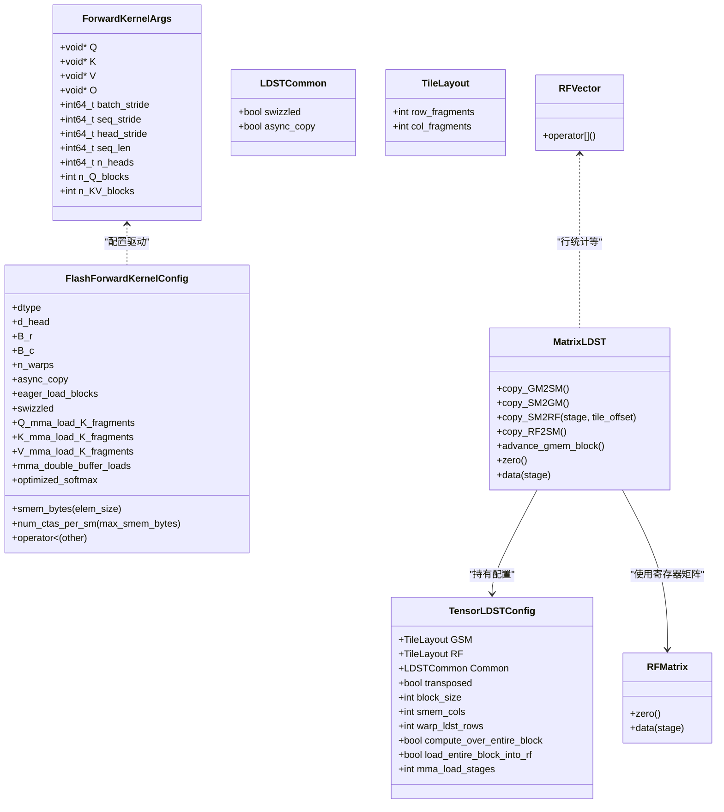
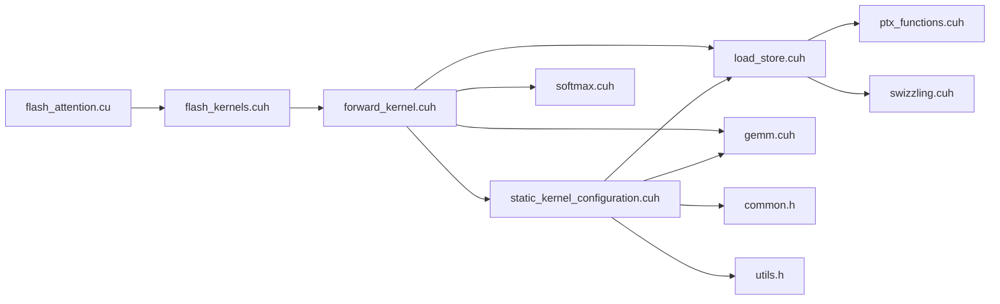
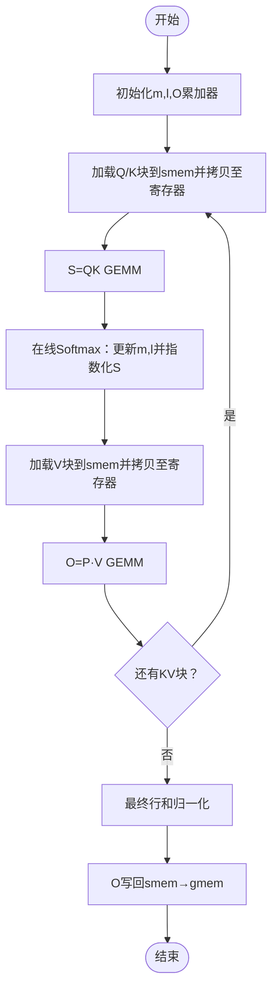

# 初始版本系列 (src_1-7)

<cite>
**本文引用的文件列表**
- [flash_attention.cu](file://previous_kernels/src_1-7/flash_attention.cu)
- [flash_kernels.cuh](file://previous_kernels/src_1-7/include/flash_kernels.cuh)
- [flash_attention.cuh](file://previous_kernels/src_1-7/include/flash_attention.cuh)
- [forward_kernel.cuh](file://previous_kernels/src_1-7/include/forward_kernel.cuh)
- [static_kernel_configuration.cuh](file://previous_kernels/src_1-7/include/static_kernel_configuration.cuh)
- [gemm.cuh](file://previous_kernels/src_1-7/include/gemm.cuh)
- [softmax.cuh](file://previous_kernels/src_1-7/include/softmax.cuh)
- [load_store.cuh](file://previous_kernels/src_1-7/include/load_store.cuh)
- [tensor.cuh](file://previous_kernels/src_1-7/include/tensor.cuh)
- [ptx_functions.cuh](file://previous_kernels/src_1-7/include/ptx_functions.cuh)
- [swizzling.cuh](file://previous_kernels/src_1-7/include/swizzling.cuh)
- [common.h](file://previous_kernels/src_1-7/include/common.h)
- [utils.h](file://previous_kernels/src_1-7/include/utils.h)
</cite>

## 目录
1. [引言](#引言)
2. [项目结构](#项目结构)
3. [核心组件](#核心组件)
4. [架构总览](#架构总览)
5. [详细组件分析](#详细组件分析)
6. [依赖关系分析](#依赖关系分析)
7. [性能考量](#性能考量)
8. [故障排查指南](#故障排查指南)
9. [结论](#结论)
10. [附录](#附录)

## 引言
本文件面向“初始版本系列（src_1-7）”的Flash Attention CUDA实现，系统梳理其基础架构与核心算法原型，重点解释以下内容：
- 如何实现 QK 矩阵乘法、Softmax 计算与 PV 矩阵乘法的基本流程
- 共享内存与寄存器的初步使用策略
- 通过代码路径展示早期版本的数据分块策略与内存访问模式，并对比不同配置下的微小改进
- 初期阶段的性能瓶颈（如全局内存访问延迟与计算吞吐不匹配）
- 调试与性能分析的实用技巧，帮助初学者理解从零构建CUDA内核的挑战

## 项目结构
src_1-7版本将前向计算拆分为多个模块化头文件，采用“静态内核配置 + 模板内核”的方式组织代码，便于在编译期选择不同配置组合，同时保持运行时开销最小化。

图表来源
- [flash_attention.cu](file://previous_kernels/src_1-7/flash_attention.cu#L1-L149)
- [flash_kernels.cuh](file://previous_kernels/src_1-7/include/flash_kernels.cuh#L1-L187)
- [forward_kernel.cuh](file://previous_kernels/src_1-7/include/forward_kernel.cuh#L1-L205)
- [static_kernel_configuration.cuh](file://previous_kernels/src_1-7/include/static_kernel_configuration.cuh#L1-L173)
- [gemm.cuh](file://previous_kernels/src_1-7/include/gemm.cuh#L1-L125)
- [softmax.cuh](file://previous_kernels/src_1-7/include/softmax.cuh#L1-L129)
- [load_store.cuh](file://previous_kernels/src_1-7/include/load_store.cuh#L1-L236)
- [ptx_functions.cuh](file://previous_kernels/src_1-7/include/ptx_functions.cuh#L1-L92)
- [swizzling.cuh](file://previous_kernels/src_1-7/include/swizzling.cuh#L1-L36)
- [tensor.cuh](file://previous_kernels/src_1-7/include/tensor.cuh#L1-L127)
- [flash_attention.cuh](file://previous_kernels/src_1-7/include/flash_attention.cuh#L1-L110)
- [common.h](file://previous_kernels/src_1-7/include/common.h#L1-L31)
- [utils.h](file://previous_kernels/src_1-7/include/utils.h#L1-L10)

章节来源
- [flash_attention.cu](file://previous_kernels/src_1-7/flash_attention.cu#L1-L149)
- [flash_kernels.cuh](file://previous_kernels/src_1-7/include/flash_kernels.cuh#L1-L187)

## 核心组件
- 内核入口与Python绑定：负责参数校验、内核配置解析、网格/块维度计算、动态共享内存设置与内核启动。
- 内核配置与实例化：通过映射表将运行时配置转换为具体模板内核实例。
- 模板内核主体：实现逐块扫描的在线Softmax与两阶段GEMM（QK→S，S→PV），并管理异步拷贝与同步。
- 静态内核配置：在编译期推导各张量的分块形状、寄存器片段数量、mma加载阶段数等。
- GEMM封装：统一mma调用与双缓冲加载逻辑，屏蔽寄存器片段布局细节。
- Softmax模块：在线计算行最大值、指数化与行和归一化，支持优化版log2/exp2路径。
- 加载存储模块：提供gmem↔smem异步拷贝、ldmatrix加载、寄存器→smem写回、半精度转换等。
- PTX函数封装：直接调用cp.async、ldmatrix、mma等指令，确保与硬件特性对齐。
- 抽象层：MatrixLDST统一管理gmem/smem/寄存器三类内存层级的生命周期与数据搬运。

章节来源
- [flash_attention.cu](file://previous_kernels/src_1-7/flash_attention.cu#L1-L149)
- [flash_kernels.cuh](file://previous_kernels/src_1-7/include/flash_kernels.cuh#L1-L187)
- [forward_kernel.cuh](file://previous_kernels/src_1-7/include/forward_kernel.cuh#L1-L205)
- [static_kernel_configuration.cuh](file://previous_kernels/src_1-7/include/static_kernel_configuration.cuh#L1-L173)
- [gemm.cuh](file://previous_kernels/src_1-7/include/gemm.cuh#L1-L125)
- [softmax.cuh](file://previous_kernels/src_1-7/include/softmax.cuh#L1-L129)
- [load_store.cuh](file://previous_kernels/src_1-7/include/load_store.cuh#L1-L236)
- [ptx_functions.cuh](file://previous_kernels/src_1-7/include/ptx_functions.cuh#L1-L92)
- [tensor.cuh](file://previous_kernels/src_1-7/include/tensor.cuh#L1-L127)

## 架构总览
下图展示了从Python到CUDA内核的端到端调用链路与关键数据流。

图表来源
- [flash_attention.cu](file://previous_kernels/src_1-7/flash_attention.cu#L1-L149)
- [flash_kernels.cuh](file://previous_kernels/src_1-7/include/flash_kernels.cuh#L1-L187)
- [forward_kernel.cuh](file://previous_kernels/src_1-7/include/forward_kernel.cuh#L1-L205)
- [static_kernel_configuration.cuh](file://previous_kernels/src_1-7/include/static_kernel_configuration.cuh#L1-L173)
- [gemm.cuh](file://previous_kernels/src_1-7/include/gemm.cuh#L1-L125)
- [softmax.cuh](file://previous_kernels/src_1-7/include/softmax.cuh#L1-L129)
- [load_store.cuh](file://previous_kernels/src_1-7/include/load_store.cuh#L1-L236)

## 详细组件分析

### 组件A：内核入口与调度（flash_attention.cu）
- 功能要点
  - 参数校验：输入张量形状一致性、数据类型（fp16/bf16）、设备计算能力要求
  - 配置解析：将Python侧配置对象映射为C++结构体，用于查找内核实例
  - 网格/块维度：基于B_r/B_c与n_warps计算线程数与grid尺寸
  - 动态共享内存：根据配置计算smem字节数并设置内核属性
  - 可选基准测试：记录事件测量内核执行时间
- 关键路径
  - 参数校验与配置映射：[参数校验与配置解析](file://previous_kernels/src_1-7/flash_attention.cu#L34-L66)
  - 网格/块与smem设置：[网格/块/动态共享内存](file://previous_kernels/src_1-7/flash_attention.cu#L100-L118)
  - 内核启动与事件记录：[内核启动与基准](file://previous_kernels/src_1-7/flash_attention.cu#L113-L134)

章节来源
- [flash_attention.cu](file://previous_kernels/src_1-7/flash_attention.cu#L1-L149)

### 组件B：内核配置与实例化（flash_kernels.cuh）
- 功能要点
  - 运行时配置到内核函数指针的映射，覆盖多种组合（dtype、B_r、B_c、n_warps、async_copy、eager_load_blocks、swizzled、mma_load_K_fragments、mma_double_buffer_loads、optimized_softmax）
  - 自动生成的映射表包含大量配置项，便于快速切换不同策略
- 关键路径
  - 映射表定义与初始化：[内核映射表](file://previous_kernels/src_1-7/include/flash_kernels.cuh#L1-L187)

章节来源
- [flash_kernels.cuh](file://previous_kernels/src_1-7/include/flash_kernels.cuh#L1-L187)

### 组件C：模板内核主体（forward_kernel.cuh）
- 功能要点
  - 逐块扫描：按Q序列块推进，对每个KV块执行一次S=QK与O=PV
  - 在线Softmax：每轮迭代更新行最大值m与行和l，指数化S并更新O累加器
  - 异步拷贝与同步：利用cp.async流水化加载，配合__syncthreads/__syncwarp保证正确性
  - 寄存器与共享内存：S/P完全驻留寄存器；O先写入smem再回写gmem，提升写带宽
- 关键路径
  - 主循环与在线Softmax：[主循环与Softmax](file://previous_kernels/src_1-7/include/forward_kernel.cuh#L110-L182)
  - 最终归一化与O写回：[最终归一化与写回](file://previous_kernels/src_1-7/include/forward_kernel.cuh#L183-L202)

章节来源
- [forward_kernel.cuh](file://previous_kernels/src_1-7/include/forward_kernel.cuh#L1-L205)

### 组件D：静态内核配置（static_kernel_configuration.cuh）
- 功能要点
  - 编译期推导：d_head碎片数、Q/O每warp行数、KV每warp加载行数、mma加载片段数与阶段数
  - 配置有效性断言：限制load_K_fragments为2的幂且不超过上限，保证寄存器/共享内存可用
  - 构造LDST配置：为Q/K/V/O分别生成TensorLDSTConfig，决定gmem/smem/寄存器间的数据搬运策略
- 关键路径
  - 形状与片段数推导：[形状推导](file://previous_kernels/src_1-7/include/static_kernel_configuration.cuh#L36-L87)
  - LDST配置构造与GEMM类型别名：[LDST与GEMM类型](file://previous_kernels/src_1-7/include/static_kernel_configuration.cuh#L89-L171)

章节来源
- [static_kernel_configuration.cuh](file://previous_kernels/src_1-7/include/static_kernel_configuration.cuh#L1-L173)

### 组件E：GEMM封装与mma调用（gemm.cuh）
- 功能要点
  - GEMM模板：封装A/B的加载阶段、双缓冲开关与K方向外积迭代
  - warp级mma：针对16×8×16片段进行累积，支持half/bf16
  - 双缓冲加载：当未整块进入寄存器时，通过阶段切换提高访存与计算重叠
- 关键路径
  - GEMM模板与阶段切换：[GEMM模板](file://previous_kernels/src_1-7/include/gemm.cuh#L22-L122)
  - mma调用封装：[mma封装](file://previous_kernels/src_1-7/include/gemm.cuh#L40-L71)

章节来源
- [gemm.cuh](file://previous_kernels/src_1-7/include/gemm.cuh#L1-L125)
- [ptx_functions.cuh](file://previous_kernels/src_1-7/include/ptx_functions.cuh#L60-L92)

### 组件F：Softmax在线实现（softmax.cuh）
- 功能要点
  - 行最大值与缩放：计算每行最大值并缩放O累加器，避免溢出
  - 指数化：支持优化版log2/exp2路径或标准exp路径
  - 行和归一化：完成最终的softmax归一化
- 关键路径
  - 行最大值与缩放：[行最大值与缩放](file://previous_kernels/src_1-7/include/softmax.cuh#L25-L68)
  - 指数化与行和更新：[指数化与行和](file://previous_kernels/src_1-7/include/softmax.cuh#L70-L105)
  - 最终归一化：[最终归一化](file://previous_kernels/src_1-7/include/softmax.cuh#L107-L129)

章节来源
- [softmax.cuh](file://previous_kernels/src_1-7/include/softmax.cuh#L1-L129)

### 组件G：加载存储与PTX封装（load_store.cuh、ptx_functions.cuh、swizzling.cuh）
- 功能要点
  - 异步拷贝：cp.async支持16B向量粒度，绕过L1缓存直连L2
  - ldmatrix：每次加载4个(8×8)片段，对应(16×16)寄存器片段
  - 寄存器→smem写回：按warp分工写回，提升写带宽
  - 列碎片重排：swizzling减少冲突，提升全局访存带宽
- 关键路径
  - 异步拷贝与等待：[cp.async封装](file://previous_kernels/src_1-7/include/ptx_functions.cuh#L9-L38)
  - ldmatrix与mma封装：[ldmatrix/mma封装](file://previous_kernels/src_1-7/include/ptx_functions.cuh#L40-L92)
  - 块级拷贝与warp分工：[块拷贝与warp分工](file://previous_kernels/src_1-7/include/load_store.cuh#L69-L106)
  - 寄存器片段加载/转置加载/写回：[寄存器片段搬运](file://previous_kernels/src_1-7/include/load_store.cuh#L108-L210)
  - 列碎片重排：[列碎片重排](file://previous_kernels/src_1-7/include/swizzling.cuh#L8-L33)

章节来源
- [load_store.cuh](file://previous_kernels/src_1-7/include/load_store.cuh#L1-L236)
- [ptx_functions.cuh](file://previous_kernels/src_1-7/include/ptx_functions.cuh#L1-L92)
- [swizzling.cuh](file://previous_kernels/src_1-7/include/swizzling.cuh#L1-L36)

### 组件H：张量抽象与生命周期（tensor.cuh）
- 功能要点
  - MatrixLDST：统一管理gmem/smem/寄存器三类内存层级，提供GM2SM/SM2GM/SM2RF/RF2SM接口
  - RFMatrix/RFVector：寄存器矩阵/向量抽象，支持多阶段存储与清零
  - 生命周期：按warp划分独立的gmem/smem偏移，避免竞争
- 关键路径
  - MatrixLDST接口与阶段切换：[MatrixLDST接口](file://previous_kernels/src_1-7/include/tensor.cuh#L43-L124)

章节来源
- [tensor.cuh](file://previous_kernels/src_1-7/include/tensor.cuh#L1-L127)

### 组件I：常量与工具（common.h、utils.h）
- 功能要点
  - 常量：WARP_SIZE、向量宽度、mma片段尺寸、缓冲阶段数等
  - 工具：constexpr_min、constexpr_log2_floor等编译期工具
- 关键路径
  - 常量定义：[常量与宏](file://previous_kernels/src_1-7/include/common.h#L1-L31)
  - 编译期工具：[工具函数](file://previous_kernels/src_1-7/include/utils.h#L1-L10)

章节来源
- [common.h](file://previous_kernels/src_1-7/include/common.h#L1-L31)
- [utils.h](file://previous_kernels/src_1-7/include/utils.h#L1-L10)

### 类关系与数据结构（代码级图）

图表来源
- [flash_attention.cuh](file://previous_kernels/src_1-7/include/flash_attention.cuh#L1-L110)
- [flash_kernels.cuh](file://previous_kernels/src_1-7/include/flash_kernels.cuh#L1-L187)
- [static_kernel_configuration.cuh](file://previous_kernels/src_1-7/include/static_kernel_configuration.cuh#L1-L173)
- [tensor.cuh](file://previous_kernels/src_1-7/include/tensor.cuh#L1-L127)

## 依赖关系分析
- 模块耦合
  - forward_kernel.cuh 依赖 static_kernel_configuration.cuh 与 load_store.cuh/gemm.cuh/softmax.cuh
  - static_kernel_configuration.cuh 依赖 common.h/utils.h 与 load_store.cuh/gemm.cuh
  - load_store.cuh 依赖 ptx_functions.cuh 与 swizzling.cuh
- 外部依赖
  - CUDA运行时与PyTorch扩展接口
  - SM_80+硬件特性（cp.async、ldmatrix、mma）

图表来源
- [flash_attention.cu](file://previous_kernels/src_1-7/flash_attention.cu#L1-L149)
- [flash_kernels.cuh](file://previous_kernels/src_1-7/include/flash_kernels.cuh#L1-L187)
- [forward_kernel.cuh](file://previous_kernels/src_1-7/include/forward_kernel.cuh#L1-L205)
- [static_kernel_configuration.cuh](file://previous_kernels/src_1-7/include/static_kernel_configuration.cuh#L1-L173)
- [load_store.cuh](file://previous_kernels/src_1-7/include/load_store.cuh#L1-L236)
- [gemm.cuh](file://previous_kernels/src_1-7/include/gemm.cuh#L1-L125)
- [softmax.cuh](file://previous_kernels/src_1-7/include/softmax.cuh#L1-L129)
- [ptx_functions.cuh](file://previous_kernels/src_1-7/include/ptx_functions.cuh#L1-L92)
- [swizzling.cuh](file://previous_kernels/src_1-7/include/swizzling.cuh#L1-L36)
- [common.h](file://previous_kernels/src_1-7/include/common.h#L1-L31)
- [utils.h](file://previous_kernels/src_1-7/include/utils.h#L1-L10)

## 性能考量
- 全局内存访问延迟
  - 通过cp.async进行16B向量粒度的异步拷贝，绕过L1缓存直连L2，降低延迟影响
  - swizzling重排列碎片，减少bank冲突，提升带宽利用率
- 计算吞吐不匹配
  - 使用ldmatrix加载(16×16)片段，mma执行(16×8×16)外积，寄存器中累积
  - 当未整块进入寄存器时启用双缓冲加载，提高访存与计算重叠
- 内存层次与带宽
  - S/P完全驻留寄存器，避免频繁跨层级搬运
  - O先写入smem再回写gmem，使用16B向量写以提升带宽
- 线程同步与屏障
  - 对于Q/K块加载完成后的同步，使用__syncthreads保证warp间安全
  - 对于寄存器→smem写回，使用__syncwarp确保同warp内写入完成

章节来源
- [load_store.cuh](file://previous_kernels/src_1-7/include/load_store.cuh#L1-L236)
- [ptx_functions.cuh](file://previous_kernels/src_1-7/include/ptx_functions.cuh#L1-L92)
- [forward_kernel.cuh](file://previous_kernels/src_1-7/include/forward_kernel.cuh#L1-L205)

## 故障排查指南
- 设备能力检查失败
  - 现象：报错要求SM_80或更高
  - 排查：确认GPU计算能力与编译目标一致
  - 参考路径：[设备能力检查](file://previous_kernels/src_1-7/flash_attention.cu#L43-L47)
- 数据类型不支持
  - 现象：仅支持fp16/bf16
  - 排查：确保输入张量dtype一致且符合要求
  - 参考路径：[数据类型校验](file://previous_kernels/src_1-7/flash_attention.cu#L50-L56)
- 分块大小不整除
  - 现象：seq_len必须是B_r/B_c的整数倍
  - 排查：调整B_r/B_c或seq_len使其满足条件
  - 参考路径：[分块校验](file://previous_kernels/src_1-7/flash_attention.cu#L77-L82)
- 内核配置未找到
  - 现象：找不到对应配置的内核实例
  - 排查：确认配置项与映射表一致
  - 参考路径：[配置查找](file://previous_kernels/src_1-7/flash_attention.cu#L60-L66)
- 寄存器/共享内存不足
  - 现象：CTA数量受限或smem使用超限
  - 排查：减小B_r/B_c或d_head，或降低mma加载片段数
  - 参考路径：[smem_bytes与CTA数量](file://previous_kernels/src_1-7/include/flash_attention.cuh#L54-L66)

章节来源
- [flash_attention.cu](file://previous_kernels/src_1-7/flash_attention.cu#L34-L66)
- [flash_attention.cuh](file://previous_kernels/src_1-7/include/flash_attention.cuh#L54-L66)

## 结论
src_1-7版本以“静态配置 + 模板内核”的方式，清晰地实现了Flash Attention的三大核心步骤：QK矩阵乘法、在线Softmax与PV矩阵乘法。通过cp.async、ldmatrix与mma的紧密配合，结合swizzling与寄存器/共享内存的合理使用，有效缓解了全局内存延迟与计算吞吐不匹配的问题。尽管仍存在寄存器/共享内存压力与同步开销，但该实现为后续版本的进一步优化奠定了坚实基础。

## 附录
- 版本间微小改进示例（基于配置差异）
  - eager_load_blocks：提前加载K/V块，减少等待时间
  - mma_double_buffer_loads：启用双缓冲加载，提高访存与计算重叠
  - swizzled：启用列碎片重排，降低bank冲突
  - optimized_softmax：使用log2/exp2路径，减少昂贵指数运算
  - 不同B_r/B_c与d_head组合：平衡寄存器占用与吞吐
- 关键流程可视化（QK→S→PV）

图表来源
- [forward_kernel.cuh](file://previous_kernels/src_1-7/include/forward_kernel.cuh#L110-L182)
- [softmax.cuh](file://previous_kernels/src_1-7/include/softmax.cuh#L1-L129)
- [gemm.cuh](file://previous_kernels/src_1-7/include/gemm.cuh#L1-L125)
- [load_store.cuh](file://previous_kernels/src_1-7/include/load_store.cuh#L1-L236)