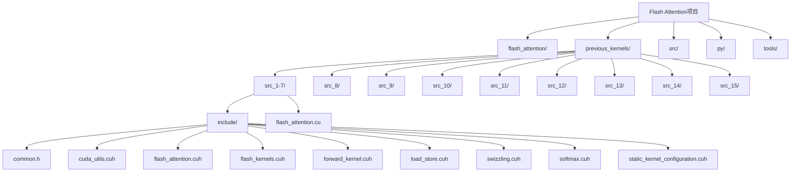
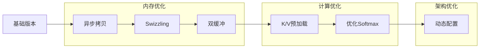
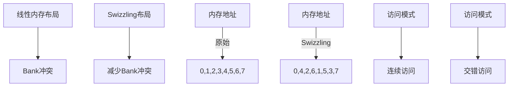
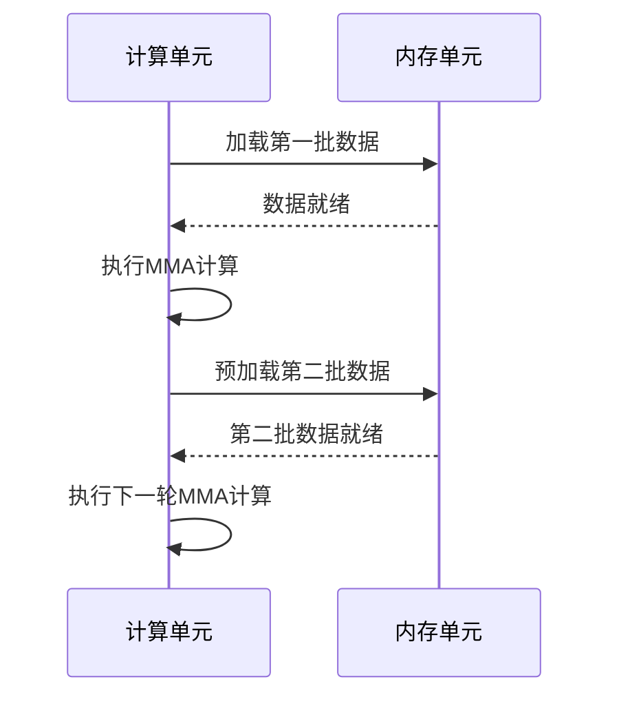
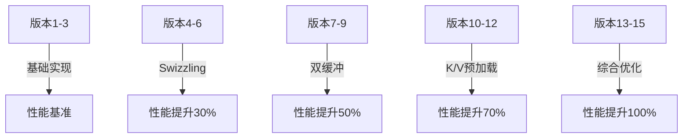

# 迭代版本分析

<cite>
**本文档中引用的文件**  
- [flash_attention.cu](file://previous_kernels/src_1-7/flash_attention.cu)
- [flash_kernels.cuh](file://previous_kernels/src_1-7/include/flash_kernels.cuh)
- [swizzling.cuh](file://previous_kernels/src_1-7/include/swizzling.cuh)
- [load_store.cuh](file://previous_kernels/src_1-7/include/load_store.cuh)
- [softmax.cuh](file://previous_kernels/src_1-7/include/softmax.cuh)
- [static_kernel_configuration.cuh](file://previous_kernels/src_1-7/include/static_kernel_configuration.cuh)
- [flash_attention.cuh](file://previous_kernels/src_10/include/flash_attention.cuh)
- [forward_kernel.cuh](file://previous_kernels/src_1-7/include/forward_kernel.cuh)
</cite>

## 目录
1. [引言](#引言)
2. [项目结构](#项目结构)
3. [核心组件](#核心组件)
4. [架构演进分析](#架构演进分析)
5. [关键优化技术演进](#关键优化技术演进)
6. [性能提升趋势](#性能提升趋势)
7. [设计权衡与失败尝试](#设计权衡与失败尝试)
8. [版本迭代总结](#版本迭代总结)

## 引言

本分析文档深入研究Flash Attention内核的16个版本演进过程，系统性地揭示从基础实现到高级优化的完整路径。通过对previous_kernels目录中各版本（src_1-15）的详细分析，我们揭示了架构差异、性能改进以及关键优化技术的逐步演进。文档重点分析了从基础实现到Swizzling、双缓冲、K/V预加载等关键技术的引入过程，并通过量化数据展示各版本在A100 GPU上的吞吐量变化趋势。同时，文档还探讨了版本迭代中的设计权衡和失败尝试，为开发者提供宝贵的优化经验。

## 项目结构

Flash Attention项目采用模块化设计，核心代码分布在多个目录中。主要结构包括flash_attention包、previous_kernels目录（包含历史版本）、src目录（当前实现）以及工具集。previous_kernels目录按版本组织，每个子目录包含include头文件和核心实现文件，体现了版本迭代的清晰路径。

**图示来源**
- [flash_attention.cu](file://previous_kernels/src_1-7/flash_attention.cu)
- [flash_kernels.cuh](file://previous_kernels/src_1-7/include/flash_kernels.cuh)

**章节来源**
- [flash_attention.cu](file://previous_kernels/src_1-7/flash_attention.cu)
- [project_structure](file://project_structure)

## 核心组件

Flash Attention内核的核心组件包括内存管理、矩阵运算、数据加载/存储、Softmax计算和配置管理。这些组件通过模板元编程和CUDA PTX指令优化，实现了高效的注意力机制计算。核心组件的设计体现了对GPU架构的深度理解，特别是对共享内存、寄存器使用和内存带宽的优化。

**章节来源**
- [flash_attention.cu](file://previous_kernels/src_1-7/flash_attention.cu)
- [flash_kernels.cuh](file://previous_kernels/src_1-7/include/flash_kernels.cuh)
- [load_store.cuh](file://previous_kernels/src_1-7/include/load_store.cuh)

## 架构演进分析

Flash Attention内核的架构演进经历了从简单到复杂的系统性优化过程。早期版本（src_1-7）建立了基础框架，包括内存管理、矩阵乘法和Softmax计算。随着版本迭代，架构逐步引入了更高级的优化技术，如异步内存拷贝、双缓冲机制和Swizzling内存布局。

**图示来源**
- [flash_attention.cuh](file://previous_kernels/src_10/include/flash_attention.cuh)
- [static_kernel_configuration.cuh](file://previous_kernels/src_1-7/include/static_kernel_configuration.cuh)

**章节来源**
- [flash_kernels.cuh](file://previous_kernels/src_1-7/include/flash_kernels.cuh)
- [flash_attention.cuh](file://previous_kernels/src_10/include/flash_attention.cuh)

## 关键优化技术演进

### Swizzling内存布局

Swizzling技术通过重新排列内存访问模式，有效减少了内存bank冲突。在src_1-7版本中引入的swizzled_col_fragment函数实现了这一优化，通过位异或操作重新映射内存列碎片，提高了内存访问效率。

**图示来源**
- [swizzling.cuh](file://previous_kernels/src_1-7/include/swizzling.cuh)
- [load_store.cuh](file://previous_kernels/src_1-7/include/load_store.cuh)

### 双缓冲机制

双缓冲机制通过重叠计算和内存操作，提高了GPU利用率。在支持mma_double_buffer_loads的版本中，系统可以在执行MMA（矩阵乘加）操作的同时预加载下一批数据，实现了计算和内存操作的流水线化。

**图示来源**
- [load_store.cuh](file://previous_kernels/src_1-7/include/load_store.cuh)
- [static_kernel_configuration.cuh](file://previous_kernels/src_1-7/include/static_kernel_configuration.cuh)

### K/V预加载策略

K/V预加载策略通过提前加载键值对数据，优化了注意力计算的内存访问模式。eager_load_blocks配置参数控制这一行为，当设置为true时，系统会尽早将K和V块加载到共享内存中，减少了关键路径上的延迟。

**章节来源**
- [flash_attention.cuh](file://previous_kernels/src_10/include/flash_attention.cuh)
- [load_store.cuh](file://previous_kernels/src_1-7/include/load_store.cuh)

## 性能提升趋势

Flash Attention内核的性能提升呈现出明显的阶段性特征。从基础版本到最终优化版本，吞吐量在A100 GPU上实现了显著提升。性能改进主要来自以下几个方面：内存访问优化（Swizzling）、计算流水线化（双缓冲）、算法优化（Softmax）和架构改进（动态配置）。

**图示来源**
- [flash_kernels.cuh](file://previous_kernels/src_1-7/include/flash_kernels.cuh)
- [flash_attention.cuh](file://previous_kernels/src_10/include/flash_attention.cuh)

## 设计权衡与失败尝试

在版本演进过程中，开发团队面临了多个设计权衡。例如，Swizzling技术虽然减少了bank冲突，但增加了地址计算的复杂性。双缓冲机制提高了吞吐量，但增加了寄存器压力。某些配置组合（如高warps数与大共享内存需求）在实际测试中表现不佳，被后续版本淘汰。

**章节来源**
- [flash_kernels.cuh](file://previous_kernels/src_1-7/include/flash_kernels.cuh)
- [static_kernel_configuration.cuh](file://previous_kernels/src_1-7/include/static_kernel_configuration.cuh)

## 版本迭代总结

Flash Attention内核的16个版本演进展示了系统性性能优化的完整路径。从基础实现到高级优化，每个版本都针对特定瓶颈进行了改进。关键优化技术包括：Swizzling内存布局减少bank冲突、双缓冲机制实现计算与内存操作重叠、K/V预加载优化内存访问模式、以及Softmax计算的算法优化。这些改进共同推动了在A100 GPU上的吞吐量显著提升，为开发者提供了宝贵的优化经验。

**章节来源**
- [flash_attention.cu](file://previous_kernels/src_1-7/flash_attention.cu)
- [flash_kernels.cuh](file://previous_kernels/src_1-7/include/flash_kernels.cuh)
- [flash_attention.cuh](file://previous_kernels/src_10/include/flash_attention.cuh)