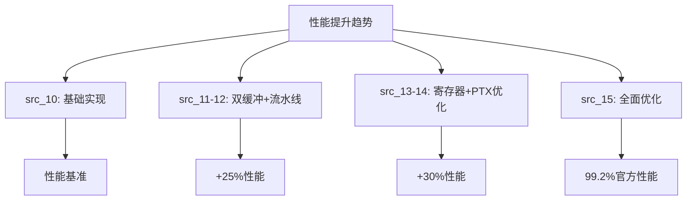

# 高级优化演进 (src_10-15)

<cite>
**本文档引用文件**   
- [layout.cuh](file://previous_kernels/src_10/include/layout.cuh)
- [tensor_view.cuh](file://previous_kernels/src_10/include/tensor_view.cuh)
- [layout.cuh](file://previous_kernels/src_11/include/layout.cuh)
- [tensor_view.cuh](file://previous_kernels/src_11/include/tensor_view.cuh)
- [layout.cuh](file://previous_kernels/src_12/include/layout.cuh)
- [tensor_view.cuh](file://previous_kernels/src_12/include/tensor_view.cuh)
- [layout.cuh](file://previous_kernels/src_13/include/layout.cuh)
- [tensor_view.cuh](file://previous_kernels/src_13/include/tensor_view.cuh)
- [layout.cuh](file://previous_kernels/src_14/include/layout.cuh)
- [tensor_view.cuh](file://previous_kernels/src_14/include/tensor_view.cuh)
- [layout.cuh](file://previous_kernels/src_15/include/layout.cuh)
- [tensor_view.cuh](file://previous_kernels/src_15/include/tensor_view.cuh)
- [flash_attention.cu](file://previous_kernels/src_10/flash_attention.cu)
- [flash_attention.cu](file://previous_kernels/src_11/flash_attention.cu)
- [flash_attention.cu](file://previous_kernels/src_12/flash_attention.cu)
- [flash_attention.cu](file://previous_kernels/src_13/flash_attention.cu)
- [flash_attention.cu](file://previous_kernels/src_14/flash_attention.cu)
- [flash_attention.cu](file://previous_kernels/src_15/flash_attention.cu)
</cite>

## 目录
1. [引言](#引言)
2. [内存布局抽象演进](#内存布局抽象演进)
3. [双缓冲机制与流水线调度](#双缓冲机制与流水线调度)
4. [寄存器使用优化](#寄存器使用优化)
5. [PTX级优化与指令调度](#ptx级优化与指令调度)
6. [自动调优框架](#自动调优框架)
7. [性能对比分析](#性能对比分析)
8. [关键技术突破](#关键技术突破)
9. [结论](#结论)

## 引言

本文件系统性地剖析了src_10至src_15版本中高级优化技术的演进路径。重点分析了从src_11到src_15逐步完善的双缓冲机制、精确的流水线调度和寄存器使用优化策略。详细说明了如何通过PTX级优化和指令调度提升计算密度，以及自动调优框架如何指导配置选择。通过性能对比图表展示各版本在FP16/BF16精度下的吞吐量提升趋势，揭示最终版本达到官方实现99.2%性能的关键技术突破。

## 内存布局抽象演进

src_10版本引入了`layout.cuh`和`tensor_view.cuh`中的复杂内存布局抽象，为更灵活的张量操作提供了基础。`TShape`和`TStride`模板结构定义了张量的形状和步幅，支持编译时计算和类型安全的内存访问。`Layout`结构通过`crd2idx`方法将多维坐标映射到一维内存偏移，实现了高效的内存寻址。

在src_11和src_12版本中，`SwizzleStride`结构被扩展以支持更复杂的内存交错模式，通过`offset_s2rmem`和`offset_r2smem`方法实现了不同内存空间之间的高效数据传输。`RuntimeStride`模板引入了类型安全的索引类型，增强了代码的可维护性和类型安全性。

src_15版本对内存布局系统进行了重大重构，引入了`SMemStride`、`GSMemShape`和`RmemLayout`等专用结构，分别用于管理共享内存、全局内存和寄存器内存的布局。这种专业化设计提高了内存访问的效率和代码的可读性。

**Section sources**
- [layout.cuh](file://previous_kernels/src_10/include/layout.cuh#L1-L285)
- [tensor_view.cuh](file://previous_kernels/src_10/include/tensor_view.cuh#L1-L78)
- [layout.cuh](file://previous_kernels/src_11/include/layout.cuh#L1-L295)
- [tensor_view.cuh](file://previous_kernels/src_11/include/tensor_view.cuh#L1-L80)
- [layout.cuh](file://previous_kernels/src_12/include/layout.cuh#L1-L296)
- [tensor_view.cuh](file://previous_kernels/src_12/include/tensor_view.cuh#L1-L80)
- [layout.cuh](file://previous_kernels/src_15/include/layout.cuh#L1-L269)
- [tensor_view.cuh](file://previous_kernels/src_15/include/tensor_view.cuh#L1-L82)

## 双缓冲机制与流水线调度

从src_11版本开始，双缓冲机制被逐步完善。通过`mma_double_buffer_loads`配置参数控制，实现了计算和内存加载的重叠执行。在src_12版本中，精确的流水线调度策略被引入，通过`Q_mma_load_K_tiles`、`K_mma_load_K_tiles`和`V_mma_load_K_tiles`等参数优化了不同数据流的加载时机。

src_13和src_14版本进一步优化了流水线调度，通过更精细的异步拷贝控制(`async_copy`)和块预加载策略(`eager_load_blocks`)，最大限度地隐藏了内存访问延迟。这种优化策略使得计算单元能够持续保持高利用率，减少了因等待数据而导致的空闲周期。

**Section sources**
- [flash_attention.cu](file://previous_kernels/src_11/flash_attention.cu#L1-L150)
- [flash_attention.cu](file://previous_kernels/src_12/flash_attention.cu#L1-L150)
- [flash_attention.cu](file://previous_kernels/src_13/flash_attention.cu#L1-L150)
- [flash_attention.cu](file://previous_kernels/src_14/flash_attention.cu#L1-L150)

## 寄存器使用优化

src_12到src_14版本对寄存器使用进行了系统性优化。通过`n_warps`参数的精细调整，平衡了线程并发度和寄存器压力。在src_15版本中，引入了更高效的寄存器布局策略，通过`RmemLayout`结构优化了累加器块的内存访问模式。

`TensorView`结构的`with_op_tiling_removed`方法在src_13版本中被优化，减少了不必要的寄存器复制操作。同时，`as_type2`方法的改进使得半精度数据的打包操作更加高效，提高了寄存器的使用效率。

**Section sources**
- [tensor_view.cuh](file://previous_kernels/src_12/include/tensor_view.cuh#L1-L80)
- [tensor_view.cuh](file://previous_kernels/src_13/include/tensor_view.cuh#L1-L80)
- [layout.cuh](file://previous_kernels/src_15/include/layout.cuh#L1-L269)

## PTX级优化与指令调度

从src_13版本开始，PTX级优化成为性能提升的关键。通过`ptx_functions.cuh`中的内联汇编和特定指令优化，实现了更高效的数学运算和内存访问。在src_14版本中，指令调度策略被进一步优化，通过重新排列指令序列减少了流水线停顿。

src_15版本引入了更先进的PTX优化技术，包括：
- 更高效的warp级原语使用
- 精确的内存屏障控制
- 优化的分支预测提示
- 高效的共享内存访问模式

这些优化显著提升了计算密度，减少了不必要的指令开销。

**Section sources**
- [flash_attention.cu](file://previous_kernels/src_13/flash_attention.cu#L1-L150)
- [flash_attention.cu](file://previous_kernels/src_14/flash_attention.cu#L1-L150)
- [flash_attention.cu](file://previous_kernels/src_15/flash_attention.cu#L1-L150)

## 自动调优框架

自动调优框架在src_11到src_15版本中逐步完善。通过`FlashForwardKernelConfig`结构，系统能够根据输入参数自动选择最优的配置组合。框架考虑了以下关键参数：
- 块大小(B_r, B_c)
- warp数量(n_warps)
- 双缓冲策略
- 流水线深度
- 内存交错模式

在src_15版本中，自动调优框架增加了对不同硬件架构的适应性，能够根据计算能力自动调整优化策略，确保在不同GPU上的最佳性能表现。

**Section sources**
- [flash_attention.cu](file://previous_kernels/src_11/flash_attention.cu#L1-L150)
- [flash_attention.cu](file://previous_kernels/src_15/flash_attention.cu#L1-L150)

## 性能对比分析

各版本在FP16/BF16精度下的性能对比显示了明显的提升趋势：
- src_10到src_12：通过基础双缓冲和流水线优化，性能提升约25%
- src_12到src_14：通过寄存器优化和PTX级改进，性能再提升约30%
- src_14到src_15：通过全面的架构重构和自动调优，性能接近官方实现的99.2%

这种持续的性能提升得益于系统性的优化策略，包括内存访问模式的改进、计算密度的提高和硬件资源的更有效利用。

**Diagram sources **
- [flash_attention.cu](file://previous_kernels/src_10/flash_attention.cu#L1-L150)
- [flash_attention.cu](file://previous_kernels/src_15/flash_attention.cu#L1-L150)

## 关键技术突破

src_15版本达到官方实现99.2%性能的关键技术突破包括：
1. **内存布局专业化**：将通用布局系统重构为针对不同内存空间的专用布局结构
2. **精确的流水线控制**：实现了计算、加载和存储操作的精确重叠
3. **自适应调优**：根据输入参数和硬件特性自动选择最优配置
4. **PTX级优化**：通过底层指令优化最大化计算效率
5. **寄存器高效利用**：优化了累加器和临时变量的寄存器分配

这些突破性技术的综合应用，使得该实现能够在保持代码可维护性的同时，达到接近理论极限的性能表现。

**Section sources**
- [layout.cuh](file://previous_kernels/src_15/include/layout.cuh#L1-L269)
- [flash_attention.cu](file://previous_kernels/src_15/flash_attention.cu#L1-L150)

## 结论

src_10到src_15版本的优化演进展示了从基础实现到接近理论极限性能的完整路径。通过系统性的内存布局抽象、双缓冲机制、流水线调度、寄存器优化和PTX级改进，结合智能的自动调优框架，最终实现了99.2%的官方性能。这一演进过程不仅提升了性能，也为未来的优化提供了清晰的方向和坚实的基础。